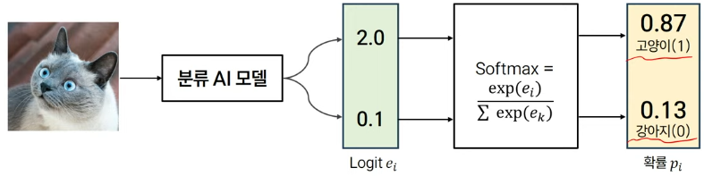

### 목차

> [1. 기계학습의 개념]
> 
> [2. AI의 주요 구성 요소 소개]
> 
> [3. 모델평가]

# 1. 기계학습의 개념

### AI의 구분

- 인공지능(AI) : 인간의 지능을 모방하여 문제 해결, 학습, 추론 등의 작업을 수행하는 시스템 및 기술

- 기계학습(ML) : 명시적인 프로그래밍 없이, 패턴을 학습하는 방법론

- 딥러닝(DL) : 뉴럴넷(인공신경망)을 모델로 기계학습 하는 것

### 기계학습 시스템 처리 과정 (추론 과정: Inference)

1. 센싱 : 카메라로 사진을 찍음 (실제 세계 => 디지털 데이터)

2. 전처리 : 데이터에서 통계적 패턴을 잡기 쉽도록 하는 밑작업 (예 : 밝기 값이 균등하도록)

3. 특징 추출 : 인식하고자 하는 목표와 연관이 많은 특징들을 추출 (자동차 탐지를 위해 사진에서 원형 패턴 추출)

4. 분류 : 기계학습 모델을 통해 입력 특징을 인식 결과로 변환해주는 과정 (자동차 인식)

### 간단한 기계학습 예제

1. 데이터 수집
   
   - 샘플
   
   - 훈련 집합 (학습 데이터셋), 테스트 집합 (테스트 데이터셋)
- 고품질 데이터 확보가 매우 중요 (양과 질)

- 필기 숫자 예시

2. 특징 정의 및 추출
   
   - 특징 예시 1) 개별적인 화소를 특징 벡터화 하는 경우 (Flatten) : 8x8 = 64차원
     
     - 64차원  특징 벡터 x = (x1, ..., x64)
     
     - 이러한 특징은 입력 변화에 민감 => 패턴을 찾기 어려움
     
     - 숫자 6에서 밑에 한 줄 짤리면 다른 숫자가 됨 -> 민감도 매우 높음
     
     
   
   - 특징 예시 2) 각 축의 검은 화서의 비율
- 분별력?
  
  - 서로 뭉쳐있음. 6에 대해서는 분별력이 좋은데 나머지 데이터들은..?

3. 분류
- 두 단계의 설계 : 모델 선택(아키텍쳐 선택)과 학습(Learning)

- 차원에 따라 : 결정 직선(곡선), 결정 평면(곡면), 결정 초평면(초곡면, 3차원 이상)
4. 평가
- 평가 데이터 : 학습 셋에서 학습 후, 테스트 셋에서 평가

- 성능 평가 기준 : 오류율, 인식률 등

- 기계학습의 궁극적 목표 : 과적합을 피하자! (정답을 외워버림)

- 데이터를 불려주는 모델을 사용하면 처음에는 효과적이지만 세대가 지날수록 오버피팅이 일어남

### 세부 절차들은 모두 수학적(Software)으로 모델링 되어 있음

- AI는 수학을 많이 사용 : 선형대수, 미분, 최적화

- 본 강의에서는 일단 수학은 최소화

- AI 닌자가...되고 싶다면?
  
  - Part 1, Mathematics for Machine Learning by Marc Peter, 2020 (Free PDF)
  
  - 오일석, 기계학습, 한빛아카데미, 2017 (패턴인식, 2023)

# 2. AI의 주요 구성 요소 소개

### 최근 AI는 대부분 딥러닝을 의미

- 딥러닝(Deep Learning) = 딥뉴럴넷(Deep Neural Networks)
  
  - 전통적 기계 학습 단계 : 입력 => 전처리 => 특징 추출 => 분류 => 결과
  
  - 딥러닝 기반 학습 단계 : 입력 => 딥뉴럴넷(특징 추출, 분류) => 결과(End-to-end 학습)

- End2End (Universal approximator)

### AI 모델을 구축하는 방법

- 딥러닝(Deep Learning)의 주요 구성 요소
  
  - 모델(Model) : 입력 데이터를 우리가 원하는 출력으로 변환해주는 함수
  
  - 손실 함수(Loss function) : 모델의 출력을 통해 모델이 잘하는지 못하는지 판단해 수치화해주는 함수
  
  - 데이터(Data) : 모델이 학습할 데이터
  
  - 알고리즘(Algorithm) : Loss(손실 함수의 값)를 줄여주기 위해 모델(파라메터)을 업데이트하는 방법

### AI의 디자인 요소 4(3)가지

- Model

- Loss

- Data

- Algorithm

### 모델(Model)

- 영상인식 예시
  
  - Classifier : 입력영상을 카테고리(클래스)로 매핑해주는 함수 f(.)

- 선형 Model, 비선형 Model 크게 2가지로 나뉨

### 선형 모델

- 단층 레이어 신경망
  
  - 뉴런이 신호를 전달하는 방식에 착안하여 제안된 초기 인공 신경망
  
  - 다수의 신호를 입력으로 받아 **선형 결합**으로 구성된 연산을 거친 후 하나의 결과를 내보내는 알고리즘

### 선형 결합과 예시

- 행렬의 곱과 합으로 구성된 연산
  
  - ex) 행렬 A와 B를 곱한 후 C를 더하여 D를 계산하는 과정

- 행렬 곱셈의 예시 -> 벡터의 내적

### 선형 모델의 구성

- 모델을 통해 예측하고자 하는 결과 y

- 모델을 구성하는 가중치 W
  
  - 모든 노드

- 모델의 입력이 되는 데이터 x

### 손실 함수(Loss)

- Loss function

- **모델의 출력값과 실제 데이터의 정답 차이의 오차**를 계산하는 함수
  
  - ex) 모델이 2.2의 값을 예측했는데 실제 정답이 2.0이었다면 두 값의 차인 0.2를 오차라고 정의

- AI 모델을 학습한다는 것은 주어진 데이터에 대한 정답에 근사한 예측을 할 수 있는 모델을 만드는 것

- 즉, 손실을 최대한 작은 값으로 줄이는 것이 AI 모델 학습의 목표

### 손실 함수의 예시

- 분류(Classification)
  
  - Cross entropy

- 회귀(Regression)
  
  - MSE(L2)
  
  - MAE(L1)

- 기타. (skip)
  
  - Triplet
  
  - KL Divergence
  
  - Smooth L1

### 손실 함수 - 분류(classification)

- 분류(Classification)
  
  - 주어진 데이터가 어떤 **범주(category)** 에 속하는지 판단하는 태스크
  
  - ex) 고양이, 강아지 사진 -> 분류 AI 모델 -> 고양이, 강아지 분류

- Logit과 확률값(probability)
  
  - Logit : 표준화되지 않은 날 것 그대로의 모델 예측값
  
  - 확률 : logit에 추가 연산(softmax)을 가하여 [0, 1] 사이의 확률값으로 나타낸 예측값

- Cross entropy
  
  - 분류에 쓰이는 가장 대표적인 손실 함수
  
  - 이진 분류 (binary classification)

### 손실 함수 - 회귀(regression)

- 범주가 아닌 연속적인 수치를 예측하는 태스크

- ex) 사람 키 예측, 제품 A의 9월 판매량 예측

### 파이토치(PyTorch) 손실 함수

- PyTorch란?

- Facebook의 AI 연구팀(FAIR)이 개발한 오픈 소스 딥러닝 프레임워크로, Python을 기반으로 함

- 주로 신경망(neural networks)을 구축하고 훈련하는 데 사용 (torch.nn)

'ㅠ'
