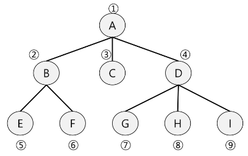
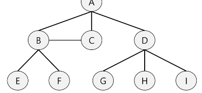
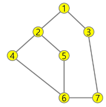

### 목차

> [1. BFS](#1-bfs)
> 
> [2. 연습문제](#2-연습문제)


# 1. BFS

- Breadth First Search

- 그래프를 탐색하는 방법 2가지
  
  - 깊이 우선 탐색 (Depth First Search, DFS)
  
  - 너비 우선 탐색(Breadth First Search, BFS)

- 너비우선탐색은 탐색 시작점의 인접한 정점들을 먼저 모두 차례로 방문한 후에, 방문했던 정점을 시작점으로 하여 다시 인접한 정접들을 차례로 방문하는 방식

- 인접한 정점들에 대해 탐색을 한 후, 차례로 다시 너비우선탐색을 진행해야 하므로, 선입선출 형태의 자료구조인 큐를 활용함

- BFS는 예제 그래프를 아래와 같은 순서로 탐색한다.



> - 초기 상태 : visited 배열 초기화, Q 생성, 시작점 enqueue
> 
> Visited : A(0)    B(1)    C(2)    D(3)    E(4)    F(5)    G(6)    H(7)    I(8)
> 
>                     F        F        F        F        F        F        F        F        F
> 
> Q [    A    |        |        |        |        |        |        |        |        ]
> 
> 
> 
> - A점부터 시작 : dequeue A, A 방문 표시, A의 인접점 enqueue
> 
> Visited : T    F    F    F    F    F    F    F    F
> 
> Q [    B    |    C    |    D    |        |        |        |        |        |        ]
> 
> 
> 
> - 탐색 진행 : dequeue B, B 방문 표시, B의 인접점 enqueue
> 
> Visited : T    T    F    F    F    F    F    F    F
> 
> Q [    C    |    D    |    E    |    F    |        |        |        |        |        ]
> 
> 
> 
> - 탐색 진행 : dequeue C, C 방문 표시, C의 인접점 enqueue
> 
> Visited : T    T    T    F    F    F    F    F    F
> 
> Q [    D    |    E    |    F    |        |        |        |        |        |        ]
> 
> 
> 
> - 탐색 진행 : dequeue D, D 방문 표시, D의 인접점 enqueue
> 
> Visited : T    T    T    T    F    F    F    F    F
> 
> Q [    E    |    F    |    G    |    H    |    I    |        |        |        |        ]
> 
> 
> 
> - 탐색 진행 : dequeue E, E 방문 표시, E의 인접점 enqueue
> 
> Visited : T    T    T    T    T    F    F    F    F
> 
> Q [    F    |    G    |    H    |    I    |        |        |        |        |        ]
> 
> 
> 
> ...(생략)
> 
> 
> 
> - 탐색 진행 : dequeue I, I 방문 표시, I의 인접점 enqueue
> 
> Visited : T    T    T    T    T    T    T    T    T
> 
> Q [        |        |        |        |        |        |        |        |        ]
> 
> 
> 
> - Q가 비었으므로 탐색 종료


- 코드

```python
'''
7 8
4 2 1 2 1 3 5 2 4 6 5 6 6 7 3 7
'''

def bfs(s, V):  # 시작정점 s, 마지막 정점 V
    visited = [0] * (V+1)   # visited 생성
    q = []          # 큐 생성
    q.append(s)     # 시작점 인큐
    visited[s] = 1  # 시작점 방문표시
    while q:        # 큐에 정점이 남아있으면 front != rear
        t = q.pop(0)    # 디큐
        print(t)        # 방문한 정점에서 할일
        for w in adj_l[t]:  # 인접한 정점 중 인큐되지 않은 정점 w가 있으면
            if visited[w]==0:
                q.append(w)     # w인큐, 인큐되었음을 표시
                visited[w] = visited[t] + 1

V, E = map(int, input().split()) # 1번부터 V번 정점, E개의 간선
arr = list(map(int, input().split()))
# 인접리스트 -------------------------
adj_l = [[] for _ in range(V+1)]
for i in range(E):
    v1, v2 = arr[i*2], arr[i*2+1]
    adj_l[v1].append(v2)
    adj_l[v2].append(v1)    # 방향이 없는 경우
# 여기까지 인접리스트 -----------------
bfs(1, 7)
```

### [참고] BFS 예제



- B-C 선이 있어도 BFS 탐색 순서는 영향 x

# 2. 연습문제

- 다음은 연결되어 있는 두 개의 정점 사이의 간선을 순서대로 나열 해 놓은 것이다. 모든 정점을 너비우선탐색 하여 경로를 출력하시오. 시작 정점을 1로 시작



- 출력 결과 : 1 - 2 - 3 - 4 - 5 - 7 - 6

- 2번부터 시작 : 2 - 1 - 4 - 5 - 3 - 6 - 7

- 최단거리 구하기 쉬움
