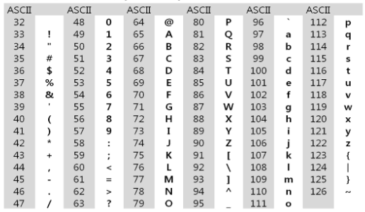
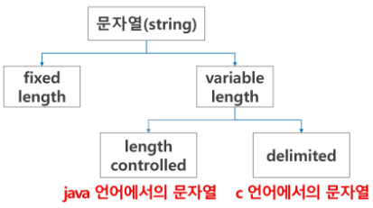
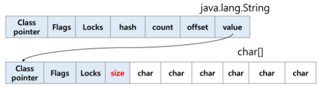

### 목차

> [1. 문자의 표현](#1-문자의-표현)
> 
> [2. 문자열](#2-문자열)
> 
> [3. 연습 문제](#3-연습-문제)

# 1. 문자의 표현

- 각 문자에 대응되는 숫자를 정해 놓고 이것을 메모리에 저장

- 영어 대소문자는 총 52자 -> 6(64가지)비트면 모두 표현 가능 => **코드체계**

> 000000 : 'a'
> 
> 000001 : 'b'

### ASCII

- American Standard Code for Information Interchange
  
  - 1967년 미국에서 제정된 문자 인코딩 표준
  
  - 7-bit 인코딩으로 128문자 표현
  
  - 33개의 출력 불가능한 제어 문자 + 공백을 비롯한 95개의 출력 가능한 문자

- 출력 가능 아스키 문자



### 확장 아스키

- 표준 문자 이외의 악센트 문자, 도형 문자, 특수 문자, 특수 기호 등 부가적인 문자 128개 추가
  
  - 1Byte 내의 8-bit 모두 사용
  
  - 컴퓨터 생산자와 소프트웨어 개발자가 다양한 문자에 할당할 수 있도록 한다. 
  
  > ex) ┨ ± β Å 등
  
  - 이렇게 할당된 확장 부호는 표준 아스키와 같이 서로 다른 프로그램이나 컴퓨터 사이에 교환 X 
  
  - 표준 아스키는 세계적으로 통용되지만 확장 아스키는 프로그램, 컴퓨터, 프린터 등이 해독할 수 있도록 설계되어 있어야 사용 가능

### 유니코드

- 다국어 처리를 위한 표준

- 자국의 코드체계를 타 국가가 가지고 있지 않으면 정보 해석 오류 발생

> ex) 0040 : '@'
> 
> 00074 : 't'
> 
> B300 : '대'
> 
> B374 : '덴'

- 유니코드도 다시 Character Set으로 분류된다.

- UCS-2(Universal Character Set 2)

- UCS-4(Universal Character Set 4)

- 유니코드를 저장하는 변수의 크기 정의

- but 바이트 순서에 대해 표준화 못함 -> UCS-2, UCS-4 구분해야함

+) 빅 엔디안/리틀 엔디안

- 빅 엔디안 : 상위 바이트(큰 쪽) 먼저 저장

> 0x01234567 -> 01 23 45 67

- 리틀 엔디안 : 하위 바이트(작은 쪽) 먼저 저장

> 0x01234567 -> 67 45 23 01

### 유니코드 인코딩

- UFT : Unicode Transformation Format

- UFT-8 : web
  
  - Min : 8bit, Max : 32bit (1 Byte * 4)

- UFT-16 : windows, java
  
  - Min : 16bit, Max : 32bit (2 Byte * 2)

- UFT-32 : unix
  
  - Min : 32bit, Max : 32bit (4 Byte * 1)

### 참고

- CRLF : 텍스트 파일에서 줄 바꿈 표시하는 데 사용하는 제어문자(바이트코드)
  
  - LF : Line Feed : 한 줄 아래로 (다음 줄로) 이동
  
  - CR : Carriage Return : 다음 줄로 이동x, 커서를 줄의 시작부분으로 이동

- 저장된 파일 16진수 편집기로 읽기 : [https://hexed.it](https://hexed.it)

- 파이썬 인코딩 : 2.x 버전 : ASCII : #-\*-coding: utf-8 -*- (첫 줄에 명시)
  
  - 3.x 버전 : 유니코드 UTF-8 : 생략 가능
  
  - 다른 인코딩 방식으로 처리시 첫 줄에 작성하는 위 항목에 원하는 인코딩 방식을 지정해주면 됨

# 2. 문자열



### java에서 String 클래스에 대한 메모리 배치 예



- java.lang.String 클래스에는 기본적인 객체 메타 데이터 외에도  필드 4가지가 포함되어 있음
  
  - hash
  
  - count(문자열 길이)
  
  - offset(문자열 시작점)
  
  - value(실제 문자열 배열에 대한 참조)

### C언어에서 문자열 처리

- 문자열은 문자들의 배열 형태로 구현된 응용 자료형

- 문자배열에 문자열을 저장할 때는 항상 마지막 끝을 표시하는 널문자(`'\0'`)를 넣어줘야 한다.

```c
char ary[] = {'a', 'b', 'c', '\0'};
char ary[] = "abc";
```

- 문자열 처리에 필요한 연산을 함수 형태로 제공

> strlen(), strcpy(), strcmp(), ...

### 참고

- 다음 두 코드의 차이 이해하기
  
  - `s1 = list(input())`
  
  - `s2 = input()`

- strlen() 함수 만들어보기

```python
def strlen(a):    # '\0' 을 만나면 '\0'을 제외한 글자수를 리턴
    # while을 써서 함수 완성해보기
    # while a[i] != '\0' ~

a = ['a', 'b', 'c', '\0']
print(strlen(a))
```

### Java(객체지향 언어)에서의 문자열 처리

- 문자열 데이터를 저장, 처리해주는 클래스를 제공

- String 클래스를 사용

```java
String str = "abc";
String str = new String("abc")
```

- 문자열 처리에 필요한 연산을 연산자, 메소드 형태로 제공

> +, length(), replace(), split(), substring() ...

- 보다 풍부한 연산을 제공

### Python에서의 문자열 처리

- char 타입 없음

- 텍스트 데이터의 취급방법이 통일되어 있음

- 문자열 기호 : `''` 홑따옴표, `""` 쌍따옴표, `'''` 홑따옴표 3개, `"""` 쌍따옴표 3개

- `+`연결 : Concatenation : `문자열 + 문자열` : 이어붙여주는 역할

- `*`반복 : `문자열 * 수` : 수만큼 문자열이 반복

- 문자열은 시퀀스 자료형으로 분류되고, 시퀀스 자료형에서 사용할 수 있는 인덱싱, 슬라이싱 연산들을 사용할 수 있음

- 문자열 클래스에서 제공되는 메소드

> replace(), split(), isalpha(), find()

- 문자열은 튜플과 같이 요소값을 변경할 수 없음(`immutable`)

### C와 Java의 String 처리의 기본적인 차이점

- c는 아스키 코드로 저장

- java는 유니코드(UTF16, 2byte)로 저장

- 파이썬은 유니코드(UTF8)로 저장

- C

```c
char * name = "홍길동";
int count = strlen(name);
printf("%d", count);    // 6
```

- Java

```java
String name = "홍길동";
System.out.println(name.length());    // 3
```

- Python

```python
name = "홍길동"
print(len(name))    # 3
```

### 문자열 뒤집기

- 자기 문자열에서 뒤집는 방법

- 새로운 빈 문자열을 만들어 소스의 뒤에서부터 읽어서 타겟에 쓰는 방법

- 자기 문자열을 이용할 경우는 swap을 위한 임시 변수가 필요하며, 반복 수행을 문자열 길이의 반만을 수행해야 한다.

> a    l    g    o    r    i    t    h    m
> 
> a <------------------------------> m
> 
>       l <---------------------> h
> 
>             g <-----------> t
> 
>                   o <--> i
> 
> 문자열 길이 : 9
> 
> 반복 : 9 / 2 = 4.5 : 4회 반복


# 3. 연습 문제

### 문자열 뒤집기

- Python에서 문자열 뒤집기

```python
# Ex
s = 'Reverse this strings'    # 'sgnirts siht esreveR'
s = s[::-1]

s = 'abcd'
s = list(s)
s.reverse()
s= ''.join(s)
```

- for 문을 이용해서도 구현해 봅시다

### 문자열 비교

- c는`strcmp()` 함수 제공

- Java에서는 `equals()` 메소드 제공
  
  - 문자열 비교에서 `==` 연산은 메모리 참조가 같은지를 묻는 것

- 파이썬에서는 `==` 연산자와 `is` 연산자를 제공
  
  - `==` 연산자는 내부적으로 특수 메서드 `_eq_()`를 호출

- 참고 : s1과 나머지 문자열을 `==`, `is`로 비교한 결과를 확인해보세요.

```python
s1 = 'abc'
s2 = 'abc'
s3 = 'def'
s4 = s1
s5 = s1[:2] + 'c'

print(s1 == s2)    # True
print(s1 is s2)    # True
print(s1 is s4)    # True
print(s1 is s5)    # False
```

- 다음 C 코드를 참고해 문자열 비교함수를 만들어보자
  
  - 문자열이 같으면 0 리턴
  
  - str1이 str2보다 사전 순서상 앞서면 음수 혹은 -1 리턴
  
  - str1이 str2보다 사전 순서상 나중이면 양수 혹은 1 리턴

```c
int my_strcmp(const char *str1, const char *str2)
{
    int i = 0;
    while(str1[i] != '\0')
    {
        if (str1[i] != str2[i]) break;
        i++;
    }
    return (str1[i] - str2[i]);
}
```

### 문자열 숫자를 정수로 변환하기

- c 언어에서는 `atoi()` 함수를 제공한다. 역 함수로는 `itoa()`가 있다.

- java에서는 숫자 클래스의 `parse` 메소드를 제공한다.
  
  - ex) `Integer.parseInt(String)`
  
  - 역함수로는 `toString()` 메소드를 제공

- 파이썬에서는 숫자와 문자변환 함수를 제공

- `int()`와 같은 `atoi()` 함수 만들기

```python
def atoi(s):
    i = 0
    for x in s:
        i = i*10 + ord(x) - ord('0')
    return i

s = '123'
a = atoi(s)
print(a + 1)    # 124
```

### str() 함수를 사용하지 않고, itoa() 구현

- 양의 정수를 입력 받아 문자열로 변환하는 함수

- 입력 값 : 변환할 정수 값, 변환된 문자열을 저장할 문자배열

- 반환 값 : 없음

- 참고 : `ord()`, `chr()`

- 음수를 변환할 때 고려사항
