### 목차

> [1. 트리](#1-트리)
> 
> [2. 이진 트리](#2-이진-트리)
> 
> [3. 순회](#3-순회)
> 
> [4. 이진 트리의 표현](#4-이진-트리의-표현)
>
> [5. 연습문제](#5-연습문제)

# 1. 트리

- 비선형 구조

- 원소들 간에 1:n 관계를 가지는 자료구조

- 원소들 간에 계층관계를 가지는 계층형 자료구조

- 상위 원소에서 하위 원소로 내려가면서 확장되는 트리(나무)모양의 구조

### 정의

- 한 개 이상의 노드로 이루어진 유한 집합이며 다음 조건을 만족한다.

- 노드 중 최상위 노드를 루트(root)라 한다.

- 나머지 노드들은 n(>=0)개의 분리 집합 T1, ..., TN으로 분리될 수 있다.

- 이들 T1, ..., TN은 각각 하나의 트리가 되며(재귀적 정의)루트의 부 트리(subtree)라 한다.

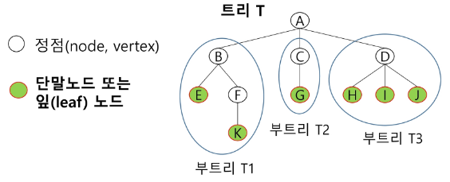

### 용어 정리

- 노드(node) : 트리의 원소

> ex. 트리 T의 노드 : A, B, C, D, E, F, G, H, I, J, K

- 간선(edge) : 노드를 연결하는 선. 부모 노드와 자식 노드를 연결

- 루트 노드(root node) : 트리의 시작 노드

> ex. 트리 T의 루트노드 : A

- 형제 노드(sibling node) : 같은 부모 노드의 자식 노드들

> ex. B, C, D는 형제 노드

- 조상 노드 : 간선을 따라 루트 노드까지 이르는 경로에 있는 모든 노드들

> K의 조상 노드 : F, B, A

- 서브 트리(subtree) : 부모 노드와 연결된 간선을 끊었을 때 생성되는 트리

- 자손 노드 : 서브 트리에 있는 하위 레벨의 노드들

> B의 자손 노드 : E, F, K

- 차수(degree)
  
  - 노드의 차수 : 노드에 연결된 자식 노드의 수
  
  > B의 차수 = 2, C의 차수 = 1
  
  - 트리의 차수 : 트리에 있는 노드의 차수 중에서 가장 큰 값
  
  > 트리 T의 차수 = 3
  
  - 단말 노드(리프 노드) : 차수가 0인 노드. 자식 노드가 없는 노드

- 높이
  
  - 노드의 높이 : 루트에서 노드에 이르는 간선의 수. 노드의 레벨
  
  > B의 높이 = 1, F의 높이 = 2
  
  - 트리의 높이 : 트리에 있는 노드의 높이 중에서 가장 큰 값. 최대 레벨
  
  > 트리 T의 높이 = 3

# 2. 이진 트리

- 모든 노드들이 2개의 서브트리를 갖는 특별한 형태의 트리
  
  - 마치라잌 2진수

- 각 노드가 자식 노드를 최대한 2개 까지만 가질 수 있는 트리
  
  - 왼쪽 자식 노드(left child node)
  
  - 오른쪽 자식 노드(right child node)

- 이진 트리의 예

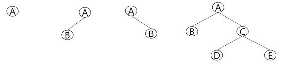

### 특성

- 레벨 i에서 노드의 최대 개수는 2^i개

- 높이가 h인 이진 느리가 가질 수 있는 노드의 개수는 (h+1)개가 되며, 최대 개수는 (2^(h+1) - 1)개가 된다.

### 종류

- 포화 이진 트리 : Full Binary Tree
  
  - 모든 레벨에 노드가 포화상태로 차 있는 이진 트리
  
  - 높이가 h일 때, 최대의 노드 개수인 (2^(h+1) - 1) 의 노드를 가진 이진 트리
  
  > 높이 3일 때 2^(3+1) - 1 = 15개의 노드
  
  - 루트를 1번으로 하여 2^(h+1) - 1까지 정해진 위치에 대한 노드 번호를 가짐

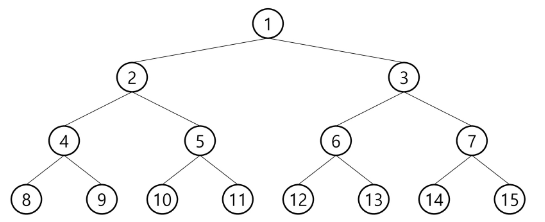

- 완전 이진 트리 : Complete Binary Tree
  
  - 높이가 h이고 노드 수가 n개일 때 (단, 2^h ≤ n ≤ 2^(h+1)-1), 포화 이진 트리의 노드 번호 1번부터 n번까지 빈 자리가 없는 이진 트리

> ex) 노드가 10개인 완전 이진 트리

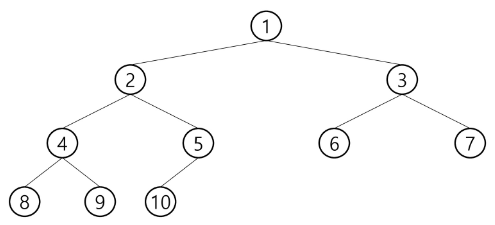

- 편향 이진 트리 : Skewed Binary Tree
  
  - 높이 h에 대한 최소 개수의 노드를 가지면서 한쪽 방향의 자식 노드만을 가진 이진 트리

> 왼쪽 편향 이진 트리, 오른쪽 편향 이진 트리

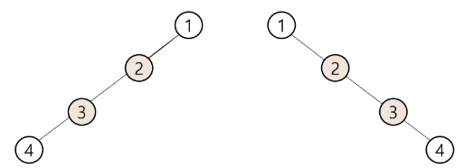

# 3. 순회

- 순회(traversal)란 트리의 각 노드를 중복되지 않게 전부 방문(visit)하는 것을 말하는데 트리는 비 선형 구조이기 때문에 선형구조에서와 같이 선후 연결 관계를 알 수 없다.

- 따라서 특별한 방법이 필요하다.

- 순회(traversal): 트리의 노드들을 체계적으로 방문하는 것

### 3가지의 기본적인 순회 방법

- L(왼쪽 서브트리), V(루트), R(오른쪽 서브트리)

- 전위순회(preorder traversal) : VLR
  
  - 부모노드 방문 후, 자식 노드를 좌, 우 순서로 방문한다.

- 중위순회(inorder traversal) : LVR
  
  - 왼쪽 자식노드, 부모노드, 오른쪽 자식노드 순으로 방문한다.

- 후위순회(postorder traversal) : LRV
  
  - 자식노드를 좌우 순서로 방문한 후, 부모노드로 방문한다.

### 전위순회(preorder traveral)

- 수행 방법
1. 현재 노드 n을 방문하여 처리한다. : V

2. 현재 노드 n의 왼쪽 서브트리로 이동한다. : L

3. 현재 노드 n의 오른쪽 서브트리로 이동한다. : R
- 전위 순회 알고리즘

```python
def preorder_traverse(T) :  # 전위순회
  if T:                     # T is not None
    visit(T)                # print(T.item)
    preorder_traverse(T.left)
    preorder_traverse(T.right)
```

- 전위순회 예

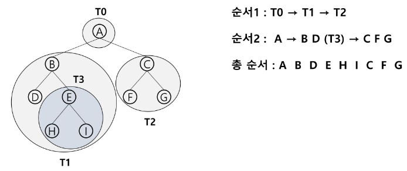

### 중위 순회(inorder traversal)

- 수행 방법
1. 현대 노드 n의 왼쪽 서브트리로 이동한다. : L

2. 현재 노드 n을 방문하여 처리한다. : V

3. 현재 노드 n의 오른쪽 서브트리로 이동한다. : R
- 중위 순회 알고리즘

```python
def inorder_traverse(T):    # 중위순회
  if T:                     # T is not None
    inorder_traverse(T.left)
    visit(T)                # print(T.item)
    inorder_traverse(T.right)
```

- 중위 순회의 예

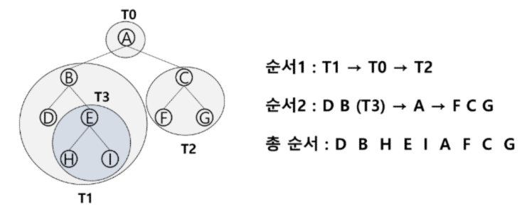

### 후위 순회(postorder traversal)

- 수행 방법
1. 현재 노드 n의 왼쪽 서브트리로 이동한다. : L

2. 현재 노드 n의 오른쪽 서브트리로 이동한다. : R

3. 현재 노드 n을 방문하여 처리한다. : V
- 후위 순회 알고리즘

```python
def postorder_traverse(T):    # 후위순회
  if T:                       # T is not None
    postorder_traverse(T.left)
    postorder_traverse(T.right)
    visit(T)                  # print(T.item)
```

- 후위 순회의 예

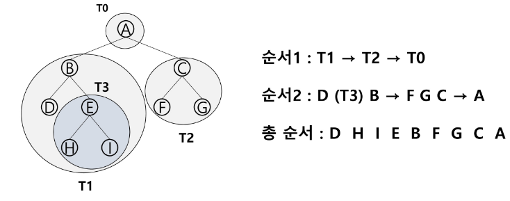

### 이진 트리의 순회

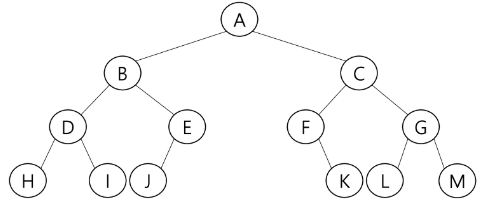

- 전위 순회 : A B D H I E J C F K G L M

- 중위 순회 : H D I B J E A F K C L G M

- 후위 순회 : H I D J E B K F L M G C A

# 4. 이진 트리의 표현

### 배열을 이용한 이진 트리의 표현

- 이진 트리에 각 노드 번호를 다음과 같이 부여

- 루트 번호를 1로 함

- 레벨 n에 있는 노드에 대하여 왼쪽부터 오른쪽으로 2^n 부터 2^(n_1) - 1 까지 번호를 차례로 부여

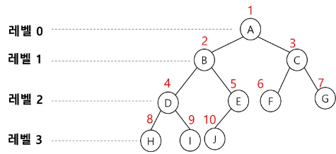

- 노드 번호의 성질
  
  - 노드 번호가 i인 노드의 부모 노드 번호 : i / 2
  
  - 노드 번호가 i인 노드의 왼쪽 자식 노드 번호 : 2 * i
  
  - 노드 번호가 i인 노드의 오른쪽 자식 노드 번호 : 2 * i + 1
  
  - 레벨 n의 노드 시작 번호 : 2^n

- 노드 번호를 배열의 인덱스로 사용

- 높이가 h인 이진 트리를 위한 배열의 크기는?
  
  - 레벨 i의 최대 노드 수 : 2^i
  
  - 따라서 1 + 2 + 4 + 8 + ... + 2^i = ∑2^i = 2^(h+1) - 1

> ex. 위 그림의 배열 :
> 
> 0 1 2 3 4 5 6 7 8 9 10  11  12  13  14  15
> 
> - A B C D E F G H I J   -   -   -   -   -

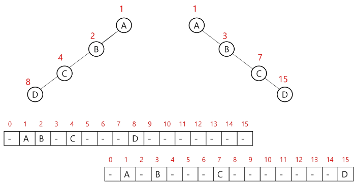

### [참고]이진 트리의 저장

- 부모 번호를 인덱스로 자식 번호를 저장

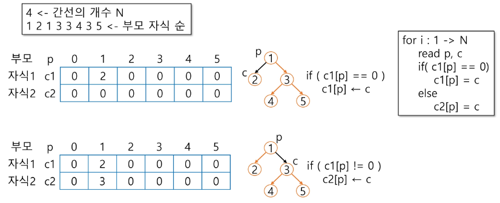

- 자식 번호를 인덱스로 부모 번호를 저장

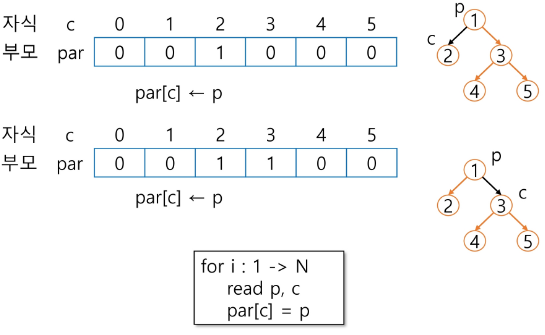

- 루트 찾기, 조상 찾기

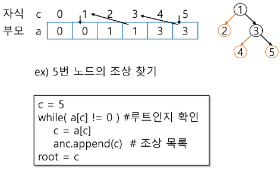

### 이진 트리의 표현-배열

- 배열을 이용한 이진 트리의 단점
  
  - 편향 이진 트리의 경우에 사용하지 않는 배열 원소에 대한 메모리 공간 낭비 발생
  
  - 트리의 중간에 새로운 노드를 삽입하거나 기존의 노드를 삭제할 경우 배열의 크기 변경 어려워 비효율적

### 이진 트리의 표현-연결 리스트

- 배열을 이용한 이진 트리의 표현의 단점을 보완하기 위해 연결리스트를 이용하여 트리를 표현할 수 있다.

- 연결 자료구조를 이용한 이진 트리의 표현
  
  - 이진 트리의 모든 노드는 최대 2개의 자식 노드를 가지므로 일정한 구조의 단순 연결 리스트 노드를 사용하여 구현

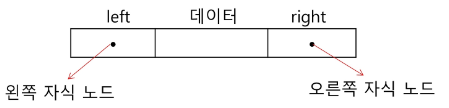

- 완전 이진 트리의 연결 리스트 표현

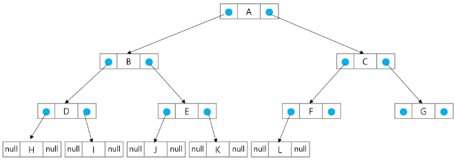

### 수식 트리

- 수식을 표현하는 이진 트리

- 수식 이진 트리(Expression Binary Tree)라고 부르기도 함

- 연산자는 루트 노드이거나 가지 노드

- 피연산자는 모두 잎 노드

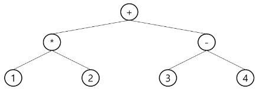

- 수식 트리의 순회

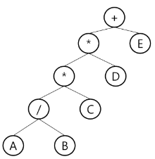

- 중위 순회 : A / B * C * D + E (식의 중위 표기법)

- 후위 순회 : A B / C * D * E + (식의 후위 표기법)

- 전위 순회 : + * * / A B C D E (식의 전위 표기법)

# 5. 연습문제

- 첫 줄에는 트리의 정점의 총 수 V가 주어진다. 그 다음 줄에는 V-1개 간선이 나열된다. 간선은 그것을 이루는 두 정점으로 표기된다. 간선은 항상 "부모 자식" 순서로 표기된다. 아래 예에서 두 번째 줄 처음 1과 2는 정점 1과 2를 잇는 간선을 의미하며 1이 부모, 2가 자식을 의미한다. 간선은 부모 정점 번호가 작은 것부터 나열되고, 부모 정점이 동일하다면 자식 정점 번호가 작은 것부터 나열된다.

- 다음 이진 트리 표현에 대하여 전위 순회하여 정점의 번호를 출력하시오.

- 코드

```python
'''
13
1 2 1 3 2 4 3 5 3 6 4 7 5 8 5 9 6 10 6 11 7 12 11 13
'''
'''
결과
1 2 4 7 12 3 5 8 9 6 10 11 13 
'''

# left, right 를 쓰는 버전
# 단, 입력이 반드시 각 노드당 최대 2번씩만 들어온다고 가정한 코드

# 전위 순회(나 -> 왼쪽 -> 오른쪽)
def preorder(node):
    if node == 0:
        return
    # 아래 3개 순서를 바꾸면 중위, 후위로 바뀐다.
    print(node, end=' ')    # 나
    preorder(left[node])    # 왼쪽
    preorder(right[node])   # 오른쪽

N = int(input())    # 정점의 개수(정점: 1~N 번)
arr = list(map(int, input().split()))
left = [0] * (N + 1)
# ex) left[3] = 2 -> 3번 부모의 왼쪽 자식은 2다.
right = [0] * (N + 1)

for i in range(0, len(arr), 2):
    parent, child = arr[i], arr[i+1]
    
    # 왼쪽 자식이 없다면, 왼쪽에 삽입
    if left[parent] == 0:
        left[parent] = child
    # 왼쪽 자식은 있는데, 오른쪽 자식이 없다면 오른쪽에 삽입
    else:
        right[parent] = child

root = 1    # 시작점은 1이라고 가정
preorder(root)
```

- 연결 리스트

```python
from collections import deque

class TreeNode:
    def __init__(self, key):
        self.key = key  # 노드의 값
        self.left = None  # 왼쪽 자식 노드를 가리킴
        self.right = None  # 오른쪽 자식 노드를 가리킴

class BinaryTree:
    def __init__(self):
        self.root = None  # 트리의 루트 노드

    # 새로운 노드를 삽입하는 함수 (레벨 순서 삽입)
    def insert(self, key):
        new_node = TreeNode(key)
        if self.root is None:
            self.root = new_node
            return

        # 레벨 순서로 트리를 탐색하기 위해 큐를 사용
        queue = deque([self.root])

        while queue:
            node = queue.popleft()

            # 왼쪽 자식이 비어있으면 삽입
            if node.left is None:
                node.left = new_node
                break
            else:
                queue.append(node.left)

            # 오른쪽 자식이 비어있으면 삽입
            if node.right is None:
                node.right = new_node
                break
            else:
                queue.append(node.right)

    def inorder_traversal(self):
        # 중위 순회를 통해 트리의 노드들을 출력하는 함수
        return self._inorder_traversal(self.root, [])

    def _inorder_traversal(self, node, result):
        if node:
            self._inorder_traversal(node.left, result)
            result.append(node.key)
            self._inorder_traversal(node.right, result)
        return result

# 예제 사용법
if __name__ == "__main__":
    tree = BinaryTree()
    tree.insert(50)
    print("Inorder Traversal:", tree.inorder_traversal())
    tree.insert(30)
    print("Inorder Traversal:", tree.inorder_traversal())
    tree.insert(20)
    print("Inorder Traversal:", tree.inorder_traversal())
    tree.insert(40)
    print("Inorder Traversal:", tree.inorder_traversal())
    tree.insert(70)
    print("Inorder Traversal:", tree.inorder_traversal())
    tree.insert(60)
    print("Inorder Traversal:", tree.inorder_traversal())
    tree.insert(80)

    print("Inorder Traversal:", tree.inorder_traversal())
```

- 인접 리스트 (전에 그래프 풀던 방식)

> graph = [[], [2, 3], [1], [1]] 이거

```python
'''
13
1 2 1 3 2 4 3 5 3 6 4 7 5 8 5 9 6 10 6 11 7 12 11 13
'''

def dfs(node):
    if node == -1:
        return

    preorder.append(node)
    dfs(graph[node][0])
    inorder.append(node)
    dfs(graph[node][1])
    postorder.append(node)


N = int(input())
E = N - 1
arr = list(map(int, input().split()))
graph = [[] for _ in range(N + 1)]
# append 를 통해 갈 수 있는 경로를 추가하기
for i in range(E):
    p, c = arr[i * 2], arr[i * 2 + 1]
    graph[p].append(c)

# 없는 경우 -1로 데이터를 저장하기 위한 코드("좌우 경로가 있는가 ?")
# 탐색 시 index 오류를 방지하기 위해 없는 경로를 -1로 저장하였습니다.
for i in range(N + 1):
    while len(graph[i]) < 2:
        graph[i].append(-1)


preorder = []
inorder = []
postorder = []

dfs(1)

print(*inorder)
print(*preorder)
print(*postorder)
```
