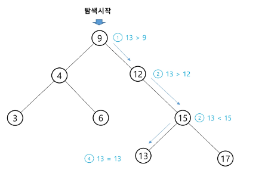
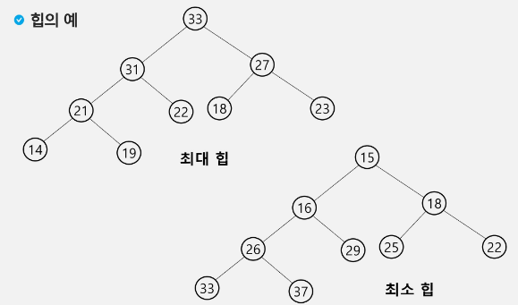

### 목차

> [1. 이진 탐색 트리](#1-이진-탐색-트리)
> 
> [2. 힙](#2-힙heap)

# 1. 이진 탐색 트리

- BST : Binary Search Tree 자료구조

- Data들을 빠르게 검색할 수 있도록 체계적으로 저장을 해 두고, 최대 `O(log n)`의 빠른 속도로 값을 검색할 수 있는 자료구조

- 빠르게 검색될 수 있도록, 특정 규칙을 갖는 이진트리 형태로 값을 저장해둔다.

### 리스트 vs BST

- BST는 리스트보다 더 빠른 삽입 / 삭제 / 탐색이 가능하다.

- 리스트 성능
  
  - 삽입 : `O(n)`, 단 맨 끝 삽입은 O(1)
  
  - 삭제 : `O(n)`, 단 맨 끝 삭제는 O(1)
  
  - 탐색 : `O(n)`

- BST 성능
  
  - 삽입 : 평균 `O(log N)`
  
  - 삭제 : 평균 `O(log N)` -> 삭제할 노드 탐색하는 데 걸리는 시간
  
  - 탐색 : 평균 `O(log N)`

- 파이썬 공식 Library에는 Binary Search Tree 자료구조가 내장되어 있지 않아 직접 구현해서 사용해야한다.

### set 동작 원리 - 삽입

- 처음 등장하는 값은 `root`에 저장된다.

- 비교할 노드 값 보다 target 값이 더 큰 경우 우측 자식 노드로 배정되고, 그렇지 않으면 왼쪽 자식 노드로 배정된다.


- 삽입을 위해 root부터 바닥 노드까지 탐색을 하며 자기 위치를 찾는다.

- 이는 트리의 높이(h) 만큼 탐색시간이 걸린다.

- 완벽하게 균형 잡힌 이진트리인 경우, 삽입 시간복잡도는 `O(log N)`이다.
  
  - 2^h(높이) - 1 = N(노드 수)
  
  - log2 N = h

- 최악의 경우(ex. 1 2 3 4 5...) 시간복잡도는 리스트와 같다. `O(n)`
  
  - 편향 이진 트리의 모양

### BST 탐색 방법

- 탐색 연산

- 완벽하게 균형잡힌 이진트리인 경우, 탐색 시간복잡도는 `O(log N)` 이다. 높이만큼 시간이 걸리기 때문

> ex. 13 탐색



### BST 순회

- BST에서 DFS 중위순회를 하게 되면 key 값이 작은 순서대로 탐색 가능(정렬)


### 이진 탐색 트리 - 성능

- 탐색(searching), 삽입(insertion), 삭제(deletion) 시간은 트리의 높이 만큼 시간이 걸린다.
  
  - `O(h)`, h : BST의 깊이(height)

- 평균의 경우
  
  - 이진 트리가 균형적으로 생성되어 있는 경우
  
  - `O(log n)`

- 최악의 경우
  
  - 한쪽으로 치우친 경사 이진트리의 경우
  
  - `O(n)`
  
  - 순차탐색과 시간복잡도가 같다.

### 연산 연습

- 삭제 연산


- 13 삭제 : 리프노드 삭제 : 그냥 삭제

- 12 삭제 : 자식이 하나 : 자식->부모 연결 후 삭제

- 9 삭제 : 자식이 둘 : 왼쪽 서브트리의 가장 큰 값이나 오른쪽 서브트리의 가장 작은 값

### [정리] 이진 탐색 트리

- 탐색작업을 효율적으로 하기 위한 자료구조

- 모든 원소는 서로 다른 유일한 키를 갖는다.

- key(왼쪽 서브트리) < key(루트 노드) < key(오른쪽 서브트리)

- 왼쪽 서브트리와 오른쪽 서브트리도 이진 탐색 트리다.

- 중위 순회하면 오름차순으로 정렬된 값을 얻을 수 있다.

# 2. 힙(Heap)

- 완전 이진 트리에 있는 노드 중에서 키값이 가장 큰 노드나 키값이 가장 작은 노드를 찾기 위해서 만든 자료구조

- 최대 힙(max heap)
  
  - 키값이 가장 큰 노드를 찾기 위한 `완전 이진 트리`
  
  - 부모노드의 키값 > 자식노드의 키값
  
  - 루트 노드 : 키값이 가장 큰 노드

- 최소 힙(min heap)
  
  - 키값이 가장 작은 노드를 찾기 위한 `완전 이진 트리`
  
  - 부모노드의 키값 < 자식노드의 키값
  
  - 루트 노드 : 키값이 가장 작은 노드

- 힙의 예



- 힙이 아닌 트리의 예


- 트리 1 : 완전이진트리가 아니다. 1이 왼쪽부터 들어가지 않음

- 트리 2 : 규칙을 어겼다. 부모 노드가 자식 노드보다 항상 크거나 항상 작지 않음

### 힙 연산 - 삽입

- 그냥 삽입 가능한 경우


- 자리 바꿔야 하는 경우


### 힙 연산 - 삭제

- 힙에서는 루트 노드의 원소만을 삭제할 수 있다.

- 루트 노드의 원소를 삭제하여 반환한다.

- 힙의 종류에 따라 최댓값 또는 최솟값을 구할 수 있다.

- 삭제 예


### 힙을 이용한 우선순위 큐

- 완전 이진 트리로 구현된 자료구조로서, 키값이 가장 큰 노드나 가장 작은 노드를 찾기에 적합한 자료구조

- 아래의 예는 최소 힙(Min heap)으로서, 가장 작은 키값을 가진 노드가 항상 루트에 위치한다.


- 힙의 키를 우선순위로 활용하여 우선순위 큐를 구현할 수 있다.

- 관련 링크 : [Priority Queues](https://pages.cs.wisc.edu/~vernon/cs367/notes/11.PRIORITY-Q.html)

- BST 코드

```python
'''
7
3 5 1 2 7 4 -5
'''

class Node:
    def __init__(self, key):
        self.key = key
        self.left = None
        self.right = None


class BinarySearchTree:
    def __init__(self):
        self.root = None

    def insert(self, key):
        if self.root is None:
            self.root = Node(key)
        else:
            self._insert(self.root, key)

    def _insert(self, node, key):
        if key < node.key:
            if node.left is None:
                node.left = Node(key)
            else:
                self._insert(node.left, key)
        else:
            if node.right is None:
                node.right = Node(key)
            else:
                self._insert(node.right, key)

    def search(self, key):
        return self._search(self.root, key)

    def _search(self, node, key):
        if node is None or node.key == key:
            return node
        if key < node.key:
            return self._search(node.left, key)
        else:
            return self._search(node.right, key)

    def inorder_traversal(self):
        self._inorder_traversal(self.root)

    def _inorder_traversal(self, node):
        if node:
            self._inorder_traversal(node.left)
            print(node.key, end=' ')
            self._inorder_traversal(node.right)

N = int(input())
arr = list(map(int, input().split()))

bst = BinarySearchTree()

for num in arr:
    bst.insert(num)

print("중위 순회 결과:", end=' ')
bst.inorder_traversal()  # 중위 순회: -5 1 2 3 4 5 7

# 탐색 예제
key = 5
result = bst.search(key)
if result:
    print(f"\n키 {key} 찾음.")
else:
    print(f"\n키 {key} 못 찾음.")
```

- 최대힙 코드

```python
'''
7
20 15 19 4 13 11 17

7
20 15 19 4 13 11 23
'''


# 최대힙
def enq(n):
    global last
    last += 1   # 마지막 노드 추가(완전이진트리 유지)
    h[last] = n # 마지막 노드에 데이터 삽입
    c = last    # 부모>자식 비교를 위해
    p = c//2    # 부모번호 계산
    while p >= 1 and h[p] < h[c]:   # 부모가 있는데, 더 작으면
        h[p], h[c] = h[c], h[p]  # 교환
        c = p
        p = c//2


def deq():
    global last
    tmp = h[1]   # 루트의 키값 보관
    h[1] = h[last]
    last -= 1
    p = 1           # 새로 옮긴 루트
    c = p*2
    while c <= last:  # 자식이 있으면
        if c+1 <= last and h[c] < h[c+1]: # 오른쪽자식이 있고 더 크면
            c += 1
        if h[p] < h[c]:
            h[p], h[c] = h[c], h[p]
            p = c
            c = p*2
        else:
            break
    return tmp


N = int(input())          # 필요한 노드 수
arr = list(map(int, input().split()))

h = [0]*(N+1)   # 최대힙
last = 0        # 힙의 마지막 노드 번호

for num in arr:
    enq(num)

print(h)

while last > 0:
    print(deq(), end=' ')
```

- 최소힙 코드

```python
'''
7
20 15 19 4 13 11 17

7
20 15 19 4 13 11 23
'''


# 최소힙
def enq(n):
    global last
    last += 1   # 마지막 노드 추가(완전이진트리 유지)
    h[last] = n # 마지막 노드에 데이터 삽입
    c = last    # 부모>자식 비교를 위해
    p = c//2    # 부모번호 계산
    while p >= 1 and h[p] > h[c]:   # 부모가 있는데, 더 크면
        h[p], h[c] = h[c], h[p]  # 교환
        c = p
        p = c//2


def deq():
    global last
    tmp = h[1]   # 루트의 키값 보관
    h[1] = h[last]
    last -= 1
    p = 1           # 새로 옮긴 루트
    c = p*2
    while c <= last:  # 자식이 있으면
        if c+1 <= last and h[c] > h[c+1]:  # 오른쪽자식이 있고 더 작으면
            c += 1
        if h[p] > h[c]:
            h[p], h[c] = h[c], h[p]
            p = c
            c = p*2
        else:
            break
    return tmp


N = int(input())          # 필요한 노드 수
arr = list(map(int, input().split()))

h = [0]*(N+1)   # 최대힙
last = 0        # 힙의 마지막 노드 번호

for num in arr:
    enq(num)

print(h)

while last > 0:
    print(deq(), end=' ')

```

- 힙 라이브러리 활용

```python
'''
7
20 15 19 4 13 11 17

7
20 15 19 4 13 11 23
'''

from heapq import heappush, heappop

N = int(input())          # 필요한 노드 수
arr = list(map(int, input().split()))

heap = []  # 최대힙을 구현하기 위한 리스트

# 최소힙 ( 기본 )
for num in arr:
    heappush(heap, num)

print([x for x in heap])  # 힙의 내부 상태를 출력 (음수로 저장된 상태)

while heap:
    print(heappop(heap), end=' ')

print('\n------------------------------------')

# 최대힙
# 삽입 시 음수로 곱하여 저장 (제일 큰 수가 제일 작아짐)
# 삭제 후 음수값을 곱하여 출력 (다시 원래 수로 복구하여 출력)
for num in arr:
    heappush(heap, -num)

print([-x for x in heap])  # 힙의 내부 상태를 출력 (음수로 저장된 상태)

while heap:
    print(-heappop(heap), end=' ')
```
