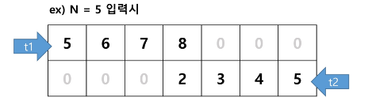
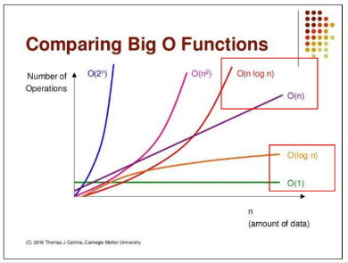
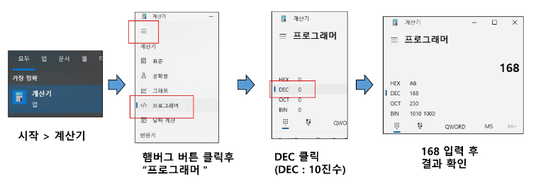
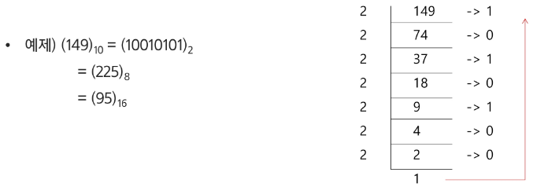

### 목차

> [1. SW 문제 해결](#1-sw-문제-해결)
> 
> [2. 복잡도 분석](#2-복잡도-분석)
> 
> [3. 표준 입출력 방법](#3-표준입출력)
> 
> [4. 진수](#4-진수-진법)

# 1. SW 문제 해결

### SW 문제 해결 역량

- 프로그램을 하기 위한 많은 제약 조건과 요구사항을 이해하고 최선의 방법을 찾아내는 능력

- 프로그래머가 사용하는 언어나 라이브러리, 자료구조, 알고리즘에 대한 지식을 적재적소에 퍼즐을 배치하듯 이들을 연결하여 큰 그림을 만드는 능력이라 할 수 있다.

- 문제 해결 역량은 추상적인 기술이다.
  
  - 프로그래밍 언어, 알고리즘처럼 명확히 정의된 실체가 없다.
  
  - 무작정 알고리즘을 암기하고 문제를 풀어본다고 향상되지 않는다.

- 문제 해결 역량을 향상시키기 위해서 훈련이 필요하다.

### 문제 해결 과정

1. 문제를 읽고 **이해**한다.

2. 문제를 익숙한 용어로 재정의한다.

3. 어떻게 해결할지 **계획**을 세운다.

4. **계획을 검증**한다.

5. 프로그램으로 **구현**한다.

6. 어떻게 풀었는지 돌아보고, 개선할 방법이 있는지 찾아본다.

### 예시 문제 : 리스트에 숫자 넣기

- 수 N을 입력받는다.

- 윗 줄에는 N부터 1씩 증가되는 숫자 4개를 왼쪽에 채운다.

- 아랫 줄에는 N부터 1씩 감소되는 숫자 4개를 오른쪽에 채운다.

- 최종 결과를 출력한다. 빈 공간은 0으로 출력한다.

### 설계 예시

- 2x7 크기의 0으로 채운 리스트를 준비한다.

- 수 N을 입력 받는다.

- t1 = N 대입 후, for 4번 돌려 T1 값을 리스트에 넣는다. range(0, 4)

- t2 = N 대입 후, for 4번 돌려 T2 값을 리스트에 넣는다. range(6, 2, -1)

- 리스트 출력



### 정리

- SW 문제 해결 능력을 기르는 이유
  
  - 코딩을 더 잘하게 하는 능력을 기르기 위함
  
  - SWEA 문제를 통해 기본문법 & 자료구조 & 알고리즘을 더 능숙하게 쓸 수 있도록 훈련한다.

- SWEA 문제를 잘 풀기 위한 전략
  
  - 단계 1 : 완벽한 문제 이해
  
  - 단계 2 : 종이와 펜을 이용한 설계하기 (어떻게 구현할지 계획하기)
  
  - 단계 3 : 설계한대로 구현 & 디버깅을 한다.

# 2. 복잡도 분석

### 알고리즘?

- 알고리즘 : 유한한 단계를 통해 문제를 해결하기 위한 절차나 방법. 주로 컴퓨터용어로 쓰이며, 컴퓨터가 어떤 일을 수행하기 위한 단계적 방법을 말한다.

- 간단하게 다시 말하면 어떠한 문제를 해결하기 위한 절차라고 볼 수 있다.

- 예를 들어 1부터 100까지의 합을 구하는 문제를 생각해보자

> ①. 1 + 2 + 3 + ... + 100 = 5050
> 
> ②. 100 x (1 + 100) / 2 = 5050

- ②가 더 낫다.

### 알고리즘의 효율성과 시간적 효율성

- `공간적 효율성`과 `시간적 효율성`

- 공간적 효율성은 연산량 대비 얼마나 **적은 메모리 공간**을 요하는 가를 말한다.

- 시간적 효율성은 연산량 대비 얼마나 **적은 시간**을 요하는 가를 말한다.

- 효율성을 뒤집어 표현하면 복잡도(Complexity)가 된다. 복잡도가 높을수록 효율성은 저하된다.

### 복잡도 분석

- 복잡도의 점근적 표기

- 시간 (또는 공간)복잡도는 입력 크기에 대한 함수로 표기하는데, 이 함수는 주로 여러 개의 항을 가지는 다항식이다.

- 이를 단순한 함수로 표현하기 위해 점근적 표기 (Asymptotic Notation)를 사용한다.

- 입력 크기 n이 무한대로 커질 때의 복잡도를 간단히 표현하기 위해 사용되는 표기법.

- O(Big-Oh)-표기

- Ω(Big-Omega)-표기

- Θ(Big-Theta)-표기

- 아래 코드는 몇 번 반복될까? N번

```python
n = int(input())

for i in range(n):
print(i, end = '')
```

### O(Big-Oh)-표기

- O-표기는 복잡도의 점근적 상한을 나타낸다.

- 복잡도가f(n) = 2n^2 - 7n + 4 이라면, f(n)의 O-표기는 O(n^2)이다.

- 먼저 f(n)의 단순화된 표현은 n^2이다.

- 단순화된 함수 n^2에 임의의 상수 c를 곱한 cn^2이 n이 증가함에 따라 f(n)의 상한이 된다. (단, c > 0)

- 상수랑 낮은 차수를 다 날려서 대략적이 지표만 계산 가능

```python
n = int(input())

for i in range(n):
    print(i, end = '')

for i in range(n):
    print(i, end = '')

for i in range(n):
    print(i, end = '')
```

- ㄴ실제 횟수 : 3N

- 빅-오 표기법 : O(N)

```python
n = int(input())

for i in range(n):
    for x in range(n):
        print(i, end = '')

    for y in range(n):
        print(i, end = '')
```

- ㄴ실제 횟수 : 2N^2

- 빅-오 : O(N^2)

```python
n = int(input())

for i in range(50):
    print(i)
```

- ㄴ상수 횟수를 반복하는 코드

- O(1)

---

- 빅오표기법을 이렇게 표기하기도 한다~

- O(5N)

- 5 배수를 강조해서 표현하고 싶을 때 O(N)이라고 적지 않고 O(5N) 이라고 적곤 한다.

> ex. 논문 등에서 알고리즘 성능을 미세하게 비교하고 싶은 경우
> 
> 기존 알고리즘 성능이 O(7N)이지만 제가 짠 알고리즘 성능은 O(2N)으로 더 좋은 성능을 냅니다~

- 빅오표기법으로 성능 비교하기

- `O(N)` VS `O(N^2)`

- N이 1을 넘는 순간 O(N)이 시간적인 측면에서는 더 좋아진다.

- 문제, 상황마다 다르다.

- ex) N이 5 이하인데 O(N)은 구현하는데 5분, O(N^2)은 구현하는데 1초라면 O(N^2)이 더 좋을 수도 있다.

- 자주 사용하는 O-표기
  
  - O(1) : 상수 시간(Constant time)
  
  - O(logn) : 로그(대수) 시간 (Logarithmic time)
  
  - O(n) : 선형 시간 (Linear time)
  
  - O(nlogn) : 로그 선형 시간 (Log-linear time)
  
  - O(n^2) : 제곱 시간 (Quadratic time)
  
  - O(n^3) : 세제곱 시간 (Cubic time)

- O(N) 이해하기
  
  - 만약 N이 10,000이고 O(N)으로 짠 알고리즘이 있다면, 10,000번 반복
  
  - O(N^2)이라면 100,000,000 (1억)번
  
  - O(log N)이라면 약 13번 (2^13 = 8,192)
  
  - N이 100,000,000이고 O(log N)이라면 약 26

- O(logN) 은 O(1) 보다는 느리지만, 유사한 성능을 보인다고 결론을 낼 수 있다.

- O(NlogN) 은 O(N) 보다는 느리지만, 유사한 성능을 보인다고 결론을 낼 수 있다.



- 왜 효율적인 알고리즘이 필요한가

- 10억 개의 숫자를 정렬하는데 PC에서 O(n^2) 알고리즘은 300여년, O(nlogn) 알고리즘은 5분

| O(n^2)   | 1,000 | 1백만  | 10억  |
|:--------:|:-----:|:----:|:----:|
| PC       | < 1초  | 2시간  | 300년 |
| 슈퍼컴      | < 1초  | 1초   | 1주일  |
| O(nlogn) | 1,000 | 1백만  | 10억  |
| PC       | < 1초  | < 1초 | 5분   |
| 슈퍼컴      | < 1초  | < 1초 | < 1초 |

- 효율적인 알고리즘은 슈퍼컴퓨터보다 더 큰 가치가 있다.

- 값비싼 H/W의 기술 개발보다 효율적인 알고리즘 개발이 훨씬 더 경제적이다.

# 3. 표준입출력

- 챕터의 목표 : 콘솔 입력 대신, **파일 입력**으로 입력을 받아보자. + 출력

```python
import sys
sys.stdin = open('input.txt', 'r')
sys.stdout = open('output.txt', 'w')

# 아래랑 기능이 같다.
text = input
print(text)
```

- 'r' : **R**ead mode로 파일을 Open한다.

# 4. 진수 (진법)

- 2, 8, 10, 16진수

- 10진수 : 사람이 사용, 수 하나를 0~9로 표현

- 2진수 : 컴퓨터가 사용, 수 하나를 0, 1로 표현

- 8진수 : 2진수를 더 가독성 있게... 요새는 중요X

- 16진수 : 2진수를 더 가독성 있게 사용, 수 하나를 0~9, A, B, C, D, E, F로 표현

> (168)10 = (1010 1000)2 = (250)8 = (A8)16

- 16진수를 사용하는 이유 :

- 10진수 : 인간이 이해하기 편함, but 2진수를 10진수로 변환 시 연산이 오래 걸림

- 16진수 : 인간이 이해하기 어렵지만, 2진수를 16진수로 변환 시 연산 속도가 매우 빠름

- 계산기로 사용 가능



- 용어 암기
  
  - HEX : 16진수
  
  - DEC : 10진수
  
  - OCT : 8진수
  
  - BIN : 2진수

### 진법 변환

- 10진수 -> 타 진수

- 원하는 타진법의 수로 나눈 뒤 나머지를 거꾸로 읽는다.



```python
tar = 149
result = []

while tar != 0:
    result.append(tar % 2)
    tar //= 2

result.reverse()
print(result)
```

- 2진수 -> 16진수 : 2진수 4개를 16진수 1개로 변환


