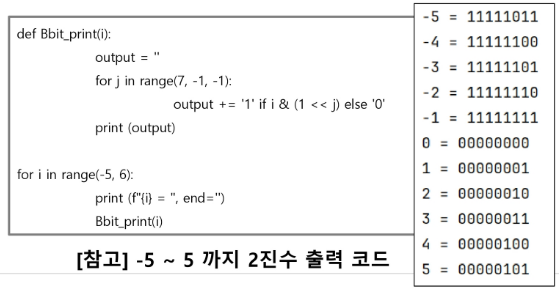

### 목차

> [1. 비트 연산](#1-비트-연산)
> 
> [2. 실수](#2-실수)

# 1. 비트 연산

- 비트와 바이트
  
  - 1 bit : 0과 1을 표현하는 정보의 단위
  
  - 1 Byte : 8 bit를 묶어 1 Byte라고 한다.

- 예시
  
  - 1001 0110 1101 1100 은 총 몇 비트이면서, 몇 바이트인가?
  
  - 16 bit 2 Byte

- 비트연산
  
  - 컴퓨터의 CPU는 0과 1로 다루어 동작되며, 내부적으로 비트 연산을 사용하여 덧셈, 뺄셈, 곱셈 등을 계산한다.

### AND, OR, XOR, NOT

| 연산자     | 연산자의 기능                                                                                                                               |
|:-------:|:-------------------------------------------------------------------------------------------------------------------------------------:|
| & (AND) | a And b : a, b 둘 다 1일 때만 결과가 1. 그 외에는 0 <br> 예) num1 & num2                                                                           |
| | (OR)  | a OR b : a, b 둘 중 하나만 1이면 결과가 1. 그 외에는 0 <br> 예) num1 \| num2                                                                         |
| ^ (XOR) | XOR(엑스오어) 연산자, OR처럼 동작되는데 둘 다 1인 경우는 0이다. <br> 같으면 0, 다르면 1 <br> 어떤 값이던 특정 수로 2회 XOR를 하면 원래 수로 돌아온다. <br> 암호화에 사용 <br> 예) num1 ^ num2 |
| ~ (NOT) | 모든 비트를 반전시킨다. <br> 예) 8 bit에서 ~(0001 1111) = 1110 0000                                                                                |

- 7 & 5, 7 | 5, 7 ^ 5
  
  - 0b111 & 0b101 = 101 = 5
  
  - 0b111 | 0b101 = 111 = 7
  
  - 0b111 ^ 0b101 = 010 = 2
  
  - 0b010 ^ 0b101 = 111 = 7

- 2진수 : `0b`

```python
print(bin(10))    # 10->2 0b1010
print(int('1101', 2))    # 2->10 11
```

- 16진수 : `0x`

```python
print(hex(10))    # 10->16 0xa
print(int('b', 16))    # 16->10 11
```

- 0b1101 1110 & 0b1 1011 
  
  - = 0001 1010 = 26

- 0x4A3 | 25(10) 
  
  - = 0b0100 1010 0011 | 0b0001 1001 = 0100 1011 1011 = 4BB =  1211

### 비트 연산자

- Left Shift `<<` : 특정 수 만큼 비트를 왼쪽으로 밀어낸다.
  
  - 0b1101 << 2 = 0b110100

- Right Shift `>>`  : 특정 수 만큼 비트를 오른쪽으로 밀어낸다. (우측 비트들이 제거된다.)
  
  - 0b1101 >> 2 = 0b11

- 응용

- `1 << n` = 2^n
  
  - 임베디드 분야에서 계산을 빠르게 하기 위해 사용된다.

- `i & (1<<n)`
  
  - i의 n번째 비트가 1인지 아닌지를 확인할 수 있다.
  
  - ex) 1101 & (1<<2) : 
  
  - 1101에서 2번째 bit가 1인지 확인 가능.
  
  - 결과 : 0100 -> 결과가 0보다 크면 n번째 비트는 1임이 확정

### 음수 표현 방법

- 컴퓨터는 음수를 "**2의 보수**"로 관리

- 맨 앞자리 bit (**MSB**)는 음수 or 양수를 구분하는 비트

- 음수에서 2의 보수 사용 이유 : 뺄셈의 연산 속도를 올릴 수 있고 +0과 -0을 따로 취급하지 않기 위해



- 2의 보수 예시
  
  - 10001
  
  - 수를 모두 뒤집고 +1
  
  - 01110 + 1 = 01111
  
  - 1111000 -> 0000111+1 = 0001000

- 2의 보수를 취한 수를 한번 더 2의 보수를 취하면 원래의 값으로 돌아온다.

- -5를 2의 보수로 표현 (수는 8bit로 저장한다고 가정)
  
  - 5 = 0000 0101
  
  - -5는 음수 -> MSB = 1
  
  - 나머지 7bit 뒤집고 +1 -> 111 1010 + 1 = 111 1011
  
  - 따라서 -5 = 1111 1011

- NOT 4 -> ~4 = -5
  
  - 4 = 0b0000 0100
  
  - ~4 = 0b1111 1011 = -5

# 2. 실수

- 소수점 출력
  
  - {숫자:.2f} : 숫자를 소수점 ~~둘?~~셋째자리에서 반올림 -> n.xx

- 파이썬은 다른 언어와 달리 내부적으로 더 큰 규모의 자료구조를 사용해서 훨씬 넓은 범위의 실수를 표현할 수 있다.
  
  - 최대로 표현할 수 있는 값은 약 1.8 x 10^308 이고 이 이상은 inf로 표현
  
  - 최소로 표현할 수 있는 값은 약 5.0 x 10^-324 이며, 이 이하는 0으로 표현

- 컴퓨터는 실수를 내부적으로 근사적으로 관리
  
  - 실수는 정확한 값이 아니라 근사 값으로 저장되는데 이때 **생기는 작은 오차가 계산 과정에서 다른 결과를 가져온다.**

```python
print(0.1 + 0.1 + 0.1 == 0.3)    # False
```

### [도전] 실수 값 출력해보기

```python
t = 0.1

print(f'{t:.2f}')    # 0.10
print(f'{t:.20f}')    # 0.10000000000000000555

print(0.1 + 0.1 == 0.2)    # True : 오차가 허용범위 안
print(0.1 + 0.1 + 0.1 == 0.3)    # False : 오차가 허용범위 밖
```

### 실수의 표현

- 컴퓨터는 실수를 표현하기 위해 부동 소수점(floating-point) 표기법을 사용한다. 이 표기법은 **IEEE 754**라는 컴퓨터에서 부동소수점을 표기하는 국제표준이다.

- 부동 소수점 표기 방법은 소수점의 위치를 고정시켜 표현하는 방식이다. 소수점의 위치를 왼쪽의 가장 유효한 숫자 다음으로 고정시키고 밑수의 지수승으로 표현
  
  - 1001.0011 -> 1.0010011 x 2^3

- 실수를 저장하기 위한 형식(IEEE 754, 32bit - Single Precision 표기법 기준)

- 32bit 구조
  
  - 부호 1비트 | 지수 8비트 | 가수 23비트
  
  - 부호 1비트 : 0이면 양수, 1이면 음수
  
  - 지수부(exponent) : 부동소수점의 크기 + bias값
  
  - 가수부(mantissa) : 실질적 수

- 12.375를 부동소수점으로 표기 (2진수로 변환)
  
  - 12 = 1100, 0.375 = 0.011이므로 1100.011
  
  - 1100.011 = 1.100011 x 2^3
  
  - 가수는 100011이고 지수는 3
  
  - 지수 + bias -> 3 + 127 = 130 (10000010)
  
  - 부호비트 : 0 (양수)
  
  - 가수 : **100011**00000000000000000

- **컴퓨터는 실수를 근사적으로 표현**
  
  - 이진법으로 표현할 수 없는 형태의 실수는 정확한 값이 아니라서 근사값으로 저장되는데 이때 생기는 작은 오차가 계산 과정에서 다른 결과를 가져온다.

- 실수 자료형의 유효 자릿수를 알아두자
  
  - 32 비트 실수형 유효자릿수(십진수) -> 약 6자리 (C++)
  
  - 64 비트 실수형 유효자릿수(십진수) -> 약 15자리 (C++, Java)
  
  - 파이썬에서는 내부적으로 더 많은 비트를 사용해서 훨씬 넓은 범위의 실수를 표현할 수 있다.


