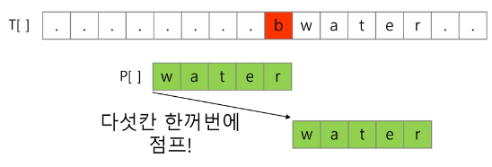
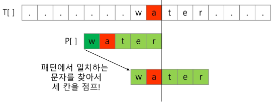
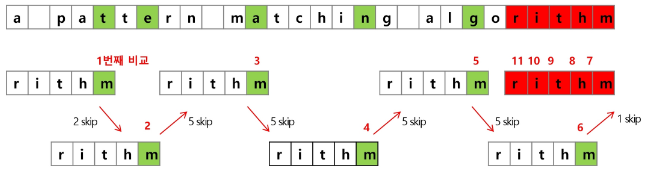

### 목차

> [1. 패턴 매칭]
> 
> [2. 고지식한 알고리즘(Brute Force]
> 
> [3. KMP 알고리즘]
> 
> [4. 보이어 무어 알고리즘]
> 
> [5. 연습문제3]
> 
> [6. 문자열 암호화]

# 1. 패턴 매칭

### 패턴 매칭에 사용되는 알고리즘들

- 고지식한 패턴 검색 알고리즘

- 카프-라빈 알고리즘

- KMP 알고리즘

- 보이어-무어 알고리즘

# 2. 고지식한 알고리즘(Brute Force)

- 본문 문자열을 처음부터 끝까지 차례대로 순회하면서 패턴 내의 문자들을 일일이 비교하는 방식으로 동작

> `T`    T    T    T    A    A    C    C    A    ... -> 다음 시작점으로 이동
> 
> `T`    T    A    => 실패 -> 원점으로 돌아감
> 
> - 한 칸 이동, 비교
> 
> T    `T`    T    T    A    A    C    C    A    ...
> 
>       `T`    T    A    => 실패

```python
p = "is"        # 찾을 패턴
t = "This is a book~!"    # 전체 텍스트
M = len(p)    # 찾을 패턴의 길이
N = len(t)    # 전체 텍스트의 길이

def BruteForce(p, t):
    i = 0    # t의 인덱스
    j = 0    # p의 인덱스
    while j < M and i < N:
        if t[i] != p[i]:
            i = i - j
            j = -1
        i = i + 1
        j = j + 1
    if j == M : return i - M    # 검색 성공
    else : return -1        # 검색 실패 
```

- 코드

```python
t = 'TTTTTABC'
p = 'TTA'
N = len(t)
M = len(p)
cnt = 0
for i in range(N-M+1):  # 비교 시작 위치
    for j in range(M):
        if t[i + j] != p[j]:
            break       # for j, 다음 글자부터 비교 시작
    else:           # for j가 중단없이 반복되면
        cnt += 1
print(cnt)    # 1
```

### 고지식한 패턴 검색 알고리즘의 시간 복잡도

- 최악의 경우 시간 복잡도는 텍스트의 모든 위치에서 패턴을 비교해야 하므로 O(MN)이 됨

- 길이가 10000인 문자열에서 길이 80인 패턴을 찾는다고 할 때, 최악의 경우 약 10,000 * 80 = 800,000 번의 비교가 일어난다.

- 비교횟수를 줄일 수 있는 방법?

# 3. KMP 알고리즘

- 불일치가 발생한 텍스트 스트링의 앞 부분에 어떤 문자가 있는지를 미리 알고 있으므로, 불일치가 발생한 앞 부분에 대하여 다시 비교하지 않고 매칭을 수행

- 패턴을 전처리하여 배열 next[M]을 구해서 잘못된 시작을 최소화함
  
  - next[M] : 불일치가 발생했을 경우 이동할 다음 위치

- 시간 복잡도 : O(M+N)

### 아이디어 설명

- 텍스트에서 abcdabc까지는 매치되고, e에서 실패한 상황 패턴의 맨 앞의 abc와 실패 직전의 abc는 동일함을 이용할 수 있다.

- 실패한 텍스트 문자와 P[4]를 비교한다.

> T[] ... `a b c` d `a b c` d ...
> 
>                                         d≠e
> 
> P[]     `a b c` d `a b c` e f
> 
> ------shift-------> `a b c` d `a b c` e f
> 
>                                         d=d 부터 비교 시작

### 매칭이 실패했을 때 돌아갈 곳 계산

- 패턴의 각 위치에 대해 매칭에 실패했을 때 돌아갈 곳을 준비해 둔다.

| a   | b   | c   | d   | a   | b   | c   | e   | f   |
|:---:|:---:|:---:|:---:|:---:|:---:|:---:|:---:|:---:|
| -1  | 0   | 0   | 0   | 0   | 1   | 2   | 3   | 0   |

- 코드

```python
def kmp(t, p):
    N = len(t)
    M = len(p)
    lps = [0] * (M+1)
    # preprocessing
    j = 0   # 일치한 개수 == 비교할 패턴 위치
    lps[0] = -1
    for i in range(1, M):
        lps[i] = j
        if p[i] == p[j]:
            j += 1
        else:
            j = 0
    lps[M] = j
    # search
    i = 0   # 비교할 텍스트 위치
    j = 0   # 비교할 패턴 위치
    while i < N and j <= M:
        if j == -1 or t[i] == p[j]:
            i += 1
            j += 1
        else:       # 불일치
            j = lps[j]
        if j == M:  # 패턴을 찾을 경우
            print(i-M, end = ' ')   # 패턴의 인덱스 출력
            j = lps[j]
    print()
    return

t = 'zzzabcdabcdabcefabcd'
p = 'abcdabcef'
kmp(t, p)   # 7
t = 'AABAACAADAABAABA'
p = 'AABA'
kmp(t, p)   # 0 9 12
t = 'AAAAABAAABA'
p = 'AAAA'
kmp(t, p)   # 0 1
t = 'AAAAABAAABA'
p = 'AA'
kmp(t, p)   # 0 1 2 3 6 7
```

# 4. 보이어 무어 알고리즘

- 오른쪽에서 왼쪽으로 비교

- 대부분의 상용 소프트웨어에서 채택하고 있는 알고리즘

- 보이어-무어 알고리즘은 패턴에 오른쪽 끝에 있는 문자가 불일치하고 이 문자가 패턴내에 존재하지 않는 경우, 이동 거리는 무려 패턴의 길이 만큼이 된다.



- 오른쪽 끝에 있는 문자가 불일치 하고 이 문자가 패턴 내에 존재할 경우



- 보이어-무어 알고리즘 예시



- rithm 문자열의 skip 배열

| m   | h   | t   | i   | r   | 다른 모든 문자 |
|:---:|:---:|:---:|:---:|:---:|:--------:|
| 0   | 1   | 2   | 3   | 4   | 5        |

### 문자열 매칭 알고리즘 비교

- 찾고자 하는 문자열 패턴의 길이 m, 총 문자열 길이 n

- 고지식한 패턴 검색 알고리즘 : 수행시간 O(mn)

- 카프-라빈 알고리즘 : 수행시간 O(n)

- KMP 알고리즘 : 수행시간 O(n)

- 보이어 무어 알고리즘
  
  - 앞의 두 매칭 알고리즘들의 공통점은 텍스트 문자열의 문자를 적어도 한 번씩 훑는다는 것. 따라서 최선의 경우에도 O(n)
  
  - 보이어-무어 알고리즘은 텍스트 문자를 다 보지 않아도 된다
  
  - 발상의 전환 : 패턴의 오른쪽부터 비교
  
  - 최악의 경우 수행시간 : O(mn)
  
  - 입력에 따라 다르지만 일반적으로 O(n)보다 시간이 덜 든다.

# 5. 연습문제3

- 고지식한 방법을 이용하여 패턴 찾기

- 임의의 본문 문자열과 찾을 패턴 문자열 생성

- 결과 값으로 찾은 위치 값을 출력

- 코드

```python
def f(t, p):    # 패턴 p와 일치하는 구간의 시작인덱스 리턴, 일치하는 경우가 없으면 -1 리턴
    N = len(t)
    M = len(p)

    for i in range(N - M + 1):  # 비교 시작 위치
        for j in range(M):
            if t[i + j] != p[j]:
                break       # for j, 다음 글자부터 비교 시작
        else:           # for j가 중단없이 반복되면
            return i    # 패턴을 찾은 경우
    return -1

t = 'TTTTTATTAATA'
p = 'TTA'
print(f(t, p))      # 3
t = 'ABCDEABCDEABAT'
p = 'TTA'
print(f(t, p))      # -1
```

# 6. 문자열 암호화

### 시저 암호(Caesar cipher)

- 줄리어스 시저가 사용했다고 하는 암호

- 시저는 기원전 100년경에 로마에서 활약했던 장군

- 시저 암호에서는 평문에서 사용되고 있는 알파벳을 일정한 문자 수만큼 [평행이동] 시킴으로써 암호화를 행한다.

- 1만큼 평행했다는 카이사르 암호화의 예

| 평문  | S   | A   | V   | E   |     | P   | R   |
|:---:|:---:|:---:|:---:|:---:|:---:|:---:|:---:|
| 암호문 | T   | B   | W   | F   | A   | Q   | S   |

- 키값

> T B W F ...
> 
> - 1일 때 : T B W F ...
> 
> - 2일 때 : U C X G ...
> 
> - ...
> 
> - 25일 때 : S A V E ...

### 문자 변환표를 이용한 암호화(단일 치환 암호)

- 단순한 카이사르 암호화보다 훨씬 강력한 암호화 기법

- 문자 변환표의 예

| 평문  |     | A   | E   | P   | R   | S   | V   |
|:---:|:---:|:---:|:---:|:---:|:---:|:---:|:---:|
| 암호문 | Q   | H   | J   | I   | P   | X   | G   |

- 변환표를 사용한 예

| 평문  | S   | A   | V   | E   |     | P   | R   |
|:---:|:---:|:---:|:---:|:---:|:---:|:---:|:---:|
| 암호문 | X   | H   | G   | J   | Q   | I   | P   |

- 60 p....
