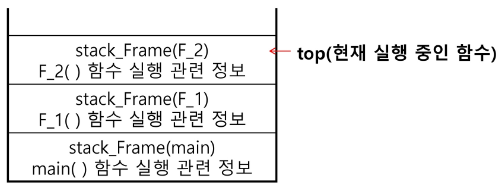

### 목차

> [1. 스택]
> 
> [2. 스택의 응용]
> 
> [3. 재귀호출]


# 1. 스택(stack)

### 스택의 특성

- 물건을 쌓아 올리듯 자료를 쌓아 올린 형태의 자료구조

- 스택에 저장된 자료는 선형 구조를 갖는다.
  
  - 선형구조 : 자료 간의 관계가 1:1의 관계를 갖는다.
  
  - 비선형구조 : 자료 간의 관계가 1:N의 관계를 갖는다. (ex. 트리)

- 스택에 자료를 삽입하거나 스택에서 자료를 꺼낼 수 있다.

- `후입선출(LIFO, Last-In-First-Out)` : **마지막에 삽입한 자료를 가장 먼저 꺼낸다.**

> 스택에 1, 2, 3 순으로 자료 삽입 -> 꺼내면 역순 : 3, 2, 1

### 스택을 구현하기 위해 필요한 자료구조와 연산

- 자료구조 : 자료를 선형으로 저장할 저장소
  
  - 배열 사용 가능
  
  - 저장소 자체를 스택이라고 부르기도 한다.
  
  - 스택에서 마지막으로 삽입된 원소의 위치를 `top`이라 부른다.

- 연산
  
  - **삽입** : `push` : 저장소에 자료를 저장
  
  - **삭제** : `pop` : 저장소에서 자료 꺼내기
  
  - `isEmpty` : 스택이 공백인지 아닌지 확인
  
  - `peek` : 스택의 top에 있는 item(원소)을 반환하는 연산

### 스택의 삽입/삭제 과정

- 빈 스택에 원소 A, B, C를 차례로 삽입 후 한번 삭제하는 연산과정


### 스택의 구현

- 스택의 push 알고리즘 : append 메소드를 통해 리스트의 마지막에 데이터를 삽입

```python
def push(item):
    s.append(item)
```

- 코드

```python
def push(item, size):
	global top
	top += 1
	if top == size:
		print('overflow!')
	else:
		stack[top] = item

size = 10
stack = [0] * size
top = -1

push(10, size)
top += 1			# push(20)
stack[top] = 20
```

- 스택의 pop 알고리즘

```python
def pop():
    if len(s) == 0:
        # underflow
        return
    else:
        return s.pop()
```

- 코드

```python
def pop():
    global top
    if top == -1:
        print('underflow')
        return 0
    else:
        top -= 1
        return stack[top+1]

print(pop())

if top > -1:    # pop()
    top -= 1
    print(stack[top+1])
```

### 연습문제1

- 스택 구현

- 구현한 스택을 이용해 3개의 데이터를 스택에 저장하고 다시 3번 꺼내 출력하기

```python
stack = []
stack.append(1) # push(1)
stack.append(2) # push(2)
stack.append(3) # push(3)
print(stack.pop())  # 3
print(stack.pop())  # 2
print(stack.pop())  # 1
```

```python
top = -1

top += 1    # push(1)
stack[top] = 1
top += 1    # push(2)
stack[top] = 2
top += 1    # push(3)
stack[top] = 3

top -= 1
print(stack[top+1])    # 3
print(stack[top])      # 2
top -= 1
print(stack[top])      # 1
top -= 1
```

# 2. 스택의 응용

- 1차원 배열을 사용하여 구현할 경우 구현이 용이하다는 장점이 있지만 스택의 크기를 변경하기가 어렵다는 단점이 있다.

- 이를 해결하기 위한 방법으로 저장소를 동적으로 할당하여 스택을 구현하는 방법이 있다. 동적 연결리스트를 이용하여 구형하는 방법을 의미한다. 구현이 복잡하다는 단점이 있지만 메모리를 효율적으로 사용한다는 장점을 가진다. 스택의 동적 구현은 생략~

### 괄호검사 문제

- 괄호의 종류 : 대괄호`[]`, 중괄호`{}`, 소괄호`()`

- 조건
  
  1. 왼쪽 괄호의 개수와 오른쪽 괄호의 개수가 같아야 한다.
  
  2. 같은 괄호에서 왼쪽 괄호는 오른쪽 괄호보다 먼저 나와야 한다.
  
  3. 괄호 사이에는 포함 관계만 존재한다.

- 잘못된 괄호 사용의 예

> (a(b)
> 
> a(b)c)
> 
> a{b(c[d]e}f)

- 스택을 이용한 괄호 검사


- 괄호 조사 알고리즘 개요
  
  - 문자열에 있는 괄호를 차례대로 조사하면서 왼쪽 괄호를 만나면 스택에 삽입하고, 오른쪽 괄호를 만나면 스택에서 top 괄호를 삭제한 후 오른쪽 괄호와 짝이 맞는지 검사
  
  - 이 때 스택이 비어 있으면 조건1 또는 조건2에 위배, 괄호의 짝이 맞지 않으면 조건3에 위배
  
  - 마지막 괄호까지 조사한 후에도 스택에 괄호가 남아 있으면 조건1에 위배

### function call

- 프로그램에서의 함수 호출과 복귀에 따른 수행 순서 관리

- 가장 마지막에 호출된 함수가 가장 먼저 실행을 완료하고 복귀하는 후입선출 구조이므로, 후입선출 구조의 스택을 이용하여 수행순서 관리


- 함수 호출이 발생하면 호출한 함수 수행에 필요한 지역변수, 매개변수 및 수행 후 복귀할 주소 등의 정보를 스택 프레임(stack frame)에 저장하여 시스템 스택에 삽입



- 함수의 실행이 끝나면 시스템 스택의 top 원소(스택 프레임)를 삭제(pop)하면서 프레임에 저장되어 있던 복귀주소를 확인하고 복귀

- 함수 호출과 복귀에 따라 이 과정을 반복하여 전체 프로그램 수행이 종료되면 시스템 스택은 공백 스택이 된다.

```python
def f2(c, d):
    return c-d

def f1(a, b):
    c = a+b
    d = 10
    return f2(c, d)

a = 10
b = 20
print(f1(a, b))     # 20
```

# 3. 재귀호출

- 필요한 함수가 자신과 같은 경우 자신을 다시 호출하는 구조

- 함수에서 실행해야 하는 작업의 특성에 따라 일반적인 호출방식보다 재귀호출방식을 사용하여 함수를 만들면 프로그램의 크기를 줄이고 간단하게 작성

### factorial

- n에 대한 factorial : 1부터 n까지의 모든 자연수를 곱하여 구하는 연산

> n! = n x (n-1)!
> 
> (n-1)! = (n-1) x (n-2)!
> 
> (n-2)! = (n-2) x (n-3)!
> 
> ...
> 
> 2! = 2 x 1!
> 
> 1! = 1

- 마지막에 구한 하위 값을 이용하여 상위 값을 구하는 작업을 반복


-  코드

```python
def fact(n):
    if n==1:
        return 1
    return n*fact(n-1)

print(fact(5))      # 120
```


### 피보나치

- 0과 1로 시작하고 이전의 두 수 합을 다음 항으로 하는 수열

- 피보나치 수열의 i 번째 값을 계산하는 함수 F를 정의하면 다음과 같다.

> F0 = 0, F1 = 1
> 
> Fi = Fi-1 + Fi-2 for i ≥2

- 위의 정의로부터 피보나치 수열의 i 번째 항을 반환하는 함수를 재귀함수로 구현 가능

```python
def fibo(n):
    if n < 2:
        return n
    else:
        return fibo(n-1) + fibo(n-2)
```

### 재귀 호출 연습

- 모든 배열 원소에 접근하기

```python
def f(i, N)    # 크기 N인 배열 arr[i]에 접근
    if i == N:
        return
    else:
        print(arr[i])
        f(i+1, N)
```

- 배열에 v가 있으면 1, 없으면 0을 리턴

```python
def f(i, N, v):    # v : 찾는 값
    if i == N:
        return 0
    elif arr[i] == v:
        return 1
    else:
        return f(i+1, N, v)
```


