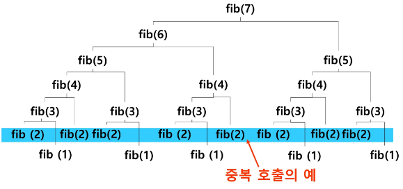
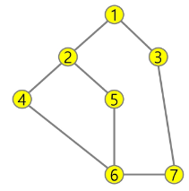

### 목차

> [1. Memoization](#1-memoization)
> 
> [2. DP](#2-dp)
> 
> [3. DFS(깊이우선탐색)](#3-dfs깊이우선탐색)
> 
> [4. 연습문제3](#4-연습문제3)

# 1. Memoization

- 피보나치 수를 재귀함수로 구현한 알고리즘의 문제점 : 중복 호출이 매우 많다

- 피보나치 수열의 Call Tree



- 메모이제이션(memoization) : 컴퓨터 프로그램을 실행할 때 예전에 계산한 값을 메모리에 저장해서 매번 다시 계산하지 않도록 하여 전체적인 실행속도를 빠르게 하는 기술. 동적 계획법의 핵심

- 글자 그대로 해석하면 '메모리 넣기(to put in memory)'라는 의미. '기억되어야 할 것'이라는 뜻의 라틴어 memorandum에서 파생됨. '기억하기', '암기하기' 라는 뜻의 memorization과 혼동x 동사형은 memoize

- 피보나치 수를 구할 때 fibo(n)의 값을 계산하자마자 저장하면 실행시간을 O(n)으로 줄일 수 있다.

- 알고리즘

```python
# memo를 위한 배열을 할당하고 모두 0으로 초기화
# memo[0]을 0으로 memo[1]는 1로 초기화

'''
# memo x

def fibo(n):
    if n<2:
        return n
    else:
        return fibo(n-1) + fibo(n-2)
'''

def fibo1(n):
    global memo
    if n >= 2 and memo[n] == 0:
        memo[n] = fibo1(n-1) fibo1(n-2)
    return memo[n]

memo = [0] = 0
memo[0] = 0
memo[1] = 1
print(fibo1(100))
```

# 2. DP

- Dynamic Programming : 동적 계획 알고리즘은 그리디 알고리즘과 같이 최적화 문제를 해결하는 알고리즘

- 동적 계획 알고리즘은 먼저 입력 크기가 작은 부분 문제들을 모두 해결한 후에 그 해들을 이용하여 보다 큰 크기의 부분 문제들을 해결하여, 최종적으로 원래 주어진 입력의 문제를 해결하는 알고리즘이다. 

### 피보나치 수 DP 적용

- 피보나치 수는 부분 문제의 답으로부터 본 문제의 답을 얻을 수 있으므로 최적 부분 구조로 이루어져 있다.
1) 문제를 부분 문제로 분할
   
   - Fibonacci(n) = Fibonacci(n-1) + Fibonacci(n-2)

2) 가장 작은 부분 문제부터 해 구하기

3) 결과를 테이블에 저장하고 테이블에 저장된 부분 문제의 해를 이용하여 상위 문제 해 구하기

| 테이블 인덱스 | 저장되어 있는 값 |
|:-------:|:---------:|
| [0]     | 0         |
| [1]     | 1         |
| [2]     | 1         |
| [3]     | 2         |
| [4]     | 3         |
| ...     | ...       |
| [n]     | fibo(n)   |

- 피보나치 수 DP 적용 알고리즘

```python
def fibo2(n):
    f = [0] * (n + 1)
    f[0] = 0
    f[1] = 1
    for i in range(2, n+1):
        f[i] = f[i-1] + f[i-2]

    return f[n]
```

### DP의 구현 방식

- recursive 방식 : fibo1()

- iterative 방식 : fibo2()

- memoization을 재귀적 구조에 사용하는 것보다 반복적 구조로 DP를 구현한 것이 성능 면에서 보다 효율적

- 재귀적 구조는 내부에 시스템 호출 스택을 사용하는 오버헤드가 발생하기 때문

# 3. DFS(깊이우선탐색)

- 비선형구조인 그래프 구조는 그래프로 표현된 모든 자료를 빠짐없이 검색하는 것이 중요

- 두 가지 방법
  
  - 깊이 우선 탐색(Depth First Search, DFS)
  
  - 너비 우선 탐색(Breath First Search, BFS)

### DFS(깊이우선탐색)

- 시작 정점의 한 방향으로 갈 수 있는 경로가 있는 곳까지 깊이 탐색해 가다가 더 이상 갈 곳이 없게 되면, 가장 마지막에 만났던 갈림길 간선이 있는 정점으로 되돌아와서 다른 방향의 정점으로 탐색을 계속 반복하여 결국 모든 정점을 방문하는 순회방법

- 가장 마지막에 만났던 갈림길의 정점으로 되돌아가서 다시 깊이 우선 탐색을 반복해야 하므로 후입선출 구조의 스택 사용

### [참고] 로봇이 선을 따라 모든 칸 탐색


1. 시작 정점 v를 결정해서 방문한다.

2. 정점 v에 인접한 정점 중에서
   
   - 방문하지 않은 정점 w가 있으면, 정점 v를 스택에 push하고 정점 w를 방문, 그리고 w를 v로 하여 다시 2)를 반복
   
   - 방문하지 않은 정점이 없으면, 탐색의 방향을 바꾸기 위해서 스택을 pop하여 받은 가장 마지막 방문 정점을 v로 하여 다시 2) 반복

3. 스택이 공백이 될 때까지 2) 반복

> 로봇    스택
> 
> 1        
> 
> 2        1
> 
> 4        1 2
> 
> 2        1 -> `2`
> 
> 5        1 2
> 
> 7        1 2 5
> 
> 5        1 2 -> `5`
> 
> 2        1 -> `2`
> 
> 1        -> `1`
> 
> 3        1
> 
> 6        1 3
> 
> 3        1 -> `3`
> 
> 1        -> `1`

- 알고리즘

```python
visited[], stack[] 초기화
DFS(v)
    시작점 v 방문;
    visited[v] <- true;
    while {
        if (v의 인접 정점 중 방문 안 한 정점 w가 있으면)
            push(v);
            v <- w;    (w에 방문)
            visited[w] <- true;
        else
            if (스택이 비어 있지 않으면)
                v <- pop(stack);
            else
                break
    }
end DFS()
```

### DFS 예

- 초기상태 : 배열 visited를 False로 초기화하고 공백 스택을 생성


1. 정점 A를 시작으로 깊이 우선 탐색을 시작

> stack :
> 
> visited : T F F F F F F

```python
A 방문;
visited[A] <- true;
```

2. 정점 A에 방문하지 않은 정점 B, C가 있으므로 A를 스택에 push하고, 인접정점 B와 C중에서 오름차순에 따라 B를 선택하여 탐색을 계속함

> stack : A
> 
> visited : T T F F F F F

```python
push(A);
B 방문;
visited[B] <- true;
```

3. 정점 B에 방문하지 않은 정점 D,E가 있으므로 B를 스택에 push하고, 인접정점 D와 E 중에서 오름차순에 따라 D를 선택하여 탐색을 계속함

> stack : A B
> 
> visited : T T F T F F F

```python
push(B);
D 방문;
visited[D] <- true;
```

4. 정점 D에 방문하지 않은 정점 F가 있으므로 D를 스택에 push하고, 인접정점 F를 선택하여 탐색 계속함

> stack : A B D
> 
> visited : T T F T F T F

```python
push(D);
F 방문;
visited[F] <- true;
```

5. 정점 F에 방문하지 않은 정점 E, G가 있으므로 F를 스택에 push하고, 인접정점 E와 G중에서 오름차순에 따라 E를 선택하여 탐색 계속

> stack : A B D F
> 
> visited : T T F T T T F

```python
push(F);
E 방문;
visited[E] <- true;
```

6. 정점 E에 방문하지 않은 정점 C가 있으므로 E를 스택에 push하고, 인접정점 C를 선택하여 탐색 계속

> stack : A B D F E
> 
> visited : T T T T T T F

```python
push(E);
C 방문;
visited[C] <- true;
```

7. 정점 C에서 방문하지 않은 인접정점이 없으므로, 마지막 정점으로 돌아가기 위해 스택을 pop하여 받은 정점 E에 대해서 방문하지 않은 인접정점이 있는지 확인

> stack : A B D F
> 
> visited : T T T T T T F

```python
pop(stack);
```

8. 정점 E는 방문하지 않은 인접정점이 없으므로, 다시 스택을 pop하여 받은 정점 F에 대해서 방문하지 않은 인접정점이 있는지 확인

> stack : A B D
> 
> visited : T T T T T T F

```python
pop(stack);
```

9. 정점 F에 방문하지 않은 정점 G가 있으므로 F를 스택에 push하고, 인접정점 G를 선택하여 탐색 계속

> stack : A B D F
> 
> visited : T T T T T T T

```python
push(F);
G 방문;
visited[G] <- true;
```

10. 정점 C에서 방문하지 않은 인접정점이 없으므로, 마지막 정점으로 돌아가기 위해 스택을 pop하여 받은 정점 F에 대해서 방문하지 않은 인접정점이 있는지 확인

> stack : A B D
> 
> visited : T T T T T T T

```python
pop(stack);
```

11. 정점 F에서 방문하지 않은 인접정점이 없으므로, 마지막 정점으로 돌아가기 위해 스택을 pop하여 받은 정점 D에 대해서 방문하지 않은 인접정점이 있는지 확인

> stack : A B
> 
> visited : T T T T T T T

```python
pop(stack);
```

12. 정점 D에서 방문하지 않은 인접정점이 없으므로, 마지막 정점으로 돌아가기 위해 스택을 pop하여 받은 정점 B에 대해서 방문하지 않은 인접정점이 있는지 확인

> stack : A
> 
> visited : T T T T T T T

```python
pop(stack);
```

13. 정점 B에서 방문하지 않은 인접정점이 없으므로, 마지막 정점으로 돌아가기 위해 스택을 pop하여 받은 정점 A에 대해서 방문하지 않은 인접정점이 있는지 확인

> stack : 
> 
> visited : T T T T T T T

```python
pop(stack);
```

14. 현재 정점 A에서 방문하지 않은 인접정점이 없으므로, 마지막 정점으로 돌아가기 위해 스택을 pop하는데, 스택이 공백이므로 깊이 우선 탐색을 종료

> 최종 경로 : A-B-D-F-E-C-G


# 4. 연습문제3

- 다음은 연결되어 있는 두 개의 정점 사이의 간선을 순서대로 나열해 놓은 것이다. 모든 정점을 깊이 우선 탐색하여 화면에 깊이 우선 탐색 경로를 출력하시오. 시작 지점을 1로 시작

> 1 2 1 3 2 4 2 5 4 6 5 6 6 7 3 7



출력 결과의 예 : 1 2 4 6 5 7 3

- 코드

```python
'''
1
7 8
1 2 1 3 2 4 2 5 4 6 5 6 6 7 3 7
'''
def DFS(s, V):              # s : 시작정점, v : 정점개수(1번부터인 정점의 마지막 정점)
    visited = [0]*(V+1)     # 방문한 정점 표시
    stack = []              # 스택 생성
    print(s)
    visited[s] = 1          # 시작정점 방문 표시
    v = s
    while True:
        # v에 인접하고, 방문 안 한 w가 있으면
        for w in adjL[v]:
            if visited[w] == 0:
                # push(v) 현재 정점을 push하고
                stack.append(v)
                v = w       # w에 방문
                print(v)
                visited[w] = 1  # 방문 표시
                break
        else:               # 남은 인접정점이 없어서 break가 걸리지 않은 경우
            # 이전 갈림길을 스택에서 꺼내서... if TOP > -1
            if stack:
                v = stack.pop()
            else:   # 되돌아갈 곳이 없으면/남은 갈림길이 없으면 탐색종료
                break   # while True


T = int(input())
for tc in range(1, T + 1):
    V, E = map(int, input().split())
    adjL = [[] for _ in range(V+1)]
    arr = list(map(int, input().split()))
    for i in range(E):
        v1, v2 = arr[i*2], arr[i*2+1]
        adjL[v1].append(v2)
        adjL[v2].append(v1)
    print(adjL)

    DFS(1, V)
    
'''
[[], [2, 3], [1, 4, 5], [1, 7], [2, 6], [2, 6], [4, 5, 7], [6, 3]]
1
2
4
6
5
7
3
'''
```
