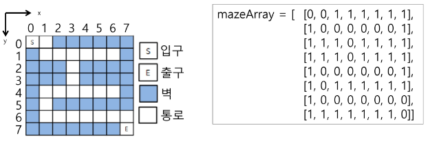

### 목차

> [1. 계산기1](#1-계산기1)
> 
> [2. 계산기2](#2-계산기2)
> 
> [3. 백트래킹](#3-백트래킹)


# 1. 계산기1

- 문자열로 된 계산식이 주어질 때, 스택을 이용하여 이 계산식의 값을 계산하기

- 문자열 수식 계산의 일반적인 방법
1. 중위 표기법의 수식을 후위 표기법으로 변경(스택 이용)

> 중위표기법(infix notation)
> 
> - 연산자를 피연산자의 가운데에 표기
> 
> - A + B
> 
> 후위표기법(postfix notation)
> 
> - 연산자를 피연산자 뒤에 표기
> 
> - A B +

2. 후위 표기법의 수식을 스택을 이용하여 계산

### 중위표기식의 후위표기식 변환

- 수식의 각 연산자에 대해서 우선순위에 따라 괄호를 사용하여 다시 표현

- 각 연산자를 그에 대응하는 오른쪽괄호의 뒤로 이동

- 괄호 제거

> ex. A*B-C/D
> 
> 1. ( (A*B) - (C/D) )
> 
> 2. ( (A B)* (C D)/ )-
> 
> 3. AB*CD/-

- 변환 알고리즘(스택 이용)
1. 입력 받은 중위 표기식에서 토큰 읽기

2. 토큰이 피연산자이면 토큰 출력

3. 토큰이 연산자(괄호포함)일 때, 이 토큰이 스택의 top에 저장되어 있는 연산자보다 우선순위가 높으면 스택에 push하고, 그렇지 않다면 스택 top의 연산자의 우선순위가 토큰의 우선순위보다 작을 때까지 스택에서 pop한 후 토큰의 연산자를 push, 만약 top에 연산자가 없으면 push

4. 토큰이 오른쪽 괄호')'이면 스택 top에 왼쪽 괄호 '('가 올 때까지 스택에 pop 연산을 수행하고 pop 연산자출력, 왼쪽 괄호를 만나면 pop만 하고 출력은x

5. 중위 표기식에 더 읽을 게 없으면 중지, 더 읽을 게 있다면 1부터 다시 반복

6. 스택에 남아있는 연산자를 모두 pop하여 출력
   
   - 스택 밖의 왼쪽 괄호는 우선순위가 가장 높으며, 스택 안의 왼쪽 괄호는 우선 순위가 가장 낮다.
- 연산자 우선순위

| 토큰  | 스택 안 | 스택 밖 |
|:---:|:----:|:----:|
| )   | -    | -    |
| * / | 2    | 2    |
| + - | 1    | 1    |
| (   | 0    | 3    |


> ex. (6 + 5 * (2  - 8) / 2)
> 
> - 토큰 하나 가져와서 top에 연산자가 없으므로 push
> 
> 스택 : (
> 
> 수식 : 
> 
> - 피연산자면 출력
> 
> 스택 : (
> 
> 수식 : 6
> 
> - `+`의 우선순위가 스택 안의 `(`보다 높음
> 
> 스택 : ( +
> 
> 수식 : 6
> 
> - `*`이 `+`보다 높음
> 
> 스택 : ( + *
> 
> 수식 : 6 5
> 
> - `(`이 `*`보다 높음
> 
> 스택 : ( + * (
> 
> 수식 : 6 5
> 
> - `-`이 `(`보다 높음
> 
> 스택 : ( + * ( -
> 
> 수식 : 6 5 2 8
> 
> - `)` : 여는 괄호를 만날 때까지 모두 pop, 여는 괄호 버림
> 
> 스택 : ( + *
> 
> 수식 : 6 5 2 8 -
> 
> - `/`보다 낮은 연사자를 만날 때까지 pop, /보다 낮은 연산자를 만나면 push
> 
> 스택 : ( + /
> 
> 수식 : 6 5 2 8 - *
> 
> - `)` : 여는 괄호를 만날 때까지 모두 pop, 여는 괄호 버림
> 
> 스택 :
> 
> 수식 : 6 5 2 8 - * 2 / +
> 
> - 스택이 비었으면 정상 종료

- 연습문제 : 수식문자열을 후위식으로 변환

> 2 + 3 * 4 / 5
> 
> -> 2 3 4 * 5 / +
> 
> 2 + 3 * 4 + 5
> 
> -> 2 3 4 * + 5 +

# 2. 계산기2

### 후위 표기법의 수식을 스택을 이용하여 계산

1. 피연산자를 만나면 스택에 push

2. 연산자를 만나면 필요한 만큼의 피연산자를 스택에서 pop, 연산결과를 다시 스택에 push

3. 수식이 끝나면, 마지막으로 스택을 pop

> ex. 6 5 2 8 - * 2 / +
> 
> - 피연산자 스택에 push
> 
> 스택 : 6 5 2 8
> 
> - 연산자이면 스택에서 피연산자를 두 번 pop()하여 2개 꺼낸다.
> 
> - 2 - 8 = -6 -> 계산 결과를 스택에 push
> 
> 스택 : 6 5 -6
> 
> - 연산자이면 스택에서 피연산자를 두 번 pop()하여 2개 꺼낸다.
> 
> - 5 * -6 = -30 -> 계산 결과를 스택에 push
> 
> 스택 : 6 -30
> 
> - 피연산자 스택에 push
> 
> 스택 : 6 -30 2
> 
> - 연산자이면 스택에서 피연산자를 두 번 pop()하여 2개 꺼낸다.
> 
> - -30 / 2 = -15 -> 계산 결과를 스택에 push
> 
> 스택 : 6 -15
> 
> - 연산자이면 스택에서 피연산자를 두 번 pop()하여 2개 꺼낸다.
> 
> - 6 + -15 = -9 -> 계산 결과를 스택에 push
> 
> 스택 : -9
> 
> - 수식에 더 이상 토큰이 없으면 스택에서 최종 결과값 pop()하여 출력

> 검산 : (6 + 5 * (2 - 8) / 2)
> 
> = (6 + 5 * (-6) / 2) = ( 6 + -30 / 2) = (6 + -15) = (-9) = -9

# 3. 백트래킹

### Backtracking

- 해를 찾는 도중에 '막히면' (즉, 해가 아니면) 되돌아가서 다시 해을 찾는 기법

- 백트래킹 기법은 최적화(optimization) 문제와 결정(decision) 문제를 해결할 수 있다.

- 결정 문제 : 문제의 조건을 만족하는 해가 존재하는지의 여부를 'yes' 또는 'no'가 답하는 문제

> ex. 미로 찾기, n-Queen 문제, Map coloring , 부분 집합의 합(Subset Sum) 문제 등

- 백트래킹과 깊이우선탐색과의 차이
  
  - 어떤 노드에서 출발하는 경로가 해결책으로 이어질 것 같지 않으면 더 이상 그 경로를 따라가지 않음으로써 시도의 횟수를 줄임.(prunning 가지치기)
  
  - 깊이우선탐색이 모든 경로를 추적하는데 비해 백트래킹은 불필요한 경로를 조기에 차단
  
  - 깊이우선탐색을 가하기에는 경우의 수가 너무나 많음. 즉, N! 가지의 경우의 수를 가진 문제에 대해 깊이우선탐색을 가하면 당연히 처리 불가능한 문제
  
  - 백트래킹 알고리즘을 적용하면 일반적으로 경우의 수가 줄어즐지만 이 역시 최악의 경우에는 여전히 지수함수 시간(Expontential)을 요하므로 처리 불가능

- 모든 후보를 검사? **NO!**

- 백트래킹 기법
  
  - 어떤 노드의 유망성을 점검한 후에 유망(promising)하지 않다고 결정되면 그 노드의 부모로 되돌아가 (backtracking) 다음 자식 노드로 감
  
  - 어떤 노드를 방문하였을 때 그 노드를 포함한 경로가 해답이 될 수 없으면 그 노드는 유망하지 않다고 하며, 반대로 해답의 가능성이 있으면 유망하다고 한다.
  
  - 가지치기(pruning) : 유망하지 않는 노드가 포함되는 경로는 더 이상 고려하지 않는다.

- 백트래킹 알고리즘 절차
1. 상태 공간 트리의 깊이 우선 검색을 실시한다.

2. 각 노드가 유망한지를 점검한다.

3. 만일 그 노드가 유망하지 않으면, 그 노드의 부모 노드로 돌아가서 검색을 계산한다.

### 미로 찾기

- 아래 그림과 같이 입구와 출구가 주어진 미로에서 입구부터 출구까지의 경로를 찾는 문제

- 이동할 수 있는 방향은 4방향으로 제한한다.



- a미로 찾기 알고리즘

- 스택에 경로를 push하고 더 진행할 수 없으면 지나온 경로를 pop하여 역으로 되돌아간다.

- 코드

```python
def fstart(N):
    for i in range(N):
        for j in range(N):
            if maze[i][j] == 2:
                return i, j
    return -1, -1

def dfs2(i, j, N):      # 재귀
    visited[i][j] = 1
    if maze[i][j]==3:
        return 1
    else:
        for di, dj in [[0,1], [1,0], [0,-1], [-1,0]]:
            ni, nj = i+di, j+dj
            if 0<=ni<N and 0<=nj<N and maze[ni][nj]!=1 and visited[ni][nj]==0:
                if dfs2(ni, nj, N):
                    return 1
        return 0

T = int(input())
for tc in range(1, T+1):
    N = int(input())
    maze = [list(map(int, input())) for _ in range(N)]

    # 출발위치 찾기
    sti, stj = fstart(N)

    # 미로 탐색
    #ans = dfs1(sti, stj, N)     # stack을 사용한 dfs1 구현해보기
    #print(f'#{tc} {ans}')
    visited = [[0]*N for _ in range(N)] # dfs2 용
    print(f'#{tc} {dfs2(sti, stj, N)}')
```

- 일반 백트래킹 알고리즘

```python
def checknode(v):    # node
    if promising(v):
        if there is a solution at v:
            write the solution
        else:
            for u in each child of v:
                checknode(u)
```

- 깊이 우선 검색 vs. 백트래킹
  
  - 순수한 깊이 우선 검색 : 155노드
  
  - 백트래킹 : 27노드
