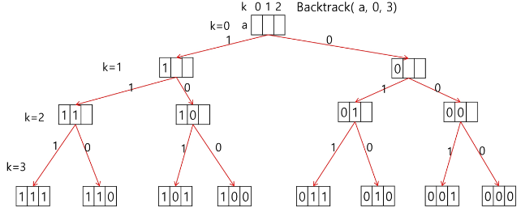
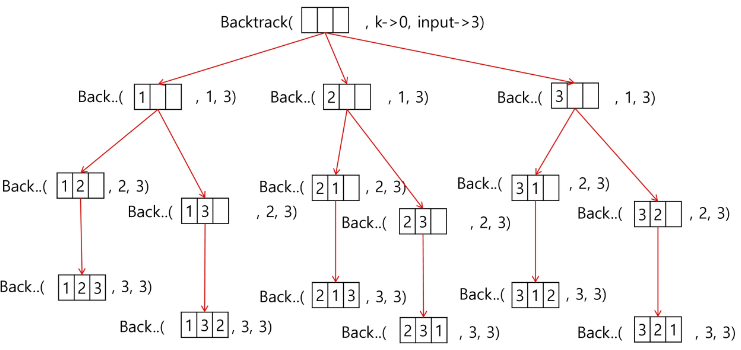
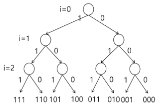

### 목차

> [1. 부분집합](#1-부분집합)
> 
> [2. 순열](#2-순열)
> 
> [3. 가지치기](#3-가지치기)
>
> [4. 연습문제2](#4-연습문제2)

# 1. 부분집합

- 어떤 집합의 공집합과 자기자신을 포함한 모든 부분집합을 powerset이라고 하며 구하고자 하는 어떤 집합의 원소 개수가 n일 경우 부분집합의 개수는 2^n개 이다.

- 백트래킹 기법으로 powerset 만들기
  
  - 일반적인 백트래킹 접근 방법 이용
  
  - n개의 원소가 들어있는 집합의 2^n개의 부분집합을 만들 때는 true 또는 false 값을 가지는 항목들로 구성된 n개의 배열을 만드는 방법 이용
  
  - 여기서 배열의 i번째 항목은 i번째의 원소가 부분집합의 값인지 아닌지를 나타내는 값

- for문을 이용한 방법 (4중 for문...)

```python
bit = [0, 0, 0, 0]
for i in range(2):
    bit[0] = i
    for j in range(2):
        bit[1] = j
        for k in range(2):
            bit[2] = k
            for l in range(2):
                bit[3] = l
                print(bit)
```

- {1, 2, 3}의 부분집합 표현



- 선택지가 모두 2개 (1 or 0)
- powerset을 구하는 백트래킹 알고리즘

```python
def backtrack(a, k, n):    # a : 주어진 배열, k : 결정할 원소, n : 원소 개수
    c = [0] * MAXCANDIDATES

    if k == n:
        process_solution(a, k)    # 답이면 원하는 작업을 한다
    else:
        ncandidates = construct_candidates(a, k, n, c) # c : 후보 추천 및 저장
        for i in range(ncandidates):
            a[k] = c[i]
            backtrack(a, k+1, n)

def construct_candidates(a, k, n, c):
    c[0] = True
    c[1] = False
    return 2

def process_solution(a, k):
    for i in range(k):
        if a[i]:
            print(num[i], end = '')
    print()

MAXCANDIDATES = 2
NMAX = 4
a = [0] * NMAX
num = [1, 2, 3, 4]
backtrack(a, 0, 3)    # n = 3이라서 1, 2, 3으로만 출력
'''
123
12
13
1
23
2
3

'''
```

# 2. 순열

- ex. 집합 {1, 2, 3}에서 모든 순열을 생성하는 함수

- 동일한 숫자가 포함되지 않았을 때, 각 자리 수 별로 loop를 이용해 구현(for문)

```python
for i1 in range(1, 4):
    for i2 in range(1, 4):
        if i2 != i1:
            for i3 in range(1, 4):
                if i3 != i1 and i3 != i2:
                    print(i1, i2, i3)
```

- 그림



- 선택지가 3->2->1개

- 백트래킹을 이용하여 {1, 2, 3, ..., NMAX}에 대한 순열 구하기

- 접근 방법은 앞의 부분집합 구하는 방법과 유사

- 코드

```python
def backtrack(a, k, n):
    c = [0] * MAXCANDIDATES

    if k == n:
        for i in range(0, k):
            print(a[i], end = ' ')
        print()
    else:
        ncandidates = construct_candidates(a, k, n, c)
        for i in range(ncandidates):
            a[k] = c[i]
            backtrack(a, k+1, n)

def construct_candidates(a, k, n, c):
    in_perm = [False] * (NMAX + 1)

    for i in range(k):
        in_perm[a[i]] = True

    ncandidates = 0
    for i in range(1, NMAX + 1):
        if in_perm[i] == False:
            c[ncandidates] = i
            ncandidates += 1
    return ncandidates

MAXCANDIDATES = 3
NMAX = 3
a = [0] * NMAX
backtrack(a, 0, 3)
'''
1 2 3 
1 3 2 
2 1 3 
2 3 1 
3 1 2 
3 2 1 
'''
```

# 3. 가지치기

- 집합 {1, 2, 3}의 원소에 대해 각 부분집합에서의 포함 여부를 트리로 표현



- i 원소의 포함 여부를 결정하면 i까지의 부분 집합의 si를 결정할 수 있다.

- si-1이 찾고자 하는 부분집합의 합보다 크면 남은 원소를 고려할 필요가 없다.

- A[i] 원소를 부분 집합의 원소로 고려하는 재귀 함수(A는 서로 다른 자연수의 집합)

```python
# i-1 원소까지 고려한 합 s, 찾으려는 합 t

f(i, N, s, t)
	if s== t		# i-1 원소까지의 합이 찾는 값인 경우
	elif i = N		# 모든 원소에 대한 고려가 끝난 경우
	elif s > t		# 남은 원소를 고려할 필요가 없는 경우
	else		#남은 원소가 있고 s < t인 경우
		subset[i] = 1
		f(i+1, N, s+A[i], t)	# i 원소 포함
		subset[i] = 0
		f(i+1, N, s, t)	# i 원소 미포함
```

- 추가 고려 사항

> 고려한 구간 
> 
> 1    2    3    4    /    5    6    7    8    9    10
> 
> (1 ~ 4)고려한 구간의 합 S : S > T 이면 중단 : 고려한 구간의 합이 찾는 값 T 보다 클 경우 중단
> 
> (5 ~ 10)남은 구간의 합 RS : S + RS < T : 남은 원소의 합을 다 더해도 찾는 값 T 미만인 경우 중단

# 4. 연습문제2

- {1, 2, 3, 4, 5, 6, 7, 8, 9, 10}의 powerset 중 원소의 합이 10인 부분집합을 구하시오.

- 코드

```python

def f(i, k, s, t):  # i : 원소, k : 집합의 크기, s : i-1까지 고려된 합, t : 목표
    global cnt
    global fcnt
    fcnt += 1
    if s > t:       # 고려한 원소의 합이 찾는 합보다 큰 경우
        return
    elif s == t:    # 남은 원소를 고려할 필요가 없는 경우
        cnt += 1
        return
    elif i == k:    # 모든 원소 고려
        return
    else:
        bit[i] = 1
        f(i+1, k, s + A[i], t)  # A[i] 포함
        bit[i] = 0
        f(i+1, k, s, t)     # A[i] 미포함


A = [1, 2, 3, 4, 5, 6, 7, 8, 9, 10]
N = 10
# A = [i for i in range(1, N+1)

key = 10
cnt = 0     # 합이 key와 같은 부분집합의 수
bit = [0] * N
fcnt = 0
f(0, N, 0, key)
print(cnt)
print(fcnt)
'''
10
349
'''
```

- 자리 바꿈 순열

- 코드

```python
f(i, N)
	if i == N		# 순열 완성
	
	else
		for j : i -> N-1
			P[i] <-> P[j]
			f(i + 1, N)
			P[i] <-> P[j]
```

+) 순열 문제에서의 가지치기
