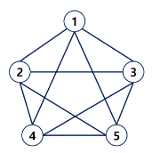
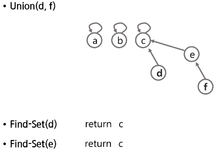

### 목차

> [1. 그래프 기본](#1-그래프-기본)
> 
> [2. DFS](#2-dfs)
> 
> [3. BFS](#3-bfs)
> 
> [4. Union-Find(Disjoint set)](#4-union-finddisjoint-set)

# 1. 그래프 기본

> 문제 : 친구관계
> 
> - A의 친구는 B다.
> 
> - C의 친구는 E, F이다.
> 
> - (D - E), (F - G), (N - B, I, L), (G - A, C, D, H), (I - J, H), (B - D, K, L), (M - I, J), (E - A, H), (C - B, I, L), (B - I), (J - A, G)
> 
> - A의 친구 중에 친구가 가장 많은 친구는 누구인가?

### 그래프

- 그래프는 아이템(사물 또는 추상적 개념)들과 이들 사이의 연결 관계를 표현한다.
  
  - 그래프는 정점(Vertex)들의 집합과 이들을 연결하는 간선(Edge)들의 집합으로 구성된 자료구조
    
    - \|V\| : 정점의 개수, \|E\| : 그래프에 포함된 간선의 개수
    
    - \|V\|개의 정점을 가지는 그래프는 최대 \|V\| (|V| - 1) / 2 간선이 가능
    
    - 예) 5개 정점이 있는 그래프의 최대 간선 수는 10(=5*4/2) 개이다.
      
      - 4 + 3 + 2 + 1

- 선형 자료구조나 트리 자료구조로 표현하기 어려운 N : N 관계를 가지는 원소들을 표현하기에 용이하다.

### 그래프 유형

- 무향 그래프(Undirected Graph) : 친구

- 유향 그래프(Directed Graph) : 지하철, 도로

- 가중치 그래프(Weighted Graph) : 무향, 유향 둘 다 가능

- 사이클 없는 방향 그래프(DAG, Directed Acyclic Graph)


- 완전 그래프 : 정점들에 대해 모든 간선들을 가진 그래프 (보통 최악의 케이스)



- 부분 그래프 : 원래 그래프에서 일부의 정점이나 간선을 제외한 그래프

### 인접 정점

- 인접(Adjacency)

- 두 개의 정점에 간선이 존재(연결됨)하면 서로 인접해 있다고 한다.

- 완전 그래프에 속한 임의의 두 정점들은 모두 인접해 있다.

### 그래프 경로

- 경로란 간선들을 순서대로 나열한 것
  
  - 간선들 : (0, 2), (2, 4), (4, 6)
  
  - 정점들 : 0 - 2 - 4 - 6

- 경로 중 한 정점을 최대한 한 번만 지나는 경로를 **단순경로**라 한다.
  
  - 0 - 2 - 4 - 6, 0 - 1 - 6

- 시작한 정점에서 끝나는 경로를 **사이클**(Cycle)이라고 한다.
  
  - 1 - 3 - 5 - 1

### 그래프 표현

- 간선의 정보를 저장하는 방식, 메모리나 성능을 고려해서 결정

- **인접 행렬** (Adjacent matrix)
  
  - 장점 : 연결여부를 한 번에 탐색 가능
  
  - 단점 : 메모리 낭비가 심하다.
  
  - \|V\| x \|V\| 크기의 2차원 배열을 이용해서 간선 정보를 저장
  
  - 배열의 배열(포인터 배열) => "연결이 안 되어있다" 라는 정보도 함께 저장

- **인접 리스트** (Adjacent List) : "코테에서는 추천"
  
  - 각 정점마다 해당 정점으로 나가는 간선의 정보를 저장 => "연결된 정보만" 저장
  
  - 장점 : 메모리 활용이 효율적
  
  - 단점 : 연결 정보 확인이 어렵다.

- 간선의 배열
  
  - 간선(시작 정점, 끝 정점)을 배열에 연속적으로 저장

- 실제 개발에서는 **연결리스트** 사용. 삽입, 삭제가 많기 때문

### 인접 행렬

- 두 정점을 연결하는 간선의 유무를 행렬로 표현
  
  - \|V\| x \|V\| 정방 행렬
  
  - 행 번호와 열 번호는 그래프의 정점에 대응
  
  - 두 정점이 인접되어 있으면 1, 그렇지 않으면 0으로 표현
  
  - 무향 그래프
    
    - i번째 행의 합 = i번째 열의 합 = Vi의 차수
  
  - 유향 그래프
    
    - 행 i의 합 = Vi의 진출 차수
    
    - 열 i의 합 = Vi의 진입 차수


### 인접 리스트

- 각 정점에 대한 인접 정점들을 순차적으로 표현

- 하나의 정점에 대한 인접 정점들을 각각 노드로 하는 연결 리스트로 저장 (실제로는 삽입 삭제가 많아서.)


- 무방향 그래프는 방향 그래프에 비해 간선의 수가 2배라는 뜻

# 2. DFS

> 문제 : 친구관계
> 
> - 친구 관계를 그래프로 표현
> 
> - A로부터 시작해서 한 명의 친구에게만 소식을 전달할 수 있다면 최대 몇 명의 친구가 소식을 전달 받을 수 있을까? (단, 소식을 전달 받은 친구한테는 소식을 재전달 불가)
> 
> - A로부터 시작해서 친구들에게 동시에 소식을 전달할 수 있다고 할 때, 가장 늦게 전달 받는 사람은 누구일까? (단, 친구에게 소식을 전달하는 속도는 동일)

### 그래프 순회(탐색)

- 그래프 순회는 비선형구조인 그래프로 표현된 모든 자료(정점)를 빠짐없이 탐색하는 것을 의미한다.

- 두 가지 방법
  
  - 깊이 우선 탐색(Depth First Search, DFS)
  
  -  너비 우선 탐색(Breadth First Search, BFS)

### DFS

- 시작 정점의 한 방향으로 갈 수 있는 경로가 있는 곳까지 깊이 탐색해 가다가 더 이상 갈 곳이 없게 되면, 가장 마지막에 만났던 갈림길 간선이 있는 정점으로 되돌아와서 다른 방향의 정점으로 탐색을 계속 반복하여 결국 모든 정점을 방문하는 순회방법

- 가장 마지막에 만났던 갈림길의 정점으로 되돌아가서 다시 깊이 우선 탐색을 반복해야 하므로 후입선출 구조의 스택 사용

- DFS 알고리즘 - 재귀

```python
def DFS_Recursive(G, v):
    visited[v] = True    # 방문 설정
    
    for w in adjacency(G, v):
        if visited[w] != True:
            DFS_Recursive(G, w)
```

- DFS 알고리즘 - 반복

```python
stack = []
visited = []
def DFS(v):
    stack.append(s, v)
    while stack:
        v = stack.pop()
        if visited[v] != True:
            visited[v] = True
            for w in adjacency(v):
                if visited[w] != True:
                    stack.append(s, w)
```


### 연습문제1

- 다음은 연결되어 있는 두 정점 사이의 간선을 순서대로 나열 해 놓은 것이다. 모든 정점을 깊이 우선 탐색하여 화면에 깊이 우선 탐색 경로를 출력하시오. 시작 정점을 1로 시작하시오.

- 7, 8, 1, 2, 1, 3, 2, 4, 2, 5, 4, 6, 5, 6, 6, 7, 3, 7

- 출력 결과 예
  
  - 1-2-4-6-5-7-3
  
  - 1-3-7-6-5-2-4


```python
# page25. 연습문제1
import sys
sys.stdin = open("graph.txt", "r")


# 시작점: 1번부터 시작
# 끝점: 1번에서 갈 수 있는 모든 정점을 방문하면 종료
# (visited 처리 덕분에, 기저조건 없이도 자연스럽게 종료됨)
def dfs(node):
    print(node, end=' ')  # 현재 노드 출력

    # 현재 정점에서 연결되어있는 노드들을 탐색
    # graph[node][::-1] : 숫자가 큰 노드부터 탐색 (후보군을 뒤집어주면 된다.)
    for next_node in graph[node]:
        if visited[next_node]:  # 이미 방문했다면 통과
            continue

        visited[next_node] = 1  # 방문 처리
        dfs(next_node)          # 다음 정점으로 이동


N, M = map(int, input().split())
# 비어있는 리스트를 N + 1번 반복하면서 생성
# 1. 비어있는 리스트: 아직 갈 수 있는 곳이 없다.
# 2. N + 1번 : 0번 인덱스를 버린다. (문제에서 노드번호가 1번부터 시작)
# # --> 인접리스트를 만들기위해 아래와 같이 정의
graph = [[] for _ in range(N + 1)]

# graph = [[0] * (N + 1) for _ in range(N + 1)]  # 인접행렬 예시
visited = [0] * (N + 1)

# 연결 정보를 저장
for _ in range(M):
    s, e = map(int, input().split())
    # 양방향 그래프이므로, 시작<->끝점을 바꾸면서 저장
    graph[s].append(e)
    graph[e].append(s)  # 문제가 방향 그래프라면, 바꾼 정보를 저장하면 버그난다!

visited[1] = 1  # 출발지 방문 처리
dfs(1)
```

# 3. BFS

- 너비우선탐색은 탐색 시작점의 인접한 정점들을 먼저 모두 차례로 방문한 후에, 방문했던 정점을  시작점으로 하여 다시 인접한 정점들을 차례로 방문하는 방식

- 인접한 정점들에 대해 탐색을 한 후, 차례로 다시 너비우선탐색을 진행해야 하므로, 선입선출 형태의 자료구조인 큐를 활용함.

- BFS는 예제 그래프를 붙여진 번호 순서로 탐색


- 입력 파라미터 : 그래프 G와 탐색 시작점 v

- 큐 생성 -> 시작점 v를 큐에 삽입 -> 점 v를 방문한 것으로 표시

- while 큐가 비어있지 않은 경우 -> 큐의 첫번째 원소 반환 -> 그 원소와 연결된 모든 선에 대해 -> 방문하지 않은 곳이라면 큐에 넣고 방문한 것으로 표시

### 연습문제2

- 다음은 연결되어 있는 두 정점 사이의 간선을 순서대로 나열 해 놓은 것이다. 모든 정점을 깊이 우선 탐색하여 화면에 깊이 우선 탐색 경로를 출력하시오. 시작 정점을 1로 시작하시오.

- 7, 8, 1, 2, 1, 3, 2, 4, 2, 5, 4, 6, 5, 6, 6, 7, 3, 7

- 출력 결과 예
  
  - 1-2-3-4-5-7-6


```python
# page31. 연습문제2
import sys
sys.stdin = open("graph.txt", "r")


def bfs(node):
    q = [node]  # 선입선출 구조인 Queue 처럼 활용할 것이다.

    # q 에 저장되는 데이터: 다음에 처리할 데이터 (후보군)
    while q:  # 갈 수 있는 곳이 없을 때까지
        now = q.pop(0)   가장 앞에 있는 데이터를 뽑는다.

        print(now, end=' ')  # 현재 노드 출력

        # 현재 정점에서 인접한 정점들을 확인
        for next_node in graph[now]:
            if visited[next_node]:  # 이미 방문한 정점이면 통과
                continue
                
            visited[next_node] = 1  # 방문 처리
            q.append(next_node)     # 후보군에 추가(순서가 되면 처리해주세요)


# 그래프를 만드는 코드는 DFS 와 BFS 가 똑같다
# 핵심: 무슨 노드를 먼저 탐색할 것인가!
#   - 갈 수 있으면 끝까지 가자 : DFS
#   - 특정 정점을 기준으로 퍼져나가면서 확인하자 : BFS
N, M = map(int, input().split())
graph = [[] for _ in range(N + 1)]  # 인접리스트로 저장
visited = [0] * (N + 1)
for _ in range(M):
    s, e = map(int, input().split())
    graph[s].append(e)
    graph[e].append(s)

visited[1] = 1
bfs(1)
```

# 4. Union-Find(Disjoint set)

- Disjoint set : 서로소 집합, 상호배타 집합

- 서로소 또는 상호배타 집합들은 서로 중복 포함된 원소가 없는 집합들이다. 다시 말해 교집합이 없다.

- 집합에 속한 하나의 특정 멤버를  통해 각 집합들을 구분한다. 이를 대표자(representative)라 한다.

- 상호배타 집합을 표현하는 방법
  
  - 연결 리스트
  
  - 트리

- 상호배타 집합 연산
  
  - Make-Set(x)
  
  - Find-Set(x)
  
  - Union(x, y)

- 상호배타 집합 예


- Make-Set(x)

- Make-Set(y)

- Make-Set(a)

- Make-Set(b)

- Union(x, y)

- Union(a, b)

- Find-Set(y) : return x (representative)

- Find-Set(b) : return a (representative)

- Union(x, a)

### 상호배타 집합 표현 - 연결리스트

- 같은 집합의 원소들은 하나의 연결리스트로 관리한다.

- 연결리스트의 맨 앞의 원소를 집합의 대표 원소로 삼는다.

- 각 원소는 집합의 대표원소를 가리키는 링크를 갖는다.

- 연결리스트 연산 예
  
  - Find-Set(e) : return a
  
  - Find-Set(f) : return b
  
  - Union(a, b)


### 상호배타 집합 표현 -트리

- 하나의 집합(a disjoint set)을 하나의 트리로 표현한다.

- 자식 노드가 부모 노드를 가리키며 루트 노드가 대표자가 된다.

- 연산 예




- 상호배타 집합을 표현한 트리의 배열을 이용해 저장된 모습

| 첨자  | 0   | 1   | 2   | 3   | 4   | 5   |
|:---:|:---:|:---:|:---:|:---:|:---:|:---:|
| 정점  | a   | b   | c   | d   | e   | f   |
| 부모  | 0   | 1   | 2   | 2   | 2   | 4   |

- Make-Set(x) : 유일한 멤버 x를 포함하는 새로운 집합을 생성하는 연산
  
  - p[x] : 노드 x의 부모 저장

```python
def make_set(n):
    p = [i for i in range(n)]  # 각 원소의 부모를 자신으로 초기화
    return p
```

- Find-Set(x) : x를 포함하는 집합을 찾는 연산 (반복)

```python
def find(x):
    if parents[x] == x:  # x 자기자신이 x 를 바라본다 == 해당 집합의 대표자를 찾았다
        return x

    # x의 부모가 가리키고 있는 정점부터 다시 대표자를 탐색
    return find(parents[x])
```

- Union(x, y) : x와 y를 포함하는 두 집합을 통합하는 연산

```python
def union(x, y):
    # x 와 y 의 대표자를 찾자.
    root_x = find(x)
    root_y = find(y)

    if root_x == root_y:  # 이미 같은 집합이면 끝
        return

    # 다른 집합이라면 더 작은 루트노트에 합친다.
    # 문제에 따라 다르다.
    if root_x < root_y:
        parents[y] = root_x  # y 가 바라보는 부모는 x 의 대표자
    else:
        parents[x] = root_y
```

- 예제 사용법

```python
n = 7  # 원소의 개수
parents = make_set(n)  # 집합생성. parents 에 부모 정보들을 저장

union(1, 3)
union(2, 3)
union(5, 6)

print(parents)  # 대표자의 수 == 집합의 수

print('find_set(6) = ', find(6))

target_x = 3
target_y = 4

# 원소 1과 원소 2가 같은 집합에 속해 있는지 확인
if find(target_x) == find(target_y):
    print(f"원소 {target_x}과 원소 {target_y}는 같은 집합에 속해 있습니다.")
else:
    print(f"원소 {target_x}과 원소 {target_y}는 다른 집합에 속해 있습니다.")

'''
[0, 1, 1, 1, 4, 5, 5]
find_set(6) =  5
원소 3과 원소 4는 다른 집합에 속해 있습니다.
'''
```

- 문제점 : 전자의 경우, 비효율적. 부모 찾는 데 오래 걸림.


- 연산의 효율을 높이는 방법
  
  - Rank를 이용한 Union
  
  - 각 노드는 자신을 루트로 하는 subtree의 높이를 랭크(Rank)라는 이름으로 저장한다.
  
  - 두 집합을 합칠 때 rank가 낮은 집합을 rank가 높은 집합에 붙인다.

- Path compression
  
  - Find-Set을 행하는 과정에서 만나는 모든 노드들이 직접 root를 가리키도록 포인터를 바꾸어 준다.

- 랭크를 이용한 Union의 예


- 랭크를 이용한 Union에서 랭크가 증가하는 예


- Path Compression의 예


- Make_Set(x) : 유일한 멤버 x를 포함하는 새로운 집합을 생성하는 연산
  
  - p[x] : 노드 x의 부모 저장
  
  - rank[x] : 루트 노드가 x인 트리의 랭크 값 저장

```python
def make_set(n):
    p = [i for i in range(n)]  # 각 원소의 부모를 자신으로 초기화
    r = [0] * n  # 시작 rank 는 모두 0으로 초기화
    return p, r
```

- Find_Set(x) : x를 포함하는 집합을 찾는 연산 (반복)

- Find_Set 연산은 특정 노드에서 루트까지의 경로를 찾아 가면서 노드의 부모 정보를 갱신한다.

```python
def find(x):
    # 원소의 부모가 자기자신이다 == 자기가 그 그룹의 대표자
    if parents[x] == x:
        return x

    # 경로 압축 (path compression)을 통해 부모를 루트로 설정
    # parents[x]  # x 가 가리키고 있는 부모
    # find(parents[x])  # x 의 부모로부터 대표자를 찾아와라.
    parents[x] = find(parents[x])
    return parents[x]
```

- Union(x, y) : x와 y를 포함하는 두 집합을 통합하는 연산

```python
def union(x, y):
    root_x = find(x)
    root_y = find(y)

    if root_x == root_y:  # 이미 같은 집합이면 끝
        return

    # rank를 비교하여 더 작은 트리를 큰 트리 밑에 병합
    if ranks[root_x] > ranks[root_y]:
        parents[root_y] = root_x
    elif ranks[root_x] < ranks[root_y]:
        parents[root_x] = root_y
    else:
        # rank가 같으면 한쪽을 다른 쪽 아래로 병합하고 rank를 증가시킴
        parents[root_y] = root_x
        ranks[root_x] += 1
```

- 예제 사용법

```python
n = 7  # 원소의 개수
parents, ranks = make_set(n)

union(1, 3)
union(2, 3)
union(5, 6)

print('find_set(6) = ', find(6))

target_x = 2
target_y = 3

# 원소 1과 원소 2가 같은 집합에 속해 있는지 확인
if find(target_x) == find(target_y):
    print(f"원소 {target_x}과 원소 {target_y}는 같은 집합에 속해 있습니다.")
else:
    print(f"원소 {target_x}과 원소 {target_y}는 다른 집합에 속해 있습니다.")

'''
find_set(6) =  5
원소 2과 원소 3는 같은 집합에 속해 있습니다.
'''
```
