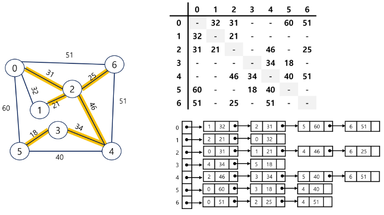
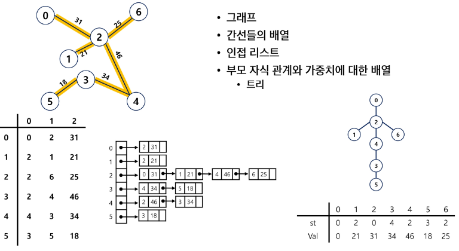
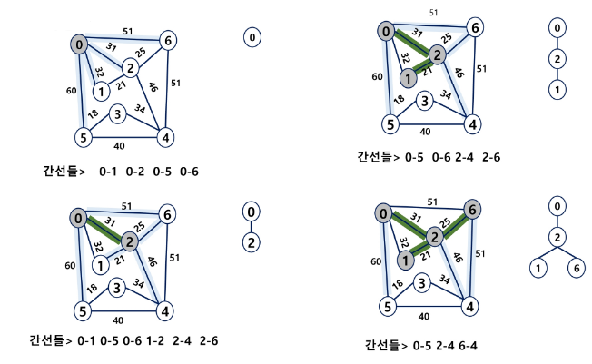
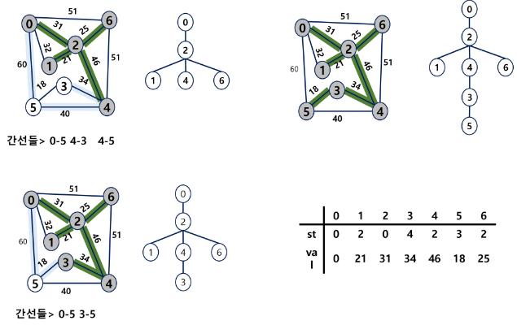
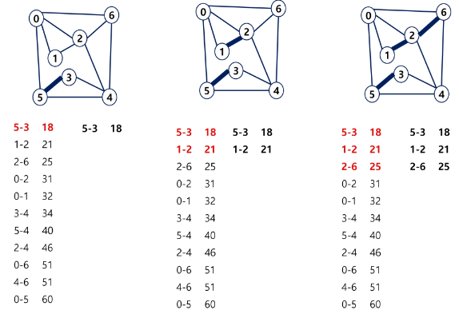
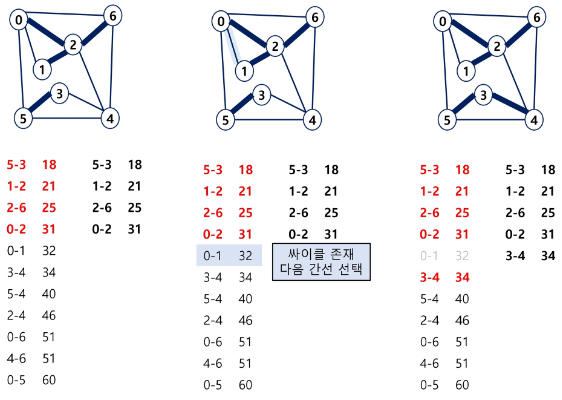
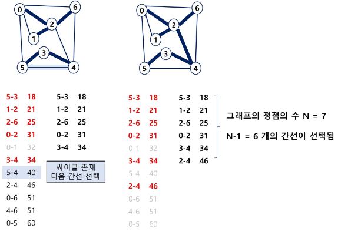
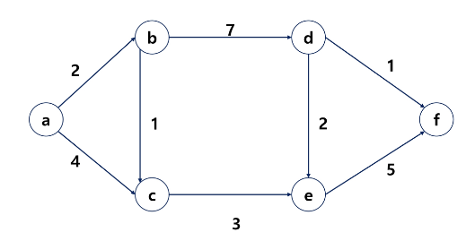

### 목차

> [1. 최소 비용 신장 트리 (MST)](#1-최소-비용-신장-트리mst)
> 
> [2. Prim 알고리즘](#2-prim-알고리즘)
> 
> [3. Kruskal 알고리즘](#3-kruskal-알고리즘)
> 
> [4. 최단 경로 (Dijkstra)](#4-최단경로-dijkstra)

# 1. 최소 비용 신장 트리(MST)

- 그래프에서 최소 비용 문제
  
  - 모든 정점을 연결하는 간선들의 가중치 합이 최소가 되는 트리
  
  - 두 정점 사이의 최소 비용의 경로 찾기

- 신장 트리
  
  - **n개의 정점**으로 이루어진 무방향 그래프에서 n개의 정점과 **n-1개의 간선**으로 이루어진 **트리**
  - 모든 정점을 연결, 간선이 n-1개, 트리
  - 전체 그래프에서 신장 트리는 반드시 하나이다.

- 최소 신장 트리 (Minimum Spanning Tree)
  
  - 무방향 가중치 그래프에서 신장 트리를 구성하는 간선들의 가중치의 합이 최소인 신장 트리





- 구현 방법 :
  
  - Prim 알고리즘
  
  - Kruskal 알고리즘

- 공통점 : 그리디 방식으로 접근, 작은 것부터 선택

- 차이점 : 정점 기준, 간선 기준으로 생각

# 2. Prim 알고리즘

- 하나의 정점에서 연결된 간선들 중에 하나씩 선택하면서 MST를 만들어 가는 방식
  
  - 1)임의 정점을 하나 선택해서 시작
  
  - 2)선택한 정점과 인접하는 정점들 중의 최소 비용의 간선이 존재하는 정점을 선택
  
  - 모든 정점이 선택될 때까지 1), 2) 과정을 반복

- 서로소인 2개의 집합 (2 disjoint-sets) 정보를 유지
  
  - 트리 정점들(tree vertices) - MST를 만들기 위해 선택된 정점들
  
  - 비트리 정점들(nontree vertices) - 선택 되지 않은 정점들

- 알고리즘 적용 예





- 알고리즘 코드

```python
'''
7 11
0 1 32
0 2 31
0 5 60
0 6 51
1 2 21
2 4 46
2 6 25
3 4 34
3 5 18
4 5 40
4 6 51
'''

from heapq import heappush, heappop

def prim(start):
    heap = list()
    MST = [0] * (V)  # visited 랑 똑같다!

    # 최소 비용 합계
    sum_weight = 0

    # 힙에서 관리해야 할 데이터
    # 가중치, 정점 정보
    # heappush(heap, (start, 0))  # 정점 번호를 기준으로 정렬이 되기 때문에 안됩니다.
    heappush(heap, (0, start))  # 시작점은 가중치가 0이다.

    while heap:
        weight, v = heappop(heap)  # 현재 시점에서 가중치가 가장 작은 정점
        
        # 이미 방문한 지점이면 통과
        if MST[v]:
            continue

        # 방문 처리
        MST[v] = 1
        # 누적합 추가
        sum_weight += weight

        # 갈 수 있는 노드를 보면서
        for next in range(V):
            # 갈 수 없는 지점이면 continue
            if graph[v][next] == 0:
                continue

            # 이미 방문한 지점이면 continue
            if MST[next]:
                continue

            heappush(heap, (graph[v][next], next))

    return sum_weight


V, E = map(int, input().split())
graph = [[0] * (V) for _ in range(V)]  # 인접 행렬로 구현
                                       # [선택과제] 인접 리스트로 변경
for _ in range(E):
    u, v, w = map(int, input().split())
    graph[u][v] = w
    graph[v][u] = w  # 가중치가 있는 무방향 그래프

result = prim(0)
print(f'최소 비용 = {result}')
```


# 3. Kruskal 알고리즘

- 간선을 하나씩 선택해서 MST를 찾는 알고리즘
1. 최초, 모든 간선을 선택해서 MST를 찾는 알고리즘

2. 가중치가 가장 낮은 간선부터 선택하면서 트리를 증가시킴
   
   - 사이클이 존재하면 다음으로 가중치가 낮은 간선 선택

3. n-1개의 간선이 선택될 때 까지 2를 반복
- 알고리즘 적용 예







- 알고리즘 코드

```python
'''
7 11
0 1 32
0 2 31
0 5 60
0 6 51
1 2 21
2 4 46
2 6 25
3 4 34
3 5 18
4 5 40
4 6 51
'''

V, E = map(int, input().split())    # V 마지막 정점, 0~V번 정점. 개수 (V+1)개
edge = []
for _ in range(E):
    u, v, w = map(int, input().split())
    edge.append([u, v, w])  # 출발, 도착, 가중치 묶어서 저장 (간선 정보들을 모두 저장)
edge.sort(key=lambda x: x[2])  # 가중치 기준으로 오름차순 정렬
parents = [i for i in range(V)]       # 대표원소 배열


def find_set(x):
    if parents[x] == x:
        return x

    parents[x] = find_set(parents[x])  # 경로 압축
    return parents[x]


def union(x, y):
    root_x = find_set(x)
    root_y = find_set(y)

    if root_x == root_y:
        return

    # 더 작은 루트노트에 합친다.
    if root_x < root_y:
        parents[root_y] = root_x
    else:
        parents[root_x] = root_y

# MST의 간선수 N = 정점 수 - 1
cnt = 0     # 선택한 edge의 수 (사용이유: N - 1 가 되면 신장트리 완성) - 시간 효율을 위해 사용
total = 0   # MST 가중치의 합
# print(edge)
for u, v, w in edge:
    # 출발점과 도착점이 같은 그룹에 속해있다면, 이미 연결된 친구들이다.
    # 다른 집합이라면
    if find_set(u) != find_set(v):  # 싸이클이 없다면
        print(u, v, w)  # 선택한 순서대로 출력
        cnt += 1
        union(u, v)
        total += w
        if cnt == V - 1:  # MST 구성이 끝나면
            break

print(f'최소 비용 = {total}')

```

# 4. 최단경로 (Dijkstra)

- 최단 경로 정의
  
  - 간선의 가중치가 있는 그래프에서 두 정점 사이의 경로들 중에 간선의 가중치의 합이 최소인 경로

- 하나의 시작 정점에서 끝 정점까지의 최단경로
  
  - 다익스트라(dijkstra)알고리즘
    
    - 음의 가중치를 허용하지 않음
  
  - 벨만-포드(Bellman-Ford) 알고리즘
    
    - 음의 가중치 허용

- 모든 정점들에 대한 최단 경로
  
  - 플로이드-워샬(Floyd-Warshall) 알고리즘

### Dijkstra 알고리즘

- 시작 정점에서 거리가 최소인 정점을 선택해 나가면서 최단 경로를 구하는 방식이다.

- 시작정점(s)에서 끝정점(t) 까지의 최단 경로에 정점 x가 존재한다.

- 이때, 최단경로는 s에서 x까지의 최단경로와 x에서 t까지의 최단경로로 구성된다.

- 탐욕 기법을 사용한 알고리즘으로 MST의 프림 알고리즘과 유사하다.

- 알고리즘 코드

```python
'''
6 8
0 1 2
0 2 4
1 2 1
1 3 7
2 4 3
3 4 2
3 5 1
4 5 5
'''

import heapq

INF = int(1e9)  # 무한을 의미하는 값으로 1억

# 노드의 개수, 간선의 개수를 입력받기
n, m = map(int, input().split())
# 시작 노드 번호 (문제에 따라 다름)
start = 0
# 인접리스트 만들기
graph = [[] for i in range(n)]
# 누적거리를 저장할 테이블 - INF 로 저장
distance = [INF] * n

# 간선 정보를 입력
for _ in range(m):
    a, b, w = map(int, input().split())
    graph[a].append([b, w])  # 단방향 그래프이다!


def dijkstra(start):
    pq = []
    # heapq 에 리스트로 저장할 때는 맨 앞의 데이터를 기준으로 정렬된다.
    heapq.heappush(pq, (0, start))
    distance[start] = 0  # 시작 노드 최단 거리는 0

    # 우선순위 큐가 빌 때 까지 반복
    while pq:
        # 가장 최단 거리인 노드에 대한 정보 꺼내기
        dist, now = heapq.heappop(pq)
        # 현재 노드가 이미 처리됐다면 skip
        # 예제 그림: c 위치 가중치 3, 4 로 도착가능 [참고]
        if distance[now] < dist:
            continue

        # 현재 노드와 연결된 다른 인접한 노드 확인
        for next in graph[now]:
            next_node = next[0]
            cost = next[1]  # 다음 노드의 가중치

            new_cost = dist + cost  # 누적값(현재까지의 누적값 + 다음 노드 가중치)

            # 다음 노드를 가는 데 더 많은 비용이 드는 경우
            if new_cost >= distance[next_node]:
                continue

            distance[next_node] = new_cost  # next_node 까지 가는데 비용은 new_cost
            heapq.heappush(pq, (new_cost, next_node))


# 다익스트라 알고리즘 실행
dijkstra(start)

# 모든 노드로 가기 위한 최단 거리 출력
for i in range(n):
    # 도달할 수 없는 경우, 무한 출력
    if distance[i] == INF:
        print("INF", end=' ')
    else:
        print(distance[i], end=' ')

# 0 2 3 9 6 10 출력의 의미
# -> 0번 노드에서 갈 수 있는 다른 노드들까지의 최단거리들을 모두 구할 수 있다.
# - 다익스트라 한 번이면, 하나의 정점 -> 다른 정점들까지의 최단거리들을 모두 구한다.

```

- 알고리즘 적용 예



- a에서 시작

|     |       |     | D   |     |     |     | U   |
|:---:|:-----:|:---:|:---:|:---:|:---:|:---:|:---:|
|     | a     | b   | c   | d   | e   | f   | U   |
| 거리  | **0** | ∞   | ∞   | ∞   | ∞   | ∞   | a   |

- a에서 b, c 와의 거리 중 짧은 b 선택

|     |       |       | D   |     |     |     | U   |
|:---:|:-----:|:-----:|:---:|:---:|:---:|:---:|:---:|
|     | a     | b     | c   | d   | e   | f   | U   |
| 거리  | **0** | **2** | 4   | ∞   | ∞   | ∞   | a b |

- b로 이동 -> b에서 c, d와의 거리 중 짧은 c 선택

|     |       |       | D     |     |     |     | U     |
|:---:|:-----:|:-----:|:-----:|:---:|:---:|:---:|:-----:|
|     | a     | b     | c     | d   | e   | f   | U     |
| 거리  | **0** | **2** | **3** | 9   | ∞   | ∞   | a b c |

- c로 이동 -> c에서 e까지의 거리와 b에서 d까지의 거리 중 짧은 e 선택

|     |       |       | D     |     |       |     | U       |
|:---:|:-----:|:-----:|:-----:|:---:|:-----:|:---:|:-------:|
|     | a     | b     | c     | d   | e     | f   | U       |
| 거리  | **0** | **2** | **3** | 9   | **6** | ∞   | a b c e |

- e로 이동 -> e에서 d, f까지의 거리 중 짧은 d 선택

- 만약 e->d 간선이 있다면 abce->d와 기존의 ab->d 길이 비교 후 짧은 쪽으로 갱신

|     |       |       | D     |       |       |     | U         |
|:---:|:-----:|:-----:|:-----:|:-----:|:-----:|:---:|:---------:|
|     | a     | b     | c     | d     | e     | f   | U         |
| 거리  | **0** | **2** | **3** | **9** | **6** | 11  | a b c e d |

- d로 이동 후 f 길이 갱신, 마지막 남은 f 선택

|     |       |       | D     |       |       |        | U           |
|:---:|:-----:|:-----:|:-----:|:-----:|:-----:|:------:|:-----------:|
|     | a     | b     | c     | d     | e     | f      | U           |
| 거리  | **0** | **2** | **3** | **9** | **6** | **10** | a b c e d f |

