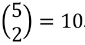
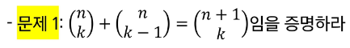

### 목차

> [0. 서론](#0-서론---프로그래밍과-논리수학)
> 
> [1. 논리와 증명](#1-논리와-증명)
> 
> [2. 수와 표현](#2-수와-표현)
> 
> [3. 집합과 조합론](#3-집합과-조합론)
> 
> [4. 기초 수식](#4-기초-수식)
> 
> [5. 재귀](#5-재귀)
> 
> [6. 동적 프로그래밍](#6-동적-프로그래밍)

# 0. 서론 - 프로그래밍과 논리/수학

- 프로그래밍이 초보자에게 어렵게 느껴지는 이유
1. 복잡해 보이는 프로그래밍 언어 문법, 복잡한 라이브러리

2. 논리 (Hard Logic)

### 논리

- 오늘은 "논리학"의 기초를 학습

- 논리에는 두 가지가 있다.
  
  - Hard Logic : 논리
  
  - Soft Logic : 직관적 논리, 논리적인 느낌을 줌.
    
    - 장점 : 익숙한 상황에서 빠름
    
    - 단점 : 정확하지 않음, 강한 착각을 일으킴

- 카드 문제
  
  - 사실 : 카드의 한 쪽에는 알파벳이, 다른 쪽에는 숫자가 써 있다.
  
  - 주장 : 만약 한 쪽이 D인 경우 반대쪽은 3이 적혀 있을 것이다.
  
  - 카드가 D(뒤) F(뒤) 3(앞) 7(앞) 4장 있다.
  
  - 주장의 참과 거짓을 증명하기 위해 반드시 뒤집어 봐야 하는 카드 : D, 7

- 맥주집 문제 -> 직관
  
  - 규칙 : 20세 이하인 사람은 맥주를 마실 수 없다.
  
  - 사실 : 나이 or 마시고 있는 것이 표시되어 있다.
  
  - 사람 17세, 31세, 콜라, 맥주 4명
  
  - 규칙이 잘 지켜지고 있는지 확인하고자 한다면 확인이 필요한 사람 : 17세, 맥주

- 직관과 논리의 차이
  
  - 직관 : 무의식적이고 즉각적인 사고 과정. 명확한 논리적 추론 없이 결론에 도달
    
    - 경험, 감정, 잠재의식에 의존하는 사고 방식
  
  - 논리 : 명확한 규칙과 절차를 통해 사고를 전개
    
    - 일련의 단계적 추론 과정을 통해 결론에 도달

- 일상 생활에서는 Soft Logic이 빠르기 때문에 유용
  
  - 논리적으로 부정확한 표현을 사용하더라도 어떤 의미인지는 알고 있을 것이라고 생각하고 넘어간다.

- 프로그래밍은 Hard Logic을 사용
  
  - 직관적인 논리로 프로그래밍을 하면 프로그램이 동작을 안 할 것이다.
  
  - 프로그래밍 언어의 표현들은 모두 논리학에서 나온 것
  
  - Soft Logic으로 알고리즘을 이해하려고 하면 안된다. 사용되는 수많은 알고리즘을 이해하기 위해서는 Hard Logic이 필요

### 명제

- 예시1
  
  - 아들에게 이번 시험에 100점을 맞으면 치킨을 사주겠다고 약속했다.
    
    - 100점 맞아서 치킨을 사주었다 : 약속 지킴
    
    - 100점 맞아서 치킨을 안 사주었다. : 약속 어김
    
    - **100점 못 받았는데 치킨 사주었다. : 약속 지킴** (100점 못 받으면 안 사주겠다고 안 함)
    
    - **100점 못 받았는데 치킨 안 사주었다. : 약속 지킴**
  
  - **가정이 거짓이면 전제는 항상 참이 된다.**

- 명제란? 
  
  - 참 혹은 거짓을 명확히 판별할 수 있는 문장

- 예시

> 2는 짝수이다. : 명제O
> 
> 5는 10보다 크다. : 명제O
> 
> 수업은 재미있다. : 명제X - 주관적인 표현
> 
> 서울은 대한민국의 수도이다. : 명제O
> 
> 즐겁게 수업을 들으세요. : 명제X - 명령/권유/질문은 참거짓 평가 불가

### 조건명제 : 두 명제 사이에 조건을 부여하는 표현

- `p -> q`로 표현한다. (if문과 비슷)

- 전건 `p` : 조건이 되는 명제 (만약 p라면)

- 후건 `q` : 조건이 충족될 때 결과로 나오는 명제 (그러면 q이다.)

> 비가 온다면 땅이 젖는다.
> 
> p : 비가 온다 or 오지 않는다.
> 
> q : 땅이 젖는다. or 젖지 않는다.

- 진리표 (Truth Table)
  
  - 논리식이나 논리 연산의 모든 가능한 입력 조합과 그에 따른 출력을 보여주는 표

| p   | q   | p->q |        |
|:---:|:---:|:----:|:------:|
| 0   | 0   | 1    | 비X, 땅X |
| 0   | 1   | 1    | 비X, 땅O |
| 1   | 0   | 0    | 비O, 땅X |
| 1   | 1   | 1    | 비O, 땅O |

- 조건명제와 관련된 추가적인 명제

- 원래명제 :` p -> q`
1. 역 (Converse) : 조건명제의 전건과 후건을 서로 바꿈
   
   - `q -> p`
   
   - 만약 땅이 젖으면, 비가 온다.
   
   - 조건명제가 참이라도 참이 아닐 수 있다.
   
   - 사용 사례 : 원래 조건 명제의 반대 방향을 추론하고자 할 때 사용
     
     - 직사각형이면 네 각이 모두 직각
     
     - 네 각이 모두 직각이면 직사각형

2. 이 (Inverse) : 조견명제의 전건과 후건을 각각 부정
   
   - `~p -> ~q`
   
   - 만약 p가 아니면, q도 아니다.
   
   - 만약 비가 오지 않으면, 땅이 젖지 않는다.
   
   - 조건명제가 참이라도 참이 아닐 수 있다.
   
   - 논리적으로 원래 명제와 부정된 상황에서 참인지 거짓인지 확인

3. 대우 (Contrapositive)
   
   - `~q -> ~p`
   
   - 만약 q가 아니면, p도 아니다.
   
   - 만약 땅이 젖지 않으면, 비가 오지 않는다.
   
   - **원래 조건명제와 항상 동일한 진리값을 가진다!**
   
   - 대우가 참임을 증명하면 원래 명제도 참이다. (간접 증명)
- 연습

- 문제 1 : 다음을 명제식 형태로 쓰고 참인지 거짓인지 판단
  
  - 만약 1232...14124이 Prime Number이라면, 2는 짝수이다.
    
    - p : 알 수 없음, q : 참
    
    - 대우 : 2가 홀수라면 ~ : p 거짓 -> 전건이 거짓이므로 명제는 참

- 문제 2 : p, q가 명제이고  p->q가 거짓일 때 다음 명제의 참거짓 판단
  
  - p : 참, q : 거짓
  1. ~p -> q : 거짓 -> 거짓 : `참`
  
  2. p V q : 참 or 거짓 : `참`
  
  3. q -> p : 거짓 -> 참 : `참`

- 문제 4 : 다음 명제식의 진리표 만들기
  
  1. p ^ (q -> ~p)
  
  | p   | q   | ~p  | (q -> ~p) | p ^ (q -> ~p) |
  |:---:|:---:|:---:|:---------:|:-------------:|
  | T   | T   | F   | F         | F             |
  | T   | F   | F   | T         | T             |
  | F   | T   | T   | T         | F             |
  | F   | F   | T   | T         | F             |

### 증명

- 증명은 정확한 명제식으로 표현할 수 있는 것이어야 함

- 보통은 정확한 명제식까지 쓰지는 않으나 근본적으로는 명제식으로 바꿀 수 있음

- 증명에 대한 많은 오해가 `p -> q`를 `p <-> q`와 혼동하는 것에서 일어남

- 증명 방법
  
  - 직접 증명 : 조건에서 바로 결론을 도출
    
    - ex) 짝수의 합은 항상 짝수이다.
  
  - 간접 증명 (귀류법) : 결론이 거짓이라고 가정하여 모순을 유도하는 방식
    
    - ex) √2는 유리수가 아니다.
    
    - 시작 : √2가 유리수라고 가정 -> a/b 식으로 나타낼 수 있어야 한다
  
  - 대우를 이용한 증명
  
  - 수학적 귀납법

- 모든 당구공은 색이 같다는 다음 증명에서 잘못된 것은?
  
  - **수학적 귀납법 : P(1)이 참이고 P(n) -> P(n+1)이 참이면 P(n)은 모든 자연수 n에 대해서 참이다.**
  
  - 모든 자연수 n에 대해 당구공 n개가 들어있는 집합에서 그 집합에 포함된 당구공은 색이 같다는 것을 증명함
  
  - (앞부분 생략) P(n+1) 당구공 집합에서 하나를 빼면 당구공 n개가 있는 집합의 당구공 색이 모두 같음. 방금 뺀 원소를 다시 넣고, 다른 당구공을 빼면 당구공 n개가 있는 집합이 되므로 모든 당구공의 색이 같음.
  
  - P(n)->P(n+1)이 참임을 보이기만 하면 되므로 P(n)이 정말로 참일 필요는 없다.
  
  - 증명 방법에서 실제로 잘못된 부분 : 처음 뺀 당구공과 두번째로 뺀 당구공의 색이 같다는 것은 공통 부분이 있다는 것인데 실제로 n=1일 때 n+1 = 2인 경우 공통 부분이 없음.

- 증명 연습

- Trivial Proof : 자명 증명, 사소한 증명, 무의미한 증명 : ∀x, P(x) -> Q(x)를 증명하려는데, Q(x)가 항상 참인 경우
  
  - 대우에서 전건이 항상 거짓이기 때문에 명제는 항상 참이 된다.

- Vacuous Proof : 공허한 증명 : ∀x, P(x) -> Q(x)를 증명라혀는데 P(x)가 항상 거짓인 경우
  
  - 명제는 항상 참

# 1. 논리와 증명

- 문제 1 : 다음 명제들이 항진명제라는 것을 진리표를 이용해서 보이시오.

- ~(~p ^ q) v q

| p   | q   | ~p  | (~p ^ q) | ~(~p ^ q) | ~(~p ^ q) v q |
|:---:|:---:|:---:|:--------:|:---------:|:-------------:|
| T   | T   | F   | F        | T         | T             |
| T   | F   | F   | F        | T         | T             |
| F   | T   | T   | T        | F         | T             |
| F   | F   | T   | F        | T         | T             |

- 문제 2 : 다음 명제들이 모순명제라는 것을 진리표를 이용해서 보이시오.

- (~p v q) ^ (p ^ ~q)

| p   | q   | ~p  | (~p v q) | ~q  | (p ^ ~q) | (~p v q) ^ (p ^ ~q) |
|:---:|:---:|:---:|:--------:|:---:|:--------:|:-------------------:|
| T   | T   | F   | T        | F   | F        | F                   |
| T   | F   | F   | F        | T   | T        | F                   |
| F   | T   | T   | T        | F   | F        | F                   |
| F   | F   | T   | T        | T   | F        | F                   |

- 문제 4 : 명제식의 변형을 통해 다음 명제 간소화

- (p ^ ~q) v (p ^ q)
  
  - p ^ (~q v q) -> 항진명제
  
  - p ^ U = p

- 문제 5 : 다음 명제들이 참인지 확인하시오. 단 R은 실수의 집합, Z는 정수의 집합

- ∀x ∈ R, x^2 ≥ x : 거짓 (반례 : x = 1/2)

- ∀x ∈ Z, x^2 ≥ x : 참

- ∃x ∈ R, x^2 < x : 참

- ∃x ∈ R, x^2 ≥ x : 거짓

+) 문제 1~12

# 2. 수와 표현

- 컴퓨터는 0/1을 표현할 수 있는 비트들을 모아 수를 표현

- k개의 비트를 사용하면 0부터 2^k-1까지 표현 가능. 최대 2^k가지의 값 표현 가능

- 10진수로 k자리를 쓰면 0부터 10^k-1까지 표현이 가능한 것과 완전히 동일한 과정

- 어떤 값 n을 표현하기 위해서는 약 log n 비트가 필요

- `log n` 이란
  
  - 2의 몇 승이 n이 되느냐의 답
  
  - n을 표현하는데 몇 비트가 필요한가의 답
  
  - 1로 시작해서 계속 2배를 할 때 몇 번 하면 n이 되느냐의 답
  
  - n을 계속 2로 나눌 때 몇 번 나누면 1이 되느냐에 대한 값

- x = log n일 때 x와 n을 비교하면 x가 더 작고 n이 커질수록 차이가 더 커진다.

- 컴퓨터 분야에서 로그의 밑은 항상 2

- 32비트 컴퓨터의 주소 공간은 2^32 = 약 40억개 주소

- n + (n/2 + n/2) + (n/4 +n/4 +n/4 + n/4) + (n/8 + n/8 + ...) + ... (1 + 1 + ...) = n log n
  
  - n + n/2 +  n/4 + ... + 1 ≒ 2n
  
  - 위 두 식의 항의 개수는 log n개

- 문제 1 : 2진수 표현에서 logn 비트로 표현할 수 있는 숫자 범위는?
  
  - n비트 -> 2^n 가지
  
  - log n 비트 -> n 가지

- 문제 3 : n이 충분히 큰 값을 때 값 비교
  
  - 2n < n^2 : n이 2보다 클 때.
  
  - 2^(nlogn) = n^n > n! : n이 1보다 클 때

- 문제 5 : 다음 함수들의 역함수 구하기
  
  - f(x) = log(x - 3) - 5 : y = 2^(x+5) +3

+) 문제 1~5

# 3. 집합과 조합론

- 두 집합 A와 B에 대해 A가 B의 부분집합임을 증명한다는 것은 A의 임의의 원소가 B에 포함됨을 보이는 것과 같다.
  
  - 예를 들어 모든 4의 배수는 2의 배수라는 것을 증명하려면 4k = 2(2k)임을 보이면 되는 것.
  
  - 두 집합 A와 B가 같다는 것을 증명하기 위해서는 A가 B의 부분집합이고 B가 A의 부분집합임을 증명하면 된다.

> 다음 두 집합이 같다는 것을 상세히 증명해 보자.
> 
> A = {x | x = 2k + 1, k는 자연수}, B = {x | x = 4k + 1 혹은 4k + 3, k는 자연수}
> 
> 1. A가 B의 부분집합이다 :
> 
> A에 포함되는 임의의 원소  x를 가정. x = 2k + 1
> 
> k가 짝수(=2t)인 경우와 홀수(=2t+1)인 경우로 나눔.
> 
> 짝수인 경우 x = 2k + 1 = 2(2t) + 1 = 4t + 1로서 x는 B에 포함됨.
> 
> 홀수인 경우 x = 2k + 1 = 2(2t) + 1 = 4t + 3f로서 x는 B에 포함됨.
> 
> 모든 가능한 경우에 x는 B에 포함됨.
> 
> 2. B가 A의 부분집합이다.
> 
> B에 포함되는 임의의 원소 x를 가정
> 
> x = 4k + 1인 경우, x = 4k + 1 = 2(2k) + 1로서 x는 A에 포함됨.
> 
> x = 4k + 3인 경우, x = 2(2k + 1) + 1로서 x는 A에 포함됨.
> 
> ∴ 위 두 가지 증명에서 집합 A와 B는 같다.

- 조합론은 경우의 수를 따지는 문제들을 보통 말한다.

- 조합의 개수는 C를 이용하여 표현하기도 하지만 아래와 같은 괄호 표현을 더 많이 쓴다.

 

> nCk = n! / (n-k)! k!

- 연습 문제

- 문제 1



- `nCk` + `nC(k-1)` = `(n+1)Ck`
  
  - `n! / (n-k)! k!` + `n! / (n-(k-1))! (k-1)!`
  
  - = `n!((n-k+1) + k) / (n-k+1)! k!`
  
  - = `(n+1)! / (n+1-k)! k!`

+) 문제 1~16

# 4. 기초 수식

- 알고리즘 시간 복잡도를 표현할 수 있는 다양한 수식이 존재

- 풀이법을 익혀 두어야 알고리즘의 시간 복잡도를 계산할 수 있고, 알고리즘 시간이 얼마나 걸릴 지 예측할 수 있다.

- 연습 문제 : 다음 재귀식들을 O() notation 수준으로 풀어라.

- 문제 1 : T(n) = T(n-1) + 1, T(0) = 1
  
  - T(n) = T(0) + 1 + ... + 1 = n+1 = `O(n)`

- 문제 3 : T(n) = T(n-1) + logn, T(0) = 1
  
  - T(n) = 1 + logn + ... + logn = nlogn + 1 = `O(nlogn)`

- 문제 4 : T(n) = T(n/2) + 1, T(1) = 1
  
  - T(n) = T(n/2^2) + 1 + 1 = T(n/2^3) + 1 + 1 + 1 = T(n/2^k) + k
  
  - T(n/2^k) 이 T(1)일 때 k = logn
  
  - T(n) = T(1) + logn = `O(logn)`

+) 문제 1~8

# 5. 재귀

- 재귀란 자기 자신을 호출하는 함수. 그럼 끝날 수 있을까?

- 함수는 입력이 있으며, 자기 자신의 입력과 동일한 입력으로 자기 자신을 호출하면 끝나지 않음.

- 하지만 다른 입력으로 호출하면 끝날 수 있다.

```python
def abc(x):    # 안 끝남
    return abc(x)
```

```python
def sum(x)    # 끝남
    if x <= 0:
        return 0
    return x + sum(x-1)
```

- 함수란 어떤 문제를 해결하는 방법을 코딩한 것

- 함수가 어떤 문제의 단 한 케이스만을 해결하는 것이 아님

- 제대로 코딩 된 것이라면 해결하는 문제의 모든 케이스들을 해결해야 함

- 수학적 귀납법 증명 사용 가능 :
  
  - n이 0일 때 문제를 풀 수 있다.
  
  - n-1에서 문제를 풀 수 있으면 n에서도 문제를 풀 수 있다.

- 위 2가지가 사실이면 모든 가능한 n에 대해 문제를 풀 수 있다.

- 위 함수 중 sum()을 보면 수학적 귀납법의 2가지를 코딩한 것. 따라서 sum() 함수는 문제를 해결한다는 것을 증명할 수 있다.

- 위의 증명은 high-level 증명(일반적인 원리, 구조를 사용해 일반적?추상적?수준에서 접근한 증명)

- 부분 문제가 동일한 경우 재귀로 문제를 풀 수 있다.
  
  - ex) 어떤 문제를 해결하려다 부분 문제를 만났는데, 원래 해결하려던 입력 케이스와 동일한 문제에 속하지만 "크키가 더 작은" 입력 케이스를 해결해야 하는 경우
  
  - 피보나치 수열, Merge Sort 등

+) 문제 1~4

# 6. 동적 프로그래밍

- 재귀 함수에서 동일한 입력의 함수 호출이 반복적으로 일어날 때 그 결과 값을 저장해 두고 불러 쓰는 것 : 메모이제이션 (Memoization)

- 최초 입력에서 파생되는 모든 가능한 입력에 대한 답을 모두 저장할 수 있는 메모리가 있어야 한다.

- 단순히 재귀에서 저장된 값을 찾아보는 것으로도 가능하지만, 결과 값의 순서를 정해서 계산할 수도 있다. (Dynamic Programming)

- 연습 문제

- 문제 1 : Memoization 피보나치 수열 F(n) = F(n-1) + F(n-2), F(1) = F(2) = 1
  
  - 계산되는 값이 n가지 밖에 없으므로 이 값들을 저장할 수 있는 배열을 만들어 두고 재귀 호출에 들어가기 전에 값이 있는지 확인하기.

+) 문제 1~2
