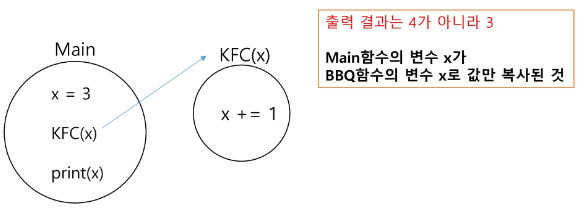
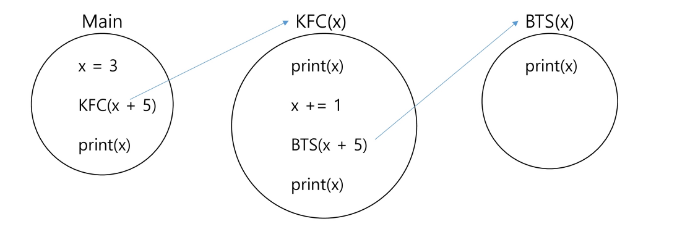
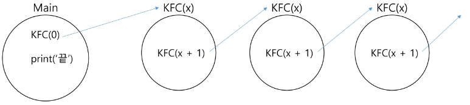
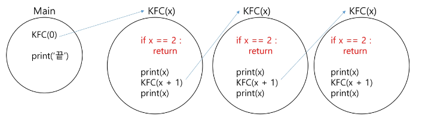
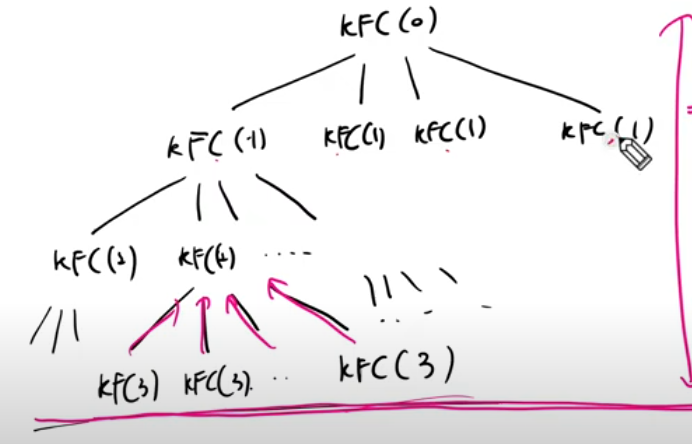
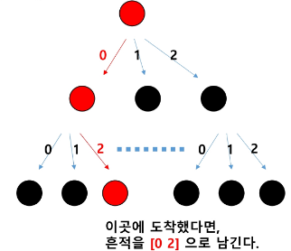

### 목차

> [1. 반복과 재귀](#1-반복iteration과-재귀recursion)
> 
> [2. 순열](#2-순열-permutation)
> 
> [3. 완전 탐색](#3-완전탐색)


# 1. 반복(Iteration)과 재귀(Recursion)

- 반복과 재귀는 유사한 작업을 수행할 수 있다.

- 반복은 수행하는 작업이 완료될 때 까지 계속 반복
  
  - 루프 (for, while 구조)
  
  - 반복문은 코드를 n번 반복시킬 수 있다.

- 재귀는 주어진 문제의 해를 구하기 위해 동일하면서 더 작은 문제의 해를 이용하는 방법
  
  - 하나의 큰 문제를 해결할 수 있는 (해결하기 쉬운) 더 작은 문제로 쪼개고 결과들을 결합한다.
  
  - 재귀호출은 n 중 반복문을 만들어낼 수 있다.

### 퀴즈

- 아래처럼 11~33까지 출력하는 프로그램을 작성하시오 (N=2)

> 11
> 
> 12
> 
> 13
> 
> 21
> 
> 22
> 
> 23
> 
> 31
> 
> 32
> 
> 33

- 2중 for문 사용

```python
for i in range(1, 4):
    for j in range(1, 4):
        print(i, j)
```

- [도전] 1111~3333 (N=4)

> 1111
> 
> 1112
> 
> 1113
> 
> 1121
> 
> 1122
> 
> ...
> 
> 3332
> 
> 3333

- N개라면 N중 반복문이 된다.

- 재귀호출로 구현하면 짧아진다.

```python
path = []

def run(lev):
    if lev == N:
        print(path)
        return

    for i in range(1, 4):
        path.append(i)
        run(lev + 1)
        path.pop()

N = int(input())
run(0)
```

### 재귀를 연습하기 전, 알아야 할 함수의 특징 1

- KFC 함수 호출할 때, int 타입 객체를 전달하면 값만 복사가 된다.

- 아래 예시에서 main 함수의 x와 KFC 함수의 x는 서로 다른 객체이다.



```python
def KFC(x):
    print(x)
    x += 1
    print(x)

x = 3
KFC(x + 1)
print(x)

'''
4
5
3
'''
```

### 재귀를 연습하기 전, 알아야 할 함수의 특징 2

- 함수가 끝나면 Main으로 되돌아 오는 것이 아니라, 해당 함수를 호출했던 곳으로 돌아온다.



```python
def BBQ(x):
    x += 10
    print(x)

def KFC(x):
    print(x)
    x += 3
    BBQ(x + 2)
    print(x)

x = 3
KFC(x + 1)
print(x)

'''
4
19
7
3
'''
```

### [도전] 무한 재귀호출

- 아래 그림과 같은 코드를 직접 구현
  
  - 첫 번째 KFC 함수의 x값은 0
  
  - 두 번째 KFC 함수의 x값은 1
  
  - 세 번째 KFC 함수의 x값은 2

- 무한 재귀 호출이 발생하면 어떻게 되는지, 직접 코드를 작성하고 실행



- 결과 : RecursionError 발생

- 재귀호출의 시작 : 무한 재귀호출을 막는 것



- 출력결과 : `0 1 1 0`

- 위 그림에서 if문 : `기저조건 (base case)`

### [도전]

- 0 1 2 3 4 5 5 4 3 2 1 0 을 재귀호출을 이용하여 구현
  
  - 몇 번 Depth에서 return을 해야하고, print문을 어느 위치에 배치할지 생각.
  
  - 0에서 시작, 6에서 종료

```python
def func(x):
    # 1. 기저조건(종료조건)
    if x == 6:
        return

    # 후보군을 반복하면서
    # 2. 다음 재귀 호출 전
    print(x, end=' ')
    # 3. 재귀 호출 (현재 값에 무슨 수식을 적용해서 넘겨줄까 ?)
    func(x + 1)  # 다음 재귀 호출에서는 현재보다 x 값이 1이 커야한다.
    # 4. 호출하고 돌아왔을 때
    print(x, end=' ')

start = 0
func(start)
```

- 재귀호출 개수 4개인 경우 그림 그려보기

```python
def KFC(x):
    if x == 3:
        return

    KFC(x + 1)
    KFC(x + 1)
    KFC(x + 1)
    KFC(x + 1)
    # for문으로도 표현 가능
    for i in range(4):
        KFC(x + 1)

KFC(0)
```




- 재귀의 깊이 = 트리의 높이 

# 2. 순열 (Permutation)

- 서로 다른 `N`개에서 `R`개를 중복없이 순서를 고려하여 나열하는 것

- ex) 0, 1, 2 카드 중 2장을 뽑아 순열 나열

> 0 1
> 
> 0 2
> 
> 1 0
> 
> 1 2
> 
> 2 0
> 
> 2 1

### 중복순열

- 서로 다른 N개에서 R개를 **중복을 허용하고**, 순서를 고려하여 나열하는 것

- ex) 0, 1, 2 카드 중 2장을 뽑아 중복순열 나열

> 0 0
> 
> 0 1
> 
> 0 2
> 
> 1 0
> 
> 1 1
> 
> 1 2
> 
> 2 0
> 
> 2 1
> 
> 2 2

### 중복순열 구현 원리

1. 재귀호출을 할 때 마다 이동 경로를 흔적으로 남긴다.

2. 가장 마지막 레벨에 도착했을 때 이동 경로를 출력한다.



### [도전]

- 중복순열 [1, 1, 1] ~ [6, 6, 6] 까지 출력하는 코드를 재귀호출로 구현

- 아래 코드는 중복을 제거한 코드.

```python
path = []  # 경로를 기록할 리스트
used = [0] * 7  # 1~6 숫자의 사용 여부를 기록할 리스트


# 0부터 시작, 3개를 뽑은 경우 종료
def recur(level):
    # 1. 기저조건
    if level == 3:
        print(*path)
        return

    # 2. 후보군을 반복하면서
    for i in range(1, 7):
        # i 가 이미 뽑혔다면, continue 해라
        # 아래 코드의 단점: "in" = O(len(path))
        # 시간 초과 위험도가 높다!
        # if i in path:
        #     continue

        # 방문하지 않았다면 실행해라
        # == 방문했다면 실행하지 마라
        # i 가 이미 뽑혔다면, continue 해라
        if used[i]:
            continue

        # 2.1 재귀 호출 전 - 경로 기록 + 사용 기록
        used[i] = 1
        path.append(i)
        # 2.2 다음 재귀 호출 (파라미터 전달)
        recur(level + 1)
        # 2.3 돌아왔을 때 - 사용했던 경로 삭제 + 사용 여부 초기화
        path.pop()
        used[i] = 0


recur(0)  # 호출: 시작점을 같이 전달해주는 경우가 많다.
```

### 중복을 취급하지 않는 순열 구현 방법

1. 중복순열 코드를 작성한다.

2. 중복을 제거하는 코드를 추가하면 순열 코드가 된다.
- 중복을 제거하는 원리 :
  
  - **전역 리스트**를 사용하면 이미 선택했던 숫자인지 아닌지 구분할 수 있따.
  
  - 이를 used 배열 또는 visited 배열이라고 한다.
  
  - DFS, BFS에 사용되는 것과 같다.

# 3. 완전탐색

- Brute-Force, 브루트 포스 알고리즘

- 모든 가능한 경우를 모두 시도해 정답을 찾아내는 알고리즘

- ex) 자전거 열쇠 비밀번호 맞추기
  
  - 1111~9999 네 자리 숫자 맞추기 : 4중 for문
  
  - 더 길어진다면 순열 코드(재귀호출)로 구현

### 문제 1. 주사위 눈금의 합

- 3개의 주사위를 던져 나올 수 있는 중복 순열에 대해 합이 10 이하가 나오는 경우는 총 몇 가지 인가?

```python
path = []


# 주사위 몇 개 던졌는지, 주사위의 합이 몇인지 ?
def recur(level, total):
    # 가지치기: 이미 10을 넘는 경우의 수는 계산할 필요가 없다!
    if total > 10:
        return

    # 기저조건: 3개를 던졌을 때 종료
    if level == 3:
        # 10 이하인가?
        if total <= 10:
            print(path)
        return

    # 후보군 탐색
    for i in range(1, 7):
        # i의 의미: 주사위 숫자
        path.append(i)
        recur(level + 1, total + i)  # 주사위 결과를 더하여 전달
        path.pop()


recur(0, 0)
```

### 문제 2. 연속 3장의 트럼프 카드

- A, J, Q, K 네 종류의 카드들이 다량으로 쌓여져 있다. 이 중 5장의 카드를 뽑아 나열.

- AAAAA, AAAAJ, ..., KKKKK

- 같은 종류의 카드가 세 장 연속으로 나오는 경우의 수

```python
card = ['A', 'J', 'Q', 'K']
path = []
cnt = 0


def cont_three():
    if path[0] == path[1] == path[2]: return True
    if path[1] == path[2] == path[3]: return True
    if path[2] == path[3] == path[4]: return True
    return False


def permu(lev):
    global cnt
    if lev == 5:
        if cont_three():
            cnt += 1
        return

    for i in range(4):
        path.append(card[i])
        permu(lev + 1)
        path.pop()


permu(0)
print(cnt)
```

### 문제 3. Baby-gin (ver. 완전탐색)

- 0~9 번호가 적혀있는 카드 6장

- 3장의 카드가 연속 : `run`

- 3장의 카드가 동일 : `triplet`

- 6장의 카드가 `run`과 `triplet`으로만 구성된 경우를 `baby-gin`

- 6장의 카드 번호를 입력받고 완전탐색으로 baby-gin 여부를 판단

```python
'''
2 3 5 7 7 7
6 6 7 7 6 7
0 5 4 0 6 0
1 0 1 1 2 3
'''

arr = []
used = [False for _ in range(6)]
path = []
is_found_baby_gin = False


def is_baby_gin():
    cnt = 0

    # 앞에 세 자리가 triplet 또는 run 이라면 cnt += 1을 수행
    a, b, c = path[0], path[1], path[2]
    if a == b == c:
        cnt += 1
    elif a == (b - 1) == (c - 2):
        cnt += 1

    # 뒤에 세 자리가 triplet 또는 run 이라면 cnt += 1을 수행
    a, b, c = path[3], path[4], path[5]
    if a == b == c:
        cnt += 1
    elif a == (b - 1) == (c - 2):
        cnt += 1

    # cnt 가 2 라면, baby-gin 이 맞다.
    return cnt == 2


def run(lev):
    global is_found_baby_gin
    if lev == 6:
        # baby-gin인지 검사하는 코드
        if is_baby_gin():
            is_found_baby_gin = True

        return

    for i in range(6):
        if used[i]:
            continue
        used[i] = True
        path.append(arr[i])
        run(lev + 1)
        path.pop()
        used[i] = False


arr = list(map(int, input().split()))
#arr = [2, 3, 5, 7, 7, 7]

run(0)

if is_found_baby_gin:
    print('Yes')
else:
    print('No')
```

+) 실습문제 : SWEA 문제박스

