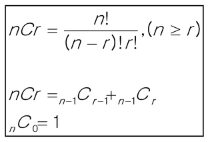

### 목차

> [1. 부분 집합](#1-부분-집합)
> 
> [2. 조합](#2-조합)
> 
> [3. 탐욕 알고리즘](#3-탐욕-알고리즘greedy)

# 1. 부분 집합

- 집합에 포함된 원소들을 선택하는 것

> ex) {A, B, C}
> 
> {}, {A}, {B}, {C}, {A, B}, {A, C}, {B, C}, {A, B, C}

- 부분집합에는 아무것도 선택하지 않은 경우(`공집합`)도 집합에 포함된다.

### 집합에서 부분 집합을 찾아내는 구현 방법

1. 완전탐색
- 재귀호출을 이용한 완전탐색으로 부분 집합을 구할 수 있다.

- 실전보다는 완전 탐색 학습용으로 추천하는 방법
2. Binary Counting
- 2진수 & 비트연산을 이용하여 부분집합을 구할 수 있다.

- 부분 집합이 필요할 때 사용하는 추천 방법

### 부분 집합 구현 (완전 탐색)

- 민철이에겐 3명의 친구가 있다. {MIN, CO, TIM}

- 함께 영화관에 갈 수 있는 멤버를 구성하고자 한다. 모든 경우를 출력. 


- O, X 로 집합에 포함 시킬지 말지 결정

- 구현 방법 : Branch 2개, Level 3개

- 코드 (이름 출력 코드 추가)

```python
arr = ['O', 'X']
path = []
name = ['KIM', 'CO', 'TIM']


def print_name():
    print('{', end='')
    for i in range(3):
        if path[i] == 'O':
            print(name[i], end=' ')
    print('}')


def run(lev):
    if lev == 3:
        print(path)
        print_name()
        return

    for i in range(2):
        path.append(arr[i])
        run(lev + 1)
        path.pop()


run(0)

'''
['O', 'O', 'O']
{KIM CO TIM }
['O', 'O', 'X']
{KIM CO }
['O', 'X', 'O']
{KIM TIM }
['O', 'X', 'X']
{KIM }
['X', 'O', 'O']
{CO TIM }
['X', 'O', 'X']
{CO }
['X', 'X', 'O']
{TIM }
['X', 'X', 'X']
{}
'''
```

- ㄴ재귀 추천 x

### 바이너리 카운팅(Binary Counting)

- 원소 수에 해당하는 N개의 비트열을 이용한다.

- 0 0 1 이면 {A}

- 1 1 0 이면 {B, C}

| 10진수 | 이진수 | {A, B, C} |
|:----:|:---:|:---------:|
| 0    | 000 | {}        |
| 1    | 001 | {A}       |
| 2    | 010 | {B}       |
| 3    | 011 | {A, B}    |
| 4    | 100 | {C}       |
| 5    | 101 | {A, C}    |
| 6    | 110 | {B, C}    |
| 7    | 111 | {A, B, C} |

### 집합의 총 개수

- 만들 수 있는 집합의 총 개수는 2ⁿ 이며 n=3이기에 총 2³ = 8개 집합이다.

- 2ⁿ은 `1 << n` 공식을 이용하여 빠르게 구할 수 있음

### 0b110이 주어지면 BC 출력하는 함수

- 6 (0b110)에서 비트연산을 이용하여 마지막 한 자리가 1인지 0인지 검사한다.

- 검사한 한 자리를 제거한다.

- get_sub(0) ~ get sub(7) 까지 호출하여 모든 부분집합을 출력

```python
arr = ['A', 'B', 'C']
n = len(arr)

def get_sub(tar):
    for i in range(n):
        if tar & 0x1:
           print(arr[i], end='')
        tar >>= 1

get_sub(6)
print('\n---')
for tar in range(0, 1 << n):    # range(0, 8)
    print('{', end='')
    get_sub(tar)
    print('}')

'''
BC
---
{}
{A}
{B}
{AB}
{C}
{AC}
{BC}
{ABC}
'''
```

### [도전] 친구와 카페 방문

- 민철이는 친구 {A, B, C, D, E}가 있다. 이 중 최소 2명 이상의 친구를 선정하여 함께 카페에 가려고 할 때, 총 몇 가지 경우가 가능할까?

```python
arr = ['A', 'B', 'C', 'D', 'E']
n = len(arr)

def get_sub(tar):
    cnt = 0
    for i in range(n):
        if tar & 0x1:
            cnt += 1
        tar >>= 1
    return cnt


res = 0
for tar in range(0, 1 << n):    # range(0, 8)
    if get_sub(tar) >= 2:
        res += 1
print(res)

'''
26
'''
```

# 2. 조합

- 서로 다른 n개의 원소 중 r개를 순서 없이 골라낸 것을 조합(combination)이라고 부른다.

- 순열과 조합 차이

- **순열** : {A, B, C, D, E} 5명 중 1등, 2등, 3등 뽑기
  
  - A B C 와 C A B 는 다른 경우다.

- **조합** : 5명 중 3명 뽑기
  
  - A B C 와 C B A 는 같은 경우이다.



### [도전]

- {A, B, C, D, E} 5명 중 3명을 뽑을 수 있는 모든 경우

> ABC, ABD, ABE, ACD, ACE, ADE,
> 
> BCD, BCE, BDE,
> 
> CDE 

- For문으로 조합 구현하기

- 5명중 3명을 뽑는 조합은 3중 for문으로 구현 가능

```python
arr = ['A', 'B', 'C', 'D', 'E']

for a in range(5):
    start1 = a + 1
    for  b in range(start1, 5):
        start2 = b + 1
        for c in range(start2, 5):
            print(arr[a], arr[b], arr[c])

'''
A B C
A B D
A B E
A C D
A C E
A D E
B C D
B C E
B D E
C D E
'''
```

- 조합 b는 a + 1부터 시작하고 c는 b + 1부터 시작하는 규칙이 존재한다.

- 5명 중 3명 뽑기 : 3중 for문

- 5명 중 n명 뽑기 : n중 for문 -> 재귀호출 구현 필요
  
  - Branch : 최대 5개
  
  - Level : n

```python
arr = ['A', 'B', 'C', 'D', 'E']
path = []


n = 3
def run(lev, start):
    if lev == n:
        print(path)
        return

    for i in range(start, 5):
        path.append(arr[i])
        run(lev + 1, i + 1)
        path.pop()


run(0, 0)

'''
['A', 'B', 'C']
['A', 'B', 'D']
['A', 'B', 'E']
['A', 'C', 'D']
['A', 'C', 'E']
['A', 'D', 'E']
['B', 'C', 'D']
['B', 'C', 'E']
['B', 'D', 'E']
['C', 'D', 'E']
'''
```

### [도전] 주사위 던지기

- 주사위 눈금 N개를 던져서 나올 수 있는 모든 조합 출력

- N = 3 일 때 코드                                

```python
N = 3
path = []


def run(lev, start):
    if lev == N:
        print(path)
        return

    for i in range(start, 7):
        path.append(i)
        run(lev + 1, i)
        path.pop()


run(0, 1)
'''
[1, 1, 1] [1, 1, 2] [1, 1, 3] [1, 1, 4] [1, 1, 5] [1, 1, 6] 
[1, 2, 2] [1, 2, 3] [1, 2, 4] [1, 2, 5] [1, 2, 6] [1, 3, 3] 
[1, 3, 4] [1, 3, 5] [1, 3, 6] [1, 4, 4] [1, 4, 5] [1, 4, 6] 
[1, 5, 5] [1, 5, 6] [1, 6, 6] [2, 2, 2] [2, 2, 3] [2, 2, 4] 
[2, 2, 5] [2, 2, 6] [2, 3, 3] [2, 3, 4] [2, 3, 5] [2, 3, 6] 
[2, 4, 4] [2, 4, 5] [2, 4, 6] [2, 5, 5] [2, 5, 6] [2, 6, 6] 
[3, 3, 3] [3, 3, 4] [3, 3, 5] [3, 3, 6] [3, 4, 4] [3, 4, 5] 
[3, 4, 6] [3, 5, 5] [3, 5, 6] [3, 6, 6] [4, 4, 4] [4, 4, 5] 
[4, 4, 6] [4, 5, 5] [4, 5, 6] [4, 6, 6] [5, 5, 5] [5, 5, 6] [5, 6, 6] [6, 6, 6] 
'''
```

# 3. 탐욕 알고리즘(Greedy)

- 결정이 필요할 때, 현재 기준으로 가장 좋아 보이는 선택지로 결정하여 답을 도축하는 알고리즘

- 대표적인 문제해결기법
  
  - 완전탐색 (Brute-Force) : 답이 될 수 있는 모든 경우를 시도
  
  - Greedy : 결정이 필요할 때 가장 좋아보이는 선택지로 결정
  
  - DP : 과거의 데이터를 이용하여 현재의 데이터를 만들어냄 (차후 학습 예정)
  
  - 분할정복 : 큰 문제를 작은 문제로 나누어 해결 (차후 학습 예정)

### 문제 : 동전교환

- 10, 50, 100, 500 총 4종류의 동전이 있다. 손님의 돈을 최소한의 동전 수를 사용하여 교환해 주려고 한다. 1730원을 거슬러주기 위해 사용할 수 있는 최소 동전의 수는?

- 500\*3 + 100\*2 + 10\*3 = 1730

```python
# 그리디의 핵심 조건
# 탐욕적 선택 조건(Greedy Choice Property): 각 단계의 선택이 이후 선택에 영향을 주지 않는다.
# 최적 부분 구조(Optimal Substructure): 각 단계의 최선의 선택이, 전체 문제의 최선의 해가 된다.
# 예시) 대구 - 충주 - 대전 - 역삼 멀티캠퍼스

coin_list = [500, 100, 50, 10]
target = 1730
cnt = 0

for coin in coin_list:
    possible_cnt = target // coin  # 사용 가능한 동전의 수로 나눔 (ex) 500원이라면 3개 가능)
    
    cnt += possible_cnt  # 동전의 수를 정답에 추가
    target -= coin * possible_cnt  # 동전 금액 만큼 빼준다.

print(cnt)
```

- 10, 50, 70 동전일 때는 100원 거슬러주기에서 그리디로 접근하면 예외가 발생할 수 있다.

- 70\*1 + 10\*3 => 4개

- 50\*2 => 2개

- 10, 50, 100, 500처럼 모든 동전이 배수 관계인 경우는 그리디가 성립

- 10, 50, 70처럼 모든 동전이 배수관계가 아닌 경우는 그리디가 성립x

- 그리디 알고리즘은 쉬워 보이나, 예외 없이 모든 경우가 맞는 규칙인지 아닌지 증명이 어렵다.

### 화장실 문제

- 기숙사에는 하나의 화장실만 존재

- A~D학생은 각자의 평균 화장실 사용 기간이 순서대로 15, 30, 50, 10분

- A가 먼저 화장실 이용 : B, C, D는 15x3 = 45분 대기

- B가 다음 화장실 이용 : 대기시간 누적 합은 45 + 30x2 = 105분

- C가 다음 화장실 이용 : 대기시간 누적 합은 105 + 50x1 = 155분

- 마지막으로 D가 화장실 이용.

- 이 문제를 그리디로 풀 경우 어떤 기준으로 접근해야 대기시간의 누적합이 최소가 될까?
  
  - 최소값부터 고려

### Knapsack 문제

- 도둑이 보물들이 있는 창고에 침입했다.

- 도둑은 최대 30kg까지 짐을 담아갈 수 있다.

- 물건의 개수(N) 그리고 물건 별 무게(W)와 가격(P)이 주어질 때, 어떤 물건을 담아야 도둑이 최대 이득을 볼 수 있을까?

|     | 무게   | 값     | 값/kg    |
|:---:|:----:|:-----:|:-------:|
| 물건1 | 5kg  | 50만원  | 10만원/kg |
| 물건2 | 10kg | 60만원  | 6만원/kg  |
| 물건3 | 20kg | 140만원 | 7만원/kg  |

- 물건은 하나씩만 존재

- 이 문제는 kg당 가치가 가장 높은 것을 먼저 담으면 안된다. 예외 케이스 존재.
  
  - 물건 1, 3 -> 190
  
  - 물건 2, 3 -> 200

- 그리디로 해결할 수 없다. 완전탐색 or DP로 접근해야 한다.

### Fractional Knapsack 문제

- Knapsack과 달리 물건을 원하는 만큼 자를 수 있는 문제

> ex) 물건1 5kg + 물건2 10kg + 물건3 15kg

- 그리디로 해결 가능.

- kg당 가격이 가장 높은 물건을 최대한 담으면 된다.

- 50 + 140 + 30 = 220

- 소스코드

```python
n = 3
target = 30  # Knapsack KG
things = [(5, 50), (10, 60), (20, 140)]  # (Kg, Price)

# (Price / Kg) 기준으로 내림차순 sort
things.sort(key=lambda x: (x[1] / x[0]), reverse=True)
# sort 결과 = [(5, 50), (20, 140), (10, 60)]
print(things)

total = 0
for kg, price in things:
    per_price = price / kg

    # 만약 가방에 남은 용량이 얼마되지 않는다면,
    # 물건을 잘라 가방에 넣고 끝낸다.
    if target < kg:
        total += target * per_price
        break

    total += price
    target -= kg

print(int(total))
```

### 회의실 배정 문제

- 회의실이 하나인 회사가 있다. 여러 팀들이 원하는 회의실 예약 시간이 주어질 때, 가능한 많은 회의가 열리기 위해서는 회의들을 어떻게 배정해야 할까?


- 이 문제는 그리디로 해결 가능

- 해결 방법 : 회의 종료시간이 가장 빠른 회의를 먼저 선택하면 된다.

- 다른 예시 : 총 10개의 회의 요청이 존재

> (5, 9), (6, 10), (8, 11), (1, 4), (3, 5), (1, 6), (5, 7), (3, 8), (2, 13), (12, 14)

- 먼저 종료시간 기준으로 10개 회의들을 오름차순 정렬


- 종료시간이 가장 빠른 회의를 찾자 마자 확정


- 4시 이후에 가능한 회의 중 가장 빨리 끝나는 회의를 찾아 확정


- 반복


- 코드

```python
'''
input

11
1 4
3 5
0 6
5 7
3 8
5 9
6 10
8 11
8 12
2 13
12 14
'''

T = int(input())
li = []
for _ in range(T):
    li.append(list(map(int, input().split())))

# 1. 끝나는 시간 / 2. 빨리 시작하는 시간 순서대로 정렬되어야 한다.
li.sort(key=lambda x: (x[1], x[0]))

cnt = 0
end = -1
for meeting in li:
    # 끝나는 시간보다 크거나 같다 == 회의가 시작할 수 있다.
    # 즉, 회의가 시작할 수 있다면
    # 1. 정답에 1 추가
    # 2. 끝나는 시간 초기화
    if meeting[0] >= end:
        cnt += 1
        end = meeting[1]

print(cnt)
```

+) 연습문제 : 부분집합의 합


