### 목차

> [1. 분할 정복](#1-분할-정복)
> 
> [2. 병합 정렬](#2-병합-정렬)
> 
> [3. 퀵 정렬](#3-퀵-정렬)
> 
> [4. 이진 검색](#4-이진-검색)
> 
> [5. 정리](#5-정리)

# 1. 분할 정복

- 문제를 분할해서 해결하는 분할 정복(Divide and Conquer) 기법을 이해한다.

- 대표적인 알고리즘인 퀵 정렬과 병합 정렬, 이진 검색에 대해 학습한다.

- 유래 : 1805.12.2나플레옹이 아우스터리츠 전투에서 전력이 우세한 연합군을 공격하기 위해 중앙부로 쳐들어가서 반으로 나누고 한 부분씩 격파.

### 문제 : 가짜 동전 찾기

- n개의 동전들 중에 가짜 동전이 하나 포함되어 있다. 가짜 동전은 진짜 동전에 비해 아주 조금 가볍다. 진짜 동전들의 무게가 동일하다고 할 때 양팔 저울을 이용해서 가짜 동전을 찾아보자. 양팔 저울을 최소로 사용해서 가짜 동전을 찾는 방법은 무엇인가?

- 예를 들어 동전이 24(찐23 짭1)개 있다면?

### 설계 전략

- 분할(Divide) : 해결할 문제를 여러 개의 작은 부분으로 나눔

- 정복(Conquer) : 나눈 작은 문제를 각각 해결

- 통합(Combine) : (필요하다면) 해결된 해답을 모은다.

### Top-down approach 예시

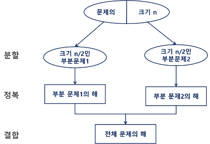

- 예시 : 거듭 제곱 문제, 자연수 C의 n제곱 값 구하는 함수 구현

### 거듭 제곱

- 반복(Iterative) 알고리즘 : `O(n)`

> C^2 = C x C
> 
> C^3 = C x C x C
> 
> C^4 = C x C x C x C
> 
> ...

```python
Iterative_Power(x, n)
    result <- 1
    for i in 1 -> n
        result <- result * x
    return result
```

- 분할 정복 기반의 알고리즘 : `O(log₂n)`

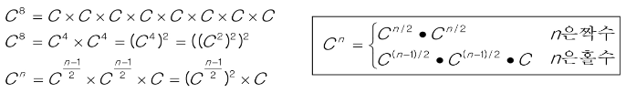

```python
Recursive_Power(x, n)
    if n == 1: return x
    if n is even:
        y <- Recursive_Power(x, n/2)
        return y * y
    else:
        y <- Recursive_Power(x, (n-1)/2)
        return y * y * x
```

# 2. 병합 정렬

- Merge Sort : 여러 개의 정렬된 자료의 집합을 병합하여 한 개의 정렬된 집합으로 만드는 방식

- 분할 정복 알고리즘 활용
  
  - 자료를 최소 단위의 문제까지 나눈 후에 차례대로 정렬하여 최종 결과를 얻어냄
  
  - top-down 방식

- 시간 복잡도 : `O(n log n)`

### 병합 정렬 과정

- {69, 10, 30, 2, 16, 8, 31, 22} 를 병합 정렬

- 분할 단계 : 전체 자료 집합에 대하여 **최소 크기의 부분집합이 될 때까지** 분할 작업을 계속한다.

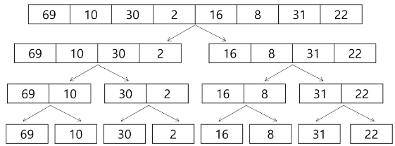

- 병합 단계 : 2개의 부분집합을 정렬하면서 하나의 집합으로 병합

- 8개의 부분집합이 1개로 병합될 때까지 반복함

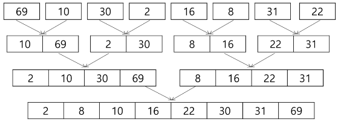

- 알고리즘 : 분할 과정

```python
def merge_sort(m):
    # 리스트의 길이가 1이면 이미 정렬된 상태이므로 그대로 반환
    if len(m) == 1:
        return m

    # 리스트를 절반으로 나누기 위해 중간 인덱스를 계산
    mid = len(m) // 2
    left = m[:mid]  # 리스트의 앞쪽 절반
    right = m[mid:]  # 리스트의 뒤쪽 절반

    # 재귀적으로 왼쪽 부분과 오른쪽 부분을 정렬
    left = merge_sort(left)
    right = merge_sort(right)

    # 두 개의 정렬된 리스트를 병합하여 반환
    return merge(left, right)
```

- 알고리즘 : 병합 과정

```python
def merge(left, right):
    # 두 리스트를 병합할 결과 리스트를 초기화
    result = [0] * (len(left) + len(right))
    l = r = 0  # 왼쪽 리스트와 오른쪽 리스트의 인덱스

    # 두 리스트를 순차적으로 비교하여 작은 값을 결과 리스트에 추가
    while l < len(left) and r < len(right):
        if left[l] < right[r]:
            result[l + r] = left[l]
            l += 1
        else:
            result[l + r] = right[r]
            r += 1

    # 왼쪽 리스트에 남은 요소들을 결과 리스트에 추가
    while l < len(left):
        result[l + r] = left[l]
        l += 1

    # 오른쪽 리스트에 남은 요소들을 결과 리스트에 추가
    while r < len(right):
        result[l + r] = right[r]
        r += 1

    # 병합된 결과 리스트를 반환
    return result
```

# 3. 퀵 정렬

- 주어진 배열을 두 개로 분할하고, 각각을 정렬한다.

- 병합 정렬과 다른 점:
  
  - 다른 점 1 :병합 정렬은 그냥 두 부분으로 나누는 반면에, 퀵 정렬은 분할할 때 **기준 아이템(pivot item)** 중심으로 분할한다.
    
    - 기준보다 작은 것은 왼편, 큰 것은 오른편에 위치한다.
  
  - 다른 점 2 : 각 부분 정렬이 끝난 후, 병합 정렬은 "병합"이란 후처리 작업이 필요하나, 퀵 정렬은 필요로 하지 않는다.

- Quick Sort는 **Partitioning** 이라는 과정을 반복하면서, 평균 시간복잡도 `O(n log n)`이라는 빠른 속도로 정렬이 되는 Sort이다.

### Partitioning

1. 작업영역을 정한다.

2. 작업영역 중 왼쪽에 있는 수를 Pivot(기준)이라고 하자.

3. Pivot을 기준으로왼쪽에는 Pivot보다 작은 수를 배치한다. (정렬 안됨)
   
   오른쪽에는 Pivot보다 큰 수를 배치시킨다. (정렬 안됨)


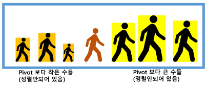

- 파티셔닝이 끝나고 pivot(주황)의 위치는 확정(Fix)된다.

- 정렬이 다 되었을 때에도 Pivot의 위치는 지금 위치 그대로 배정된다.

- 나머지 파티셔닝 중 작업영역의 중요성(?)

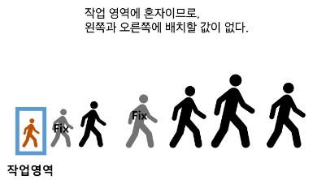

- 알고리즘

```python
def quick_sort(left, right):
    if left < right:
        pivot = hoare_partition1(left, right)
        # pivot = hoare_partition2(left, right)
        # pivot = hoare_partition3(left, right)
        quick_sort(left, pivot - 1)
        quick_sort(pivot + 1, right)
```

### Hoare-Partition 알고리즘

```python
# 피벗: 제일 왼쪽 요소
# 이미 정렬된 배열이나 역순으로 정렬된 배열에서 최악의 성능을 보일 수 있음
def hoare_partition1(left, right):
    pivot = arr[left]  # 피벗을 제일 왼쪽 요소로 설정
    i = left + 1
    j = right

    while i <= j:
        while i <= j and arr[i] <= pivot:
            i += 1

        while i <= j and arr[j] >= pivot:
            j -= 1

        if i < j:
            arr[i], arr[j] = arr[j], arr[i]

    arr[left], arr[j] = arr[j], arr[left]
    return j


# 피벗: 제일 오른쪽 요소
# 이미 정렬된 배열이나 역순으로 정렬된 배열에서 최악의 성능을 보일 수 있음
def hoare_partition2(left, right):
    pivot = arr[right]  # 피벗을 제일 오른쪽 요소로 설정
    i = left
    j = right - 1

    while i <= j:
        while i <= j and arr[i] <= pivot:
            i += 1
        while i <= j and arr[j] >= pivot:
            j -= 1
        if i < j:
            arr[i], arr[j] = arr[j], arr[i]

    arr[i], arr[right] = arr[right], arr[i]
    return i


# 피벗: 중간 요소로 설정
# 일반적으로 더 균형 잡힌 분할이 가능하며, 퀵 정렬의 성능을 최적화할 수 있습니다.
def hoare_partition3(left, right):
    mid = (left + right) // 2
    pivot = arr[mid]  # 피벗을 중간 요소로 설정
    arr[left], arr[mid] = arr[mid], arr[left]  # 중간 요소를 왼쪽으로 이동 (필요 시)
    i = left + 1
    j = right

    while i <= j:
        while i <= j and arr[i] <= pivot:
            i += 1
        while i <= j and arr[j] >= pivot:
            j -= 1
        if i < j:
            arr[i], arr[j] = arr[j], arr[i]

    arr[left], arr[j] = arr[j], arr[left]
    return j
```

- 아이디어

- P(피봇)값들 보다 큰 값들은 오른쪽, 작은 값들은 왼쪽 집합에 위치하도록 한다.

> | P   | 요소들 < P | P < 요소들 |
> |:---:|:-------:|:-------:|

- 피봇을 두 집합의 가운데에 위치시킨다.

> | 요소들 < P | P   | P < 요소들 |
> |:-------:|:---:|:-------:|

- 피봇 선택

- 왼쪽 끝/오른쪽 끝/임의의 세 개 값 중에 중간 값

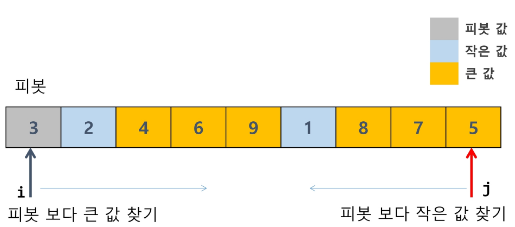

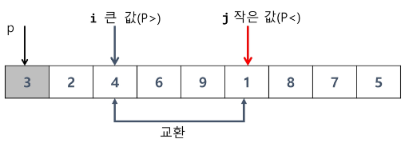

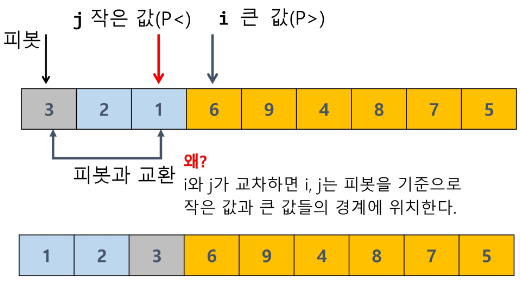

### Lomuto partition 알고리즘

```python
def lomuto_partition(left, right):
    pivot = arr[right]

    i = left - 1
    for j in range(left, right):
        if arr[j] <= pivot:
            i += 1
            arr[i], arr[j] = arr[j], arr[i]

    arr[i + 1], arr[right] = arr[right], arr[i + 1]
    return i + 1

def quick_sort(left, right):
    if left < right:
        pivot = lomuto_partition(left, right)
        quick_sort(left, pivot - 1)
        quick_sort(pivot + 1, right)


quick_sort(0, len(arr) - 1)
print(arr)
```

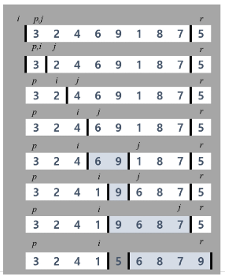

# 4. 이진 검색

### 문제 : 병뚜껑 속의 숫자 게임

- 술래가 병뚜껑 속 숫자를 확인한 후, 다음 사람부터 숫자를 맞히기 시작한다. 술래는 Up 또는 Down을 통해 게임에 참여한 사람들이 병뚜껑 속 숫자에 점점 가까워질 수 있도록 힌트를 제시한다.

- ex) 병뚜껑 속 숫자가 3일 경우 :
  
  - 첫 번째 사람이 14 -> down
  
  - 두 번째 사람이 2 -> up
  
  - 세 번째 사람이 4 -> down
  
  - 네 번째 사람이 3을 부를 수 밖에 없음 -> 벌주 당첨

- 최대로 빨리 당첨 되려면 어떻게 해야 할까?

### 이진 검색

- 자료의 가운데에 있는 항목의 키 값과 비교하여 다음 검색의 위치를 결정하고 검색을 계속 진행하는 방법
  
  - 목적 키를 찾을 때까지 이진 검색을 순환적으로 반복 수행함으로써 검색 범위를 반으로 줄여가면서 보다 빠르게 검색을 수행한다.

- 이진 검색을 하기 위해서는 자료가 정렬된 상태여야 한다.

### 검색 과정

1. 자료의 중앙에 있는 원소를 고른다.

2. 중앙 원소의 값과 찾고자 하는 목표의 값을 비교한다.

3. 목표 값이 중앙 원소의 값보다 작으면 자료의 왼쪽 반에 대해서 새로 검색을 수행하고, 크다면 자료의 오른쪽 반에 대해서 새로 검색을 수행한다.

4. 찾고자 하는 값을 찾을 때까지 1~3의 과정을 반복한다.
- ex) 이진 검색으로 7을 찾는 경우

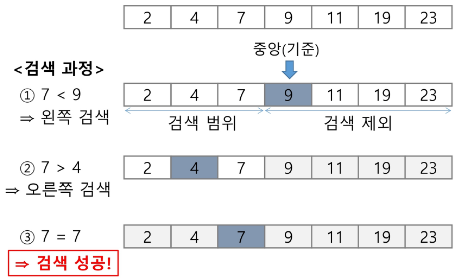

### 알고리즘 : 반복 구조

```python
arr = [2, 4, 7, 9, 11, 19, 23]
# 이진 탐색은 정렬된 데이터에 적용 가능하다.
# arr.sort()


def binary_search(target):
    low = 0
    high = len(arr) - 1
    # 탐색 횟수 카운팅
    cnt = 0

    while low <= high:
        mid = (low + high) // 2
        cnt += 1

        if arr[mid] == target:
            return mid, cnt
        elif arr[mid] > target:
            high = mid - 1
        else:
            low = mid + 1
    return -1, cnt


print(f'9 = {binary_search(9)}')
print(f'2 = {binary_search(2)}')
print(f'20 = {binary_search(20)}')
```

### 알고리즘 : 재귀구조

```python
arr = [2, 4, 7, 9, 11, 19, 23]
# 이진 탐색은 정렬된 데이터에 적용 가능하다.
# arr.sort()


def binary_search(low, high, target):
    # 기저조건
    # target 을 발견하지 못하면 종료
    if low > high:
        return -1

    mid = (low + high) // 2

    # 발견했다면
    if target == arr[mid]:
        return mid

    # target 이 mid 보다 작다 == target 이 mid 의 왼쪽에 존재한다 == high 를 mid - 1로
    elif target < arr[mid]:
        return binary_search(low, mid - 1, target)
    else:
        return binary_search(mid + 1, high, target)


print(f'9 = {binary_search(0, len(arr) - 1, 9)}')
print(f'2 = {binary_search(0, len(arr) - 1, 2)}')
print(f'20 = {binary_search(0, len(arr) - 1, 20)}')
```

# 5. 정리

### 병합 정렬

- 외부 정렬(External Sort)의 기본이 되는 정렬 알고리즘이다.

- 멀티코어(Multi-Core) CPU나 다수의 프로세서에서 정렬 알고리즘을 병렬화하기 위해 병합 정렬 알고리즘이 활용된다.

### 퀵 정렬

- 매우 큰 입력 데이터에 대해서 좋은 성능을 보이는 알고리즘이다.

### 이진 검색

- 정렬된 데이터를 기준으로 특정 값이나 범위를 검색하는 데 사용

- [이진 검색을 활용한 심화 학습 키워드] Low Bound, Upper Bound
  
  - 정렬된 배열에서 특정 값 이상(이하)이 처음으로 나타나는 위치를 찾는 알고리즘
  
  - 특정 데이터의 범위 검색 등에서 활용
