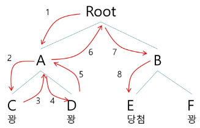
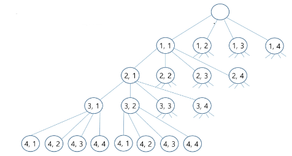
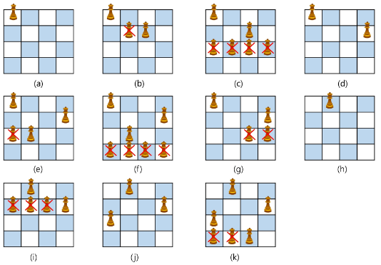
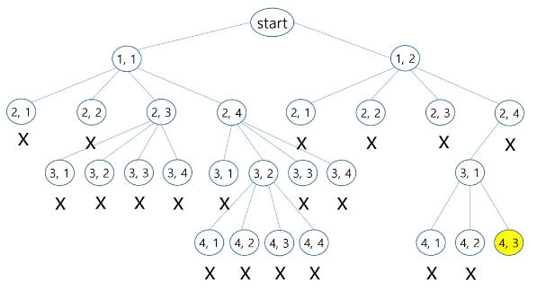
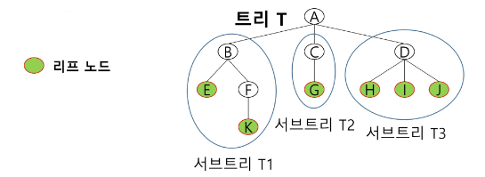
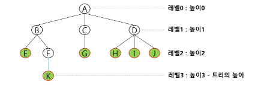

### 목차

> [1. 백트래킹 응용](#1-백트래킹-응용)
> 
> [2. 트리 개요-복습](#2-트리-개요-복습)
> 
> [3. 이진 트리-복습](#3-이진-트리-복습)
> 
> [4. 이진 탐색 트리 (BST)-복습](#4-queens-문제로-축소해서-생각)
> 
> [5. 힙 트리 (Heap)-복습](#5-힙트리heap-tree)


# 1. 백트래킹 응용

### 백트래킹(Backtracking) 개념

- 여러 가지 선택지(옵션)들이 존재하는 상황에서 한 가지를 선택한다.

- 선택이 이루어지면 새로운 선택지들의 집합이 생성된다.

- 이런 선택을 반복하면서 최종 상태에 도달한다.
  
  - 올바른 선택을 계속하면 목표 상태(goal state)에 도달한다.

### 당첨 리프 노드 찾기

- 루트에서 갈 수 있는 노드를 선택한다.

- 꽝 노드까지 도달하면 최근의 선택으로 되돌아와서 다시 시작한다.

- 더 이상의 선택지가 없다면 이전의 선택지로 돌아가서 다른 선택을 한다.

- 루트까지 돌아갔을 경우 더 이상 선택지가 없다면 찾는 답이 없다.



### 백트래킹과 깊이 우선 탐색과의 차이

- 어떤 노드에서 출발하는 경로가 해결책으로 이어질 것 같지 않으면 더 이상 그 경로를 따라가지 않음으로써 시도의 횟수를 줄임. (**Prunning** 가지치기)

- 깊이 우선 탐색이 모든 경로를 추적하는데 비해 백트래킹은 불필요한 경로를 조기에 차단

- 깊이 우선 탐색을 가하기에는 경우의 수가 너무나 많음. 즉, `N!`가지의 경우의 수를 가진 문제에 대해 깊이 우선 탐색을 가하면 당연히 처리 불가능한 문제

- 백트래킹 알고리즘을 적용하면 일반적으로 경우의 수가 줄어들지만 이 역시 최악의 경우에는 여전히 지수함수 시간(Exponential Time)을 요하므로 처리 불가능

### 문제 : N-Queen 문제

- nxn 서양 장기판에서 배치한 Queen들이 서로 우협하지 않도록 n개의 Queen을 배치하는 문제

- 어떤 두 Queen도 서로를 위협하지 않아야 한다.

- Queen을 배치한 n개의 위치는?

### 8-Queens 문제

- 퀸 8개를 8x8 크기의 체스판 안에 서로를 공격할 수 없도록 배치하는 모든 경우를 구하는 문제

- 후보 해의 수 : 64C8 = 64! / 8!(64-8!) = 4,426,165,368

- 실제 해의 수 : 이 중에서 실제 해는 92개 뿐

- 즉, 44억개가 넘는 후보 해의 수 속에서 92개를 최대한 효율적으로 찾아내는 것이 관건

### 4-Queens 문제로 축소해서 생각

- 같은 행에 위치할 수 없다.

- 모든 경우의 수 : 4x4x4x4 = 256

- 상태 공간 트리(state space tree)



- 루프 노드에서 리프(leaf) 노드까지의 경로는 해답후보(candidate solution)가 되는데, 깊이 우선 검색을 하여 그 해답후보 중에서 해답을 찾을 수 있다.

- 그러나 이 방법을 사용하면 해답이 될 가능성이 전혀 없는 노드의 후손 노드(descendant)들도 모두 검색해야 하므로 비효율적이다

- 모든 후보를 검사? NO!

- 백트래킹 기법
  
  - 어떤 노드의 유망성을 점검한 후에 유망(promising)하지 않다고 결정되면 그 노드의 부모로 되돌아가(backtracking) 다음 자식 노드로 감.
  
  - 어떤 노드를 방문하였을 때 그 노드를 포함한 경로가 해답이 될 수 없으면 그 노드는 유망하지 않다고 하며, 반대로 해답의 가능성이 있으면 유망하다고 한다.
  
  - 가지치기(prunning) : 유망하지 않는 노드가 포함되는 경로는 더 이상 고려하지 않는다.

- 백트래킹을 이용한 알고리즘은 다음과 같은 절차로 진행된다.
  
  1. 상태 공간 트리의 깊이 우선 검색을 실시
  
  2. 각 노드가 유망한지를 점검
  
  3. 만일 그 노드가 유망하지 않으면, 그 노드의 부모 노드로 돌아가서 검색을 계속한다.

- 일반 백트래킹 알고리즘

```python
def checknode(node):
    if promising(v):
        if there is a solution at v:
            write the solution
        else:
            for each child u of v:
                checknode(u)
```

- 4-Queens



- 상태 공간 트리



- 깊이 우선 검색 vs 백트래킹
  
  - 순수한 깊이 우선 검색 = **155**노드
  
  - 백트래킹 = **27**노드

- 백트래킹 2차원
  
  - zip은 느리다.

```python
def check(row, col):
    # 현재 열에 퀸이 있는지 확인
    for i in range(row):
        if visited[i][col] == 1:
            return False

    # 왼쪽 대각선 확인
    i, j = row - 1, col - 1
    while i >= 0 and j >= 0:
        if visited[i][j] == 1:
            return False
        i -= 1
        j -= 1

    # 오른쪽 대각선 확인
    i, j = row - 1, col + 1
    while i >= 0 and j < N:
        if visited[i][j] == 1:
            return False
        i -= 1
        j += 1

    # # 왼쪽 대각선 확인
    # for i, j in zip(range(row - 1, -1, -1), range(col - 1, -1, -1)):
    #     if visited[i][j] == 1:
    #         return False
    #
    # # 오른쪽 대각선 확인
    # for i, j in zip(range(row - 1, -1, -1), range(col + 1, N)):
    #     if visited[i][j] == 1:
    #         return False

    return True


def dfs(row):
    global cnt

    if row == N:
        cnt += 1
        return

    for col in range(N):
        if check(row, col):
            visited[row][col] = 1
            dfs(row + 1)
            visited[row][col] = 0  # Backtracking


T = int(input())
for tc in range(1, T + 1):
    N = int(input())
    visited = [[0] * N for _ in range(N)]
    cnt = 0

    dfs(0)
    print(f'#{tc} {cnt}')
```

- 백트래킹 일차원

```python
def check(row):
    for col in range(row):
        if visited[row] == visited[col]:
            return False

        # 열과 행의 차이가 같다 == 현재 col 의 좌우 대각선이다
        if abs(visited[row] - visited[col]) == abs(row - col):
            return False

    return True


def dfs(row):
    global cnt

    if row == N:
        cnt += 1
        return

    for col in range(N):
        visited[row] = col
        if not check(row):
            continue

        dfs(row + 1)


T = int(input())
for tc in range(1, T + 1):
    N = int(input())
    visited = [0] * N
    cnt = 0

    dfs(0)
    print(f'#{tc} {cnt}')
```

### 연습문제2

- {1, 2, 3, 4, 5, 6, 7, 8, 9, 10}의 powerset 중 원소의 합이 10인 부분집합을 모두 출력하시오.

- 예제 코드 1

```python
# 1,2,3,4,5,6,7,8,9,10}의 powerset 중 원소의 합이 10인 부분집합을 모두 출력하시오.
arr = [i for i in range(1, 11)]
visited = []


def dfs(level, sum):
    if level == len(arr):
        return

    if sum > 10:
        return

    if sum == 10:
        print(*visited)
        return

    for i in range(len(arr)):
        if arr[i] in visited:
            continue

        visited.append(arr[i])
        dfs(level + 1, sum + arr[i])
        visited.pop()


dfs(0, 0)
```

- 예제 코드 2 : 순서x

```python
# 1,2,3,4,5,6,7,8,9,10}의 powerset 중 원소의 합이 10인 부분집합을 모두 출력하시오.
# 단, 순서에 따른 중복을 제거하세요
arr = [i for i in range(1, 11)]
visited = []


# 버전1
def dfs(level, sum, idx):
    # 가지치기 : 합이 10이면 종료
    if sum == 10:
        print(*visited)
        return

    # 가지치기 : 10이상의 숫자면 볼 필요 없음
    if sum > 10:
        return

    for i in range(idx, len(arr)):
        # 가지치기 : 이미 사용한 숫자라면 생략
        if arr[i] in visited:
            continue

        visited.append(arr[i])
        dfs(level + 1, sum + arr[i], i)
        visited.pop()


# 버전2
# 트리 구조처럼 사용하면 훨씬 쉽고 빠르다
def dfs2(level, sum):
    if sum > 10:
        return

    if sum == 10:
        print(*visited)
        return

    # 모두 선택하지 않으면 합이 10이 넘지 못하므로
    # 기저조건 추가
    if level == len(arr):
        return

    # 선택하는 경우
    visited.append(arr[level])
    dfs2(level + 1, sum + arr[level])
    visited.pop()

    # 현재 숫자를 선택하지 않는 경우
    dfs2(level + 1, sum)


# dfs(0, 0, 0)
dfs2(0, 0)
```

# 2. 트리 개요-복습

- Tree : 사이클이 없는 무향 연결 그래프
  
  - 두 노드(or 정점) 사이에는 유일한 경로가 존재한다.
  
  - 각 노드는 최대 하나의 부모 노드가 존재할 수 있따.
  
  - 각 노드는 자식 노드가 없거나 하나 이상이 존재할 수 있다.

- 비선형 구조
  
  - 원소들 간에 1:n 관계를 가지는 자료구조
  
  - 원소들 간에 계층관계를 가지는 계층형 자료구조

- 한 개 이상의 노드로 이루어진 유한집합이며 다음 조건을 만족한다.
  
  - 노드 중 부모가 없는 노드를 루트(root)라 한다.
  
  - 나머지 노드들은 n(>=0)개의 분리 집합 T1, ..., TN으로 분리될 수 있다.

- 이들 T1, ..., TN은 각각 하나의 트리가 되며 (재귀적 정의) 루트의 서브 트리 (subtree)라 한다.



### 트리 용어

- 노드(node) : 트리의 원소이고 정점(vertex)이라고도 한다.
  
  - 트리 T의 노드 - A, B, C, D, E, F, G, H, I, J, K

- 간선(edge) : 노드를 연결하는 선
  
  - 부모 노드와 자식 노드를 연결

- 루트 노드(root node) : 트리의 시작 노드
  
  - 트리 T의 루트 노드 - A

- 형제 노드 (sibling node) : 같은 부모 노드의 자식 노드들
  
  - B, C, D는 형제 노드

- 조상 노드 : 간선을 따라 루트 노드까지 이르는 경로에 있는 모든 노드들
  
  - K의 조상 노드 : F, B, A

- 서브 트리(subtree) : 부모 노드와 연결된 간선을 끊었을 때 생성되는 트리

- 자손 노드 : 서브 트리에 있는 하위 레벨의 노드들
  
  - B의 자손 노드 : E, F, K

- 차수 (degree) :
  
  - 노드의 차수 : 노드에 연결된 자식 노드의 수
    
    - B의 차수 : 2, C의 차수 : 1
  
  - 트리의 차수 : 트리에 있는 노드의 차수 중에서 가장 큰 값
    
    - 트리 T의 차수 : 3
  
  - 단말 노드(리프 노드) : 차수가 0인 노드. 자식 노드가 없는 노드



- 높이
  
  - 노드의 높이 : 루트에서 노드에 이르는 간선의 수. 로드의 레벨
    
    - B의 높이 : 1, F의 높이 : 2
  
  - 트리의 높이 : 트리에 있는 노드의 높이 중에서 가장 큰 값. 최대 레벨
    
    - 트리 T의 높이 : 3

# 3. 이진 트리-복습

- 모든 노드들이 최대 2개의 서브 트리를 갖는 특별한 형태의 트리

- 각 노드가 자식 노드를 최대한 2개 까지만 가질 수 있는 트리

- 레벨 i 에서 노드의 최대 개수는 2^i개

- 높이가 h인 이진 트리가 가질 수 있는 노드의 최대 개수는 h+1 ~ 2^(h+1)-1개

- 포화 이진 트리 (Full Binary Tree) : 
  
  - 모든 레벨에 노드가 포화상태로 채워져 있는 이진 트리. 항상 최대 노드 개수를 가짐

- 완전 이진 트리 (Complete Binary Tree) : 
  
  - 높이가 h이고 노드 수가 n개일 때 포화 이진 트리의 노드 번호 1번부터 n번까지 빈 자리가 없는 이진 트리

- 편향 이진 트리 (Skewed Binary Tree) :
  
  - 높이 h에 대한 최소 개수의 노드를 가지면서 한쪽 방향의 자식 노드만을 가진 이진 트리
  
  - 왼쪽 편향, 오른쪽 편향 이진 트리

- 순회 (traversal) : 
  
  - 트리의 노드들을 체계적으로 방문하는 것
  
  - 트리의 각 노드를 중복되지 않게 전부 방문(visit)하는 것을 말하는데 트리는 비 선형 구조이기 때문에 선형구조에서와 같이 선후 연결 관계를 알 수 없다.

- 전위 순회(preorder traversal) : VLR
  
  - 자손 노드보다 현재 노드를 먼저 방문한다.

- 중위 순회(inorder traveral) : LVR
  
  - 왼쪽, 현재, 오른쪽 노드

- 후위 순회(postorder traversal) : LRV
  
  - 자손노드 방문 후 현재 노드

- 더 많은 내용은 [8/27 필기](8_27.md) 참고

# 4. 이진 탐색 트리(BST)

- 탐색작업을 효율적으로 하기 위한 자료구조

- 모든 원소는 서로 다른 유일한 키를 갖는다.

- key(왼쪽 서브트리) < key(루트 노드) < key(오른쪽 서브 트리)

- 왼쪽 서브 트리와 오른쪽 서브 트리도 이진 탐색 트리다.

- 중위 순회하면 오름차순으로 정렬된 값을 얻을 수 있다.

- 탐색 연산 : 
  
  - 루트에서 탐색 시작
  
  - 탐색할 키 값 x를 루트 노드의 키 값 k와 비교
  
  - x==k : 탐색 성공
  
  - x < k : 루트 노드의 왼쪽 서브 트리에 대해 탐색연산 수행
  
  - x > k : 루트 노드의 오른쪽 서브 트리에 대해 탐색연산 수행
  
  - 더 탐색할 서브트리가 없으면 탐색 실패

- 삽입 연산 : 
  
  - 먼저 탐색 연산을 수행
  
  - 삽입할 원소와 같은 원소가 트리에 있으면 삽입할 수 없기 때문
  
  - 탐색에서 탐색 실패가 결정되는 위치가 삽입 위치 -> 원소 삽입.

- 삭제 연산
  
  - 리프노드 : 그냥 삭제
  
  - 자식이 하나 : 자식->부모 연결
  
  - 자식이 둘 : 왼쪽 서브트리의 가장 큰 값이나 오른쪽 서브트리의 가장 작은 값 -> 삭제 위치

- 탐색, 삽입, 삭제 성능 : 
  
  - 평균 : `O(log n)`
  
  - 최악 : `O(n)`

- 더 많은 내용은 [8/28 필기](8_28.md) 참고

# 5. 힙트리(Heap Tree)

- 완전 이진 트리에 있는 노드 중에서 키 값이 가장 큰 노드나 키 값이 가장 작은  노드를 찾기 위해 만든 자료구조

- 최대 힙(max heap) : 
  
  - 키 값이 가장 큰 노드를 찾기 위한 **완전 이진 트리**
  
  - 부모 노드 키 값 > 자식 노드 키 값
  
  - 루트 노드 : 키 값 최대

- 최소 힙(min heap)
  
  - 키 값이 가장 작은 노드를 찾기 위한 **완전 이진 트리**
  
  - 부모 노드 키 값 < 자식 노드 키 값
  
  - 루트 노드 : 키 값 최소

- 삽입 연산 : 
  
  - 빈 자리에 삽입한 후 부모 노드와 키 값 비교하며 자리 바꾸기 후 확정

- 삭제 연산 :
  
  - 힙에서는 루트 노드의 원소만 삭제 가능
  
  - 루트 노드 삭제 후 힙의 가장 마지막 노드를 루트 노드로 이동, 자식 노드와 키 값 비교하며 자리 바꾸기 후 확정

- **특별한 큐의 구현**과 **정렬**에 힙 활용

- 우선순위 큐를 구현하는 가장 효율적인 방법 : 힙 사용
  
  - 노드 하나의 추가/삭제 시간 복잡도 : `O(logN)`
  
  - 전체 정렬 : `O(NlogN)`
    
    - N개의 노드 삽입 + N개의 노드 삭제
  
  - 최대/최소값을 `O(1)`에 구할 수 있다.
  
  - 완전 정렬보다 관리 비용이 적다.

- 배열을 통해 트리 형태 쉽게 구현 가능

- 힙 정렬은 힙 자료구조를 이용해서 이진 탐색과 유사한 방법으로 수행됨

- 힙 정렬은 배열에 저장된 자료를 정렬하기에 유용하다.

- 더 많은 내용은 [8/28 필기](8_28.md) 참고


