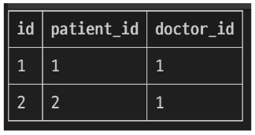

### 목차

> [1. Many to many relationships](#1-many-to-many-relationships)
> 
> [2. ManyToManyField](#2-manytomanyfield)
> 
> [3. 좋아요 기능 구현](#3-좋아요-기능-구현)

# 1. Many to many relationships

- N:M or M:N

- 한 테이블의 0개 이상의 레코드가 다른 테이블의 0개 이상의 레코드와 관련된 경우

- **양쪽 모두에서 N:1 관계를 가짐**

### M:N 관계의 역할과 필요성 이해하기

- '병원 진료 시스템 모델 관계'를 만들며 M:N 관계의 역할과 필요성 이해하기

- 환자와 의사 2개의 모델을 사용하여 모델 구조 구상하기

### N:1의 한계

- 의자와 환자 간 모델 관계 설정
  
  - 한 명의 의사에게 여러 환자가 예약할 수 있도록 설계

- hospitals/models.py

```python
class Doctor(models.Model):
    name = models.TextField()

    def __str__(self):
        return f'{self.pk}번 의사 {self.name}'


class Patient(models.Model):
    doctor = models.ForeignKey(Doctor, on_delete=models.CASCADE)
    name = models.TextField()

    def __str__(self):
        return f'{self.pk}번 환자 {self.name}'
```

- 의사와 환자 데이터 생성
  
  - 2명의 의사와 환자를 생성하고 환자는 서로 다른 의사에게 예약

```shell
doctor1 = Doctor.objects.create(name='allie')
doctor2 = Doctor.objects.create(name='barbie')
patient1 = Patient.objects.create(name='carol', doctor=doctor1)
patient2 = Patient.objects.create(name='duke', doctor=doctor2)

doctor1
<Doctor: 1번 의사 allie>

doctor2
<Doctor: 2번 의사 barbie>

patient1
<Patient: 1번 환자 carol>

patient2
<Patient: 2번 환자 duke>
```


### N:1의 한계 상황

- 1번 환자(carol)가 두 의사 모두에게 진료를 받고자 한다면 환자 테이블에 1번 환자 데이터가 중복으로 입력될 수 밖에 없음


- 동시에 예약을 남길 수는 없을까?


- 동일한 환자지만 다른 의사에게도 진료 받기 위해 예약하기 위해서는 객체를 하나 더 만들어 진행해야 함

- 외래 키 컬럼에 `'1, 2'` 형태로 저장하는 것은 DB 타입 문제로 불가능

- => 예약 테이블을 따로 만들자

### 중개 모델

1. 예약 모델 생성
- 환자 모델의 외래 키를 삭제하고 별도의 예약 모델을 새로 생성

- 예약 모델은 의사와 환자에 각각 N:1 관계를 가짐

- hospitals/models.py

```python
# 외래키 삭제
class Patient(models.Model):
    name = models.TextField()

    def __str__(self):
        return f'{self.pk}번 환자 {self.name}'


# 중개모델 작성
class Reservation(models.Model):
    doctor = models.ForeignKey(Doctor, on_delete=models.CASCADE)
    patient = models.ForeignKey(Patient, on_delete=models.CASCADE)

    def __str__(self):
        return f'{self.doctor_id}번 의사의 {self.patient_id}번 환자'
```

2. 예약 데이터 생성
- 데이터베이스 초기화 후 Migration 진행 및 shell_plus 실행

- 의사와 환자 생성 후 예약 만들기

```shell
doctor1 = Doctor.objects.create(name='allie')
patient1 = Patient.objects.create(name='carol')

Reservation.objects.create(doctor=doctor1, patient=patient1)
```


3. 예약 정보 조회
- 의사와 환자가 예약 모델을 통해 각각 본인의 진료 내역 확인

```shell
# 의사 -> 예약 정보 찾기
doctor1.reservation_set.all()
<QuerySet [<Reservation: 1번 의사의 1번 환자>]>

# 환자 -> 예약 정보 찾기
patient1.reservation_set.all()
<QerySet [<Reservation: 1번 의사의 1번 환자>]>
```

4. 추가 예약 생성
- 1번 의사에게 새로운 환자 예약 생성

```shell
patient2 = Patient.objects.create(name='duke')
Reservation.objects.create(doctor=doctor1, patient=patient2)
```


5. 예약 정보 조회
- 1번 의사의 예약 정보 조회

```shell
# 의사 -> 환자 목록
doctor1.reservaion_set.all()
<QuerySet [<Reservation: 1번 의사의 1번 환자>, <Reservation: 1번 의사의 2번 환자>]>
```

### Django에서는 `'ManyToManyField'`로 중개모델을 자동으로 생성

- 기존 모델들은 아무런 변화 없이 중개 테이블이 새로 생성됨

### `ManyToManyField()`

- M:N 관계 설정 모델 필드
  
  - 다대다 관계는 클래스 이름을 주로 복수형으로 작성
  
  - doctor (1:N) -> doctors (M:N)

- 환자 모델에 `ManyToManyField` 작성
  
  - 의사 모델에 작성해도 상관 없으며 참조/역참조 관계만 잘 기억할 것

- hospitals/models.py

```python
class Patient(models.Model):
    # ManyToManyField 작성
    doctors = models.ManyToManyField(Doctor)
    name = models.TextField()

    def __str__(self):
        return f'{self.pk}번 환자 {self.name}'

# Reservation Class 주석 처리
```

- 데이터베이스 초기화 후 Migration 진행 및 shell_plus 실행

- 생성된 중개 테이블 hospitals_patient_doctors 확인


- 의사 1명과 환자 2명 생성

```shell
doctor1 = Doctor.objects.create(name='allie')
patient1 = Patient.objects.create(name='carol')
patient2 = Patient.objects.create(name='duke')
```

- 예약 생성 (환자가 예약)

```shell
# patient1이 doctor1에게 예약
patient1.doctors.add(doctor1)

# patient1 - 자신이 예약한 의사목록 확인
patient1.doctors.all()
<QuerySet [<Doctor: 1번 의사 allie>]>

# doctor1 - 자신이 예약된 환자목록 확인
doctor1.patient_set.all()
<QerySet [<Patient: 1번 환자 carol>]>
```

- 예약 생성 (의사가 예약)

```shell
# doctor1이 patient2를 예약
doctor1.patient_set.add(patient2)

# doctor1 - 자신의 예약 환자목록 확인
doctor1.patient_set.all()
<QerySet [<Patient: 1번 환자 carol>, <Patient: 2번 환자 duke>]>

# patient1, 2 - 자신이 예약한 의사목록 확인
patient2.doctors.all()
<QuerySet [<Doctor: 1번 의사 allie>]>

patient1.doctors.all()
<QuerySet [<Doctor: 1번 의사 allie>]>
```

- 중개 테이블에서 예약 현황 확인



- 예약 취소하기 (삭제)

- 이전에는 Reservation을 찾아서 지워야 했다면 이제는 `.remove()` 로 삭제 가능

```shell
# doctor1이 patient1 진료 예약 취소
doctor1.patient_set.remove(patient1)

doctor1.patient_set.all()
<QerySet [<Patient: 2번 환자 duke>]>

patient1.doctors.all()
<QerySet []>
```

```shell
# patient2가 doctor1 진료 예약 취소
patient2.patient_set.remove(doctor1)

patient2.doctors.all()
<QerySet []>

doctor1.patient_set.all()
<QerySet []>
```

- 만약 예약 정보에 병의 증상, 예약일 등 추가 정보가 포함되어야 한다면?

### `'through'` argument

- 중개 테이블에 **'추가 데이터'** 를 사용해 M:N 관계를 형성하려는 경우에 사용

- `Reservation` Class 재작성 및 `through` 설정

  - 이제는 예약 정보에 "증상"과 "예약일"이라는 추가 데이터가 생김

```python
class Patient(models.Model):
    doctors = models.ManyToManyField(Doctor, through='Reservation')
    name = models.TextField()

    def __str__(self):
        return f'{self.pk}번 환자 {self.name}'


class Reservation(models.Model):
    doctor = models.ForeignKey(Doctor, on_delete=models.CASCADE)
    patient = models.ForeignKey(Patient, on_delete=models.CASCADE)
    ### 추가
    symptom = models.TextField()
    reserved_at = models.DateTimeField(auto_now_add=True)
    ###

    def __str__(self):
        return f'{self.doctor.pk}번 의사의 {self.patient.pk}번 환자'
```

- 데이터베이스 초기화 후 Migration 진행 및 shell_plus 실행

- 의사 1명과 환자 2명 생성

```shell
doctor1 = Doctor.objects.create(name='allie')
patient1 = Patient.objects.create(name='carol')
patient2 = Patient.objects.create(name='duke')
```

- 예약 생성 방법 1

  - Reservation class를 통한 예약 생성

```shell
reservation1 = Reservation(doctor=doctor1, patient=patient1, symptom='headache')
reservation1.save()

doctor1.patient_set.all()
<QerySet [<Patient: 1번 환자 carol>]>

patient1.doctors.all()
<QuerySet [<Doctor: 1번 의사 allie>]>
```

- 예약 생성 방법 2

  - Patient 또는 Doctor의 인스턴스를 통한 예약 생성 (`through_defaults`)

```shell
patient2.doctors.add(doctor1, through_defaults={'symptom': 'flu'})

doctor1.patient_set.all()
<QerySet [<Patient: 1번 환자 carol>, <Patient: 2번 환자 duke>]>

patient2.doctors.all()
<QuerySet [<Doctor: 1번 의사 allie>]>
```

- 생성된 예약 확인


- 생성과 마찬가지로 의사와 환자 모두 각각 예약 삭제 가능

```shell
doctor1.patient_set.remove(patient1)
patient2.doctors.remove(doctor1)
```

### M:N 관계 주요 사항

- M:N 관계로 맺어진 두 테이블에는 물리적인 변화가 없음

- `ManyToManyField`는 중개 테이블을 자동으로 생성

- `ManyToManyField`는 M:N 관계를 맺는 두 모델 어디에 위치해도 상관 없음

  - 대신 필드 작성 위치에 따라 참조와 역참조 방향을 주의할 것

- N:1은 완전한 종속의 관계였지만 M:N은 종속적인 관계가 아니며 '의사에게 진찰받는 환자 & 환자를 진찰하는 의사' 이렇게 2가지 형태 모두 표현 가능

# 2. ManyToManyField

### `ManyToManyField(to, **options)`

- M:N 관계 설정 시 사용하는 모델 필드

- 양방향 관계 : 어드 모델에서든 관련 객체에 접근할 수 있음

- 중복 방지 : 동일한 관계는 한 번만 저장됨

### ManyToManyField 대표 인자 3가지

1. `related_name`

2. `symmetrical`

3. `through`

### `'related_name'` arguments

- 역참조시 사용하는 manager name을 변경

```python
class Patient(models.Model):
    # ManyToManyField - related_name 작성
    doctors = models.ManyToManyField(Doctor, related_name='patients')
    name = models.TextField()
```

```shell
# 변경 전
doctor.patient_set.all()

# 변경 후 (변경 후 이전 managerr name은 사용 불가)
doctor.patients.all()
```

### `'symmetrical'` arguments

- 관계 설정 시 대칭 유무 설정

- `ManyToManyField`가 **동일한 모델**을 가리키는 정의에서만 사용

- 기본 값 : `True`

```python
# 예시

class Person(models.Model):
    friends = models.ManyToManyField('self')
    # friends = models.ManyToManyField('self', symmetrical=False)
```

- `True`일 경우
  
  - source 모델(관계를 시작하는 모델)의 인스턴스가 target 모델(관계의 대상이 되는 모델)의 인스턴스를 참조하면 자동으로 target 모델 인스턴스도 source 모델 인스턴스를 자동으로 참조하도록 함 (대칭)
  
  - 즉, 내가 당신의 친구라면 자동으로 당신도 내 친구가 됨

- `False`일 경우
  
  - `True`와 반대 (대칭되지 않음)

### `'through'` arguments

- 사용하고자 하는 중개모델을 지정

- 일반적으로 "추가 데이터를 M:N 관계와 연결하려는 경우"에 활용

```python
class Patient(models.Model):
    doctors = models.ManyToManyField(Doctor, through='Reservation')
    name = models.TextField()

class Reservation(models.Model):
    doctor = models.ForeignKey(Doctor, on_delete=models.CASCADE)
    patient = models.ForeignKey(Patient, on_delete=models.CASCADE)
    symptom = models.TextField()
    reserved_at = models.DateTimeField(auto_now_add=True)
```

### M:N에서의 대표 조작 methods

- `add()`

  - 관계 추가

  - "지정된 객체를 관련 객체 집합에 추가"

- `remove()`

  - 관계 제거

  - "관련 객체 집합에서 지정된 모델 객체를 제거"


# 3. 좋아요 기능 구현

### 모델 관계 설정

- Article(M) - User(N) : 0개 이상의 게시글은 0명 이상의 회원과 관련

- => 게시글은 회원으로부터 0개 이상의 좋아요를 받을 수 있고 회원은 0개 이상의 게시글에 좋아요를 누를 수 있음

- Article 클래스에 ManyToManyField 작성

- articles/models.py

```python
class Article(models.Model):
    user = models.ForeignKey(settings.AUTH_USER_MODEL, on_delete=models.CASCADE)
    like_users = models.ManyToManyField(settings.AUTH_USER_MODEL) ## 추가
    title = models.CharField(max_length=10)
    content = models.TextField()
    created_at = models.DateTimeField(auto_now_add=True)
    updated_at = models.DateTimeField(auto_now=True)
```

- Migration 진행 후 에러 발생

### 역참조 매니저 충돌

- N:1
  
  - "유저가 작성한 게시글"
  
  - **user.article_set**.all()

- M:N
  
  - "유저가 좋아요 한 게시글"
  
  - **user.article_set**.all()

- like_users 필드 생성 시 자동으로 역참조 매니저 `.article_set` 생성됨

- 그러나 이전 N:1(Article-User) 관계이서 이미 같은 이름의 매니저를 사용 중
  
  - `user.article_set.all()` -> 해당 유저가 작성한 모든 게시글 조회

- 'user가 작성한 글 (`user.article_set`)과 user가 좋아요를 누른 글(`user.article_set`)을 구분할 수 없게 됨

- => user와 관계된 ForeignKey 혹은 ManyToManyField 둘 중 하나에 `related_name` 작성 필요

- related_name 작성 후 Migration 재진행

```python
class Article(models.Model):
    user = models.ForeignKey(settings.AUTH_USER_MODEL, on_delete=models.CASCADE)
    like_users = models.ManyToManyField(
        settings.AUTH_USER_MODEL, related_name='like_articles'  ## 추가
    )
    title = models.CharField(max_length=10)
    content = models.TextField()
    created_at = models.DateTimeField(auto_now_add=True)
    updated_at = models.DateTimeField(auto_now=True)
```

- 생성된 중개 테이블 확인


### User - Article간 사용 가능한 전체 related manager

- `article.user` : 게시글을 작성한 유저 - N:1

- `user.article_set` : 유저가 작성한 게시글(역참조) - N:1

- `aritlce.like_users` : 게시글을 좋아요 한 유저 - M:N

- `user.like_articles` : 유저가 좋아요 한 게시글(역참조) - M:N

### 기능 구현

- url 작성

- articles/urls.py

```python
urlpatterns = [
    ...,
    path('<int:article_pk>/likes/', views.likes, name='likes'),
]
```

- view 함수 작성

- articlels/views.py

```python
@login_required
def likes(request, article_pk):
    article = Article.objects.get(pk=article_pk)
    if request.user in article.like_users.all():
        article.like_users.remove(request.user)
    else:
        article.like_users.add(request.user)
    return redirect('articles:index')
```

- index 템플릿에서 각 게시글에 좋아요 버튼 출력

- articles/index.html

```django

  ...
  <form action="" method="POST">
    
    
      <input type="submit" value="좋아요 취소">
    
      <input type="submit" value="좋아요">
    
  </form>
  <hr>

```

- 좋아요 버튼 출력 확인


- 좋아요 버튼 클릭 후 테이블 확인

