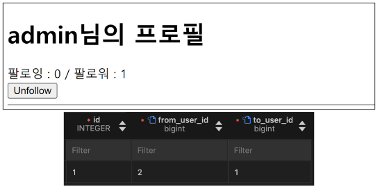
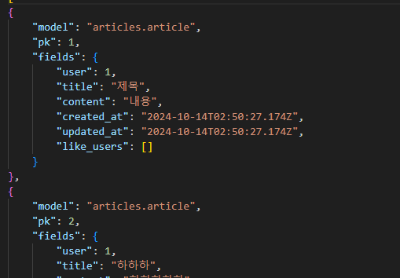

### 목차

> [1. 팔로우 기능 구현](#1-팔로우-기능-구현)
> 
> [2. Fixtures](#2-fixtures)
> 
> [3. Improve query](#3-improve-query)
> 
> [4. 참고](#4-참고)

# 1. 팔로우 기능 구현

### 프로필 페이지

- 각 회원의 개인 프로필 페이지에 팔로우 기능을 구현하기 위해 프로필 페이지를 먼저 구현하기

### 프로필 구현

- url 작성
  
  - `<str:username>` 은 맨 마지막에 써야한다. 다음 주소들이 날아감

  - 주소는 일치하는 것을 찾아 위에서부터 내려오는데 `<str:username>`은 문자열 변수라서 다 걸림

  - `pofile/<str:username>`처럼 앞에 다른 주소 추가로 붙이면 괜찮다.

- accounts/urls.py

```python
urlpatterns = [
    ...,
    path('profile/<str:username>/', views.proile, name='profile'),
]
```

- view 함수 작성

- accounts.views.py

```python
from django.contrib.auth import get_user_model

def profile(request, username):
    User = get_user_model()
    person = User.objects.get(username=username)
    # person = get_user_model().objects.get(username=username)
    context = {
        'person': person,
}
return render(request, 'accounts/profile.html', context)
```

- profile 템플릿 작성

- accounts/profile.html

```django
<h1>{{ person.username }}님의 프로필</h1>
<hr>
<h2>{{ person.username }} 가 작성한 게시글</h2>

  <div>{{ article.title }}</div>

<hr>
...
<h2>{{ person.username }} 가 작성한 댓글</h2>

  <div>{{ comment.content }}</div>

<hr>
<h2>{{ person.username }} 가 좋아요한 게시글</h2>

  <div>{{ article.title }}</div>

```

- 프로필 페이지로 이동할 수 있는 링크 작성

- articles/index.html

```django
<a href="">내 프로필</a>

<p>작성자 : <a href="">{{ article.user }}</a></p>
```

### 모델 관계 설정

- User(M) - User(N) : 0명 이상의 회원은 0명 이상의 회원과 관련

- => 회원은 0명 이상의 팔로워를 가질 수 있고, 0명 이상의 다른 회원들은 팔로잉 할 수 있음

- `ManyToManyField` 작성

- accounts/models.py

```python
class User(AbstractUser):
    followings = models.ManyTodManyField('self', symmetrical=False, related_name='followers')
```

- 참조 : 내가 팔로우하는 사람들 (팔로잉, `followings`)

- 역참조 : 상대방 입장에서 나는 팔로워 중 한 명 (팔로워, `followers`)

- **바뀌어도 상관 없으나 관계 조회 시 생각하기 편한 방향으로 정한 것**

- Migrations 진행 후 중개 테이블 확인


### 기능 구현

- url 작성

- accounts/urls.py

```python
urlpatterns = [
    ...,
    path('<int:user_pk>/follow/', views.follow, name='follow'),
]
```

- view 함수 작성

- accounts/views.py

```python
@login_required
def follow(request, user_pk):
    User = get_user_model()
    # 팔로우 요청을 보내는 대상 : you => person
    person = User.objects.get(pk=user_pk)
    # 나 (팔로우 요청하는 사람) : me => request.user
    # 나와 팔로우 대상자가 같지 않을 경우만 진행 (다른 사람만 팔로우 가능)
    if person != request.user:
        # 만약 내가 상대방의 팔로워 목록에 이미 있다면 팔로우 취소
        if request.user in person.followers.all():
            person.followers.remove(request.user)
            # request.user.followings.remove(person)
        else: # 내가 상대방 팔로워 목록에 없다면 팔로우
          person.followers.add(request.user)
          # request.user.followings.add(person)
    return redirect('accounts:profile', person.username)
```

- 프로필 유저의 팔로잉, 팔로워 수 & 팔로우, 언팔로우 버튼 작성

- accounts/profile.html

```django
<h1>{{ person.username }}의 프로필</h1>
<div>
  팔로잉 : {{ person.followings.all|length }} / 팔로워 : {{ person.followers.all|length }}
</div>


  <div>
    <form action="" method="POST">
      
      
        <input type="submit" value="언팔로우">
      
        <input type="submit" value="팔로우">
      
    </form>
  </div>

```

- 팔로우 버튼 클릭 -> 팔로우 버튼 변화 및 중개 테이블 데이터 확인



# 2. Fixtures

- Dajango가 데이터베이스로 가져오는 방법을 알고 있는 데이터 모음

- 데이터는 데이터베이스 구조에 맞추어 작성되어 있음

### 초기 데이터 제공

- Fixtures의 사용 목적

- 협업하는 유저 A, B가 있다고 생각해보기

1. A가 먼저 프로젝트를 작업 후 원격 저장소에 push 진행

  - gitignore로 인해 DB는 업로드하지 않기 때문에 A가 생성한 데이터도 업로드 X

2. B가 원격 저장소에서 A가 push한 프로젝트를 pull (혹은 clone)

  - 결과적으로 B는 DB가 없는 프로젝트를 받게 됨

- 이처럼 프로젝트의 앱을 처음 설정할 때 동일하게 준비된 데이터로 데이터베이스를 미리 채우는 것이 필요한 순간이 있음

- Django에서는 fixtures를 사용해 앱에 초기 데이터(initial data)를 제공

### 사전준비

- M:N 까지 모두 작성된 Django 프로젝트에서 유저, 게시글, 댓글 등 각 데이터를 최소 2~3개 이상 생성해두기

### fixtures 관련 명령어

- `dumpdata` : 생성 (데이터 추출)

- `loaddata` : 로드 (데이터 입력)

### dumpdata

- 데이터베이스의 모든 데이터를 추출

- 작성 예시

```bash
$ python manage.py dumpdata [app_name[.ModelName] [app_name[.ModelName] ... ]] > filename.json
```

- 활용 : 게시글 데이터 추출

- `--indent` 를 사용하지 않으면 데이터가 한 줄로 만들어짐

```bash
python manage.py dumpdata --indent 4 articles.article > articles.json
```

- 만들어진 json 파일



- 유저, 댓글 추출

```bash
$ python manage.py dumpdata --indent 4 accounts.user > users.json
$ python manage.py dumpdata --indent 4 articles.comment > comments.json
```

### Fixtures 파일을 직접 만들지 말 것

- 반드시 `dumpdata` 명령어를 사용하여 생성

### loaddata

- Fixtures 데이터를 데이터베이스로 불러오기

### Fixtures 파일 기본 경로

- `app_name/fixtures/`

- Django는 설치된 모든 app의 디렉토리에서 fixtures 폴더 이후의 경로로 fixtures 파일을 찾아 load

### loaddata 활용

- `articles/fixtures/` 로 파일 이동

- db.sqlite3 파일 삭제 후 migrate 진행

- load 진행 후 데이터가 잘 입력되었는지 확인

```bash
python manage.py loaddata articles.json users.json comments.json
```

### loaddata 순서 주의사항

- 만약 `loaddata`를 한번에 실행하지 않고 별도로 실행한다면 모델 관계에 따라 load 순서가 중요할 수 있음

  - `comment`는 `article`에 대한 key 및 `user`에 대한 key가 필요

  - `article`은 `user`에 대한 key가 필요

- 즉, 현재 모델 관계에서는 `user` -> `article` -> `comment` 순으로 data를 load해야 오류가 발생하지 않음

  - 한방에 다 하면 신경쓸 필요 X

```bash
python manage.py loaddata users.json
python manage.py loaddata articles.json
python manage.py loaddata comments.json
```

# 3. Improve query

- query 개선하기

- 같은 결과를 얻기 위해 DB 측에 보내는 query 개수를 점차 줄여 조회하기

  - ~.objects.all() 이런거 보내는 수 줄이기

### 사전 준비

- fixtures 데이터 : 게시글 10개, 댓글 100개, 유저 5개

- 모델 관계

  - N : 1 - Article : User / Comment : Article

  - N : M - Article : User

```bash
$ python manage.py migrate
$ python manage.py loaddata articles.json users.json comments.json

Installed 115 object(s) from 3 fixture(s)
```

- 서버 실행 후 확인

### annotate

- SQL의 `GROUP BY`를 사용 -> 게시글 가져오면서 댓글도 함께 가져오기

- 쿼리셋의 각 객체에 계산된 필드를 추가

- 집계함수(`Count`, `Sum` 등)와 함께 자주 사용됨

```python
Book.objects.annotate(num_authors=Count('authors'))
```

- 의미
  
  - 결과 객체에 `'num_authors'`라는 새로운 필드를 추가

  - 이 필드는 각 책과 연관된 저자의 수를 계산

- 결과

  - 결과에는 기존 필드와 함께 '`num_authors'` 필드를 가지게 됨

  - `book.num_authors`로 해당 책의 저자 수에 접근할 수 있게 됨

- 문제 상황 : 11개의 쿼리 중 10개가 유사함(10개의 게시글 댓글 일일이 가져오기)


- 문제 원인 : 각 게시글마다 댓글 개수를 반복 평가

- index_1.html

```django
<p>댓글개수 : {{ article.comment_set.count }}</p>
```

- 문제 해결 : 게시글을 조회하면서 **댓글 개수까지 한번에 조회**해서 가져오기

  - `Article.objects.annotate(Count('comment')).order_by('-pk')`

- views.py

```python
def index_1(request):
    # articles = Article.objects.order_by('-pk')
    articles = Article.objects.annotate(Count('comment')).order_by('-pk')
    context = {
        'articles': articles,
    }
    return render(request, 'articles/index_1.html', context)
```

- index_1.html

```django
<p>댓글개수 : {{ article.comment__count }}</p>
```

- 11개의 쿼리가 1개로 줄어듦

### select_related

- SQL의 `INNER JOIN`을 사용

- 1:1 또는 N:1 참조 관계에서 사용

  - ForeignKey나 OneToOneField 관계에 대해 JOIN을 수행

- 단일 쿼리로 관련 객체를 함께 가져와 성능을 향상

```python
Book.objects.select_related('publisher')
```

- 의미 :

  - Book 모델과 연관된 Publisher 모델의 데이터를 함께 가져옴

  - ForeignKey 관계인 'publisher'를 JOIN하여 단일 쿼리 만으로 데이터를 조회

- 결과

  - Book 객체를 조회할 때 연관된 Publisher 정보도 함께 로드

  - `book.publisher.name`과 같은 접근이 추가적인 데이터베이스 쿼리 없이 가능

- 문제 원인 : 각 게시글마다 작성한 유저명까지 반복 평가

- index_2.html

```django

  <h3>작성자 : {{ article.user.username }}</h3>
  <p>제목 : {{ article.title }}</p>
  <hr>

```

- 문제 해결 : 게시글을 조회하면서 **유저 정보까지 한번에 조회**해서 가져오기

  - `Article.objects.select_related('user').order_by('-pk')`

- views.py

```python
def index_2(request):
    # articles = Article.objects.order_by('-pk')
    articles = Article.objects.select_related('user').order_by('-pk')
    context = {
        'articles': articles,
    }
    return render(request, 'articles/index_2.html', context)
```

- 11개의 쿼리가 1개로 줄어듦

### prefetch_related

- SQL이 아닌 Python을 사용한 JOIN을 진행

  - 관련 객체들을 미리 가져와 메모리에 저장하여 성능을 향상

- M:N 또는 N:1 역참조 관계에서 사용

  - ManyToManyField나 역참조 관계에 대해 별도의 쿼리를 실행

```python
Book.objects.prefetch_related('authors')
```

- 의미

  - Book과 Author는 ManyToMany 관계로 가정

  - Book 모델과 연관된 모든 Author 모델의 데이터를 미리 가져옴

  - Django가 별도의 쿼리로 Author 데이터를 가져와 관계를 설정

- 결과

  - Book 객체들을 조회한 후, 연관된 모든 Author 정보가 미리 로드 됨

  - `for author in book.authors.all()` 와 같은 반복이 추가적인 데이터베이스 쿼리 없이 실행됨

- 문제 원인 : 각 게시글 출력 후 각 게시글의 댓글 목록까지 개별적으로 모두 평가

- index_3.html

```django

  <p>제목 : {{ article.title }}</p>
  <p>댓글 목록</p>
  
    <p>{{ comment.content }}</p>
  
  <hr>

```

- 문제 해결 : 게시글을 조회하면서 **참조된 댓글까지 한번에 조회**해서 가져오기

  - `Article.objects.prefetch_related('comment_set').order_by`

- views.py

```python
def index_3(request):
    # articles = Article.objects.order_by('-pk')
    articles = Article.objects.prefetch_related('comment_set').order_by('-pk')
    context = {
        'articles': articles,
    }
    return render(request, 'articles/index_3.html', context)
```

- 11개의 쿼리가 2개로 줄어듦

### select_related & prefetch_related

- 문제 원인 : "게시글" + "각 게시글의 댓글 목록" + "댓글의 작성자"를 단계적으로 평가

- index_4.html

```django

  <p>제목 : {{ article.title }}</p>
  <p>댓글 목록</p>
  
    <p>{{ comment.user.username }} : {{ comment.content }}</p>
  
  <hr>

```

- 문제 해결 1단계 : 게시글을 조회하면서 참조된 댓글까지 한번에 조회

  - `articles = Article.objects.order_by('-pk')` -> `articles = Article.objects.prefetch_related('comment_set').order_by('-pk')`

  - 111개의 쿼리에서 102개로 줄어듦

  - 아직 각 댓글을 조회하면서 각 댓글의 작성자를 중복 조회 중

- 문제 해결 2단계 : "게시글" + "각 게시글의 댓글 목록" + "댓글의 작성자"를 한번에 조회

  - `articles = Article.objects.prefetch_related(Prefetch('comment_set', queryset=Comment.objects.select_related('user'))).order_by('-pk')`

- views.py

```python
def index_4(request):
    # articles = Article.objects.order_by('-pk')
    # articles = Article.objects.prefetch_related('comment_set').order_by('-pk')
    articles = Article.objects.prefetch_related(
        Prefetch('comment_set', queryset=Comment.objects.select_related('user'))
    ).order_by('-pk')

    context = {
        'articles': articles,
    }
    return render(request, 'articles/index_4.html', context)
```

- 102개의 쿼리가 2개로 줄어듦

### 섣부른 최적화는 악의 근원

- "작은 효율성에 대해서는, 말자하자면 97% 정도에 대해서는, 잊어버려라. 섣부른 최적화는 모든 악의 근원이다." - *도널드 커누스(Donald E. Knuth)*

# 4. 참고

### 'exists' method

- `exists()`

- QuerySet에 결과가 하나 이상 존재하는지 여부를 확인하는 메서드

- 결과가 포함되어 있으면 True를 반환하고 결과가 포함되어 있지 않으면 False를 반환

- 데이터베이스에 최소한의 쿼리만 실행하여 효율적

- 전체 QuerySet을 평가하지 않고 결과의 존재 여부만 확인

- 대량의 QuerySet에 있는 특정 객체 검색에 유용

- 적용 예시

```python
# 적용 전
if request.user in article.like_users.all():

# 적용 후
if article.like_users.filter(pk=request.user.pk).exists():

# 적용 전
if request.user in person.followers.all():

# 적용 후
if person.followers.filter(pk=request.user.pk).exists():
```

### 모든 모델을 한꺼번에 dump 하기

- 권장 X

- 변경이 필요할 때 관리하기 힘듦

```bash
# 3개의 모델을 하나의 json 파일로
$ python manage.py dumpdata --indent 4 articles.article articles.comment accounts.user > data.json

# 모든 모델을 하나의 json 파일로
$ python manage.py dumpdata --indent 4 > data.json
```

### loaddata 시 encoding codec 관련 에러가 발생하는 경우

1. `dumpdata` 시 추가 옵션 작성 : `-Xutf8` : 한글 등 문자 깨짐 방지

```bash
$ python -Xutf8 manage.py dumpdata [생략]
```

2. 메모장 활용

  1. 메모장으로 json 파일 열기
  2. "다른 이름으로 저장"클릭
  3. 인코딩을 UTF8로 선택 후 저장