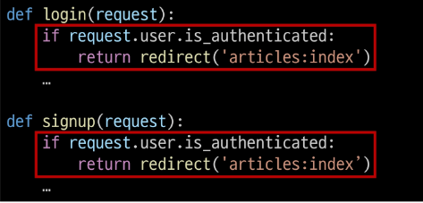

### 목차

> [1. 회원 가입](#1-회원-가입)
> 
> [2. 회원 탈퇴](#2-회원-탈퇴)
> 
> [3. 회원정보 수정](#3-회원정보-수정)
> 
> [4. 비밀번호 변경](#4-비밀번호-변경)
> 
> [5. 로그인 사용자에 대한 접근 제한](#5-로그인-사용자에-대한-접근-제한)
> 
> [6. 참고](#6-참고)

# 1. 회원 가입

- User 객체를 Create 하는 과정

### `UserCreationForm()`

- 회원 가입시 사용자 데이터를 받는 built-in ModelForm

### 회원 가입 페이지 작성

- accounts/urls/py

```python
app_name = 'accounts'
urlpatterns = [
    ...,
    path('signup/', views.signup, name='signup'),
]
```

- accounts/views.py

```python
from django.contrib.auth.forms import UserCreationForm

def signup(request):
    if request.method =='POST':
        pass
    else:
        form = UserCreationForm()
    context = {
        'form' : form,
    }
    return render(request, 'accounts/signup.html', context)
```

- accounts/signup.html

```django
<h1>회원가입</h1>
<form action="" method="POST">
  
  {{ form.as_p }}
  <input type="submit">
</form>
```


### 회원 가입 로직 작성

- accounts/views.py

```django
def signup(request):
    if request.method =='POST':
        form = UserCreationForm(request.POST)
        if form.is_valid():
            form.save()
            return redirect('articles:index')
    else:
        form = UserCreationForm()
    context = {
        'form' : form,
    }
    return render(request, 'accounts/signup.html', context)
```

### 회원 가입 로직 에러

- 회원가입 시도 후 에러 페이지 확인

- Managere isn't available; 'auth.User' has been swapped for 'accounts.User'

- `django.contrib.auth`에 있는 회원가입에 사용하는 `UserCreationForm`이 대체한 커스텀 유저 모델이 아닌 과거 Django의 기본 유저 모델로 인해 작성된 클래스이기 때문

```python
class Meta:
    model = User
    fields = ("username",)
    fields_classes = {"username": UsernameField}
```

- 커스텀 유저 모델을 사용하려면 다시 작성해야 하는 Form
  
  - `UserCreationForm`, `UserChangeForm`
  
  - 두 Form 모두 `Class Meta: model =User`가 작성된 Form이기 때문에 재작성 필요

- accounts/forms.py

```python
from django.contrib.auth.forms import UserCreationForm, UserChangeForm
# django는 User 모델을 직접 참조하는 것을 권장하지 않는다.
# from .models import User
# 그래서 django는 User 모델을 간접적으로 참조할 수 있는 방법을 별도로 제공한다.
# 현재 활성화된 User 모델 반환
from django.contrib.auth import get_user_model


class CustomUserCreationForm(UserCreationForm):
    class Meta(UserCreationForm.Meta):
        model = get_user_model()


class CustomUserChangeForm(UserChangeForm):
    class Meta(UserChangeForm.Meta):
        model = get_user_model()
```

### `get_user_model()`

- "현재 프로젝트에서 활성화된 사용자 모델(active user model)"을 반환하는 함수

### User 모델을 직접 참조하지 않는 이유

- `get_user_model()`을 사용해 `User`모델을 참조하면 커스텀 User 모델을 자동으로 반환해주기 때문

- Django는 필수적으로 `User` 클래스를 직접 참조하는 대신 `get_user_model()`을 사용해 참조해야 한다고 강조하고 있음

- User model 참조에 대한 자세한 내용은 추후 모델 관계에서 다룰 예정

### 회원 가입 로직 완성

- `CustomUserCreationForm`으로 변경

- accounts/views.py

```python
from .forms import CustomUserCreationForm

def signup(request):
    if request.method =='POST':
        form = CustomUserCreationForm(request.POST)
        if form.is_valid():
            form.save()
            return redirect('articles:index')
    else:
        form = CustomUserCreationForm()
    context = {
        'form' : form,
    }
    return render(request, 'accounts/signup.html', context)
```

# 2. 회원 탈퇴

- User 객체를 Delete 하는 과정

### 회원 탈퇴 로직 작성

- accounts/urls.py

```python
app_name = 'accounts'
urlpatterns = [
    ...,
    path('delete/', views.delete, name='delete'),
]
```

- accounts/views.py

```python
def delete(request):
    # User 모델에서 누가 회원탈퇴를 요청한건지 검색할 필요가 없다.
    # request 객체(request.user)에 현재 view 함수에 요청을 보내는 유저 정보가 들어있기 때문.
    user = request.user
    user.delete()
    # request.user.delete()
    return redirect('articles:index')
```

- accounts/index.html

```django
  <form action="" method='POST'>
    
    <input type="submit" value='회원탈퇴'>
  </form>
```

- 회원 탈퇴 진행


# 3. 회원정보 수정

- User 객체를 Update 하는 과정

### `UserChangeForm()`

- 회원정보 수정 시 사용자 입력 데이터를 받는 built-in `ModelForm`

### 회원정보 수정 페이지 작성

- accounts.urls.py

```python
app_name = 'accounts'
urlpatterns = [
    ...,
    path('update/', views.update, name='update'),
]
```

- accounts/views.py

```python
from .forms import CustomUserChangeForm

def update(request):
    if request.method == 'POST':
        pass
    else:
        form = CustomUserChangeForm(instance = request.user)
    context = {
        'form': form
    }
    return render(request, 'accounts/update.html', context)
```

- accounts/update.html

```django
<h1>회원정보 수정</h1>
<form action="" method="POST">
  
  {{ form.as_p }}
  <input type="submit">
</form>
```

- accounts/index.html

```django
<a href="">회원정보 수정</a>
```

- 회원정보 수정 페이지 확인


### UserChangeForm 사용 시 문제점

- `User` 모델의 모든 정보들(`fields`)까지 모두 출력됨

- 일반 사용자들이 접근해서는 안되는 정보는 출력하지 않도록 해야 함

- `CustomUserChangeForm`에서 출력 필드를 다시 조정하기

### CustomUserChangeForm 출력 필드 재정의

- User Model의 필드 목록 확인
  
  - [django.contrib.auth | Django documentation | Django](https://docs.djangoproject.com/en/4.2/ref/contrib/auth/)

- accounts/forms.py

```python
class CustomUserChangeForm(UserChangeForm):
    class Meta(UserChangeForm.Meta):
        model = get_user_model()
        fields = ('first_name', 'last_name', 'email')
```

- 회원정보 수정 페이지 확인


### 회원정보 수정 로직 완성

- accounts/views.py

```python
def update(request):
    if request.method == 'POST':
        form = CustomUserChangeForm(request.POST, isinstance=request.user)
        if form.is_valid():
            form.save()
            return redirect('articles:index')
    else:
        form = CustomUserChangeForm(instance = request.user)
    context = {
        'form': form
    }
    return render(request, 'accounts/update.html', context)
```

+) class Meta 윗줄에 `password = None` 을 추가하면 '비밀번호 : ~ 비밀번호가 설정되지 않았습니다~'가 뜨지 않는다.

# 4. 비밀번호 변경

- 인증된 사용자의 Session 데이터를 Update 하는 과정

### `PasswordChangeForm()`

- 비밀번호 변경 시 사용자 입력 데이터를 받는 built-in `Form`

### 비밀번호 변경 페이지 작성

- django는 비밀번호 변경 페이지를 회원정보 수정 form 하단에 별도 주소로 안내
  
  - /user_pk/password/

- crud/urls.py

```python
from accounts import views

urlpatterns = [
    ...,
    path('<int:user_pk>/password/', views.change_password, name='change_password'),
]
```

- accounts/views.py

```python
from dajango.contrib.auth.forms import PasswordChangeForm

def change_password(request, user_pk):
    if request.method == 'POST':
        pass
    else:
        form = PasswordChangeForm(request.user)
    context = {
        'form': form,
    }
    return render(request, 'accounts/change_password.html', context)
```

- accounts/change_password.html

```django
<h1>비밀번호 변경</h1>
<form action="" method="POST">
  
  {{ form.as_p }}
  <input type="submit">
</form>
```

- 비밀번호 변경 페이지 확인


### 비밀번호 변경 로직 완성

- accounts/views.py

```python
def change_password(request, user_pk):
    if request.method == 'POST':
        form = PasswordChangeForm(request.user, request.POST)
        # form = PasswordChangeForm(user=request.user, data=request.POST)
        if form.is_valid():
            form.save()
            return redirect('articles:index')
    else:
        form = PasswordChangeForm(request.user)
    context = {
        'form': form,
    }
    return render(request, 'accounts/change_password.html', context)
```

### 세션 무효화 방지

- 암호 변경 시 세션 무효화
  
  - 비밀번호가 변경되면 기존 세션과의 회원 인증 정보가 일치하지 않게 되어 버려 로그인 상태가 유지되지 못하고 로그아웃 처리됨
  
  - 비밀번호가 변경되면서 기존 세션과의 회원 인증 정보가 일치하지 않기 때문

- `update_session_auth_hash(request, usere)`
  
  - 암호 변경 시 세션 무효화를 막아주는 함수
  
  - 암호가 변경되면 새로운 password의 Session Data로 기존 session을 자동으로 갱신

- `update_session_auth_hash` 적용
  
  - accounts/views.py


# 5. 로그인 사용자에 대한 접근 제한

1. `is_authenticated` 속성

2. `login_required` 데코레이터

### `is_authenticated`

- 사용자가 인증 되었는지 여부를 알 수 있는 User model의 속성

- 모든 `User` 인스턴스에 대해 항상 `True`인 읽기 전용 속성

- 비인증 사용자에 대해서는 항상 `False`

### is_authenticated 적용하기

- 로그인과 비로그인 상태에서 화면에 출력되는 링크를 다르게 설정하기

- articles/index.html


- 인증된 사용자라면 로그인/회원가입 로직을 수행할 수 없도록 하기



### `login_required`

- 인증된 사용자에 대해서만 view 함수를 실행시키는 데코레이터

- 비인증 사용자의 경우 `/accounts/login/` 주소로 `redirect` 시킴

### login_required 적용하기

- 인증된 사용자만 게시글을 작성/수정/삭제 할 수 있도록 수정 

- articles/views.py


+) logout, delete, update, change_password에도 적용

# 6. 참고

### `is_authenticated` 속성 코드

- 메서드가 아닌 속성 값임을 주의


### 회원가입 후 자동 로그인

- 회원가입 성공한 user 객체를 활용해 login 진행

- accounts/views.py


### 회원 탈퇴 개선

- 탈퇴와 함께 기존 사용자의 Session Data 삭제 방법
  
  - 사용자 객체 삭제 이후 로그아웃 함수 호출
  
  - 단, "**탈퇴(1) 후 로그아웃(2)**"의 순서가 바뀌면 안됨!!
  
  - 먼저 로그아웃이 진행되면 해당 요청 객체 정보가 없어지기 때문에 탈퇴에 필요한 유저 정보 또한 없어지기 때문

- accounts/views.py

```python
def delete(request):
    request.user.delete()
    auth_logout(request)
```

### PasswordChangeForm 인자 순서

- `PassWordChangeForm`이 다른 `Form`과 달리 user 객체를 첫 번째 인자로 받는 이유

- 부모 클래스인 `SetPasswordForm`의 생성자 함수 구성을 따르기 때문

- [https://github.com/django/django/blob/4.2/django/contrib/auth/forms.py#L399](https://github.com/django/django/blob/4.2/django/contrib/auth/forms.py#L399)

### Auth built-in form 코드

- `UserCreationForm()`
  
  - [https://github.com/django/django/blob/4.2/django/contrib/auth/forms.py#L149](https://github.com/django/django/blob/4.2/django/contrib/auth/forms.py#L149)

- `UserChangeForm()`
  
  - [https://github.com/django/django/blob/4.2/django/contrib/auth/forms.py#L170](https://github.com/django/django/blob/4.2/django/contrib/auth/forms.py#L170)

- `PasswordChangeForm()`
  
  - [https://github.com/django/django/blob/4.2/django/contrib/auth/forms.py#L422](https://github.com/django/django/blob/4.2/django/contrib/auth/forms.py#L422)


