### 목차

> [1. Web Application]
> 
> [2. Framework]
> 
> [3. 참고]

# 1. Web Application

- Web application (web service) 개발
  
  - 인터넷을  통해 사용자에게 제공되는 소프트웨어 프로그램을 구축하는 과정
  
  - 다양한 디바이스(모바일, 태블릿, PC 등)에서 웹 브라우저를 통해 접근하고 사용할 수 있음

### 클라이언트와 서버

- 웹의 동작 방식 : 우리가 컴퓨터 혹은 모바일 기기로 웹 페이지를 보게 될 때까지 일어나는 일

- '클라이언트-서버' 구조

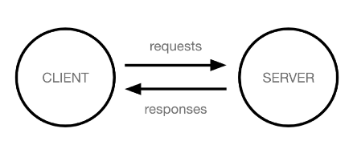

### Client

- 클라이언트 : **서비스**를 **요청**하는 주체 (웹 사용자의 인터넷이 연결된 장치, 웹 브라우저)

### Server

- 서버 : 클라이언트의 요청에 응답(페이지, 로직, 파일 등)하는 주체 (웹 페이지, 앱을 저장하는 컴퓨터)

### 우리가 웹 페이지를 보게 되는 과정

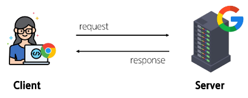

1. 웹 브라우저 **(클라이언트)** 에서 **'google.com'** 을 입력 후 엔터

2. 웹 브라우저는 인터넷에 연결된 전세계 어딘가에 있는 구글 컴퓨터 **(서버)** 에게 **'메인 홈페이지.html'** 파일을 달라고 요청

3. 요청을 받은 구글 컴퓨터는 데이터베이스에서 **'메인 홈페이지.html'** 파일을 찾아 응답

4. 웹 브라우저는 전달받은 **'메인 홈페이지.html'** 파일을 사람이 볼 수 있도록 해석해주고 사용자는 구글의 메인 페이지를 보게 됨

### Frontend & Backend

- 웹 개발에서의 Frontend와 Backend

- Frontend (프론트엔드) : 
  
  - 사용자 인터페이스(UI)를 구성하고, 사용자가 애플리케이션과 상호작용할 수 있도록 함
  
  - HTML, CSS, JavaScript, 프론트엔드 프레임워크 등

- Backend (백엔드) : 
  
  - 서버 측에서 동작하며, 클라이언트의 요청에 대한 처리와 데이터베이스와의 상호작용 등을 담당
  
  - 서버 언어(Python, Java 등) 및 백엔드 프레임워크, 데이터베이스, API, 보안 등

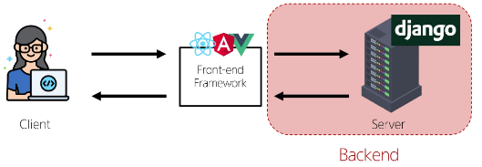

# 2. Framework

- '웹 서비스 개발'에 필요한 기술 : 
  
  - 로그인/로그아웃, 회원관리, 데이터베이스, 보안 등

- 모든 기능을 직접 개발하기에는 현실적 어려움 존재

- 현대 웹 개발의 핵심 : 
  
  - 잘 만들어진 도구를 효과적으로 활용하는 능력

- *"거인의 어깨 위에서 프로그래밍하기"*

### Web Framework

- 웹 어플리케이션을 빠르게 개발할 수 있도록 도와주는 도구 (개발에 필요한 기본 구조, 규칙, 라이브러리 등을 제공)

### django

- 장고 : Python 기반의 대표적인 웹 프레임워크

- Django를 사용하는 이유
  
  - 다양성 : 
    - Python 기반으로 웹, 모바일, 백엔드, API 서버 및 빅데이터 관리 등 광범위한 서비스 개발에 적합
  - 확장성 : 
    - 대량의 데이터에 대해 빠르고 유연하게 확장할 수 있는 기능을 제공
  - 보안 : 
    - 취약점으로부터 보호하는 보안 기능이 기본적으로 내장되어 있음
  - 커뮤니티 지원 : 
    - 개발자를 위한 지원, 문서 및 업데이트를 제공하는 활성화 된 커뮤니티

- 검증된 웹 프레임워크 : 대규모 트래픽 서비스에서도 안정적인 서비스 제공
  
  - Spotify, Instagram, Dropbox, Delivery Hero 등

- 가장 인기있는 Backend Framework (2024)
  
  1. Express.js (Node.js)
  
  2. Django (Python)
  
  3. Spring Boot (Java)
  
  4. Laravel (PHP)
  
  5. ASP.NET Core (C#)

- Django를 사용해서 서버 구현

### 가상 환경

- Python 애플리케이션과 그에 따른 패키지들을 격리하여 관리할 수 있는 **독립적인** 실행 환경

- 가상환경이 필요한 시나리오

> 1. 한 개발자가 2개의 프로젝트(A와 B)를 진행해야 한다.
> 
> 2. 프로젝트 A는 requests 패키지 버전 1을 사용해야 한다.
> 
> 3. 프로젝트 B는 requests 패키지 버전 2를 사용해야 한다.
> 
> 4. 하지만 파이썬 환경에서 패키지는 1개의 버전만 존재할 수 있다.
> 
> 5. A와 B 프로젝트의 다른 패키지 버전 사용을 위한 **독립적인 개발 환경**이 필요하다.

> 1. 한 개발자가 2개의 프로젝트(A와 B)를 진행해야 한다.
> 
> 2. 프로젝트 A는 `water`이라는 패키지를 사용해야 한다.
> 
> 3. 프로젝트 B는 `fire`이라는 패키지를 사용해야 한다.
> 
> 4. 하지만 파이썬 환경에서 `water`패키지와 `fire`패키지를 함께 사용하면 충돌이 발생하기 때문에 설치할 수 없다.
> 
> 5. A와 B 프로젝트 패키지의 충돌을 피하기 위해 각각 **독립적인 개발 환경**이 필요하다.

- Python 환경 구조 예시

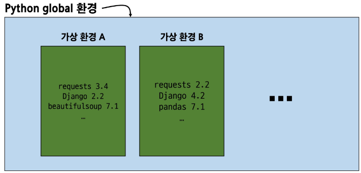

### 1. 가상 환경 venv 생성

- `venv`라는 이름의 가상환경 생성

- 임의 이름으로 생성이 가능하나 관례적으로 `venv` 이름을 사용

```bash
$ python -m venv venv
```

### 2. 가상 환경 활성화

- 활성화 명령어가 OS에 따라 다름에 주의
  
  - macOS/Linux : \$ source venv/bin/activate

```bash
$ source venv/Scripts/activate
```

### 3. 환경에 설치된 패키지 목록 확인

```bash
$ pip list
```

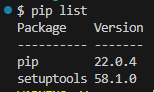

### 4. 설치된 패키지 목록 생성

- 현재 Python 환경에 설치된 모든 패키지와 그 버전을 텍스트 파일로 저장

- `requirements.txt` : 생성될 파일 이름 (관례적으로 사용)

```bash
$ pip freeze > requirements.txt
```

- 패키지 목록이 필요한 이유
  
  - 팀원이 프로젝트를 위해 어떤 패키지를 설치했고, 어떤 버전을 설치했는지 가상 환경 상황을 알아야 프로젝트를 실행할 수 있다.
  
  - 가상 환경에 대한 정보 즉 **패키지 목록**이 공유되어야 한다.

### 의존성 패키지

- requests 설치 후 설치되는 패키지 목록 변화

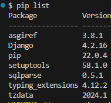

- 한 소프트웨어 패키지가 다른 패키지의 기능이나 코드를 사용하기 때문에 그 패키지가 존재해야만 제대로 작동하는 관계

- 사용하려는 패키지가 설치되지 않았거나, 호환되는 버전이 아니면 오류가 발생하거나 예상치 못한 동작을 보일 수 있다.

### 패키지 목록 파일 특징 및 주의사항

- 주요 특징
  
  - 가상환경의 패키지 목록을 쉽게 공유 가능
  
  - 프로젝트의 의존성을 명확히 문서화
  
  - 동일한 개발 환경을 다른 시스템에서 재현 가능

- 사용 시 주의사항
  
  - 활성화된 가상환경에서 실행해야 정확한 패키지 목록 생성
  
  - 시스템 전역 패키지와 구분 필요

- [번외] 패키지 목록 기반 설치
  
  - 생성된 `requirements.txt`로 다른 환경에서 동일한 환경 구성하기
  
  - 가상환경 활성화 후 `requirements.txt`에 작성된 목록을 기반으로 설치

```bash
$ pip install -r requirements.txt
```

- 가상환경 비활성화

```bash
$ deactivate
```

- 가상환경 주의사항 및 권장사항

> 1. 가상 환경에 "들어가고 나오는" 것이 아니라 사용할 Python 환경을 "On/Off"로 전환하는 개념
>    
>    - 가상환경 활성화는 현재 터미널 환경에만 영향을 끼침
>    
>    - 새 터미널 창을 열면 다시 활성해야 함
> 
> 2. 가상환경은 "방" 이 아니라 "도구 세트"
>    
>    - 활성화는 특정 도구 세트를 선택하는 것
> 
> 3. 프로젝트마다 별도의 가상환경 사용
> 
> 4. 일반적으로 가상환경 폴더 venv는 관련된 프로젝트와 동일한 경로에 위치
> 
> 5. 가상환경 폴더 venv는 gitignore에 작성되어 원격 저장소에 공유되지 않음
>    
>    - 저장소 크기를 줄여 효율적인 협업과 배포를 가능하게 하기 위함 (requirements.txt를 공유)
>    
>    - [gitignore.io](https://www.toptal.com/developers/gitignore)

- 의존성 패키지 관리의 중요성
  
  - 개발 환경에서는 각각의 프로젝트가 사용하는 패키지와 그 버전을 정확히 관리하는 것이 중요
  
  - 가상 환경 & 의존성 패키지 관리

### Django 프로젝트

1. 프로젝트 생성
   
   ```bash
   $ django-admin startproject firstpjt .
   ```
   
   - firstpjt 라는 이름의 프로젝트를 생성

2. 서버 실행
   
   ```bash
   $ python manage.py runserver
   ```
   
   - manage.py와 동일한 경로에서 진행

3. 서버 확인
   
   - 주소 (http://127.0.0.1:8000/) 를 `ctrl`과 함께 눌러 접속
   
   - 서버가 제대로 실행됐을 때 로켓 확인 가능
   
   - `ctrl + c`로 실행 중단 -> (venv) 출력 후 종료

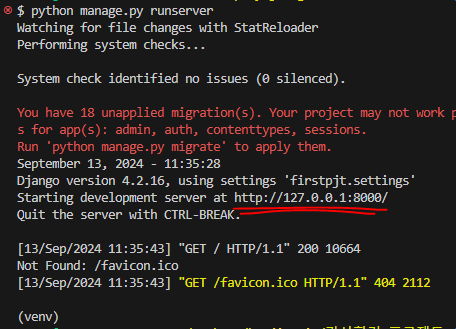

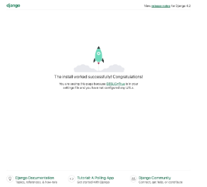

### Django Design Pattern

- 디자인 패턴 : 
  
  - 소프트웨어 설계에서 발생하는 문제를 해결하기 위한 일반적인 해결책 (공통적인 문제를 해결하는 데 쓰이는 형식화 된 관행)
  
  - "애플리케이션의 구조는 이렇게 구성하자" 라는 관행

### MVC 디자인 패턴

- Model, View, Controller

- 애플리케이션을 구조화하는 대표적인 패턴

- "데이터" & "사용자 인터페이스" & "비즈니스 로직"을 분리

- 시각적 요소와 뒤에서 실행되는 로직을 서로 영향 없이, 독립적이고 쉽게 유지 보수할 수 있는 애플리케이션을 만들기 위해

### MTV 디자인 패턴

- Model, Template, View

- Django에서 애플리케이션을 구조화하는 패턴

- 기존 MVC 패턴과 동일하나 단순히 명칭을 다르게 정의한 것

- Model, Template, View (단순한 명칭 변경)
  
  - View -> Template
  
  - Controller -> View

### Project & App

- 프로젝트와 앱

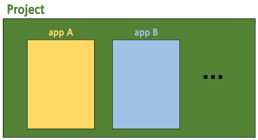

- Django project
  
  - 애플리케이션의 집합
  
  - DB 설정, URL 연결, 전체 앱 설정 등을 처리

- Django application
  
  - 독립적으로 작동하는 기능 단위 모듈
  
  - 각자 특정한 기능을 담당하며 다른 앱들과 함께 하나의 프로젝트를 구성

- 만약 온라인 커뮤니티 카페를 만든다면?
  
  - 프로젝트 : 카페 (전체 설정 담당)
  
  - 앱 : 게시글, 댓글, 회원 관리 등 (DB, 인증, 화면)

- 앱을 사용하기 위한 순서
  
  1. 앱 생생 : 앱의 이름은 '복수형'으로 지정하는 것을 권장 -> 'articles'
  
  ```bash
  $ python manage.py startapp articles
  ```
  
  2. 앱 등록 : 반드시 **앱을 생성한 후에 등록**해야 함. 등록 후 생성은 불가능
  
  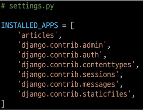

### 프로젝트 구조

- `settings.py` : 프로젝트의 모든 설정을 관리

- `urls.py` : 요청 들어오는 URL에 따라 이에 해당하는 적절한 views를 연결

- `__init__.py` : 해당 폴더를 패키지로 인식하도록 설정하는 파일

- `asgi.py` : 비동기식 웹 서버와의 연결 관련 설정

- `wsgi.py` : 웹 서버와의 연결 관리 설정

- `manage.py` : Django 프로젝트와 다양한 방법으로 상호작용하는 커맨드라인 유틸리티

- init ~ manage.py 는 수업 과정에서 수정할 일 없음

### 앱 구조

- `admin.py` : 관리자용 페이지 설정

- `models.py` : DB와 관련된 Model을 정의, MTV 패턴의 M

- `views.py` : HTTP 요청을 처리하고 해당 요청에 대한 응답을 반환 (url, model, template와 연계), MTV 패턴의 V

- `apps.py` : 앱의 정보가 작성된 곳

- `test.py` : 프로젝트 테스트 코드를 작성하는 곳

- apps, test.py 는 수업 과정에서 수정할 일 없음

### 요청과 응답

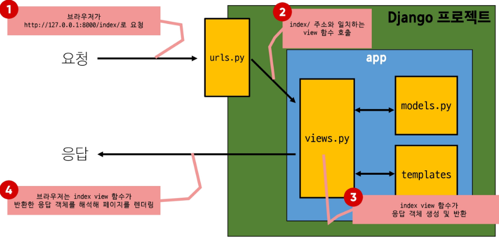

1. URLs
   
   - http://127.0.0.1:8000/index/ 로 요청이 왔을 때 request 객체를 views 모듈의 index view 함수에게 전달하며 호출
   
   - aritcle 패키지에서 view 모듈을 가져오는 것
   
   - url 경로는 반드시 `/`(slash)로 끝아야 함
     
     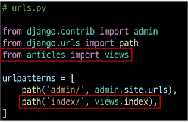

2. View
   
   - view 함수가 정의되는 곳
   
   - 특정 경로에 있는 template과 request 객체를 결합해 응답 객체를 반환
   
   - 모든 view 함수는 첫번째 인자로 요청 객체를 필수적으로 받음
   
   - 매개변수 이름이 request가 아니어도 되지만 그렇게 작성하지 않음
     
     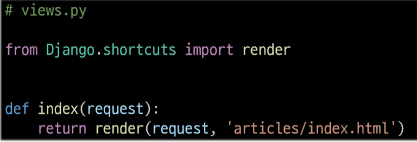

3. Template
   
   1. `articles`앱 폴더 안에 `templates`폴더 생성
      
      - 폴더명은 반드시 `templates` 여야 하며, 개발자가 직접 생성해야 함
   
   2. `templates`폴더 안에 `articles`폴더 생성
   
   3. `articles`폴더 안에 템플릿 파일 생성

### Django에서 template를 인식하는 경로 규칙

- **app폴더 / templates /**  articles / index.html

- **app 폴더 / templates /** example.html

- Django는 `templates/` 까지 기본 경로로 인식하기 때문에 view 함수에서 template 경로 작성 시 이 지점 이후의 경로를 작성해야 함

- 요청 후 응답 페이지 확인 : 주소/폴더이름/
  
  - ex) http://127.0.0.1:8000/articles/

### 데이터 흐름에 따른 코드 작성하기

- URLs -> View -> Template

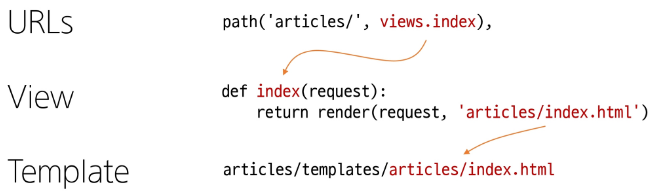

# 3. 참고

### Django 프로젝트 생성 전 루틴

1. 가상환경 생성 : `$ python -m venv venv`

2. 가상환경 활성화 : `$ source venv/Scripts/activate`

3. Django 설치 : `$ pip install django`

4. 패키지 목록 파일 생성 (패키지 설치시마다 진행) :
   
   - `$ pip freeze > requirements.txt`
   
   - Python 3.10 이상일 경우 그냥 실행하면 Django 5 버전이 설치되니 주의

5. `.gitignore` 파일 생성 (첫 add 전)

6. git 저장소 생성 (`git init`)

7. Django 프로젝트 생성

### 가상환경을 사용하는 이유

- 의존성 관리
  
  - 라이브러리 및 패키지를 각 프로젝트마다 독립적으로 사용 가능

- 팀 프로젝트 협업
  
  - 모든 팀원이 동일한 환경과 의존성 위에서 작업하여 버전간 충돌을 방지

### LTS (Long-Term Support)

- 96p...
