### 목차

> [1. Template System](#1-template-system)
> 
> [2. 템플릿 상속](#2-템플릿-상속)
> 
> [3. HTML form](#3-html-form)
> 
> [4. Django URLs](#4-django-urls)
> 
> [5. URL 이름 지정](#5-url-이름-지정)
> 
> [6. URL 이름 공간](#6-url-이름-공간)
> 
> [7. 참고](#7-참고)

# 1. Template System

### Django Template system

- 데이터 **표현**을 제어하면서, **표현**과 관련된 부분을 담당

### HTML의 콘텐츠를 변수 값에 따라 변경하기

```html
<body>
  <h1>Hello, django!</h1>
</body>
```

> 출력
> 
> Hello, django!

- **django** 부분을 개인별로 다르게 보여주기 : 딕셔너리 `return`

- 딕셔너리는 보통 context로 많이 씀

```python
def index(request):
    context = {
        'name' : 'alice'
    }
    return render(request, 'articles/index.html', context)
```

```django
<body>
  <h1>안녕하세요! {{ name }}</h1>
</body>
```

> 출력
> 
> 안녕하세요! alice

### Django Template Languate

- DTL : Template에서 조건, 반복, 변수 등의 프로그래밍적 기능을 제공하는 시스템
1. Variable
   
   - `render` 함수의 세번째 인자로 딕셔너리 데이터를 사용
   
   - 딕셔너리 key에 해당하는 문자열이 template에서 사용 가능한 변수명이 됨
   
   - dot('.')을 사용하여 변수 속성에 접근할 수 있음
   
   ```django
   {{ variable }}
   {{ variable.attribute }}
   ```

2. Filters
   
   - 표시할 변수를 수정할 때 사용 (변수 + | + 필터)
   
   - chained(연결)이 가능하며 일부 필터는 인자를 받기도 함
   
   - 약 60개의 built-in template filters를 제공
   
   ```django
   {{ variable|filter }}
   {{ name|truncatewords:30 }}
   ```

3. Tags
   
   - 반복 또는 논리를 수행하여 제어 흐름을 만듦
   
   - 일부 태그는 시작과 종료 태그가 필요
   
   - 약 24개의 built-in template tags를 제공
   
   ```django
   
    
   ```

4. Comments
   
   - DTL에서의 주석
   
   ```django
   {# name #}
   
   ...
   abc
   ...
   
   ```
- DTL 예시

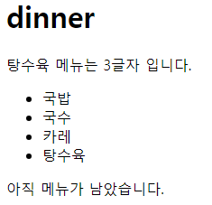

- urls.py

```python
urlpatterns = [
    path("admin/", admin.site.urls),
    path('index/', views.index),
    path('dinner/', views.dinner),
]
```

- views.py

```python
def dinner(request):
    foods = ['국밥', '국수', '카레', '탕수육',]
    picked = random.choice(foods)
    context = {
        'foods' : foods,
        'picked' : picked,
    }
    return render(request, 'articles/dinner.html', context)
```

- articles/dinner.html

```django
<h1>dinner</h1>
<p>{{ picked }} 메뉴는 {{ picked|length }}글자 입니다.</p>
<ul>
  
    <li>{{ food }}</li>
  
</ul>

  


  <p>메뉴가 소진되었습니다.</p>

  <p>아직 메뉴가 남았습니다.</p>

```

# 2. 템플릿 상속

- 기존 템플릿 구조의 한계
  
  - 만약 모든 템플릿에 bootstrap을 적용하려면?
  
  - 모든 템플릿에 bootstrap CDN 작성하기는 귀찮다.

- 템플릿 상속 : Template inheritance
  
  - **페이지의 공통요소를 포함**하고, **하위 템플릿이 재정의 할 수 있는 공간**을 정의하는 기본 'skeleton' 템플릿을 작성하여 상속 구조를 구축

- 상속 구조 만들기

- skeleton 역할을 하게 되는 상위 템플릿(base.html) 작성

- block : 하위 템플릿이 재정의할 수 있는 공간

- block은 여러 군데에서 쓸 수 있기 때문에 이름이 필요함

- articles/base.html

```django
<!DOCTYPE html>
<html lang="en">
<head>
  <meta charset="UTF-8">
  <meta name="viewport" content="width=device-width, initial-scale=1.0">
  <title>Document</title>
  <script src="https://cdn.jsdelivr.net/npm/@popperjs/core@2.11.8/dist/umd/popper.min.js" integrity="sha384-I7E8VVD/ismYTF4hNIPjVp/Zjvgyol6VFvRkX/vR+Vc4jQkC+hVqc2pM8ODewa9r" crossorigin="anonymous"></script>
  <style>
    
    
    
  </style>
</head>
<body>
  네비게이션 바

  
  
  
  footer
  <script src="https://cdn.jsdelivr.net/npm/bootstrap@5.3.3/dist/js/bootstrap.min.js" integrity="sha384-0pUGZvbkm6XF6gxjEnlmuGrJXVbNuzT9qBBavbLwCsOGabYfZo0T0to5eqruptLy" crossorigin="anonymous"></script>
</body>
</html>
```

- 기존 하위 템플릿 변경

- articles/index.html

```django







  <h1>안녕하세요! {{ name }}</h1>

```

- articles/dinner.html

```django



  <h1>dinner</h1>
  <p>{{ picked }} 메뉴는 {{ picked|length }}글자 입니다.</p>
  <ul>
    
      <li>{{ food }}</li>
    
  </ul>

    
  
  
    <p>메뉴가 소진되었습니다.</p>
  
    <p>아직 메뉴가 남았습니다.</p>
  

```

### 상속 관련 DTL 태그

- `extends` tag
  
  - 자식(하위)템플릿이 부모 템플릿을 확장한다는 것을 알림
  
  - 반드시 자식 템플릿 최상단에 작성되어야 하고, 2개 이상 상속/사용 불가
  
  ```django
  
  ```

- `block` tag
  
  - 하위 템플릿에서 재정의 할 수 있는 블록을 정의
  
  - 상위 템플릿에 작성하며, 하위 템플릿이 작성할 수 있는 공간을 지정
  
  ```django
  
  ```

- 하위 템플릿이 재정의 할 수 있는 block 영역

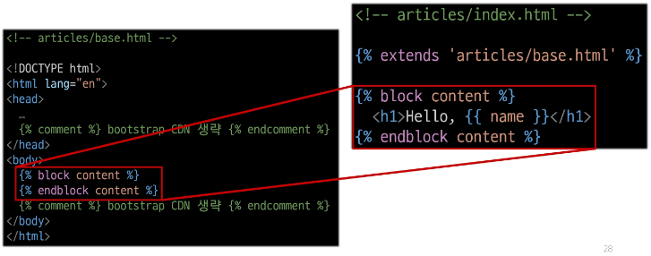

# 3. HTML form

### 요청과 응답

### 데이터를 보내고 가져오기

- sending and Retrieving form data

- HTML `form` element를 통해 사용자와 애플리케이션 간의 상호작용 이해하기

- HTML `form`은  HTTP 요청을 서버에 보내는 가장 편리한 방법

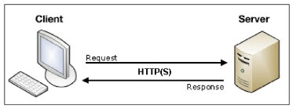

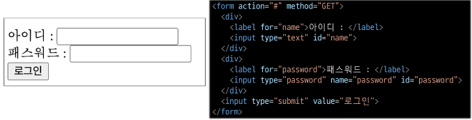

- 페이지는 이동하는 것이 아님. 요청하고 응답받는 것

- 웹 서비스에서 form 사용 예시 : 네이버 & 구글의 로그인 화면에서 사용하는 HTML **form** 요소

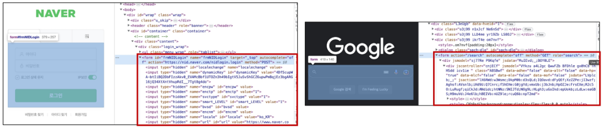

- 네이버 : 검색창에서 query를 입력받음

> 주소창에 'query=싸피' 라고 쓰여 있다.

- 구글 : 검색창에서 q를 입력받음.

> 주소창에 'q=싸피' 라고 쓰여 있다.

### `form` element

- 사용자로부터 할당된 데이터를 서버로 전송

- 웹에서 사용자 정보를 입력하는 여러 방식 (text, password, checkbox 등)을 제공

- 실습

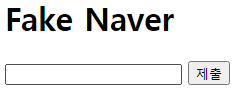

- url.py

```python
urlpatterns = [
    path("admin/", admin.site.urls),
    path('index/', views.index),
    path('dinner/', views.dinner),
    path('search/', views.search),
]
```

- views.py

```python
def search(request):
    return render(request, 'articles/search.html')
```

- articles/search.html

```django



  <h1>Fake Naver</h1>
   <form action="요청을 보낼 서버의 주소" method="GET(기본값)"> 
  <form action="https://search.naver.com/search.naver" method="GET">
    <input type="text" name="query">
    <input type="submit">
  </form>

```

- input에 단어를 입력하고 제출 버튼을 누르면 네이버 검색결과로 이동한다.

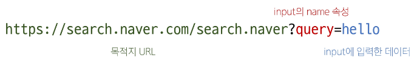

### `action` & `method`

- form의 핵심 속성 2가지

- 데이터를 어디(action)로 어떤 방식(method)으로 요청할지

- `action` : 
  
  - 입력 데이터가 전송될 URL을 지정 (목적지)
  
  - 만약 이 속성을 지정하지 않으면 데이터는 현재 form이 있는 페이지의 URL로 보내짐

- `method` : 
  
  - 데이터를 어떤 방식으로 보낼 것인지 정의
  
  - 데이터의 HTTP request methods (GET, POST)를 지정

### `input` element

- 사용자의 데이터를 입력 받을 수 있는 요소

- type 속성 값에 따라 다양한 유형의 입력 데이터를 받음

- 핵심 속성 : `name`
  
  - 사용자가 입력한 데이터에 붙이는 이름(key)
  
  - 데이터를 제출했을 때 서버는 name 속성에 설정된 값을 통해서만 사용자가 입력한 데이터에 접근할 수 있음

### Query String Parameters

- 사용자의 입력 데이터를 URL 주소에 파라미터를 통해 서버로 보내는 방법

- 문자열은 앰퍼샌드('&')로 연결된 **key=value** 쌍으로 구성되며, 기본 URL과는 물음표('?')로 구분됨

- ex) http://host:port/path?**key=value**&**key=value**

### form 활용

- 사용자 입력 데이터를 받아 그대로 출력하는 서버 만들기

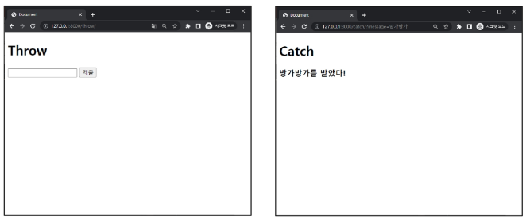

- view 함수는 몇개가 필요할까? url당 1개씩 => 2개

### 1. throw 로직 작성

- urls.py

```python
urlpatterns = [
    path('throw/', views.throw),
]
```

- views.py

```python
def throw(request):
    return render(request, 'articles/throw.html')
```

- articles/throw.html

```django



  <h1>Throw</h1>
   1. 실제 http 주소 
   <form action="http://127.0.0.1:8000/catch/" method="GET"> 
  
   2. 페이지 상대 주소 
  <form action="/catch/" method="GET">
    <input type="text" name="message">
    <input type="submit">
  </form>

```

### 2. catch 로직 작성

- throw 페이지에서 요청한 사용자 입력 데이터 가져오기

- urls.py

```python
urlpatterns = [
    path('catch/', views.catch),
]
```

- views.py

```python
def catch(request):
    # 사용자가 요청보낸 데이터를 추출해서 context 딕셔너리에 세팅
    message = request.GET.get('message')
    context = {
        'message' : message
    }
    return render(request, 'articles/catch.html',  context)
```

- articles/catch.html

```django



  <h1>Catch</h1>
  <p>당신이 입력한 데이터는 {{ message }} 입니다.</p>

```

### 3. catch 로직 마무리

### HTTP request 객체

- `form`으로 전송한 데이터 뿐만 아니라 Django로 들어오는 모든 요청 관련 데이터가 담겨 있음

- view 함수의 첫 번째 인자로 전달됨

- request 객체 살펴보기

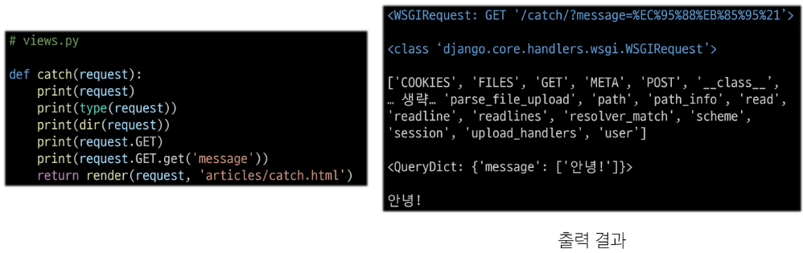

- request 객체에서 form 데이터 추출

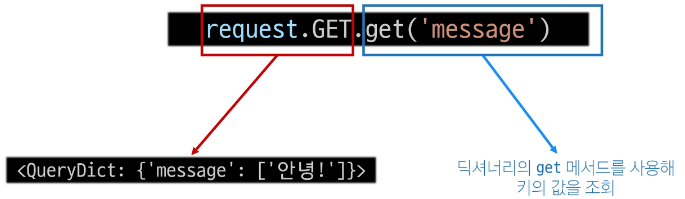


- url도 네이버처럼 보내짐

> message=안녕!

### throw-catch 간 요청과 응답 정리

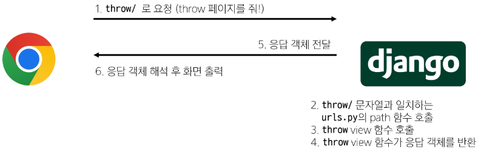

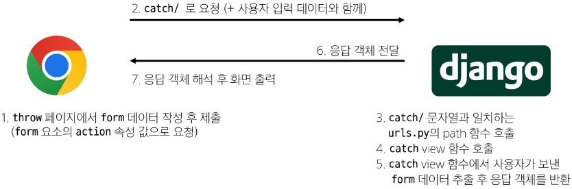

# 4. Django URLs

- 요청과 응답에서 Django URLs의 역할

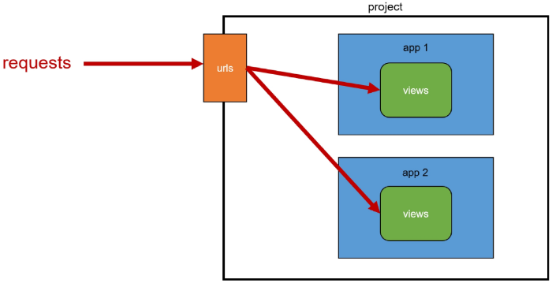

### URL dispatcher

- 운항 관리자, 분배기

- URL 패턴을 정의하고 해당 패턴이 일치하는 요청을 처리할 view 함수를 연결(매핑)

### Variable Routing

- 현재 URL 관리의 문제점 : 
  
  - 템플릿의 많은 부분이 중복되고, URL의 일부분만 변경되는 상황이라면 계속해서 비슷한 URL과 템플릿을 작성해 나가야 할까?
  
  > ex)
  > 
  > urlpatterns = [
  > 
  >     path('articles/1/', ...),
  > 
  >     path('articles/2/', ...),
  > 
  >     path('articles/3/', ...),
  > 
  >     path('articles/4/', ...),
  > 
  >     ...,
  > 
  > ]

- Varialbe Routing : 
  
  - URL 일부에 변수를 포함시키는 것
  
  - 변수는 view 함수의 인자로 전달할 수 있음

- Variable routing 작성법

```django
<path_converter:variable_name>
```

```python
path('articles/<int:num>/', views.detail)
path('hello/<str:name>/', views.greeting)
```

- path converters : 
  
  - URL 변수의 타입을 지정
  
  - `str`, `int` 등 5가지 타입 지원

- 실습

- urls.py

```python
urlpatterns = [
    path('hello/<str:name>/', views.greeting),
]
```

- views.py

```python
def greeting(request, name):
    context = {
        'name' : name,
    }
    return render(request, 'articles/greeting.html', context)
```

- articles/greeting.html

```django



  <h1>Greeting</h1>
  <p>{{ name }}님 안녕하세요!</p>

```

- 출력

> url : 주소/hello/엘리스
> 
> 
> 
> Greeting
> 
> 엘리스님 안녕하세요!


### App과 URL

- App URL mapping
  
  - 각 앱에 URL을 정의하는 것
  
  - 프로젝트와 각 앱이 URL을 나누어 관리를 편하게 하기 위함

- 2번째 앱 pages 생성 후 발생할 수 있는 문제
  
  - view 함수 이름이 같거나 같은 패턴의 URL 주소를 사용하게 되는 경우
  
  - 아래 코드와 같이 해결해 볼 수 있으나 더 좋은 방법 필요
  
  ```python
  from articles import views as articles_views
  from pages import views as pages_views
  
  urlpatterns = [
      ...,
      path('pages', pages_views.index)
  ]
  ```
  
  - **=> URL을 각자 app에서 관리하자**

- 기존 url 구조


- 변경된 url 구조

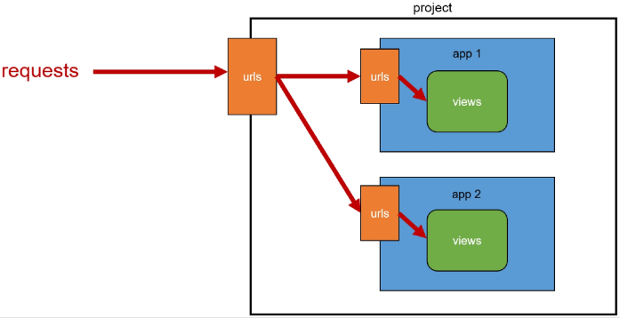

- url 구조 변화

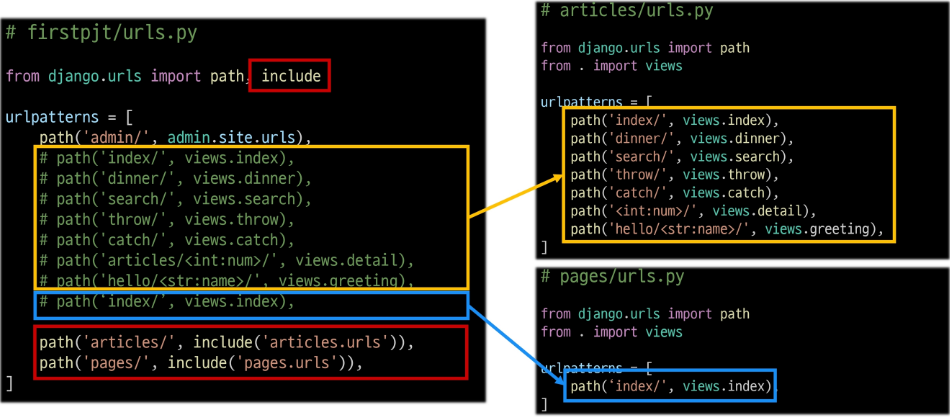

### `include()`

- 프로젝트 내부 앱들의 URL을 참조할 수 있도록 매핑하는 함수

- URL의 일치하는 부분까지 잘라내고, 남은 문자열 부분은 후속 처리를 위해 include된 URL로 전달

- include 적용 후

- 변경된 프로젝트의 **urls.py**

```python
from django.urls import path, include

urlpatterns = [
    path('admin/', admin.site.urls),
    path('articles/', include('articles.urls')),
    path('pages/', include('pages.urls')),
]
```

# 5. URL 이름 지정

- Naming URL patterns

### url 구조 변경에 따른 문제점

- 기존 '**articles/**' 주소가 '**articles/index/**'로 변경됨에 따라 해당 url을 사용하는 모든 위치를 찾아가 변경해야함

- 해결 : url에 이름 지어주고 이름만 기억하기

- urls.py 변경 전

```python
path('articles/', include('articles.urls'))
```

- urls.py 변경 후

```python
path('index/', views.index, name='index')
```

### Naming URL patterns

- URL에 이름을 지정하는 것

- `path`함수의 `name` 키워드 인자를 정의해서 사용

- articles/urls.py

```python
from django.urls import path
from . import views    # 명시적 상대경로 

urlpatterns = [
    path('index/', views.index, name='index'),
    path('dinner/', views.dinner, name='dinner'),
    ...,
    path('hello/<str:name>/', views.greeting, name='greeting'),
]
```

- pages/urls.py

```python
from django.urls import path
from . import views

urlpatterns = [
    path('index/', views.index, name='index'),
]
```

- url 표기 변화 : 
  
  - url을 작성하는 모든 곳에서 변경
  
  - `a` 태그의 `href` 속성 값 뿐만 아니라 `form`의 `action` 속성 등도 포함

- 변경 전 articles/index.html

```django



  <h1>Hello, {{ name }}</h1>
  <a href="/dinner/">dinner</a>
  <a href="/search/">search</a>
  <a href="/throw/">throw</a>

```

- 변경 후 articles/index.html

```django



  <h1>Hello, {{ name }}</h1>
  <a href="">dinner</a>
  <a href="">search</a>
  <a href="">throw</a>

```

### DTL URL tag

- `url` tag

```django

```

- 주어진 URL 패턴의 이름과 일치하는 절대 경로 주소를 반환

# 6. URL 이름 공간

### app_name 속성

- URL 이름 지정 후 남은 문제
  
  - `articles` 앱의 `url` 이름과 `pages` 앱의 `url` 이름이 같은 상황
  
  - 단순히 이름만으로는 완벽하게 분리할 수 없음
  
  - **해결 : 이름에 성(key)을 붙이자**

- `app_name` 변수 값 설정

- articles/urls.py

```python
app_name = 'articles'
urlpatterns = [
    ...,
]
```

- pages/urls.py

```python
app_name = 'pages'
urlpatterns = [
    ...,
]
```

### URL tag의 최종 변화

- 마지막으로 `url` 태그가 사용하는 모든 곳의 표기 변경하기

```django

```

>  -> 

# 7. 참고

### 추가 템플릿 경로 지정

- 템플릿 기본 경로 외 커스텀 경로 추가하기

- settings.py 중 (58 line) "DIRS": [],

```python
TEMPLATES = [
    {
        "BACKEND": "django.template.backends.django.DjangoTemplates",
        "DIRS": [],
        "APP_DIRS": True,
        "OPTIONS": {
            "context_processors": [
                "django.template.context_processors.debug",
                "django.template.context_processors.request",
                "django.contrib.auth.context_processors.auth",
                "django.contrib.messages.context_processors.messages",
            ],
        },
    },
]
```

- 새로운 템플릿 경로 생성 후 settings에 추가

> ex)
> 
> "DIRS" : [
> 
>     BASE_DIR / 'my_dir'
> 
> ]

- 각 하위 템플릿의 `extends`경로 수정

### BASE_DIR

- `settings`에서 경로지정을 편하게 하기 위해 최상단 지점을 지정해 둔 변수

- settings.py

```python
BASE_DIR = Path(__file__).resolve().parent.parent
```

- BASE_DIR 경로 위치 : 최상위 폴더(articles, firstpjt 상위 폴더)

- python의 객체 지향적 경로 작성 (띄어쓰기 주의)

```python
BASE_DIR / 'my_dir'
```

- 운영체제마다 경로 작성법이 다르기 때문에 위와 같은 방식 사용
  
  - ex. 리눅스 : 폴더1/폴더2/파일
  
  - ex. 윈도우 : 폴더1\폴더2\파일

- [Python의 객체 지향 파일 시스템 경로](https://docs.python.org/ko/3.9/library/pathlib.html#module-pathlib)

### DTL 주의사항

- Python처럼 일부 프로그래밍 구조(if, for 등)을 사용할 수 있지만 장고팀이 파이썬과 비슷한 모양으로 명칭을 그렇게 설계했을 뿐이지 **Python 코드로 실행되는 것이 아니며 Python과는 관련이 없다.**

- 프로그래밍적 로직이 아니라 표현을 위한 것임을 명심하기

- 프로그래밍적 로직은 되도록 view 함수에서 작성 및 처리할 것

- 공식문서를 참고해 다양한 태그와 필터 사용해보기

- [공식문서](https://docs.djangoproject.com/en/4.2/ref/templates/builtins/)

### Trailing Slashes

- URL의 Trailing Slashes

- Django는 URL 끝에 '**/**' 가 없다면 자동으로 붙임

- 기술적인 측면에서, 슬래쉬가 다르면 다른 URL.

- ex) **foo.com/bar** 와 **foo.com/bar/** 는 서로 다른 URL
  
  - 검색 엔진 로봇이나 웹 트래픽 분석 도구에서는 이 두 주소를 서로 다른 페이지로 보기 때문

- 그래서 Django는 검색 엔진이 혼동하지 않게 하기 위해 무조건 붙이는 것을 선택

- 그러나 모든 프레임워크가 이렇게 동작하는 것은 아니니 주의


