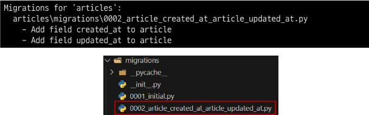

### 목차

> [1. Model](#1-model)
> 
> [2. Model Field](#2-model-field)
> 
> [3. Migrations](#3-migrations)
> 
> [4. Admin site](#4-admin-site)
> 
> [5. 참고](#5-참고)

# 1. Model

### model class

- 장고에서 모델은 class로 작성한다.

### Model을 통한 DB(데이터베이스) 관리


- Model ≠ DB

### Django Model

- DB의 테이블을 정의하고 데이터를 조작할 수 있는 기능들을 제공

- 테이블 구조를 설계하는 '청사진(blueprint)'

### model 클래스 작성

```python
class Article(models.Model):
    title = models.CharField(max_length=10)
    content = models.TextField()
```

- 작성한 모델 클래스는 최종적으로 DB에 다음과 같은 테이블 구조를 만듦

- 모델 클래스 == 테이블 설계도

- id 필드는 Django가 자동 생성

| id  | title | content |
|:---:|:-----:|:-------:|
| ..  | ..    | ..      |
| ..  | ..    | ..      |

- `django.db.models` 모듈의 `Model`이라는 부모 클래스를 상속받음

- `Model`은 model에 관련된 모든 코드가 이미 작성 되어있는 클래스
  
  - [Model의 부모 클래스 - django GitHub 참고 링크](https://github.com/django/django/blob/1857b6663b664847a426e8c79b8aec42994660ba/django/db/models/base.py#L459)

- 개발자는 가장 중요한 **테이블 구조를 어떻게 설계할지에 대한 코드만 작성하도록** 하기 위한 것 (상속을 활용한 프레임워크의 기능 제공)

- 클래스 변수명 : 테이블의 각 "필드(열) 이름" -> title, content

- Model Field
  
  - 데이터베이스 테이블의 열(column)을 나타내는 중요한 구성 요소
  
  - "데이터의 유형"과 "제약 조건"을 정의
  
  - `CharField(max_length=10)`, `TextField()`

# 2. Model Field

- DB 테이블의 **필드\(열\)** 을 정의하며, 해당 필드에 저장되는 **데이터 타입(Field types)** 과 **제약조건(Field options)** 을 정의

- [Django 공식 문서 참고](https://docs.djangoproject.com/ko/4.2/)

- Model Field 구성
1. Field types (필드 유형) : 데이터베이스에 저장될 "데이터의 종류"를 정의 (models 모듈의 클래스로 정의되어 있음)
   
   - 주요 필드 유형
   
   - 문자열 필드 : `CharField`, `TextField`
     
     - `CharField()` : 제한된 길이의 문자열을 저장 (필드의 최대 길이를 결정하는 `max_length`는 필수 옵션)
     
     - `TextField()` : 길이 제한이 없는 대용량 텍스트를 저장 (무한대는 아니며 사용하는 시스템에 따라 달라짐)
   
   - 숫자 필드 : `IntegerField`, `FloatField`
   
   - 날짜/시간 필드 : `DataField`, `TimeField`, `DateTimeField`
   
   - 파일 관련 필드 : `FileField`, `ImageField`

2. Field options (필드 옵션) : 필드의 "동작"과 "제약 조건"을 정의 (ex. `max_length`)
   
   - 주요 필드 옵션
   
   - `null` : 데이터베이스에서 NULL 값을 허용할지 여부를 결정 (기본값 : False)
   
   - `blank` : form에서 빈 값을 허용할지 여부를 결정 (기본값: False)
   
   - `default` : 필드의 기본값을 설정

### 제약 조건

- Constraint : 특정 규칙을 강제하기 위해 테이블의 열이나 행에 적용되는 규칙이나 제한사항

- ex) 숫자만 저장되도록, 문자가 100자 까지만 저장되도록 하는 등

# 3. Migrations

- model 클래스의 변경사항(필드 생성, 수정/삭제 등)을 DB에 최종 반영하는 방법

- Migrations 과정 **2단계**
  
  1. `makemigrations`
  
  2. `migrate`


- 개발자는 초안 스케치만 한다. 설계도는 복잡하기 때문

### Migrations 핵심 명령어 2가지

- `makemigrations` : model class를 기반으로 최종 설계도(migration) 작성

```bash
$ python manage.py makemigrations
```

- `migrate` : 최종 설계도를 DB에 전달하여 반영

```bash
$ python manage.py migrate
```

- `migrate` 후 DB 내에 생성된 테이블 확인
  
  - Article 모델 클래스로 만들어진 articles_article 테이블
  
  - 테이블 이름 : "앱이름_클래스이름"


- articles/migrateions/0001_initial.py (1번 설계도) 생성됨

### 추가 Migrations

- 이미 생성된 테이블에 필드를 추가 : created_at, updated_at

| id  | title | content | created_at | updated_at |
|:---:|:-----:|:-------:|:----------:|:----------:|
| ..  | ..    | ..      | ..         | ..         |
| ..  | ..    | ..      | ..         | ..         |

- 추가 모델 필드 작성 : created_at, updated_at

```python
class Article(models.Model):
    title = models.CharField(max_length=10)
    content = models.TextField()
    created_at = models.DateTimeField(auto_now_add=True)
    updated_at = models.DateTimeField(auto_now=True)
```

- `DateTimeField`의 필드 옵션 (optional)
  
  - `auto_now` : 데이터가 **저장될 때마다** 자동으로 현재 날짜시간을 저장
  
  - `auto_now_add` : 데이터가 **처음 생성될 때만** 자동으로 현재 날짜시간을 저장

- 수정사항 작성 후 migration 2단계를 다시 해야한다. **점프 절대 불가!!**


- 이미 기존 테이블이 존재하기 때문에 필드를 추가 할 때 필드의 기본 값 설정이 필요(무결성의 원칙)
  
  - 기존 게시글의 작성일/수정일 입력해라\~

- 1번은 현재 대화를 유지하면서 직접 기본 값을 입력하는 방법

- 2번은 현재 대화에서 나간 후 models.py에 기본 값 관련 설정을 하는 방법

- 1번 선택


- 추가하는 필드의 기본 값을 입력해야 하는 상황

- 날짜 데이터이기 때문에 직접 입력하기 보다는 Django가 제안하는 기본 값을 사용하는 것을 권장(1번 선택)

- 아무것도 입력하지 않고 enter를 누르면 Django가 제안하는 기본 값으로 설정됨



- 0002_article_created_at_article_updated_at.py (2번 설계도)가 작성됨
  
  - 1번 설계도에 add(추가)하는 내용

- 이처럼 Django는 설계도를 쌓아가면서 추후 문제가 생겼을 시 복구하거나 되돌릴 수 있도록 함 (마치 **'git commit'** 과 유사)

- `migrate` 후 새로고침 -> 테이블 필드 변화


### model class에 변경사항(1)이 생겼다면 반드시 새로운 설계도를 생성(2)하고, 이를 DB에 반영(3)해야 한다.

1. `model class` 변경 -> 2. `makemigrations` -> 3. `migrate`

---

# 4. Admin site

### Automatic admin interface

- Django가 추가 설치 및 설정 없이 자동으로 제공하는 관리자 인터페이스

- 데이터 확인 및 테스트 등을 진행하는 데 매우 유용
1. admin 계정 생성
   
   - email은 선택사항이기 때문에 입력하지 않고 진행 가능
   
   - 비밀번호 입력 시 보안상 터미널에 출력되지 않으니 무시하고 입력 이어가기
   
   - 비밀번호 8글자이상/여러문자 등의 빨간색 경고문구 무시하고 y 누르면 짧고 간단한 비밀번호도 생성 가능

```bash
$ python manage.py createsuperuser
```

2. DB에 생성된 admin 계정 확인


- migration을 1번 이상은 모두 진행해야 계정을 만들 수 있음
3. admin에 모델 클래스 등록
- **admin.py**에 작성한 모델 클래스를 등록해야만 admin site에서 확인 가능

```python
from django.contrib import admin
# Article 추가
from .models import Article

# Register your models here.

# admin site에 등록한다.
admin.site.register(Article)
```

4. admin site 로그인 후 등록된 모델 클래스 확인
- 서버 실행하면 migration 안 했다는 빨간 경고문구가 사라짐


5. 데이터 생성, 수정, 삭제 테스트


6. 테이블 확인


# 5. 참고

### 데이터베이스 초기화

1. migration 파일 삭제

2. db.sqlite3 파일 삭제
- `__init__.py`, `migrations 폴더` 를 **지우지 않도록 주의!!!**


### Migrations 관련

### Migrations 기타 명령어

```bash
$ python manage.py showmigrations
```

- migrations 파일들이 migrate 됐는지 안 됐는지 여부를 확인하는 명령어

- `[X]`표시가 있으면 migrate가 완료되었음을 의미

```bash
$ python manage.py sqlmigrate articles 0001
```

- 해당 migrations 파일이 SQL 언어(DB에서 사용하는 언어)로 어떻게 번역 되어 DB에 전달되는지 확인하는 명령어

### 첫 migrate 시 출력 내용이 많은 이유

- Django 프로젝트가 동작하기 위해 미리 작성 되어있는 기본 내장 app들에 대한 migration 파일들이 함께 migrate 되기 때문


### SQLite

- 데이터베이스 관리 시스템 중 하나이며 Django의 기본 데이터베이스로 사용됨

- 파일로 존재하며 가볍고 호환성이 좋음.

- Oracle 등에 비해 기술의 수는 떨어질 수 있으나 속도 등이 뒤처지지는 않음

- 안드로이드에서 많이 사용됨
