### 목차

> [1. Read](#1-read)
> 
> [2. Create](#2-create)
> 
> [3. HTTP request methods](#3-http-request-methods)
> 
> [4. HTTP response status code](#4-http-response-status-code)
> 
> [5. Redirect](#5-redirect)
> 
> [6. Delete](#6-delete)
> 
> [7. Update](#7-update)
> 
> [8. 참고](#8-참고)

### Django shell에서 연습했던 QuerySet API를 직접 view 함수에서 사용하기

# 1. Read

- 2가지 Read(조회) 진행
1. 전체 게시글 조회

2. 단일 게시글 조회 ☜

### 단일 게시글 조회

- http://127.0.0.1:8000/articles/1/

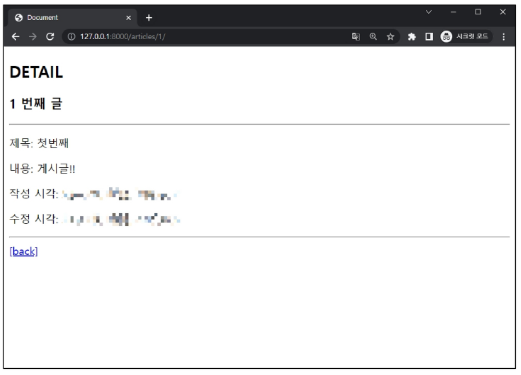

- crud/urls.py

```python
from django.urls import path, include

urlpatterns = [
    ...,
    path('articles/', include('articles.urls')),
]
```

- articles/urls.py

```python
urlpatterns = [
    ...,
    path('<int:pk>/', views.detail, name='detail'),
]
```

- articles/views.py

```python
def detail(request, pk):
    # url로부터 전달받은 pk를 활용해 데이터를 조회
    # article = Article.objects.get(id=pk)
    article = Article.objects.get(pk=pk)
    context = {
        'article': article,
    }
    return render(request, 'articles/detail.html', context)
```

- templates/articles/detail.html

```django
<h1>Detail</h1>
<h3>{{ article.pk }}번째 글</h3>
<hr>
<p>제목: {{ article.title }}</p>
<p>내용: {{ article.content }}</p>
<p>작성일: {{ article.created_at }}</p>
<p>수정일: {{ article.updated_at }}</p>
<hr>
<a href="">[back]</a>
```

### 단일 게시글 페이지 링크 작성

- http://127.0.0.1:8000/articles/

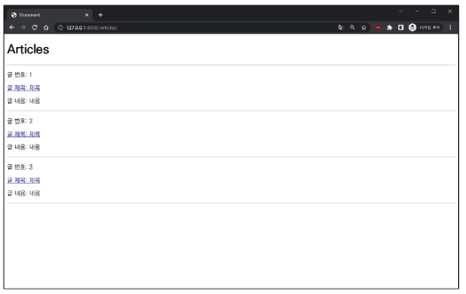

- articles/views.py

```python
def index(request):
    # 게시글 전체 조회 요청 to DB
    articles = Article.objects.all()
    context = {
        'articles': articles,
    }
    return render(request, 'articles/index.html', context)
```

- templates/articles/detail.html

```django
<h1>Articles<h1>
<hr>

  <p>글 번호: {{ article.pk }}</p>
  <a href=">
    <p>글 제목: {{ article.title }}</p>
  </a>
  <p>글 내용: {{ article.content }}</p>
  <hr>

```

# 2. Create

### Create 로직을 구현하기 위해 필요한 view 함수의 개수는?

- 사용자 입력 데이터를 받을 페이지를 렌더링 : `new`

- 사용자가 입력한 요청 데이터를 받아 DB에 저장 : `create`

### new 기능 구현

- http://127.0.0.1:8000/articles/new/

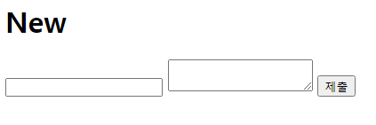

- articles/urls.py

```python
urlpatterns = [
    ...,
    path('new/', views.new, name='new'),
]
```

- articles/views.py

```
def new(request):
    # 게시글 작성 페이지 응답
    return render(request, 'articles/new.html')
```

- templates/articles/new.html

```django
<h1>New</h1>
<form action="#" method="GET">
  
  <input type="text" name="title">
  <textarea name="content" id=""></textarea>
  <input type="submit">
```

- 메인 페이지에 new 페이지로 이동할 수 있는 하이퍼링크 작성

- templates/articles/index.html

```django
<h1>Articles</h1>
<a href="">NEW</a>
```

### create 기능 구현

- http://127.0.0.1:8000/articles/create/

- articles/urls.py

```python
urlpatterns = [
    ...,
    path('create/', views.create, name='create'),
]
```

- templates/articles/create.html

```django
<h1>게시글이 작성 되었습니다.</h1>
```

- articles/views.py

```python
def create(request):
    # 1. 사용자 요청으로부터 입력 데이터를 추출
    title = request.GET.get('title')
    content = request.GET.get('content')

    # 저장 1
    # article = Article()
    # article.title = title
    # article.content = content
    # article.save()

    # 저장 2 
    article = Article(title=title, content=content)
    article.save()

    # 저장 3
    # Article.objects.create(title=title, content=content)

    # return redirect('articles:index')
    return render(request, 'articles/create.html')
```

- templates/articles/new.html

```django
<form action="" method="GET">
```

# 3. HTTP request methods

### HTTP

- 네트워크 상에서 데이터(리소스)를 주고 받기위한 약속

### HTTP request methods

- 데이터에 대해 수행을 원하는 작업(행동)을 나타내는 것
  
  - 서버에게 원하는 작업의 종류를 알려주는 역할

- 클라이언트가 웹 서버에 특정 동작을 요청하기 위해 사용하는 표준 명령어

- 대표 메서드 : `GET`, `POST`

### `'GET'` Method

- 서버로부터 데이터를 요청하고 받아오는 데 **(조회)** 사용
1. 데이터 전송
   
   - URL의 쿼리 문자열(Query String)을 통해 데이터를 전송
   
   - http://127.0.0.1:8000/articles/create/?**titile=제목&content=내용**

2. 데이터 제한
   
   - URL 길이에 제한이 있어 대량의 데이터 전송에는 적합하지 않음

3. 브라우저 히스토리
   
   - 요청 URL이 브라우저 히스토리에 남음

4. 캐싱
   
   - 브라우저는 GET 요청의 응답을 로컬에 저장할 수 있음
   
   - 동일한 URL로 다시 요청할 때, 서버에 접속하지 않고 저장된 결과를 사용
   
   - 페이지 로딩 시간을 크게 단축

### `'GET'` Method 사용 예시

- 검색 쿼리 전송

- 웹 페이지 요청

- API에서 데이터 조회

### `'POST'` Method

- 서버에 데이터를 제출하여 리소스를 **변경(생성, 수정, 삭제)** 하는 데 사용
1. 데이터 전송
   
   - HTTP Body를 통해 데이터를 전송

2. 데이터 제한
   
   - GET에 비해 더 많은 양의 데이터를 전송할 수 있음

3. 브라우저 히스토리
   
   - POST 요청은 브라우저 히스토리에 남지 않음

4. 캐싱
   
   - POST 요청은 기본적으로 캐시 할 수 없음
   
   - POST 요청이 일반적으로 서버의 상태를 변경하는 작업을 수행하기 때문

### `'POST'` Method 사용 예시

- 로그인 정보 제출

- 파일 업로드

- 새 데이터 생성 (예 : 새 게시글 작성)

- API에서 데이터 변경 요청

### `'GET'` & `'POST'` Method 정리

- GET과 POST는 각각의 특성에 맞게 적절히 사용해야 함

- GET : 데이터 조회

- POST : 데이터 생성이나 수정에 주로 사용

### Post method 변경

- POST method 적용

- templates/articles/new.html

```django
<form action="" method="POST">
```

- articles/views.py

```python
def create(request):
    # 1. 사용자 요청으로부터 입력 데이터를 추출
    title = request.POST.get('title')
    content = request.POST.get('content')
    ...
```

- 게시글 작성 후 403 응답 확인

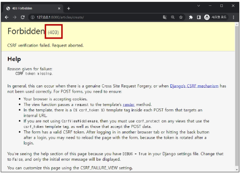

# 4. HTTP response status code

- 서버가 클라이언트의 요청에 대한 처리 결과를 나타내는 3자리 숫자

- 클라이언트에게 요청 처리 결과를 명확히 전달

- 문제 발생 시 디버깅에 도움

- 웹 애플리케이션의 동작을 제어하는 데 사용

### 403 Forbidden

- 서버에 요청이 전달되었지만, **권한** 때문에 거절되었다는 것을 의미

- 거절 된 이유 : "CSRF token이 누락되었다" 라는 응답

### CSRF

- Cross-Stie-Request-Forgery : "사이트 간 요청 위조"

- 사용자가 자신의 의지와 무관하게 공격자가 의도한 행동을 하여 특정 웹 페이지를 보안에 취약하게 하거나 수정, 삭제 등의 작업을 하게 만드는 공격 방법

### CSRF Token 적용

- DTL(Django Template Language : 장고 코어 템플릿 엔진)의 `csrf_token` 태그를 사용해 손쉽게 사용자에게 토큰 값을 부여

- 요청 시 토큰 값도 함께 서버로 전송될 수 있도록 하는 것

- templates/articles/new.html

```django
<h1>New</h1>
<form action="" method="POST">
  
```

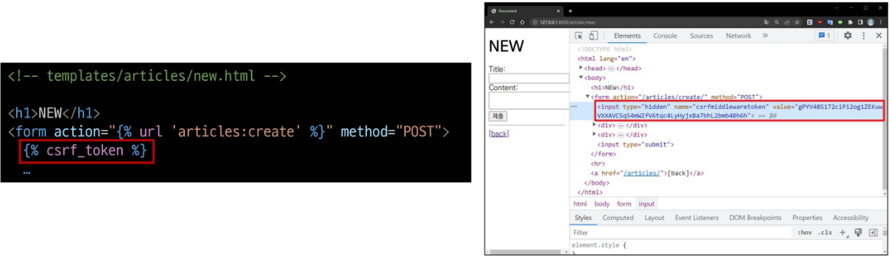

### 요청 시 CSRF Token을 함꼐 보내야 하는 이유

- Django 서버는 해당 요청이 DB에 데이터를 하나 생성하는(DB에 영향을 주는) 요청에 대해 **"Django가 직접 제공한 페이지에서 데이터를 작성하고 있는 것인지"** 에 대한 확인 수단이 필요한 것

- 겉모습이 똑같은 위조 사이트나 정상적이지 않은 요청에 대한 방어 수단

- 기존 : 요청 데이터 -> 게시글 작성

- 변경 : 요청 데이터 **+ 인증 토큰** -> 게시글 작성

### POST일 때만 Token을 확인하는 이유

- POST는 단순 조회를 위한 GET과 달리 특정 리소스에 변경(생성, 수정, 삭제)을 요구하는 의미와 기술적인 부분을 가지고 있기 때문

- DB에 조작을 가하는 요청은 반드시 인증 수단이 필요

- 데이터베이스에 대한 변경사항을 만드는 요청이기 때문에 토큰을 사용해 최소한의 신원 확인을 하는 것

### 게시글 작성 결과

- 게시글 생성 후 개발자 도구를 사용해 Form Data가 전송되는 것 확인

- 더 이상 URL에 Query String 형태로 보냈던 데이터가 표기되지 않음

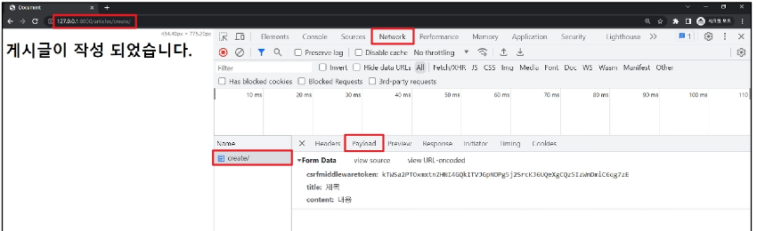

# 5. Redirect

- 게시글을 "조회해줘!" 라는 요청이 아닌 "작성해줘!" 라는 요청이기 때문에 게시글 저장 후 페이지를 응답하는 것은 POST 요청에 대한 적절한 응답이 아니다.

- 서버는 데이터 저장 후 페이지를 응답하는 것이 아닌, 사용자를 적절한 기존 페이지로 보내야 한다.
  
  - "사용자를 보낸다" -> "사용자가 GET 요청을 한 번 더 보내도록 해야 한다"
  
  - **실제로 서버가 클라이언트를 직접 다른 페이지로 보내는 것이 아닌 클라이언트가 GET 요청을 한번 더 보내도록 응답하는 것.**

### `redirect()`

- 클라이언트가 인자에 작성된 주소로 다시 요청을 보내도록 하는 함수

- `redirect()` 함수 적용
  
  - create view 함수 변경

```python
from django.shortcuts import render, redirect

def create(request):
    # 1. 사용자 요청으로부터 입력 데이터를 추출
    title = request.POST.get('title')
    content = request.POST.get('content')

    # 저장 1
    # article = Article()
    # article.title = title
    # article.content = content
    # article.save()

    # 저장 2 
    article = Article(title=title, content=content)
    article.save()

    # 저장 3
    # Article.objects.create(title=title, content=content)

    # return redirect('articles:index')
    return redirect('articles:detail', article.pk)
```

- redirect 동작 원리
1. `redirect` 응답을 받은 클라이언트는 `detail` url로 다시 요청을 보내게 됨

2. 결과적으로 `detail` view 함수가 호출되어 `detail` view 함수의 반환 결과인 `detail` 페이지를 응답 받게 되는 것
- 결국 사용자는 게시글 작성 후 작성된 게시글의 detail 페이지로 이동하는 것으로 느끼게 됨

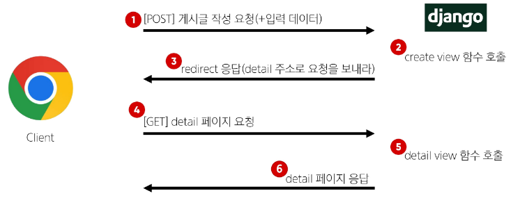

### 게시글 작성 결과

- 게시글 작성 후 생성 된 게시글의 `detail` 페이지로 `redirect` 되었는지 확인

- `create` 요청 이후에 `detail`로 다시 요청을 보냈다는 것을 알 수 있음

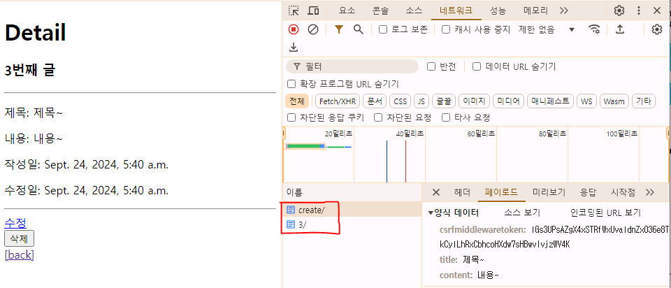

# 6. Delete

- Delete 기능 구현

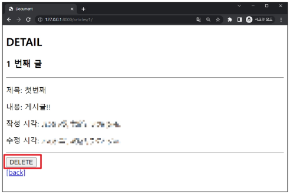

- articles/urls.py

```python
urlpatterns = [
    ...,
    path('<int:pk>/delete/', views.delete, name='delete'),
]
```

- articles/views.py

```python
def delete(request, pk):
    # 어떤 게시글 삭제할지 조회
    article = Article.objects.get(pk=pk)

    # 조회한 게시글 삭제
    article.delete()
    return redirect('articles:index')
```

- articles/detail.html

```django
<h1>Detail</h1>
<h3>{{ article.pk }}번째 글</h3>
...
<hr>
<form action="" method="POST">
  
  <input type="submit" value="삭제">
</form>
<a href="">[back]</a>
```

# 7. Update

- Update 로직을 구현하기 위해 필요한 view 함수의 개수
  
  - 사용자 입력 데이터를 받을 페이지를 렌더링 : `edit`
  
  - 사용자가 입력한 데이터를 받아 DB에 저장 : `update`

- edit, update 기능 구현

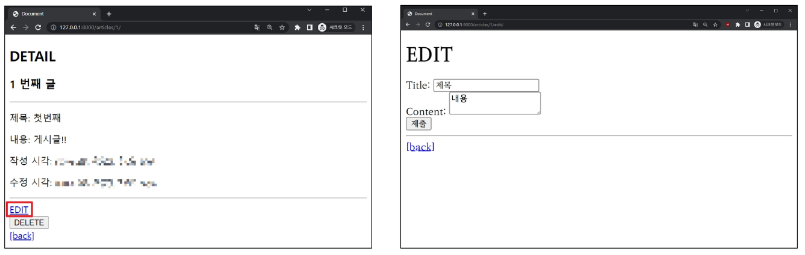

- articles/urls.py

```python
urlpatterns = [
    ...,
    path('<int:pk>/edit/', views.edit, name='edit'),
    path('<int:pk>/update/', views.update, name='update'),
]
```

- articles/views.py

```python
def edit(request, pk):
    # 어떤 게시글을 수정할지 조회
    article = Article.objects.get(pk=pk)
    context = {
        'article': article,
    }
    return render(request, 'articles/edit.html', context)

def update(request, pk):
    # 1. 어떤 게시글 수정할지 조회
    article = Article.objects.get(pk=pk)
    # 2. 사용자로부터 받은 새로운 입력 데이터 추출
    title = request.POST.get('title')
    content = request.POST.get('content')
    # 3. 기존 게시글의 데이터를 사용자로 받은 데이터로 새로 할당
    article.title = title
    article.content = content
    # 4. 저장
    article.save()

    # 다른 방법
    # article.title = request.POST.get('title')
    # article.content = request.POST.get('content')
    # article.save()

    return redirect('articles:detail', article.pk)
```

- articles/edit.html

```django
<h1>Edit</h1>
<form action="" method="POST">
  
  <input type="text" name="title" value="{{ article.title }}">
  <textarea name="content" id="">{{ article.content }}</textarea>
  <input type="submit" value="수정">
```

- articles/detail.html

```django
<a href="">수정</a><br>
```

# 8. 참고

### GET & POST

- GET과 POST

|            | GET                         | POST        |
|:----------:|:---------------------------:|:-----------:|
| 데이터 전송  방식 | URL의 Query string parameter | HTTP body   |
| 데이터 크기 제한  | 브라우저 제공 URL의 최대 길이          | 제한 없음       |
| 사용 목적      | 데이터 검색 및 조회                 | 데이터 제출 및 변경 |

### GET 요청이 필요한 경우

- 캐싱 및 성능
  
  - GET 요청은 캐시(Cache)될 수 있고, 이전에 요청한 정보를 새로 요청하지 않고 사용할 수 있음
  
  - 특히, 동일한 검색 결과를 여러 번 요청하는 경우 GET 요청은 캐시를 활용하여 더 빠르게 응답할 수 있음

- 가시성 및 공유
  
  - GET 요청은 URL에 데이터가 노출되어 있기 때문에 사용자가 해당 URL을 북마크하거나 다른 사람과 공유하기 용이

- RESTful API 설계
  
  - REST(Representational State Transfer) : 자원을 이름으로 구분하여 해당 자원의 상태를 주고받는 것
  
  - HTTP 메서드의 의미에 따라 동작하도록 디자인된 API의 일관성을 유지할 수 있음

### HTTP request methods를 활용한 효율적인 URL 구성

- 동일한 URL 한 개로 method에 따라 서버에 요구하는 행동을 다르게 요구 (Django 후반기 `RESTful API` 시간에 다룰 예정)

> GET :     articles/1/     : 1번 게시글 조회 요청!
> 
> POST :     articles/1/     : 1번 게시글 조작 요청!

### HTTP request methods 실제 활용 예시

- [TMDB API 가이드 문서 예시](https://developer.themoviedb.org/reference/intro/getting-started)

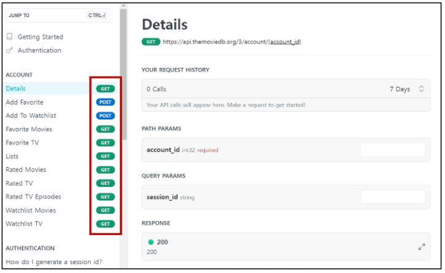

### 캐시(Cache)

- 데이터나 정보를 임시로 저장해두는 메모리나 디스크 공간

- 이전에 접근한 데이터를 빠르게 검색하고 접근할 수 있도록 함


