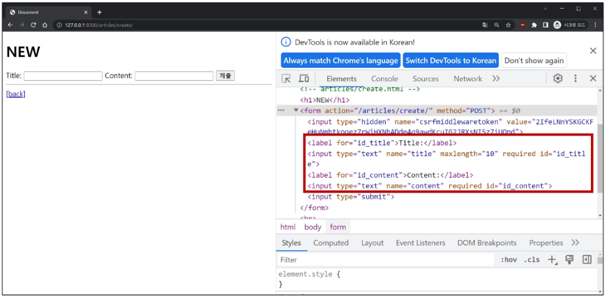

### 목차

> [1. Django Form](#1-django-form)
> 
> [2. Django ModelForm](#2-django-modelform)
> 
> [3. HTTP 요청 다루기](#3-http-요청-다루기)
> 
> [4. 참고](#4-참고)

# 1. Django Form

### HTML `form`

- 지금까지 사용자로부터 데이터를 제출받기 위해 활용한 방법

- BUT 비정상적 혹은 악의적인 요청을 필터링 할 수 없음

- 유효한 데이터인지 확인이 필요

### 유효성 검사

- 수집한 데이터가 정확하고 유효한지 확인하는 과정

- 유효성 검사 구현의 어려움
  
  - 유효성 검사를 구현하기 위해서는 입력 값, 형식, 중복, 범위, 보안 등 많은 것을 고려해야 함
  
  - 이런 과정과 기능을 직접 개발하는 것이 아닌 Django가 제공하는 Form을 사용

### Django Form

- 사용자 입력 데이터를 수집하고, 처리 및 유효성 검사를 수행하기 위한 도구

- 유효성 검사를 단순화하고 자동화할 수 있는 기능을 제공

- Form class 정의

- articles/forms.py

```python
from django import forms

class ArticleForm(forms.Form):
    title = forms.CharField(max_length=10)
    content = forms.CharField()
```

- Form class를 적용한 new 로직
  
  - view 함수 new 변경

- articles/views.py

```python
from .forms import ArticleForm

def new(request):
    form = ArticleForm()
    context = {
        'form': form,
    }
    return render(request, 'articles/new.html', context)
```

- new 페이지에서 form 인스턴스 출력

- articles/new.html

```django
<h1>New</h1>
<form action="" method="POST">
  
  {{ form }}
  <input type="submit">
</form>
```



- Form rendering options
  
  - `label`, `input` 쌍을 특정 HTML 태그로 감싸는 옵션

```django
{{ form.as_p }}
```


- 총 4가지 제공 : 보통 p 태그 많이 씀
  
  - [Working with forms | Django documentation | Django](https://docs.djangoproject.com/en/4.2/topics/forms/#form-rendering-options)
  
  - `{{ form.as_div }}`, `{{ form.as_table }}`, `{{ form.as_p }}`, `{{ form.as_ul }}`

- Form class가 대체하는 것

```python
class ArticleForm(forms.Form):
    title = forms.CharField(max_length=10)
    content = forms.CharField()
```

### Widgets

- HTML `'input'` element의 표현을 담당

- Widget 적용
  
  - Widget은 단순히 input 요소의 속성 및 출력되는 부분을 변경하는 것

```python
content = forms.CharField(widget=forms.Textarea)
```

# 2. Django ModelForm

- **Form** : 사용자 입력 데이터를 DB에 저장하지 않을 때
  
  - ex. 검색, 로그인

- **ModelForm** : 사용자 입력 데이터를 DB에 저장해야 할 때
  
  - ex. 게시글 작성, 회원가입

### ModelForm

- Model과 연결된 Form을 자동으로 생성해주는 기능을 제공

- `Form` + `Model`

- ModelForm class 정의 : 기존 `ArticleForm` 클래스 수정

- articles/forms.py

```python
from django import forms
from .models import Article

class ArticleForm(forms.ModelForm):
    class Meta:
        model = Article
        fields = '__all__'
```


### Meta class

- `ModelForm`의 정보를 작성하는 곳

- `'fields'` 및 `'exclude'` 속성 :
  
  - `exclude` 속성을 사용하여 모델에서 포함하지 않을 필드를 지정할 수도 있음

- articles/forms.py

```python
class ArticleForm(forms.ModelForm):
    class Meta:
        model = Article
        fields = ('title',)

```

```python
class ArticleForm(forms.ModelForm):
    class Meta:
        model = Article
        exclude = ('title',)
```

- Meta class 주의사항
  
  - Django에서 `ModelForm`에 대한 추가 정보나 속성을 작성하는 클래스 구조를 `Meta`클래스로 작성 했을 뿐이며, 파이썬의 inner class와 같은 문법적인 관점으로 접근하지 말 것

### ModelForm 적용

- ModelForm을 적용한 create 로직

- articles/views.py

```python
from .forms import ArticleForm

def create(request):
    form = ArticleForm(request.POST)
    if form.is_valid():
        article = form.save()
        return redirect('articles:detail', article.pk)
    context = {
        'form': form,
    }
    return render(request, 'articles/new.html', context)
```

- 제목 `input`에 공백을 입력 후 제출 시 에러 메시지 출력 확인

- 유효성 검사의 결과


### `is_valid()`

- 여러 유효성 검사를 실행하고, 데이터가 유효한지 여부를 `Boolean`으로 반환

- 유효성 검사를 실패하면 이유를 함께 넘겨줌

- 공백 데이터가 유효하지 않은 이유와 에러메시지가 출력되는 과정
  
  - 별도로 명시하지 않았지만 모델 필드에는 기본적으로 빈 값은 허용하지 않는 제약조건이 설정되어있음
  
  - 빈 값은 `is_valid()`에 의해 `False`로 평가되고 `form` 객체에는 그에 맞는 에러 메시지가 포함되어 다음 코드로 진행됨


- ModelForm을 적용한 edit 로직

- articles/views.py

```python
def edit(request, pk):
    article = Article.objects.get(pk=pk)
    form = ArticleForm(instance=article)
    context = {
        'article': article,
        'form': form,
    }
    return render(request, 'articles/edit.html', context)
```

- articles/edit.html

```django
<h1>Edit</h1>
<form action="" method="POST">
  
  {{ form.as_p }}
  <input type="submit" value="수정">
</form>
```

- ModelForm을 적용한 update 로직

- articles/views.py

```python
def update(request, pk):
    article = Article.objects.get(pk=pk)
    # 1. 모델폼 인스턴스 생성 (+사용자 입력 데이터 & 기존 데이터)
    form = ArticleForm(request.POST, instance=article)
    # 2. 유효성 검사
    if form.is_valid():
        form.save()
        return redirect('articles:detail', article.pk)
    context = {
        'article': article,
        'form': form,
    }
    return render(request, 'articles/edit.html', context)
```

### `save()`

- 데이터베이스 객체를 만들고 저장하는 `ModelForm`의 인스턴스 메서드

- `save()` 메서드가 생성과 수정을 구분하는 법
  
  - 키워드 인자 `instance` 여부를 통해 생성할 지, 수정할 지를 결정

```python
# CREATE

form = ArticleForm(request.POST)
form.save()

# UPDATE

form = ArticleForm(request.POST, instance=article)
form.save()
```

### Django Form 정리

- "사용자로부터 데이터를 수집하고 처리하기 위한 강력하고 유연한 도구"

- HTML `form`의 생성, 데이터 유효성 검사 및 처리를 쉽게 할 수 있도록 도움

- form 쓰고 안 쓰고 어느 한 쪽이 좋고 나쁨은 X

# 3. HTTP 요청 다루기

- View 함수 구조 변화

### new & create view 함수간 공통점과 차이점

- 공통점 : "데이터 생성을 구현하기 위함"

- 차이점 : "new(페이지 조회)는 `GET` method 요청만을, create(생성)는 `POST` method 요청만을 처리"

- => HTTP request method 차이점을 활용해 동일한 목적을 가지는 2개의 view 함수를 하나로 구조화

### new & create 함수 결합

```python
def new(request):
    form = ArticleForm()
    context = {
        'form': form,
    }
    return render(request, 'articles/new.html', context)
```

+

```python
def create(request):
    form = ArticleForm(request.POST)
    if form.is_valid():
        article = form.save()
        return redirect('articles:detail', article.pk)
    context = {
        'form': form,
    }
    return render(request, 'articles/new.html', context)
```

⇓

```python
def create(request):
    # 요청 메서드가 POST일 때
    if request.method == 'POST':
        form = ArticleForm(request.POST)
        if form.is_valid():
            article = form.save()
            return redirect('articles:detail', article.pk)
    # 요청 메서드가 POST가 아닐 때(GET, PUT, DELETE 등 다른 메서드)
    else:
        form = ArticleForm()
    context = {
        'form': form,
    }
    return render(request, 'articles/new.html', context)
```

- 합칠 때 **들여쓰기** 매우 중요!!!

- 요청 메서드는 GET, PUT, DELETE 등 다른 메서드들이 있기 때문에 POST가 아닐 때로 만듦

- 새로운 create view 함수
  
  - new와 create view 함수의 공통점과 차이점을 기반으로 하나의 함수로 결합
  
  - 두 함수의 유일한 차이점이었던 request method에 따른 분기
  
  - `POST` 일 때는 과거 create 함수 구조였던 객체 생성 및 저장 로직 처리
  
  - `POST`가 아닐 때는 과거 new 함수에서 진행했던 `form` 인스턴스 생성
  
  - `context`에 담기는 `form`은 
    
    1. `is_valid()`를 통과하지 못한 에러메시지를 담은 `form`이거나
    
    2. `else`문을 통과한 `form`인스턴스

- 기존 new 관련 코드 수정 (new 냅두고 create 지워도 됨)
  
  - 사용하지 않게 된 new url 제거
  
  - articles/urls.py
  
  ```python
  urlpatterns = [
      ...,
      # path('new/', views.new, name='new'),
      ...,
  ]
  ```
  
  - new 관련 키워드를 create로 변경
  
  - articles/index.html
  
  ```django
  <h1>Articles</h1>
  <a href="">CREATE</a>
  ```
  
  - articles/create.html
  
  ```django
  <h1>Create</h1>
  <form action="" method="POST">
  ```
  
  - render에서 new 템플릿을 create 템플릿을 변경
  
  - articles/view.py
  
  ```python
  return render(request, 'articles/create.html', context)
  ```

- request method에 따른 요청의 변화
  
  - GET : articles/create/ : 게시글 생성 페이지를 줘!
  
  - POST: articles/create/ : 게시글을 생성해줘!

### edit & update 함수 결합

- 새로운 update view 함수
  
  - update : POST : 수정해줘!
  
  - edit : GET : 수정 페이지 줘!

- 기존 edit과 update view 함수 결합

- articles/views.py

```python
def update(request, pk):
    article = Article.objects.get(pk=pk)
    if request.method == 'POST':
        form = ArticleForm(request.POST, instance=article)
        if form.is_valid():
            form.save()
            return redirect('articles:detail', article.pk)
    else:
        form = ArticleForm(instance=article)
    context = {
        'article': article,
        'form': form,
    }
    return render(request, 'articles/update.html', context)
```

- 사용하지 않는 edit url 제거

- articles/urls.py

```python
  urlpatterns = [
      ...,
      # path('<int:pk>/edit/', views.edit, name='edit'),
      ...,
  ]
```

- edit 관련 키워드를 update로 변경

- articles/detail.html

```django
<a href="">수정</a><br>
```

- articles/update.html

```django
<form action="" method="POST">
```

# 4. 참고

### Model Form의 키워드 인자 구성

- ModelForm 키워드 인자 data와 instance 살펴보기
  
  - `data`는 첫 번째에 위치한 키워드 인자이기 때문에 생략 가능
  
  - `instance`는 9번째에 위치한 키워드 인자이기 때문에 생략할 수 없었음

- ModelForm의 상위 클래스인 BaseModelForm의 생성자 함수 모습

```python
class BaseModelForm(BaseForm):
    def __init__(self, data=None, files=None, auto_id='id_%s', prefix=None,
                initial=None, error_class=ErrorList, label_suffix=None,
                empty_permitted=False, instance=None, use_required_attribute=None,
                renderer=None):
```

- articles/views.py

```python
form = ArticleForm(request.POST, instance=article)
```

### Widgets 응용

- form이 `{{ form.as_p }}` 한 줄이어서 widget에서 속성값을 주고 모델을 수정해 주어야 한다.

- articles/forms.py

```python
class ArticleForm(forms.ModelForm):
    title = forms.CharField(
        label='제목',
        widget=forms.TextInput(
            attrs={
                'class': 'my-title',
                'placeholder': 'Enter the title',
                'maxlength': 10,
            }
        )
    )
    content = forms.CharField(
        label='내용',
        widget=forms.Textarea(
            attrs={
                'class': 'my-content',
                'placeholder': 'Enter the content',
                'rows': 5,
                'cols': 50,
            }
        ),
        error_messages={'required': '내용을 입력해주세요.'},
    )
    
    class Meta:
        model = Article
        fields = '__all__'
```


### 필드를 수동으로 렌더링 하기

- [Working with forms | Django documentation | Django](https://docs.djangoproject.com/en/4.2/topics/forms/#rendering_fields-manually)

- widget 안 쓰고 html 쓰는 법


