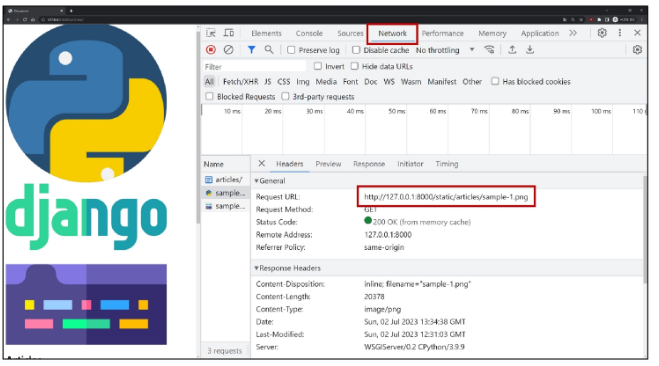

### 목차

> [1. Static files](#1-static-files)
> 
> [2. Media files](#2-media-files)
> 
> [3. 참고](#3-참고)

# 1. Static files

- 정적 파일 : 서버 측에서 변경되지 않고 고정적으로 제공되는 파일
  
  - ex. 이미지, JS, CSS 파일 등

### 웹 서버와 정적 파일

- 웹 서버의 기본동작은 **특정 위치(URL)에 있는 자원**을 요청(HTTP request) 받아서 응답(HTTP response)을 처리하고 제공하는 것

- 이는 "자원에 접근 가능한 주소가 있다."라는 의미

- 웹 서버는 요청 받은 URL로 서버에 존재하는 정적 자원을 제공함

- **정적 파일을 제공하기 위한 경로(URL)** 가 있어야 함


- Static files 경로
1. 기본 경로

2. 추가 경로

### Static files 기본 경로

- `app폴더/static/`

- 기본 경로 static file 제공하기
  
  - `articles/static/articles/` 경로에 이미지 파일 배치
  
  - static files 경로는 DTL의 `static tag`를 사용해야 함
  
  - built-in tag가 아니기 때문에 `load tag`를 사용해 import 후 사용 가능
  
  - articles/index.html
  
  ```django
  
  
  
  ```
  
  - **STATIC_URL** 확인 : http://127.0.0.1:8000/static/articles/sample-1.png

- base file에서 태그 써도 자식 파일에서 적용X -> 필요할 때마다 써야 함

### STATIC_URL

- 기본 경로 및 추가 경로에 위치한 정적 파일을 참조하기 위한 URL

- 실제 파일이나 디렉토리 경로가 아니며, URL로만 존재

- settings.py

```python
STATIC_URL = 'static/'
```

- URL + **STATIC_URL** + 정적파일 경로

> ☞http://127.0.0.1:8000/**static**/articles/sample-1.png

### Static files 추가 경로

- STATICFILES_DIRS에 문자열 값으로 추가 경로 설정

- **STATICFILES_DIRS** : 정적 파일의 기본 경로 외에 추가적인 경로 목록을 정의하는 리스트

- settings.py : 임의로 추가 경로 설정

```python
STATICFILES_DIRS = [
    BASE_DIR / 'static',
]
```

- 추가 경로에 이미지 파일 배치 후 `static tag`를 사용해 이미지 파일에 대한 경로 제공

- articles/index.html

```django

```

- 이미지를 제공받기 위해 요청하는 Request URL 확인



### => 정적 파일을 제공하려면 요청에 응답하기 위한 URL이 필요

# 2. Media Files

- 사용자가 웹에서 업로드하는 정적 파일 (user-uploaded)

### 이미지 업로드 : `ImageField()`

- 이미지 업로드에 사용하는 모델 필드

- 이미지 객체가 직접 DB에 저장되는 것이 아닌 **'이미지 파일의 경로'** 문자열이 저장됨

### 미디어 파일을 제공하기 전 준비사항

- 공식 문서 보면서 진행

    - jango static files 검색

1. `settings.py`에 **MEDIA_ROOT, MEDIA_URL** 설정

2. 작성한 **MEDIA_ROOT**D와 **MEDIA_URL**에 대한 URL 지정

### MEDIA_ROOT

- 미디어 파일들이 위치하는 디렉토리의 절대 경로

- settings.py

```python
MEDIA_ROOT = BASE_DIR / 'media'
```

### MEDIA_URL

- **MEDIA_ROOT**에서 제공되는 미디어 파일에 대한 주소를 생성

- **STATIC URL**과 동일한 역할

### MEDAI_ROOT와 MEDIA_URL에 대한 URL 지정

- 업로드 된 파일의 URL == `settings.MEDIA_URL`

- **MEDIA_URL**을 통해 참조하는 파일의 실제 위치 == `settings.MEDIA_ROOT`

- crud/urls.py

```python
from django.contrib import admin
from django.urls import path, include
from django.conf import settings
from django.conf.urls.static import static

urlpatterns = [
    path('admin/', admin.site.urls),
    path('articles/', include('articles.urls')),
] + static(settings.MEDIA_URL, document_root=settings.MEDIA_ROOT)
```

### 이미지 업로드

- `blank=Ture` 속성을 작성해 빈 문자열이 저장될 수 있도록 제약 조건 설정

- 게시글 작성 시 이미지 업로드 없이도 작성 할 수 있도록 하기 위함

- articles/models.py

```python
class Artilce(models.Model):
    ...
    image = models.ImageField(blank=True)
    ...
```

- 기존 필드 사이에 작성해도 실제 테이블 생성 시에는 가장 우측(뒤)에 추가됨

- migration 진행

- **ImageField를 사용하려면 반드시 Pillow 라이브러리가 필요**

```bash
$ pip install pillow
$ python manage.py makemigrations
$ python manage.py migrate
$ pip freeze > requirements.txt
```

- `form`요소의 `enctype` 속성 추가

- **enctype은 데이터 전송방식을 결정하는 속성**

- articles/create.html

```django
<h1>CREATE</h1>
<form action="" method="POST" enctype="multipart/form-data">
  
  {{ form.as_p }}
  <input type="submit">
</form>
```

- `ModelForm`의 2번째 인자로 요청 받은 파일 데이터 작성
  
  - `ModelForm`의 상위 클래스 `BaseModelForm`의 생성자 함수의 2번째 위치 인자로 파일을 받도록 설정되어 있음

- articles/view.py

```python
def create(request):
    if request.method == 'POST':
        form = ArticleForm(request.POST, request.FILES)
...
```

- 이미지 업로드 input 확인

```html
<input type="file" name="image" accept="image/*" id="id_image">
```

- 이미지 업로드 결과 확인
  
  - **DB에는 파일 자체가 아닌 "파일 경로"가 저장**

### 업로드 이미지 제공하기

- `url` 속성을 통해 업로드 파일의 경로 값을 얻을 수 있음

- `article.image.url` : 업로드 파일의 경로

- `article.image` : 업로드 파일의 파일 이름

- 업로드 이미지 출력 확인 및 **MEDIA_URL** 확인


- 이미지를 업로드하지 않은 게시물은 detail 템플릿을 렌더링 할 수 없음

- 이미지 데이터가 있는 경우만 이미지를 출력할 수 있도록 처리하기

- articles/detail.html

```django

  

```

### 업로드 이미지 수정

- 수정 페이지 `form`요소에 `enctype` 속성 추가

- articles/update.html

```django
<h1>Update</h1>
<form action="" method="POST" enctype="multipart/form-data">
  
  {{ form.as_p }}
  <input type="submit" value="수정">
</form>
```

- update view 함수에서 업로드 파일에 대한 추가 코드 작성
  
  - `form = ArticleForm(request.POST, request.FILES, instance=article)`

- articles/view.py

```python
def update(request, pk):
    article = Article.objects.get(pk=pk)
    if request.method == 'POST':
        form = ArticleForm(request.POST, request.FILES, instance=article)
        if form.is_valid():
            form.save()
            return redirect('articles:detail', article.pk)
    else:
        form = ArticleForm(instance=article)
    context = {
        'article': article,
        'form': form,
    }
    return render(request, 'articles/update.html', context)
```

# 3. 참고

### 미디어 파일 추가 경로

- `ImageField()`의 `upload_to` 속성을 사용해 다양한 추가 경로 설정

```python
# 1. 기본 경로 설정
image = models.ImageField(blank=True, upload_to='images/')

# 2. 업로드 날짜로 경로 설정
image = models.ImageField(blank=True, upload_to='%Y/%m/%d/')

# 3. 함수 형식으로 경로 설정
def article_image_path(instance, filename):
    return f'images/{instance.user.username}/{filename}'

image = models.ImageField(blank=True, upload_to=articles_image_path)
```

### BaseModelForm

- `request.FILES`가 두 번째 위치 인자인 이유

- `ModelForm`의 상위 클래스 `BaseModelForm`의 생성자 함수 키워드 인자 참고

```python
class BaseModelForm(BaseForm):
    def __init__(self, data=None, files=None, auto_id='id_%s', prefix=None,
                initial=None, error_class=ErrorList, label_suffix=None,
                empty_permitted=False, instance=None, use_required_attribute=None,
                renderer=None):
```


