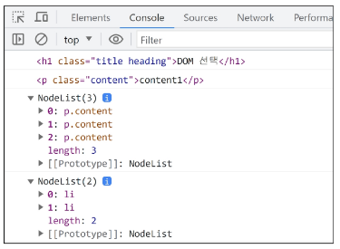

### 목차

> [1. History of JavaScript](#1-history-of-javascript)
> 
> [2. 변수](#2-변수)
> 
> [3. DOM](#3-dom)
> 
> [4. DOM 선택](#4-dom-선택)
> 
> [5. DOM 조작](#5-dom-조작)
> 
> [6. 참고](#6-참고)

# 1. History of JavaScript

### 웹의 탄생(1990)

- Tim Berners-Lee 경이 WWW, 하이퍼텍스트 시스템을 고안하여 개발

- URL, HTTP 최초 설계 및 구현

- 초기의 웹은 정적인 텍스트 페이지만을 지원

### 웹 브라우저의 대중화(1993)

- Netscape사의 최초 상용 웹 브라우저인 Netscape Navigator 출시

- 당시 약 90% 이상의 시장 점유율을 가짐

- Netscape사는 웹의 동적인 기능을 만들기 위한 프로젝트를 시작

### JavaScript의 탄생(1995)

- 당시 Netscape 소속 개발자 **Brendan Eich**는 웹의 동적 기능 개발이라는 회사의 요구사항을 넘어 스크립트 언어 `Mocha`를 개발

- 이후 `LiveScript`로 이름을 변경했으나 당시 가장 인기있던 프로그래밍 언어인` Java`의 명성에 기대보고자 `JavaScript`로 이름을 변경

- `JavaScript`는 Netscape Nevigator 2.0에 탑재되어 웹 페이지에 동적 기능을 추가하는 데 사용됨

### JavaScript 파편화(1996)

- 그런데 Microsoft가 자체 웹 브라우저인 인터넷 익스플로러(IE) 3.0에 `JavaScript`와 유사한 언어인 `JScript`를 도입

- 이 과정에서 많은 회사들이 독자적으로 `JavaScript`를 변경하고 이를 자체 브라우저에 탑재

- => `JavaScript` 파편화의 시작

### 1차 브라우저 전쟁(1995-2001)

- **Netscape** vs **Microsoft**

- Microsoft는 IE를 자사 윈도우 운영체제에 내장하여 무료로 배포

- 빌 게이츠를 필두로 한 Microsoft의 공격적인 마케팅, 자금력 그리고 압도적인 윈도우 운영체제 점유율 앞에 Netscape는 빠르게 몰락하기 시작

- 결국 IE 시장 점유율은 2002년 약 96%에 달하며 Microsoft가 승리

- 추후 Brandon Eich와 함께 Netscape에서 나온 핵심 개발진은 모질라 재단을 설립하여 `Firefox` 브라우저를 출시(2003)

### 1차 브라우저 전쟁의 영향

- 웹 표준의 부재로 인해 각 기업에서 자체 표준을 확립하려는 상황 발생

- 이는 웹 개발자들에게 큰 혼란을 주었으며, 결국 웹 표준의 중요성을 인식하는 계기가 됨

### ECMAScript 출시 (1997)

- `JavaScript`의 파편화를 막기 위해 Netscape사는 ECMA 재단에 웹 표준 제작을 요청

- ECMA에서 `ECMAScript`라는 표준 언어를 정의하여 발표(1997)

- 이때부터 `JavaScript`는 `ECMAScript` 표준에 기반을 두고 발전하기 시작

- ECMA : 정보와 통신 시스템을 위한 국제적 표준화 기구

### 2차 브라우저 전쟁(2004-2017)

- `IE` vs `Firefox` vs `?`

- 웹 표준이 정의되었지만 당시 가장 높은 점유율을 가진 IE는 웹 표준을 지키지 않았고 독자적인 규격을 유지하며 웹 시장을 주도

- IE의 독주에 대한 Firefox의 대항 : 2008년까지 30% 점유율 차지

### Chrome 브라우저의 등장(2008)

- `IE`vs`Firefox`vs`Chrome`

- Google의 Chrome 브라우저 출시

- Chrome은 출시 3년 만에 Firefox의 점유율을 넘어서고 그로부터 반년 뒤 IE의 점유율을 넘어섬

### Chrome이 우위를 점하게 된 이유

- 빠른 성능, 다양한 플랫폼 지원, 보안, Google 생태계 통합 등 다양한 이유가 있지만 가장 중요했던 역할은 바로 "적극적인 웹 표준 준수"

- 호환성
  
  - 웹 표준을 준수함으로써, 사용자들은 브라우저 간에 일관된 웹 페이지를 볼 수 있게 됨
  - 이는 다양한 플랫폼 및 기기에서 웹 사이트가 일관되게 동작할 수 있음을 의미

- 개발자 도구
  
  - 웹 개발자를 위한 강력한 도구를 제공하여 웹 애플리케이션을 개발하는 데 도움

### 2차 브라우저 전쟁의 영향

- Chrome이 웹 표준을 준수하고 새로운 웹 기술을 적극적으로 채택함으로써, 다른 브라우저 제조사들도 웹 표준 준수에 대한 중요성을 인식하고 이에 따라 웹 표준을 채택하는 데 더 많은 노력을 기울이게 됨

- 웹의 기능이 크게 확장되며 웹 애플리케이션의 비약적인 발전을 이끌어 감

- => 웹의 기술적 발전과 웹 표준의 중요성

### ECMAScript

- Ecma International이 정의하고 있는 표준화된 스크립트 프로그래밍 언어 명세

- 스크립트 언어가 준수해야 하는 규칙, 세부사항 등을 제공

### ECMAScript와 JavaScript

- JavaScript는 ECMAScript 표준을 구현한 구체적인 프로그래밍 언어

- ECMAScript의 명세를 기반으로 하여 웹 브라우저나 Node.js와 같은 환경에서 실행됨

- => **ECMAScript는 JavaScript의 표준이며, JavaScript는 ECMAScript 표준을 따르는 구체적인 프로그래밍 언어**

- => **ECMAScript는 언어의 핵심을 정의하고, JavaScript는 ECMAScript 표준을 따라 구현된 언어로 사용됨**

### ECMAScript의 역사

- ECMAScript 5(ES5)에서 안정성과 생산성을 크게 높임(2009)
  
  - 오랫동안 발표를 안 하며 준비(1999-2009)

- ECMAScript 2015(ES6)에서 객체지향 프로그래밍 언어로써 많은 발전을 이루어, 역사상 가장 중요한 버전으로 평가됨(2015)

- JavaScript 책을 보면 "**ES6+ 대응**"과 같은 문구가 있음

### JavaScript의 현재

- 현재는 Chrome, Firefox, Safari, Microsoft Edge 등 다양한 웹 브라우저가 경쟁하고 있으며, 모바일 등 시장이 다양화 되어있음

- 기존에 JavaScript는 브라우저에서만 웹 페이지의 동적인 기능을 구현하는 데 사용되었음
  
  - 예를 들어, 사용자의 입력에 따라 웹 페이지의 내용이 동적으로 변경되거나, 애니메이션 효과가 적용되는 등의 기능

- 이후 Node.js(2009 출시)로 인해 브라우저 외부에서도 실행 가능해져 서버 사이드 개발에도 사용되기 시작함

- 다양한 프레임워크와 라이브러리들이 개발되면서, 웹 개발 분야에서는 필수적인 언어로 자리 잡게 됨

# 2. 변수

### JavaScript 문법 학습

- ECMAScript 2015 (ES6) 이후의 명제를 따름

- 권장 스타일 가이드 : [JavaScript Standard Style](https://standardjs.com/rules-kokr.html)

### 식별자(변수명) 작성 규칙

- 반드시 문자, 달러(`'$'`) 또는 밑줄(`'_'`)로 시작
  
  - 숫자로 시작 불가

- 대소문자를 구분

- 예약어 사용 불가
  
  - `for`, `if`, `function` 등 이미 있는 문자들

### 식별자(변수명) Naming case

- 카멜 케이스(`camelCase`)
  
  - 변수, 객체, 함수에 사용
  
  - 파이썬과의 다른점!! (파이썬은 스네이크, JavaScript는 카멜)

- 파스칼 케이스(`PascalCase`)
  
  - 클래스, 생성자에 사용

- 대문자 스네이크 케이스(`SNAKE_CASE`)
  
  - 상수(constants)에 사용

### 변수 선언 키워드 3가지

- `let`, `const`, ~~var~~
1. `let`
- 블록 스코프(block scope)를 갖는 지역 변수를 선언

- 재할당 가능

- 재선언 불가능

- ES6에서 추가

```javascript
let number = 10   // 1. 선언 및 초기값 할당
number = 20   // 2. 재할당
```

```javascript
let number = 10   // 1. 선언 및 초기값 할당
let number = 20   // 2. 재선언 불가능
```

2. `const`

블록 스코프를 갖는 지역 변수를 선언

재할당 불가능

재선언 불가능

ES6에서 추가

```javascript
const number = 10   // 1. 선언 및 초기값 할당
number = 10   // 2. 재할당 불가능
```

```javascript
const number = 10   // 1. 선언 및 초기값 할당
const number = 10   // 2. 재선언 불가능
```

```javascript
const number  // const' declarations must be initialized. : 선언 시 반드시 초기값 설정 필요
```

### 블록 스코프(block scope)

- `if`, `for`, 함수 등의 **'중괄호({}) 내부'** 를 가리킴

- 블록 스코프를 가지는 변수는 블록 바깥에서 접근 불가능

```javascript
let x = 1

if (x == 1) {
  let x = 2
  console.log(x)  // 2
}
console.log(x)  // 1
```

### 어떤 변수 선언 키워드를 사용해야 할까?

- `const`를 기본으로 사용

- 필요한 경우에만 `let`으로 전환
  
  - **재할당**이 필요한 경우
  
  - let을 사용하는 것은 해당 변수가 의도적으로 변경될 수 있음을 명확히 나타냄
  
  - 코드의 유연성을 확보하면서도 const의 장점을 최대한 활용할 수 있음

### const를 기본으로 사용해야 하는 이유

- 코드의 의도 명확화
  
  - 해당 변수가 재할당되지 않을 것임을 명확히 표현 (변수가 계속 바뀌고 재할당되는 것은 좋지 않은 코드)
  
  - 개발자들에게 변수의 용도와 동작을 더 쉽게 이해할 수 있게 해줌

- 버그 예방
  
  - 의도치 않은 변수나 값 변경으로 인한 버그를 예방
  
  - 큰 규모의 프로젝트나 팀 작업에서 중요

# 3. DOM

### 웹 브라우저에서의 JavaScript

- 웹 페이지의 동적인 기능을 구현

### JavaScript 실행 환경 종류

1. HTML `script` 태그

```html
<body>
  <script>
    console.log('hello')
  </script>
</body>
```

2. `js` 확장자 파일 (JS hello.js)

```js
console.log('Hello')
```

```html
<body>
  <script src="hello.js"></script>
</body>
```

3. 브라우저 Console

```
> console.log('hello')
  hello
```

### Document structure

- HTML 문서는 상자들이 중첩된 형태로 볼 수 있음


- 브라우저가 문서를 표현하기 위해 사용하는 데이터 구조는 우측 이미지와 같은 모양을 가짐

- 각 상자는 객체이며 개발자는 이 객체와 상호작용하여 어떤 HTML 태그를 나타내는지, 어떤 콘텐츠가 포함되어 있는지 등을 알아낼 수 있음

- 이 표현을 Document Object Model, 또는 줄여 DOM이라고 부름

### DOM

- The Document Object Model

- 웹 페이지(Document)를 구조화된 객체로 제공하여 프로그래밍 언어가 페이지 구조에 접근할 수 있는 방법을 제공

- => 문서 구조, 스타일, 내용 등을 변경할 수 있도록 함

### DOM API

- 다른 프로그래밍 언어가 웹 페이지에 접근 및 조작할 수 있도록 페이지 요소들을 객체 형태로 제공하여 이에 따른 메서드 또한 제공

### DOM 특징

- DOM에서 모든 요소, 속성, 텍스트는 하나의 객체

- 모두 `document` 객체의 하위 객체로 구성됨


### DOM tree

- 브라우저는 HTML 문서를 해석하여 DOM tree라는 객체 트리로 구조화

- => 객체 간 상속 구조가 존재


### 브라우저가 웹 페이지를 불러오는 과정

- 웹 페이지는 웹 브라우저를 통해 해석되어 웹 브라우저 화면에 나타남

### DOM 핵심

- 문서의 요소들을 객체로 제공하여 다른 프로그래밍 언어에서 접근하고 조작할 수 있는 방법을 제공하는 API

### `documnet` 객체

- 웹 페이지 객체

- DOM Tree의 진입점

- 페이지를 구성하는 모든 객체 요소를 포함

- 예시 : HTML의 `<title>` 변경하기


# 4. DOM 선택

### DOM 조작 시 기억해야 할 것

- 웹 페이지를 동적으로 만들기 == 웹 페이지를 조작하기

- 조작 순서
1. 조작하고자 하는 요소를 **선택** (또는 탐색)

2. 선택된 요소의 콘텐츠 또는 속성을 **조작**

### 선택 메서드

- `document.querySelector()` : 요소 한 개 선택

- `document.querySelectorAll()` : 요소 여러 개 선택

### document.querySelector(selector)

- 제공한 선택자와 일치하는 element 한 개 선택

- => 제공한 선택자를 만족하는 첫 번째 element 객체를 반환 (없다면 `null` 반환)

### document.querySelectorAll(selector)

- 제공한 선택자와 일치하는 여러 element를 선택

- 제공한 선택자를 만족하는 NodeList(파이썬 배열/리스트같은 거)를 반환

### DOM 선택 실습

- select.html

```html
<body>
  <h1 class="heading">DOM 선택</h1>
  <a href="https://www.google.com/">google</a>
  <p class="content">content1</p>
  <p class="content">content2</p>
  <p class="content">content3</p>
  <ul>
    <li>list1</li>
    <li>list2</li>
  </ul>

  <script>
    console.log(document.querySelector('.heading'))
    console.log(document.querySelector('.content'))
    console.log(document.querySelectorAll('.content'))
    console.log(document.querySelectorAll('ul > li'))
  </script>
</body>
```



# 5. DOM 조작

1. 속성(attribute) 조작
   
   - 클래스 속성 조작
   
   - 일반 속성 조작

2. HTML 콘텐츠 조작

3. DOM 요소 조작

4. 스타일 조작

### 속성 조작

1. 클래스 속성 조작
- `'classList'` property : 요소의 클래스 목록을 DOMTokenList(유사 배열) 형태로 반환

- `classList` 메서드
  
  - `element.classList.add()` : 지정한 클래스 값을 추가
  
  - `element.classList.remove()` : 지정한 클래스 값을 제거
  
  - `element.classList.toggle()` : 클래스가 존재한다면 제거하고 `false`를 반환 (존재하지 않으면 클래스를 추가하고 `true`를 반환)

- 클래스 속성 조작 실습 : `add()`와 `remove()` 메서드를 사용해 지정한 클래스 값을 추가 혹은 제거


- element-manipulation.html

```html
<script>
    // 속성 요소 조작

    // 1. 클래스 속성 조작
    // h1 요소를 선택
    const h1Tag = document.querySelector('.heading')
    // h1 요소의 클래스 목록 확인
    console.log(h1Tag.classList)

    // h1 요소의 클래스 목록에 red 클래스 추가
    h1Tag.classList.add('red')
    console.log(h1Tag)
    console.log(h1Tag.classList)

    // h1Tag.classList.remove('red')
    // console.log(h1Tag.classList)

    h1Tag.classList.toggle('red')
    console.log(h1Tag.classList)
  </script>
```

2. 일반 속성 조작
- 일반 속성 조작 메서드
  
  - `Element.getAttribute()` : 해당 요소에 지정된 값을 반환(조회)
  
  - `Element.setAttribute(name, value)` : 지정된 요소의 속성 값을 설정 -> 속성이 이미 있으면 기존 값을 갱신 (그렇지 않으면 지정된 이름과 값으로 새 속성이 추가)
  
  - `Element.removeAttribute()` : 요소에서 지정된 이름을 가진 속성 제거

- 일반 속성 조작 실습


- element-manipulation.html

```html
<script>
    // 2. 일반 속성 조작
    // a 요소 선택
    const aTag = document.querySelector('a')
    console.log(aTag.getAttribute('href'))

    // a 요소의 href 속성 값을 naver로 변경
    aTag.setAttribute('href', 'https://www.naver.com/')
    console.log(aTag.getAttribute('href'))

    // a 요소의 href 속성 값 삭제
    aTag.removeAttribute('href')
    console.log(aTag.getAttribute('href'))
</script>
```

### HTML 콘텐츠 조작

- `'textContent'` property : 요소의 텍스트 콘텐츠를 표현
  
  - `<p> lorem </p>` 에서 lorem이 선택(추출)됨

- HTML 콘텐츠 조작 실습


- contents-manipulation.html

```html
<h1 class="heading">DOM 조작</h1>
<a href="https://www.google.com/">google</a>
<p class="content">content1</p>
<p class="content">content2</p>
<p class="content">content3</p>
<ul>
  <li>list1</li>
  <li>list2</li>
</ul>

<script>
  // HTML 콘텐츠 조작
  // h1 요소 선택
  const h1Tag = document.querySelector('.heading')
  console.log(h1Tag.textContent)

  // h1 요소의 콘텐츠 값을 변경
  h1Tag.textContent = '내용 수정'
  console.log(h1Tag.textContent)
</script>
```

### DOM 요소 조작

- DOM 요소 조작 메서드
  
  - `document.createElement(tagName)` : 작성한 tagName의 HTML 요소를 생성하여 반환
  
  - `Node.appendChild()` : 한 Node를 특정 부모 Node의 자식 NodeList 중 마지막 자식으로 삽입, 추가된 Node 객체를 반환
  
  - `Node.removeChild()` : DOM에서 자식 Node를 제거, 제거된 Node를 반환

- DOM 요소 조작 실습


- dom-manipulation.html

```html
<div>
  <p>DOM 요소 조작</p>
</div>

<script>
  // 생성
  const h1Tag = document.createElement('h1')
  // console.log(h1Tag)
  h1Tag.textContent = '제목'
  console.log(h1Tag)

  // 추가
  const divTag = document.querySelector('div')
  divTag.appendChild(h1Tag)
  console.log(divTag)

  // 삭제
  const pTag = document.querySelector('p')
  divTag.removeChild(pTag)

</script>
```

### style 조작

- `'style'` property : 해당 요소의 모든 style 속성 목록을 포함하는 속성

- style 조작 실습


- style-property.html

```html
<p>Lorem, ipsum dolor.</p>

<script>
  const pTag = document.querySelector('p')

  console.log(pTag.style)
  pTag.style.color = 'crimson'
  pTag.style.fontSize = '2rem'
  pTag.style.border = '1px solid black'
  console.log(pTag.style)

</script>
```

- JavaScript에서 이렇게 직접 컨트롤 할 수 있지만 메인 역할은 아님!!

# 6. 참고

### DOM 속성 확인 Tip

- 개발자도구 - Elements - Properities

- 선택한 해당 요소의 모든 DOM 속성 확인 가능


### 용어 정리

- **Node** :
  
  - DOM의 기본 구성 단위
  
  - DOM 트리의 각 부분은 Node라는 객체로 표현됨
    
    - Document Node => HTML 문서 전체를 나타내는 노드
    
    - Element Node => HTML 요소를 나타내는 노드 (예를 들어 `<p>`)
    
    - Text Node => HTML 텍스트 (Element Node 내의 텍스트 컨텐츠를 나타냄)
    
    - Attribute Node => HTML 요소의 속성을 나타내는 노드

- **NodeList** :
  
  - DOM 메서드를 사용해 선택한 Node의 목록
  
  - 배열과 유사한 구조를 가짐
  
  - Index로만 각 항목에 접근 가능
  
  - JavaScript의 배열 메서드 사용 가능
  
  - `querySelectAll()`에 의해 반환되는 NodeList는 DOM의 변경사항을 실시간으로 반영하지 않음
    
    - DOM이 나중에 변경되더라도 이전에 이미 선택한 NodeList 값은 변하지 않음

- **Element** : 요소
  
  - Node의 하위 유형. 모든 node는 element
  
  - Element는 DOM 트리에서 HTML 요소를 나타내는 특별한 유형의 Node
  
  - 예를 들어 `<p>`, `<div>`, `<span>`, `<body>` 등의 HTML 태그들이 Element 노드를 생성 -> Node의 기본 메서드를 다 갖고 요소에 맞는 메서드를 추가적으로 더 가짐
  
  - Node의 속성과 메서드를 모두 가지고 있으며 추가적으로 요소 특화된 기능 (예: `className`, `innerHTML`, `id` 등)을 가지고 있음
  
  - => 모든 Element는 Node이지만, 모든 Node가 Element인 것은 아님 

- **Parsing** :
  
  - 구문 분석, 해석
  
  - 브라우저가 문자열을 해석하여 DOM Tree로 만드는 과정
  
  - 아래 그림에 사람 : 브라우저


### 세미콜론(semicolon)

- 자바스크립트는 문장 마지막 세미콜론(`';'`)을 선택적으로 사용 가능

- 세미콜론이 없으면 ASI에 의해 자동으로 세미콜론이 삽입됨
  
  - ASI (Automatic Semicolon Insertion, 자동 세미콜론 삽입 규칙)

- JavaScript를 만든 Brendan Eich 또한 세미콜론 작성을 반대

### 변수 선언 키워드 - `'var'`

- ES6 이전에 변수 선언에 사용했던 키워드

- 재할당 가능

- 재선언 가능

- 함수 스코프(function scope)를 가짐 -> 함수 안이 아니면 모두가 전역변수

- "호이스팅"되는 특성으로 인해 예기치 못한 문제 발생 가능
  
  - 선언하기 전 사용할 수 있음

- 변수 선언 시 `var`, `const`, `let` 키워드 중 하나를 사용하지 않으면 자동으로 `var`로 선언됨
  
  - => 키워드 꼭 써야함! var 쓰면 안돼서.

### 함수 스코프 (function scope)

- 함수의 중괄호 내부를 가리킴

- 함수 스코프를 가지는 변수는 함수 바깥에서 접근 불가능

```javascript
function foo() {
    var x = 1
    console.log(x)    // 1
}

console.log(x)    // ReferenceError : x is not defined
```

```javascript
if foo() {
    var x = 1
    console.log(x)    // 1
}

console.log(x)    // 1
```

### 호이스팅(hoisting)

- 변수 선언이 끌어올려지는 현상
  
  - `var`로 선언한 변수는 선언 위치와 상관없이 함수 시작 지점, 전역에서는 코드가 시작될 때 처리됨 + 선언과 함께 초기화도 진행

- 변수에 무언가를 할당하기 전까진 `undefined`를 가짐

```javascript
console.log(name)    // undefined => 오류가 나지 않음

var name = '홍길동'    // 선언 및 할당
```

```javascript
// 위 코드와 동일하게 동작
var name
console.log(name)    // undefined

var name = '홍길동'
```

- `let`과 `const`로 선언된 변수도 기술적으로는 호이스팅 되지만, 변수가 만들어지는 내부 과정이 다르기 때문에 이 문제를 방지할 수 있음 (TDZ로 인해 초기화 전에 접근할 수 없음)
  
  - 선언만 하고 초기화는 되지 않음
  
  - TDZ : [let - JavaScript | MDN](https://developer.mozilla.org/en-US/docs/Web/JavaScript/Reference/Statements/let#temporal_dead_zone_tdz)

```javascript
console.log(age)    // ReferenceError: Cannot access 'age' before initialization : 초기화 전에 접근 불가
let age = 30

console.log(height)    // ReferenceError: Cannot access 'height' before initialization
const height = 170
```