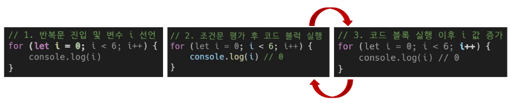

### 목차

> [1. 데이터 타입](#1-데이터-타입)
> 
> [2. 연산자](#2-연산자)
> 
> [3. 조건문](#3-조건문)
> 
> [4. 반복문](#4-반복문)
> 
> [5. 참고](#5-참고)

# 1. 데이터 타입

### 원시 자료형

- Primitive type

- `Number`, `String`, `Boolean`, `null`, `undefined`

- 변수에 값이 직접 저장되는 자료형 (불변, 값이 복사)

- 변수에 할당될 때 값이 복사됨

- => 변수 간에 서로 영향을 미치지 않음

```javascript
const a = 'bar'
console.log(a)    // bar

a.toUpperCase()
console.log(a)    // bar
```

```javascript
let a = 10
let b = a
b = 20
console.log(a)    // 10
console.lob(b)    // 20
```

### 참조 자료형

- Reference type

- `Objects`(자료형으로써의 객체) (`Object`(데이터 타입의 객체, 딕셔너리), `Array`, `Function`)

- 객체의 주소가 저장되는 자료형 (가변, 주소가 복사)

- 객체를 생성하면 객체의 메모리 주소를 변수에 할당

- => 변수 간에 서로 영향을 미침

```javascript
const arr1 = [1, 2, 3]
const arr2 = arr1
arr2.push(4)

console.log(arr1) // [1, 2, 3, 4]
console.log(arr2) // [1, 2, 3, 4]
```

```javascript
const obj1 = {name: 'Alice', age: 30}
const obj2 = obj1
obj2.age = 40

console.log(obj1.age)    // 40
console.log(obj2.age)    // 40
```

### 원시 자료형

- 원시 자료형 종류 : `Number`, `String`, `Boolean`, `null`, `undefined`

### Number

- 정수 또는 실수형 숫자를 표현하는 자료형

```javascript
const a = 13
const b = -5
const c = 3.14
const d = 2.998e8   // 2.998 * 10^8 = 299,800,000
const e = Infinity
const f = -Infinity
const g = NaN   // Not a Number를 나타내는 값, 연산의 결과로 나옴. ex) 숫자 / 문자열
```

### String

- 텍스트 데이터를 표현하는 자료형

- **'+'** 연산자를 사용해 문자열끼리 결합

- 뺄셈, 곱셈, 나눗셈 불가능. +만 가능

```javascript
const firstName = 'Tony'
const lastName = 'Stark'
const fullName = firstName + lastName

console.log(fullName)    // TonyStartk
```

### Template literals (템플릿 리터럴)

- 내장된 표현식을 허용하는 문자열 작성 방식
  
  - 파이썬의 f-string과 유사

- Backtick(````)을 이용하며, 여러 줄에 걸쳐 문자열을 정의할 수도 있고 JavaScript의 변수를 문자열 안에 바로 연결할 수 있음

- 표현식은 **'$'** 와 중괄호(**{expression}**)로 표기

- ES6+ 부터 지원

```javascript
const age = 100
const message = `홍길동은 ${age}세입니다.`
console.log(message)    // 홍길동은 100세입니다.
```

### null과 undefined

### null

- 프로그래머가 의도적으로 '값이 없음'을 나타낼 때 사용

```javascript
let a = null
console.log(a)    // null
```

### undefined

- 시스템이나 JavaScript 엔진이 '값이 할당되지 않음'을 나타낼 때 사용
  
  - ex) var로 변수 할당할 때 초기값

```javascript
let b
console.log(b)    // undefined
```

- `let`만 이렇게 가능. `const`는 불가능

### Boolean

- `true`, `false`
  
  - 파이썬과 달리 소문자

- 조건문 또는 반복문에서 Boolean이 아닌 데이터 타입은 "자동 형변환 규칙"에 따라 `true` 또는 `false`로 변환됨

- 자동 형변환

| 데이터 타입    | `false`     | `true`    |
|:---------:|:-----------:|:---------:|
| undefined | 항상 false    | X         |
| null      | 항상 false    | X         |
| Numbere   | 0, -0, NaN  | 나머지 모든 경우 |
| String    | ' ' (빈 문자열) | 나머지 모든 경우 |

# 2. 연산자

### 할당 연산자

- 오른쪽에 있는 피연산자의 평가 결과를 왼쪽 피연산자에 할당하는 연산자

- 단축 연산자 지원

```javascript
let a = 0

a += 10
console.log(a)    // 10

a -= 3
console.log(a)    // 7

a *= 10
console.log(a)    // 70

a %= 7
console.log(a)    // 0
```

### 증가 & 감소 연산자

- 증가 연산자 (`'++'`)
  
  - 피연산자를 증가(1을 더함)시키고 연산자의 위치에 따라 증가하기 전이나 후의 값을 반환

- 감소 연산자 (`'--'`)
  
  - 피연산자를 감소(1을 뺌)시키고 연산자의 위치에 따라 감소하기 전이나 후의 값을 반환

- => javascript style가이드에서는 `'+='` 또는 `'-='` 와 같이 더 명시적인 표현으로 작성하는 것을 권장

```javascript
// "전위 연산자"
// 피연산자에 1을 더한 값을 반환
// a에 +1을 할당한 후의 값 4를 반환
let a = 3
const b = ++a
console.log(a, b) // 4 4

// "후위 연산자"
// 피연산자에 1을 더하기 전의 값을 반환
// x를 먼저 반환한 후 x에 +1을 할당
let x = 3
const y = x++
console.log(x, y) // 4 3
```

### 비교 연산자

- 피연산자들(숫자, 문자, Boolean 등)을 비교하고 결과 값을 boolean으로 반환하는 연산자

```javascript
3 > 2    // true
3 < 2    // false

'A' < 'B'    // true
'Z' < 'a'    // true
'가' < '나'    // true
```

### 동등 연산자 (==)

- 두 피연산자가 같은 값으로 평가되는지 비교 후 boolean 값을 반환

- '암묵적 타입 변환'을 통해 타입을 일치시킨 후 같은 값인지 비교

- 두 피연산자가 모두 객체일 경우 메모리의 같은 객체를 바라보는지 판별

- 개발자의 의도와 다르게 암묵적으로 타입 변환을 해버려서 권장 X

- 객체와 원시 자료형을 비교할 때 객체를 원시 자료형으로 값을 추출해서 바꿈

- 다른 타입끼리 비교할 때 문자열vs숫자면 문자열을 숫자로 바꾸는 등 내부적인 규칙이 있음

```javascript
console.log(1 == 1)    // true
console.log('hello' == 'hello')    // true
console.log('1' == 1)    // true
console.log(0 == false)    // true
console.log([1] == 1)    // true
```

### 일치 연산자 (===)

- 두 피연산자의 값과 타입이 모두 같은 경우 `true`를 반환

- 같은 객체를 가리키거나, 같은 타입이면서 같은 값인지를 비교

- 엄격한 비교가 이뤄지며 암묵적 타입 변환이 발생하지 않음

- 특수한 경우를 제외하고는 동등 연산자가 아닌 **일치 연산자 사용 권장**

```javascript
console.log(1 === 1)    // true
console.log('hello' === 'hello')    // true
console.log('1' === 1)    // false
console.log(0 === false)    // false
```

### 논리 연산자

- and 연산 : `&&`

- or 연산 : `||`

- not 연산 : `!`

- 단축 평가 지원
  
  - ex) 0 && ~ 일 때 0만 보고 끝냄

```javascript
true && false    // false
true && true    // true

false || true    // true
false || false    // false

!true    // false

1 && 0    // 0
0 && 1    // 0
4 && 7    // 7
1 || 0    // 1
0 || 1    // 1
4 || 7    // 4
```

# 3. 조건문

### `if`

- 조건 표현식의 결과값을 boolean 타입으로 변환 후 참/거짓을 판단

```javascript
const name = 'customer'

if (name === 'admin') {
  console.log('관리자님 안녕')
} else if (name === 'customer') {
  console.log('고객님 안녕')
} else {
  console.log(`반갑습니다. ${name}`)
}
```

- 스타일 가이드 상 중괄호 뒤에 바로 else 붙임

### 삼항 연산자

```javascript
condition ? expression1 : expression2
```

- condition : 평가할 조건 (`true` 또는 `false`로 평가)

- expression1 : 조건이 true일 경우 반환할 값 또는 표현식

- expression2 : 조건이 false일 경우 반환할 값 또는 표현식

### 삼항 연산자 예시

- 간단한 조건부 로직을 간결하게 표현할 때 유용

- => 복잡한 로직이나 대다수의 경우에는 가독성이 떨어질 수 있으므로 적절한 상황에서만 사용할 것

```javascript
const age = 20

const message = (age >= 18) ? '성인' : '미성년자'

console.log(message)    // '성인'
```

# 4. 반복문

### 반복문 종류

- `while`, `for`, `for...in`, `for...of`

### `while`

- 조건문이 참이면 문장을 계속해서 수행

```javascript
while (조건문) {
  // do something
}
```

```javascript
let i = 0

while (i < 6) {
  console.log(i)
  i += 1
}
```

### `for`

- 특정한 조건이 거짓으로 판별될 때까지 반복

```javascript
for ([초기문]; [조건문]; [증감문]) {
  // do something
}
```

```javascript
for (let i = 0; i < 6; i++) {
  console.log(i)
}
```

- 동작 원리



### `for...in`

- 객체의( { 키 : 값 } ) 열거 가능한 **속성(property)** 에 대해 반복
  
  - 객체는 순서가 없음 -> 순서대로 출력한다고 말하지 않음

```javascript
for (variable in object) {
  statement
}
```

```javascript
const object = {
  a: 'apple',
  b: 'banana'
}

for (const property in object) {
  console.log(property)
  console.log(object[property])
}

// a
// apple
// b
// banana
```

### `for...of`

- 반복 가능한 객체(배열 ,문자열 등 OOP에서의 객체)에 대해 반복
  
  - 반복 가능 하다 => 순서가 존재한다

```javascript
for (variable of iterable) {
  statement
}
```

```javascript
const numbers = [0, 1, 2, 3]

for (const number of numbers) {
  console.log(number)
}

// 0
// 1
// 2
// 3

const myStr = 'apple'

for (const char of myStr) {
  console.log(char)
}

// a
// p
// p
// l
// e
```

### `for...in`과 `for...of` 비교 (배열과 객체)

- `for...in` : 객체 전용

```javascript
// Array
const arr = ['a', 'b', 'c']

for (const i in arr) {
  console.log(i) // 0 1 2
}
```

```javascript
// Object
const capitals = {
      korea: '서울',
      japan: '도쿄',
      china: '베이징',
    }

for (const i in capitals) {
  console.log(i) // korea japan china
}
```

- arr 내부는 `{0:'a', 1:'b', 2:'c'}` 처럼 생김 => `for...in`을 써도 오류가 나지 않음

- `for...of` : 반복 가능한 객체(배열) 전용

```javascript
// Array
const arr = ['a', 'b', 'c']

for (const i of arr) {
  console.log(i) // a b c
}
```

```javascript
// Object
const capitals = {
      korea: '서울',
      japan: '도쿄',
      china: '베이징',
    }

for (const i of capitals) {
  console.log(i)
  // TypeError: capitals is not iterable
}
```

- 객체는 순서가 없음 -> TypeError

### 배열 반복과 `for...in`

- 객체 관점에서 배열의 인덱스는 "정수 이름을 가진 열거 가능한 속성"

- `for...in`은 정수가 아닌 이름과 속성을 포함하여 열거 가능한 모든 속성을 반환

- 내부적으로 `for...in`은 배열의 반복자가 아닌 속성 열거를 사용하기 때문에 특정 순서에 따라 인덱스를 반환하는 것을 보장할 수 없음

- => `for...in`은 인덱스의 순서가 중요한 **배열에서는 사용하지 않음**

- => 배열에서는 **for 문, for...of를 사용**

- 객체 관점에서 배열의 인덱스는 정수 이름을 가진 속성이기 때문에 인덱스가 출력됨 **(순서 보장 X)**

```javascript
const arr = ['a', 'b', 'c']

for (const i in arr) {
  console.log(i) // 0 1 2
}

for (const i of arr) {
  console.log(i) // a b c
}
```

### 반복문 사용 시 `const` 사용 여부

- `for` 문
  
  - `for (let i = 0; i < arr.length; i++) { ... }`의 경우에는 최초 정의한 `i` 를 "재할당" 하면서 사용하기 때문에 **const를 사용하면 에러 발생**

- `for...in`, `for...of`
  
  - 재할당이 아니라, 매 반복마다 다른 속성 이름이 변수에 지정되는 것이므로 **const를 사용해도 에러가 발생하지 않음**
  
  - 단, `const` 특징에 따라 블록 내부에서 변수를 수정할 수 없음

### 반복문 종합

| 키워드        | 특징            | 스코프    |
|:----------:|:-------------:|:------:|
| `while`    | .             | 블록 스코프 |
| `for`      | .             | 블록 스코프 |
| `for...in` | `object` 순회   | 블록 스코프 |
| `for...of` | `iterable` 순회 | 블록 스코프 |


# 5. 참고

### NaN을 반환하는 경우 예시

1. 숫자로서 읽을 수 없음 (`Number(undefined)`)

2. 결과가 허수인 수학 계산식(`Math.sqrt(-1)`)

3. 피연산자가 `NaN (7 ** NaN)`

4. 정의할 수 없는 계산식 (`0 * Infinity`)

5. 문자열을 포함하면서 덧셈이 아닌 계산식 (`'가' / 3`)

### null & undefined

- '값이 없음' 에 대한 표현이 null과 undefined 2가지인 이유

- 결론 : 초기 버전의 설계 이슈

1. 역사적 맥락
   
   - JavaScript가 처음 만들어질 때, `null`은 '객체가 없음'을 나타내기 위해 도입
   
   - `undefined`는 나중에 추가되어 '값이 할당되지 않음'을 나타내게 됨

2. `null`의 타입이 "object"인 이유
   
   - 초기 버전에서 값의 타입을 나타내는 데 32비트 시스템을 사용
   
   - 타입 태그로 하위 3비트를 사용했는데, `'000'` 은 객체를 나타냄
   
   - `null`은 모든 비트가 `0`인 특별한 값(null pointer)으로 표현되었고, 이로 인해 객체로 잘못 해석

```javascript
typeof null   // "object"
typeof undefined    // "undefined"
```

3. ECMAScript의 표준화
   
   - ECMAScript 명세에는 `null`을 원시 자료형으로 정의
   
   - 그러나 `typeof null`의 결과는 역사적인 이유로 "object"를 유지
   
   - ECMAScript 5 개발 중 이 문제를 수정하려는 시도가 있었지만, 기존 웹 사이트들의 호환성 문제로 인해 받아들여지지 않음

```javascript
null == undefined   // true
null === undefined  // false
```