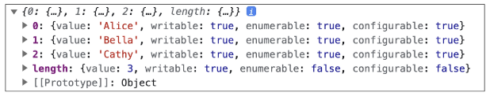

### 목차

> [1. 배열](#1-배열)
> 
> [2. Array helper method](#2-array-helper-methods)
> 
> [3. 참고](#3-참고)
>
> [4. 문제 풀이](#4-문제-풀이)

# 1. 배열

### Object

- 키로 구분된 데이터 집합(data collection)을 저장하는 자료형

- => 이제는 **순서가 있는 collection**이 필요

### Array

- 순서가 있는 데이터 집합을 저장하는 자료구조

- 대괄호(`[]`)를 이용해 작성

- 요소의 자료형은 제약 없음

- `length` 속성을 사용해 배열에 담긴 요소 개수 확인 가능

```javascript
const names = ['Alice', 'Bella', 'Cathy']

console.log(names)
console.log(names[0]) // Alice
console.log(names[1]) // Bella
console.log(names[2]) // Cathy

// 길이
console.log(names.length) // 3

// 수정
names[1] = 'Dan'
console.log(names)  // ['Alice', 'Dan', 'Cathy']
```

### 배열 메서드

- 주요 메서드

| 메서드             | 역할               |
|:---------------:|:----------------:|
| push / pop      | 배열 끝 요소를 추가 / 제거 |
| unshift / shift | 배열 앞 요소를 추가 / 제거 |

### `push()`

- 배열 끝에 요소를 추가

```javascript
const names = ['Alice', 'Bella', 'Cathy']

names.push('Dan')
console.log(names) // ['Alice', 'Bella', 'Cathy', 'Dan']
```

### `pop`

- 배열 끝 요소를 제거하고, 제거한 요소를 반환

```javascript
const names = ['Alice', 'Bella', 'Cathy']

console.log(names.pop()) // Cathy
console.log(names) // ['Alice', 'Bella']
```

### `unshift()`

- 배열 앞 요소를 추가

```javascript
const names = ['Alice', 'Bella', 'Cathy']

names.unshift('Eric')
console.log(names) // ['Eric', 'Bella', 'Dan', 'Cathy']
```

### `shift()`

- 배열 앞 요소를 제거하고, 제거한 요소를 반환

```javascript
const names = ['Alice', 'Bella', 'Cathy']

console.log(names.shift()) // Alice
console.log(names) // ['Bella', 'Cathy']                         
```

# 2. Array Helper Methods

- 배열 조작을 보다 쉽게 수행할 수 있는 특별한 메서드 모음

- ES6에 도입

- 배열의 각 요소를 **순회**하며 각 요소에 대해 함수(**콜백함수**)를 호출

- 대표 메서드 : `forEach()`, `map()`, `filter()`, `every()`, `some()`, `reduce()` 등

- 메서드 호출 시 인자로 함수(**콜백함수**)를 받는 것이 특징

### 콜백 함수

- Callback function

- 다른 함수에 인자로 전달되는 함수

- => 외부 함수 내에서 호출되어 일종의 루틴이나 특정 작업을 진행

- 파이썬의 map과 유사

- 예시

```javascript
const numbers1 = [1, 2, 3]

numbers1.forEach(function (num) {
  console.log(num ** 2)
})

// 1
// 4
// 9
```

```javascript
const numbers2 = [1, 2, 3]

const callBackFunction = function (num) {
  console.log(num ** 2)
}

numbers2.forEach(callBackFunction)

// 1
// 4
// 9
```

### 주요 Array Helper Methods

| 메서드     | 역할                                                              |
|:-------:| --------------------------------------------------------------- |
| forEach | - 배열 내의 모든 요소 각각에 대해 함수(콜백함수)를 호출 <br>- 반환 값 없음                 |
| map     | - 배열 내의 모든 요소 각각에 대해 함수(콜백함수)를 호출 <br>- 함수 호출 결과를 모아 새로운 배열을 반환 |

### `forEach`

- 배열의 각 요소를 반복하며 모든 요소에 대해 함수(콜백 함수)를 호출

- 구조 : `arr.forEach(callback(item[, index[, array]]))`
  
  - `[,` : 선택 가능하다는 뜻

- 콜백함수는 3가지 매개변수로 구성
  
  1. `item` : 처리할 배열의 요소
  
  2. `index` : 처리할 배열 요소의 인덱스 (선택 인자)
  
  3. `array` : `forEach`를 호출한 배열 (선택 인자)

- 반환 값 : `undefined`

```javascript
array.forEach(function (item, index, array) {
    // do something
})
```

- 예시

```javascript
const names = ['Alice', 'Bella', 'Cathy']

// 일반 함수 표기
names.forEach(function (name) {
  console.log(name)
})

// 화살표 함수 표기
names.forEach((name) => {
  console.log(name)
})

// 출력 결과
// Alice
// Bella
// Cathy

// Alice
// Bella
// Cathy
```

- 활용 : `forEach`의 인자를 모두 활용

```javascript
const names = ['Alice', 'Bella', 'Cathy']

names.forEach((name, index, array) => {
  console.log(name, index, array)
})

// 출력 결과
// Alice 0 ['Alice', 'Bella', 'Cathy']
// Bella 1 ['Alice', 'Bella', 'Cathy']
// Cathy 2 ['Alice', 'Bella', 'Cathy']
```

### `map()`

- 배열의 모든 요소에 대해 함수(콜백 함수)를 호출하고, 반환 된 호출 결과 값을 모아 **새로운 배열을 반환**

- 구조 : `arr.map(callback(item[, index[, array]]))`

- `forEach`의 매개 변수와 동일

- 반환 값 : 
  
  - 배열의 각 요소에 대해 실행한 "callback의 결과를 모은 새로운 배열"
  
  - => `forEach` 동작 원리와 같지만 `forEach`와 달리 **새로운 배열을 반환**함

```javascript
const newArr = array.map(function (item, index, array) {
    // do something
})
```

- 예시 : 배열을 순회하며 각 객체의 `name` 속성 값을 추출하기 (`for...of` 와 비교)

```javascript
const persons = [
  { name: 'Alice', age: 20 },
  { name: 'Bella', age: 21 }
]

// for...of
let result1 = []
for (const person of persons) {
  result1.push(person.name)
}
console.log(result1)  // ['Alice', 'Bella']

// map()
const result2 = persons.map(function (person) {
  return person.name
})
console.log(result2)  // ['Alice', 'Bella']
```

- 활용 : 화살표 함수 표기

```javascript
const names = ['Alice', 'Bella', 'Cathy']

const result3 = names.map(function (name) {
  return name.length
})

// 화살표 함수 표기
const result4 = names.map((name) => {
  return name.length
})

// 단축 가능
const result5 = names.map(name => name.length)

console.log(result3) // [5, 5, 5]
console.log(result4) // [5, 5, 5]
console.log(result5) // [5, 5, 5]
```

```javascript
const numbers = [1, 2, 3]

const doubleNumber = numbers.map((number) => {
  return number * 2
})

console.log(doubleNumber)  // [2, 4, 6]
```

### Python에서의 map 함수와 비교

- python의 `map`에 `square` 함수를 인자로 넘겨 `numbers` 배열의 각 요소를 `square` 함수의 인자로 사용하였음

```python
numbers = [1, 2, 3]

def square(num):
  return num ** 2

new_numbers = list(map(square, numbers))
print(new_numbers)  // [2, 4, 6]
```

- map 메서드에 `callBackFunc` 함수를 인자로 넘겨 `numbers` 배열의 각 요소를 `callBackFunc` 함수의 인자로 사용하였음

```javascript
const numbers = [1, 2, 3]

const myCallbackFunc = function (number) {
  return number * 2
}

const doubleNumber = numbers.map(myCallbackFunc)
console.log(doubleNumber) // [2, 4, 6]
```

### 배열 순회 종합

| 방식            | 특징                                                                                 | 비고        |
|:-------------:|:---------------------------------------------------------------------------------- |:---------:|
| **for loop**  | - 배열의 인덱스를 이용하여 각 요소에 접근<br>- `break`, `continue` 사용 가능                            |           |
| **for...of**  | - 배열 요소에 바로 접근 가능<br>-`break`, `continue` 사용 가능                                    |           |
| **forEach()** | - 간결하고 가독성이 높음<br>- callback 함수를 이용하여 각 요소를 조작하기 용이<br>- `break`, `continue` 사용 불가 | **사용 권장** |

```javascript
const names = ['Alice', 'Bella', 'Cathy']

// for loop
for (let idx = 0; idx < names.length; idx++) {
  console.log(names[idx])
}

// for...of
for (const name of names) {
  console.log(name)
}

// forEach
names.forEach((name) => {
  console.log(name)
})
```

### 기타 Array Helper Methods

- MDN 문서를 참고해 사용해보기

| 메서드        | 역할                                                                                  |
|:----------:|:-----------------------------------------------------------------------------------:|
| **filter** | 콜백 함수의 반환 값이 참인 요소들만 모아서 새로운 배열을 반환                                                 |
| **find**   | 콜백 함수의 반환 값이 참이면 해당 요소를 반환                                                          |
| **some**   | 배열의 요소 중 적어도 하나라도 콜백 함수를 통과하면 `true`를 반환하며 즉시 배열 순회 중지. 반면에 모두 통과하지 못하면 `false`를 반환 |
| **every**  | 배열의 모든 요소가 콜백 함수를 통과하면 `true`를 반환. 반면에 하나라도 통과하지 못하면 즉시 `false`를 반환하고 배열 순회 중지      |

### 배열 with '전개 구문'

- "배열 복사"

```javascript
// 배열 복사 (with 전개 구문)
let parts = ['어깨', '무릎']
let lyrics = ['머리', ...parts, '발']

console.log(lyrics) // [ '머리', '어깨', '무릎', '발' ]
```

# 3. 참고

### 콜백 함수의 이점

- 콜백 함수 구조를 사용하는 이유
1. 함수의 재사용성 측면
   
   - 함수를 호출하는 코드에서 콜백 함수의 동작을 자유롭게 변경할 수 있음
   
   - 예를 들어, `map` 함수는 콜백 함수를 인자로 받아 배열의 각 요소를 순회하며 콜백 함수를 실행
   
   - 이때, 콜백 함수는 각 요소를 변환하는 로직을 담당하므로, `map` 함수를 호출하는 코드는 간결하고 가독성이 높아짐

2. 비동기적 처리 측면
   
   - `setTimeout` 함수는 콜백 함수를 인자로 받아 일정 시간이 지난 후에 실행됨
   
   - 이때, `setTimeout` 함수는 비동기적으로 콜백 한수를 실행하므로, 다른 코드의 실행을 방해하지 않음 (비동기 JavaScript에서 자세히 진행 예정)

```javascript
console.log('a')

setTimeout(() => {
    console.log('b')
}, 3000)

console.log('c')

// a
// c
// b
```

### forEach에서 break 사용하기 대안

- `forEach`에서는 `break` 키워드를 사용할 수 없음

- 대신 `some`과 `every`의 특징을 활용해 마치 `break`를 사용하는 것처럼 활용 할 수 있음

```javascript
const array = [1, 2, 3, 4, 5]

// some
// - 배열의 요소 중 적어도 하나라도 콜백 함수를 통과하는지 테스트
// - 콜백 함수가 배열 요소 적어도 하나라도 참이면 true를 반환하고 순회 중지
// - 그렇지 않으면 false를 반환
const isEvenNumber = array.some(function (number) {
  console.log(number) // 1 2
  return number % 2 === 0
})               

console.log(isEvenNumber) // true

// every
// - 배열의 모든 요소가 콜백 함수를 통과하는지 테스트
// - 콜백 함수가 모든 배열 요소에 대해 참이면 true를 반환
// - 그렇지 않으면 false를 반환하고 순회 중지

const isAllEvenNumber = array.every(function (number) {
  console.log(number) // 1
  return number % 2 === 0
})

console.log(isAllEvenNumber) // false
```

- `some`을 활용한 예시 :

  - 콜백 함수가 `true`를 반환하면 즉시 순회를 중단하는 특징을 활용

```javascript
const names = ['Alice', 'Bella', 'Cathy']

// 1. some
// - 콜백 함수가 true를 반환하면 some 메서드는 즉시 중단하고 true를 반환
names.some(function (name) {
  console.log(name)
  if (name === 'Bella') {
    return true
  }
  return false
})
```

- `every`를 활용한 예시

  - 콜백 함수가 `false`를 반환하면 즉시 순회를 중단하는 특징을 활용

```javascript
// 2. every
// - 콜백 함수가 false를 반환하면 every 메서드는 즉시 중단하고 false를 반환
names.every(function (name) {
  console.log(name)
  if (name === 'Bella') {
    return false
  }
  return true
})
```

### 배열은 객체다

- 배열도 키와 속성들을 담고 있는 참조 타입의 객체

- 배열의 요소를 대괄호 접근법을 사용해 접근하는 건 객체 문법과 같음

  - 차이 : 배열의 키는 숫자

- 숫자형 키를 사용함으로써 배열은 객체 기본 기능 이외에도 "순서가 있는 컬렉션"을 제어하게 해주는 특별한 메서드를 제공하는 것

- 배열은 인덱스를 키로 가지며 `length` 속성을 갖는 특수한 객체

```javascript
const numbers = [1, 2, 3]
console.log(Object.getOwnPropertyDescriptors(numbers))
```



# 4. 문제 풀이

- 문제 풀면서 코드 작성해보기

### 1번

```javascript
// forEach를 사용하여 전체 학생의 평균 점수를 계산하세요.
const students = [
  { name: '김철수', score: 85 },
  { name: '이영희', score: 92 },
  { name: '박민수', score: 78 },
  { name: '정지원', score: 90 }
]

let numberOfStudent = students.length
let sumOfScores = 0

students.forEach((student) => {
  sumOfScores += student.score
})

const result = sumOfScores / numberOfStudent
console.log(result)
```

### 2번

```javascript
// forEach를 사용하여 다음 작업을 수행하세요:
// 1. 짝수는 2배로 증가
// 2. 홀수는 3을 더하기
// 결과를 새 배열에 저장
const numbers = [1, 2, 3, 4, 5]

// const -> 재선언, 재할당
const result = []

numbers.forEach((number) => {
  // 1. 짝수면 2배 곱
  if (number % 2 === 0) {
    result.push(number * 2)
  // 2. 홀수면 3을 합
  } else {
    result.push(number + 3)
  }
})

console.log(result)

// 결과
// [4, 4, 6, 8, 8]
```

### 3번

- find 안 쓰고 forEach 써도 됨

```javascript
const library = {
  books: [
    { id: 1, title: '자바스크립트 완벽 가이드', status: 'available' },
    { id: 2, title: '파이썬 기초', status: 'borrowed' },
    { id: 3, title: 'HTML/CSS 입문', status: 'available' }
  ],
  borrowHistory: [
    { bookId: 2, userId: 'user1', date: '2024-10-20' },
    { bookId: 1, userId: 'user2', date: '2024-10-15' },
    { bookId: 1, userId: 'user2', date: '2024-10-23' }
  ]
}

// forEach를 사용하여 다음을 구현하세요:
// 1. 현재 대출 가능한 도서 목록
// 2. 특정 사용자(user2)의 대출 이력

// 대출 가능 도서
const availableBooks = []
// user2 대출 이력
const user2History = []

// 대출 가능 도서 찾기
library.books.forEach((book) => {
  if (book.status === 'available') {
    availableBooks.push(book.title)
  }
})

console.log(availableBooks)

// user2의 대출 이력 찾기
library.borrowHistory.forEach((history) => {
  // user2의 대출 이력이라면
  if (history.userId === 'user2') {
    // 대출이력의 책 번호를 통해 책 찾기
    const book = library.books.find((book) => {
      return book.id === history.bookId
    })
    user2History.push({
      title: book.title,
      date: history.date
    })
  }
})

console.log(user2History)

// 결과
// 대출 가능 도서: [ '자바스크립트 완벽 가이드', 'HTML/CSS 입문' ]
// user2 대출 이력: [
//   { title: '자바스크립트 완벽 가이드', date: '2024-10-15' },
//   { title: '자바스크립트 완벽 가이드', date: '2024-10-23' }
// ]
```

### 4번

```javascript
const apiResponse = {
  status: 200,
  data: {
    items: [
      {
        id: 1,
        productInfo: {
          name: '스마트폰',
          price: 1000000,
          specs: {
            color: '블랙',
            storage: '128GB'
          }
        },
        stock: 50
      },
      {
        id: 2,
        productInfo: {
          name: '노트북',
          price: 1500000,
          specs: {
            color: '실버',
            storage: '512GB'
          }
        },
        stock: 30
      }
    ],
    pagination: {
      currentPage: 1,
      totalPages: 5
    }
  }
}

// 구조 분해 할당을 사용하여 다음 정보를 추출하세요:
// 1. 첫 번째 상품의 이름, 가격, 색상
// 2. 페이지네이션 정보
// 3. 두 상품의 재고 정보

// 1. 첫 번째 상품 정보 추출
const {
  data: {
    items: [{
      productInfo: {
        name: firstProductName,
        price: firstProductPrice,
        specs: { color: firstProductColor }
      }
    }]
  }
} = apiResponse

// 2. 페이지네이션 정보 추출
const {
  data: {
    pagination: { currentPage, totalPages }
  }
} = apiResponse

// 3. 재고 정보 추출
const {
  data: {
    items: [
      { stock: stock1 },
      { stock: stock2 }
    ]
  }
} = apiResponse

// 결과 출력
// 첫 번째 상품: 스마트폰, 1000000원, 블랙
// 페이지: 1/5
// 재고 현황: 50, 30

console.log(`첫 번째 상품: ${firstProductName}, ${firstProductPrice}원, ${firstProductColor}`)
console.log(`페이지: ${currentPage}/${totalPages}`)
console.log(`재고 현황: ${stock1}, ${stock2}`)
```