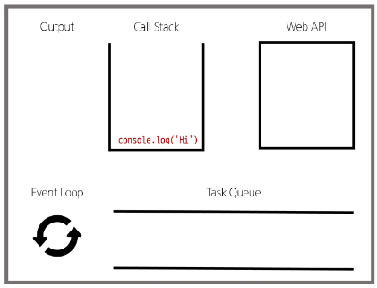
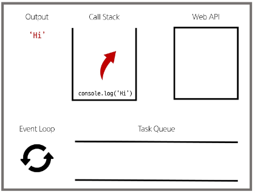
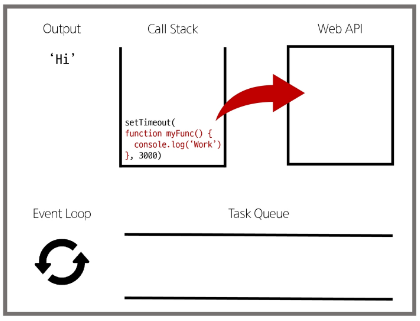
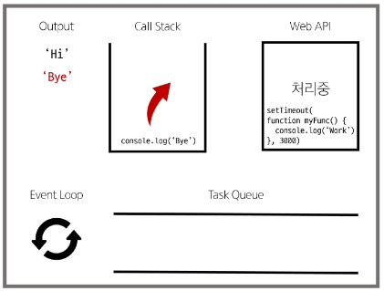
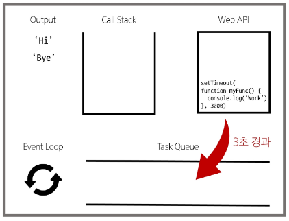
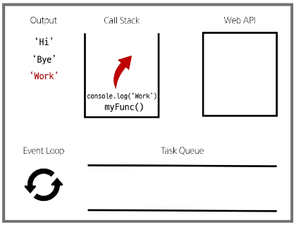
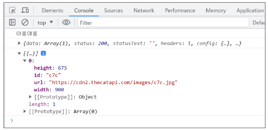

### 목차

> [1. 비동기]
> 
> [2. JavaScript와 비동기]
> 
> [3. Ajax]
> 
> [4. Callback과 Promise]
> 
> [5. 참고]

# 1. 비동기

### Synchronous (동기)

- 프로그램의 실행 흐름이 순차적으로 진행

- => 하나의 작업이 완료된 후에 다음 작업이 실행되는 방식

- 예시 1 : 카페 커피 주문
  
  - 손님 1이 주문하면 바리스타는 손님 1의 주문을 완료해야만 다음 손님의 주문을 진행 할 수 있음

- 예시 2 : 코드

```javascript
console.log('작업 1 시작')

const syncTask = function () {
  for (let i = 0; i < 1000000000; i++) {
    // 반복 실행 동안 잠시 대기
  }
  return '작업 완료'
}

const result = syncTask()
console.log(result)

console.log('작업 2 시작')
```

> 출력 결과
> 
> 작업 1 시작
> 
> (반복 실행 동안 잠시 대기)
> 
> 작업 완료
> 
> 작업 2 시작

- 작업 1이 시작되면 반복이 완료될 때까지 다음 작업(작업 2)이 시작되지 않음

### Asynchronous (비동기)

- 특정 작업의 실행이 완료될 때까지 기다리지 않고 다음 작업을 즉시 실행하는 방식

- => 작업의 완료 여부를 신경 쓰지 않고 **동시에 다른 작업들을 수행할 수 있음**

- 예시 1 : 카페 커피 주문
  
  - 손님 1이 주문하면 진동벨을 줌
  
  - 손님 1의 커피가 만들어지는 동안 다음 손님의 주문을 처리할 수 있음

- 예시2 : Gmail에서 메일 전송을 누르면 목록 화면으로 전환되지만 실제로 메일을 보내는 작업은 병렬적으로 별도로 처리됨

- 예시3 : 브라우저는 웹페이지를 먼저 처리되는 요소부터 그려 나가며 처리가 오래 걸리는 것들은 별도로 처리가 완료 되는대로 병렬적으로 진행 -> 웹 페이지 항목이 순차적으로 뜸

- 예시 4 : 코드

```javascript
console.log('작업 1 시작')

const asyncTask = function (callBack) {
  setTimeout(() => {  // 3초를 기다렸다가 콜백 함수를 호출하는 함수
    callBack('작업 완료')
  }, 3000)
}

asyncTask((result) => {
  console.log(result)
})

console.log('작업 2 시작')
```

> 출력 결과
> 
> 작업 1 시작
> 
> 작업 2 시작
> 
> 작업 완료

### Asynchronous 특징

- 병렬적 수행

- 당장 처리를 완료할 수 없고 시간이 필요한 작업들은 백그라운드에서 실행되며 빨리 완료되는 작업부터 처리

# 2. JavaScript와 비동기

### Single Thread 언어, JavaScript

- Thread란?

- => 작업을 처리할 때 실제로 작업을 수행하는 주체로, multi-thread라면 업무를 수행할 수 있는 주체가 여러 개라는 의미

- JavaScript는 한 번에 하나의 일만 수행할 수 있는 Single Thread 언어로 동시에 여러 작업을 처리할 수 없음

- 즉, JavaScript는 하나의 작업을 요청한 순서대로 처리할 수 밖에 없음

- => 그러면 어떻게 Single Thread인 JavaScript가 비동기 처리를 할 수 있을까?

### JavaScript Runtime

- "JavaScript가 동작할 수 있는 환경(Runtime)"
  
  - "브라우저" 또는 "Node.js"

- JavaScript는 Single Thread 이므로 비동기 처리를 할 수 있도록 도와주는 환경이 필요

### 브라우저 환경에서의 JavaScript 비동기 처리 관련 요소

1. JavaScript Engine의 **Call Stack**

2. **Web API**

3. **Task Queue**

4. **Event Loop**

### 런타임의 시각적 표현

```javascript
console.log('Hi')

setTimeout(function myFunc() {
    console.log('Work')
}, 3000)

console.log('Bye')
```

- 설명



- 설명



- 설명



- 설명



- 3초 뒤에 Task Queue로 이동 -> 3초보다 더 오래 걸릴 수도 있다.



- 설명


- 설명



### 브라우저 환경에서의 JavaScript 비동기 처리 동작 방식

1. 모든 작업은 **Call Stack(LIFO, Last In First Out)** 으로 들어간 후 처리된다.

2. 오래 걸리는 작업이 **Call Stack**으로 들어오면 **Web API**로 보내 별도로 처리하도록 한다.

3. **Web API**에서 처리가 끝난 작업들은 곧바로 **Call Stack**으로 들어가지 못하고 **Task Queue(FIFO)** 에 순서대로 들어간다.

4. **Event Loop**가 **Call Stack**이 비어 있는 것을 계속 체크하고 **Call Stack**이 빈다면 **Task Queue**에서 가장 오래된(가장 먼저 처리되어 들어온) 작업을 **Call Stack**으로 보낸다.

### 비동기 처리 동작 요소

1. Call Stack
- 요청이 들어올 때 마다 순차적으로 처리하는 Stack(LIFO)

- 기본적인 JavaScript의 Single Thread 작업 처리
2. Web API
- JavaScript 엔진이 아닌 브라우저에서 제공하는 runtime 환경

- 시간이 소요되는 작업을 처리 (setTimeout, DOM Event, 비동기 요청 등)
3. Task Queue (Callback Queue)
- 비동기 처리된 Callback 함수가 대기하는 Queue(FIFO)
4. Event Loop
- 태스크(작업)가 들어오길 기다렸다가 태스크가 들어오면 이를 처리하고, 처리할 태스크가 없는 경우엔 잠드는, 끊임없이 돌아가는 자바스크립트 내 루프

- Call Stack과 Task Queue를 지속적으로 모니터링

- Call Stack이 비어 있는지 확인 후 비어 있다면 Task Queue에서 대기 중인 오래된 작업을 Call Stack으로 Push

### 정리

- JavaScript는 한 번에 하나의 작업을 수행하는 Single Thread 언어로 동기적 처리를 진행

- 하지만 브라우저 환경에서는 Web API에서 처리된 작업이 지속적으로 Task Queue를 거쳐 Event Loop에 의해 Call Stack에 들어와 순차적으로 실행됨으로써 비동기 작업이 가능한 환경이 됨

# 3. Ajax

### Ajax(에이잭스 : Asynchronous JavaScript and XML)

- 비동기적인 웹 애플리케이선 개발을 위한 기술들을 통칭

- `XMLHttpRequest` 기술을 사용해 복잡하고 동적인 웹 페이지를 구성하는 프로그래밍 방식

- 브라우저와 서버 간의 데이터를 비동기적으로 교환하는 기술

- Ajax를 사용하면 페이지 전체를 새로고침하지 않고도 동적으로 데이터를 불러와 화면을 갱신할 수 있음

- Ajax의 `'x'`는 `XML` 이라는 데이터 타입을 의미하긴 하지만, 요즘은 더 가벼운 용량과 JavaScript의 일부라는 장점 때문에 `JSON`을 더 많이 사용

### Ajax 목적

1. 비동기 통신
   
   - 웹 페이지 전체를 새로고침하지 않고 서버와 데이터를 주고받을 수 있음

2. 부분 업데이트
   
   - 전체 페이지가 다시 로드되지 않고 HTML 페이지 일부 DOM만 업데이트
   
   - 페이지의 일부분만 동적으로 갱신할 수 있어 사용자 경험이 향상

3. 서버 부하 감소
   
   - 필요한 데이터만 요청하므로 서버의 부하를 줄일 수 있음

### XMLHttpRequest 객체 (XHR)

- 웹 브라우저와 서버 간의 비동기 통신을 가능하게 하는 JavaScript 객체

- JavaScript를 사용하여 서버에 HTTP 요청을 할 수 있는 객체

- 웹 페이지의 전체 새로고침 없이도 서버로부터 데이터를 가져오거나 보낼 수 있음

- => 이름에 **XML**이라는 데이터 타입이 들어가긴 하지만 **XML** 뿐만 아니라 모든 종류의 데이터를 가져올 수 있음

### 기존 기술과의 차이 - 기존 방식

- **Client** -- 요청 --> **Server**

- **Client** <-- `HTML` -- **Server**
1. 클라이언트(브라우저)에서 `form`을 채우고 이를 서버로 제출(`submit`)

2. 서버는 요청 내용에 따라 데이터 처리 후 새로운 웹페이지를 작성하여 응답으로 전달
- => 결과적으로 모든 요청에 따라 새로운 페이지를 응답 받기 때문에 계속해서 새로고침이 발생

- => 기존 페이지와 유사한 내용을 가지고 있는 경우 중복된 코드를 다시 전송 받음으로써 대역폭을 낭비하게 되는 경우가 많음

### 기존 기술과의 차이 - Ajax

- **Client** -- `XHR` 객체 생성 및 요청 --> **Server**

- **Client** <-- `JSON` -- **Server**
1. `XHR` 객체 생성 및 요청

2. 서버는 새로운 페이지를 응답으로 만들지 않고 필요한 부분에 대한 데이터만 처리 후 응답 (`JSON` 및 기타 데이터)
- => 새로운 페이지를 받는 것이 아닌 필요한 부분의 데이터만 받아 기존 페이지의 일부를 수정 (새로고침 X)

- => 서버에서 모두 처리되던 데이터 처리의 일부분이 이제는 클라이언트 쪽에서 처리되므로 교환되는 데이터양과 처리량이 줄어듦

### 이벤트 핸들러는 비동기 프로그래밍의 한 형태

- 이벤트가 발생할 때마다 호출되는 함수(콜백 함수)를 제공하는 것

- HTTP 요청은 응답이 올때까지의 시간이 걸릴 수 있는 작업이라 비동기이며, 이벤트 핸들러를 `XHR` 객체에 연결해 요청의 진행 상태 및 최종 완료에 대한 응답을 받음

### Axios

- 브라우저와 Node.js에서 사용할 수 있는 Promise 기반의 HTTP 클라이언트 라이브러리

- 클라이언트 및 서버 사이에 HTTP 요청을 만들고 응답을 처리하는 데 사용되는 자바스크립트 라이브러리

- 서버와의 HTTP 요청과 응답을 간편하게 처리할 수 있도록 도와주는 도구

- 브라우저를 위한 `XHR` 객체 생성

- 간편한 API를 제공하며, `Promise` 기반의 비동기 요청을 처리

- => 주로 웹 애플리케이션에서 서버와 통신할 때 사용

### Ajax를 활용한 클라이언트 서버 간 동작

- **Client** -- `XHR` 객체 생성 및 요청 --> **Server**

- **Client** <-- `JSON` -- **Server**

- **XHR 객체 생성 및 요청** -> **응답 데이터 생성** -> **JSON 데이터 응답** -> **Promise 객체 데이터를 활용해 DOM 조작**(웹 페이지의 일부분 만을 다시 로딩)

### Axios 설치 및 사용

- CDN 방식으로 사용하기

- https://axios-http.com/

```javascript
<script src="https://cdn.jsdelivr.net/npm/axios/dist/axios.min.js"></script>
```

### `Promise` Object

- 자바스크립트에서 비동기 작업을 처리하기 위한 객체

- 비동기 작업의 최동 완료(또는 실패)와 그 결과값을 나타냄

```javascript
const promiseObj = axios({
  method: 'get',
  url: 'https://api.thecatapi.com/v1/images/search'
})

console.log(promiseObj) // Promise object
```

- 주요 메서드
  
  - `then()` : 작업이 성공적으로 완료되었을 때 실행될 콜백 함수를 지정
  
  - `catch()` : 작업이 실패했을 때 실행될 콜백 함수를 지정

```javascript
promiseObj
  .then((response) => {
    console.log(response)
  })
  .catch((error) => {
    console.log(error)
  })
```

### Axios 기본 구조

- `axios` 객체를 활용해 요청을 보낸 후 응답 데이터 `promise` 객체를 받음

```javascript
axios({
  method: 'get',
  url: 'https://api.thecatapi.com/v1/images/search'
})
  .then((response) => {
    console.log(response)
    console.log(response.data)
  })
  .catch((error) => {
    console.log(error)
  })
```

- 성공 처리
  
  - `then` 메서드를 사용해서 "성공했을 때 수행할 로직"을 작성
  
  - 서버로부터 받은 응답 데이터를 처리

- 실패 처리
  
  - `catch` 메서드를 사용해서 "실패했을 때 수행할 로직"을 작성
  
  - 네트워크 오류나 서버 오류 등의 예외 상황을 처리

```javascript
axios({
  method: 'post',
  url: '/usere/12345',
  data: {
    firstName: 'Fred',
    lastName: 'Flintstone'
  }
})
  .then(콜백함수)
  .catch(콜백함수)
```

### then & catch 특징

- `then(callback)`
  
  - 요청한 작업이 성공하면 callback 실행
  
  - callback은 이전 작업의 성공 결과를 인자로 전달 받음

- `catch(callback)`
  
  - `then()`이 하나라도 실패하면 callback 실행 (남은 `then`은 중단)
  
  - callback은 이전 작업의 실패 객체를 인자로 전달 받음

### Axios 활용

### 고양이 사진 가져오기 실습

- The Cat API(https://api.thecatapi.com/v1/images/search)
  
  - 이미지를 요청해서 가져오는 작업을 비동기로 처리하기

- response 예시

```javascript
[
  {
    "id": "d6n",
    "url": "https://cdn2.thecatapi.com/images/d6n.jpg",
    "width": 333,
    "height": 500
  }
]
```

```javascript
<script src="https://cdn.jsdelivr.net/npm/axios/dist/axios.min.js"></script>
<script>
  const URL = 'https://api.thecatapi.com/v1/images/search'
  // 1. axios 요청 처리
  axios({
    method: 'get',
    url: URL
  })
    .then((response) => {
      console.log(response)  // 객체
      console.log(response.data)
      console.log(response.data[0])
      console.log(response.data[0].url)
    })
    .catch((error) => {
      console.log(error)
      console.log('실패했다옹')
    })
  console.log('야옹야옹')
</script>
```

- 요청 후 cat api로부터 응답을 기다려야 하는 작업은 비동기로 처리하기 때문에 '야옹야옹' 출력 이후 응답 데이터가 출력되는 것을 확인 할 수 있음



### 고양이 사진 가져오기 실습 심화

1. 버튼을 누르면

2. 고양이 이미지를 요청하고

3. 요청이 처리되어 응답이 오면

4. 응답 데이터에 있는 이미지 주소 값을 `img` 태그에 넣어 이미지 출력하기
- 버튼을 작성하고 axios 로직을 콜백 함수로 작성 및 이벤트 핸들러 부착

```javascript
<body>
  <button>냥냥펀치</button>

  <script src="https://cdn.jsdelivr.net/npm/axios/dist/axios.min.js"></script>
  <script>
    const URL = 'https://api.thecatapi.com/v1/images/search'
    const btn = document.querySelector('button')

    const getCats = function () {
      axios({
        method: 'get',
        url: URL
      })
        .then((response) => {
          // console.log(response)
          // console.log(response.data)
          console.log(response.data[0].url)
          // 1. 이미지 주소 저장
          const imgUrl = response.data[0].url
          // 2. img 태그 생성
          const imgTag = document.createElement('img')
          // 3. img태그의 src 속성 값 설정
          imgTag.setAttribute('src', imgUrl)
          // 4. body의 자식 태그로 img 태그 추가
          document.body.appendChild(imgTag)
        })
        .catch((error) => {
          console.log(error)
          console.log('실패했다옹')
        })
      console.log('야옹야옹')
    }

    btn.addEventListener('click', getCats)
  </script>
</body>
```

- 응답 데이터에서 필요한 이미지 주소 값 찾기
  
  - `console.log9response.data[0].url)`

- 찾은 이미지 주소를 활용해 HTML `img` 태그 구성하기

```javascript
// 1. 이미지 주소 저장
const imgUrl = response.data[0].url
// 2. img 태그 생성
const imgTag = document.createElement('img')
// 3. img태그의 src 속성 값 설정
imgTag.setAttribute('src', imgUrl)
// 4. body의 자식 태그로 img 태그 추가
document.body.appendChild(imgTag)
```

- 결과 확인


### Ajax와 Axios 정리

- `Ajax`
  
  - 하나의 특정한 기술을 의미하는 것이 아니라, 비동기적인 웹 애플리케이션 개발에 사용하는 기술들의 집합을 지칭

- `Axios`
  
  - 클라이언트 및 서버 사이에 HTTP 요청을 만들고 응답을 처리하는 데 사용되는 자바스크립트 라이브러리
  
  - Promise API를 기반으로 하여 비동기 처리를 더 쉽게 할 수 있음

- => 프론트엔드에서 `Axios`를 활용해 DRF로 만든 API 서버로 요청을 보내고, 받아온 데이터를 비동기적으로 처리하는 로직을 작성하게 됨

- `Ajax`는 개념이자 접근 방식이며, `Axios`는 이를 실현하는 구체적인 도구

- `Axios`는 `Ajax`를 구현하는 도구 중 하나로, `XMLHttpRequest`를 추상화하여 더 사용하기 쉽게 만든 라이브러리

# 4. Callback과 Promise

### 비동기 처리의 특성과 관리

- 비동기 처리의 특성
  
  - 비동기 처리의 핵심은 작업이 시작되는 순서가 아니라 **완료되는 순서**에 따라 처리된다는 것

- 비동기 처리의 어려움
  
  - 개발자 입장에서 **코드의 실행 순서가 불명확**하다는 단점 존재
  
  - 이로 인해 실행 결과를 정확히 예측하며 코드를 작성하기 어려울 수 있음

### 비동기 처리 관리 방법

1. 비동기 콜백
   
   - 비동기 작업이 완료된 후 실행될 함수를 미리 정의

2. Promise
   
   - 비동기 작업의 최동 완료 또는 실패를 나타내는 객체

### 비동기 콜백

- 비동기적으로 처리되는 작업이 완료되었을 때 실행되는 함수

- 연쇄적으로 발생하는 비동기 작업을 **순차적으로 동작**할 수 있게 함

- => 작업의 순서와 동작을 제어하거나 결과를 처리하는 데 사용

```javascript
const asyncTask = function (callBack) {
  setTimeout(function () {
    console.log('비동기 작업 완료')
    callBack()  // 비동기 작업 완료 후 콜백 호출
  }, 3000)  // 3초 후에 작업 완료
}

// 비동기 작업 수행 후 콜백 실행
asyncTask(function () {
  console.log('비동기 작업 완료 후 콜백 실행')
})
```

> 출력 결과
> 
> 비동기 작업 완료
> 
> 작업 완료 후 콜백 실행

### 비동기 콜백의 한계

- 비동기 콜백 함수는 보통 어떤 기능의 실행 결과를 받아서 다른 기능을 수행하기 위해 많이 사용됨

- 이 과정을 작성하다 보면 비슷한 패턴이 계속 발생
  
  - A를 처리해서 결과가 나오면, 첫 번째  callback 함수를 실행하고
  
  - 첫 번째 callback 함수가 종료되면, 두 번째 callback 함수를 실행하고
  
  - 두 번째 callback 함수가 종료되면, 세 번째 callback 함수를 실행하고...

- => "콜백 지옥" 발생

### 콜백 지옥(Callback Hell)

- 비동기 처리를 위한 콜백을 작성할 때 마주하는 문제

- 코드 작성 형태가 마치 "피라미드와 같다"고 해서 "Pyramid of doom (파멸의 피라미드)" 라고도 부름

```js
function hell (win) {
  return function () {
    loadLink(win, REMOTE_SRC, function () {
      loadLink(win, REMOTE_SRC, function () {
        loadLink(win, REMOTE_SRC, function () {
          loadLink(win, REMOTE_SRC, function () {
            loadLink(win, REMOTE_SRC, function () {
              loadLink(win, REMOTE_SRC, function () {
              })
            })
          })
        })
      })
    })
  }
}
```

### 콜백 함수 정리

- 콜백 함수는 비동기 작업을 순차적으로 실행할 수 있게 하는 반드시 필요한 로직

- 비동기 코드를 작성하다 보면 콜백 함수로 인한 콜백 지옥은 빈번히 나타나는 문제이며 이는 코드의 가독성을 해치고 유지 보수가 어려워짐

- => 지옥에 빠지지 않는 다른 표기 형태가 필요하다 !

### Promise(프로미스)

- JavaScript에서 비동기 작업의 결과를 나타내는 객체

- => 비동기 작업이 완료되었을 때 결과 값을 반환하거나, 실패 시 에러를 처리할 수 있는 기능을 제공

### "`Promise`" object

- 자바스크립트에서 비동기 작업을 처리하기 위한 객체

- 비동기 작업의 성공 또는 실패와 관련된 결과나 값을 나타냄

- 콜백 지옥 문제를 해결하기 위해 등장한 비동기 처리를 위한 객체

- "작업이 끝나면 실행 시켜 줄게" 라는 약속

- => `Promise` 기반의 HTTP 클라이언트 라이브러리가 바로 `Axios`

### Axios

- 브라우저와 Node.js에서 사용할 수 있는 **Promise 기반**의 HTTP 클라이언트 라이브러리

### 비동기 콜백 vs Promise

- 비동기 콜백 방식

```javascript
work1(function () {
  // 첫 번째 작업 ...
  work2(result1, function (result2) {
    // 두 번째 작업 ...
    work3(result2, funciont (result3) {
      console.log('최종 결과 :' + result3)
    })
  })
})
```

- promise 방식

```javascript
work1()
  .then((result1) => {
    // work2
    return result2
  })
  .then((result2) => {
    // work3
    return result3
  })
  .catch((error) => {
    // error handling
  })
```

### then & catch의 chaining

- `axios`로 처리한 비동기 로직은 항상 `promise` 객체를 반환

- 즉, `then`과 `catch`는 모두 항상 `promise` 객체를 반환
  
  - => 계속해서 `chaining`을 할 수 있음

- `then`을 계속 이어 나가면서 작성할 수 있게 됨

```javascript
axios({}).then(...).then(...).catch(...)
```

```javascript
axios({}) // Promise 객체 return
  .then(성공하면 수행할 1번 콜백함수)
  .then(1번 콜백함수가 성공하면 수행할 2번 콜백함수)
  .then(2번 콜백함수가 성공하면 수행할 3번 콜백함수)
  ...
  .catch(실패하면 수행할 콜백함수)
```

### then 메서드 chaining의 목적

- 비동기 작업의 **"순차적인"** 처리 기능

- 코드를 보다 직관적이고 가독성 좋게 작성할 수 있도록 도움

### then 메서드 chaining 적용

- chaining을 활용해 cat api 실습 코드 개선하기

```javascript
.then((response) => {
  // console.log(response)
  // console.log(response.data)
  console.log(response.data[0].url)
  // 1. 이미지 주소 저장
  const imgUrl = response.data[0].url
  // 2. img 태그 생성
  const imgTag = document.createElement('img')
  // 3. img태그의 src 속성 값 설정
  imgTag.setAttribute('src', imgUrl)
  // 4. body의 자식 태그로 img 태그 추가
  document.body.appendChild(imgTag)
})
```

⇓

```javascript
.then((response) => {
  // console.log(response)
  // console.log(response.data)
  // console.log(response.data[0].url)
  // 1. 이미지 주소 저장
  const imgUrl = response.data[0].url
  return imgUrl
})
.then((imgData) => {
  // 2. img 태그 생성
  const imgTag = document.createElement('img')
  // 3. img태그의 src 속성 값 설정
  imgTag.setAttribute('src', imgData)
  // 4. body의 자식 태그로 img 태그 추가
  document.body.appendChild(imgTag)
})
```

- 첫 번째 `then` 콜백함수의 반환 값이 이어지는 `then` 콜백함수의 인자로 전달됨

### then 메서드 chaining의 장점

1. 가독성

  - 비동기 작업의 순서와 의존 관계를 명확히 표현할 수 있어 코드의 가독성이 향상

2. 에러 처리

  - 각각의 비동기 작업 단계에서 발생하는 에러를 분할해서 처리 가능

3. 유연성 

  - 각 단계마다 필요한 데이터를 가공하거나 다른 비동기 작업을 수행할 수 있어서 더 복잡한 비동기 흐름을 구성할 수 있음

4. 코드 관리

  - 비동기 작업을 분리하여 구성하면 코드를 관리하기 용이

### Promise가 제공하는 이점 (비동기 콜백과 비교)

1. 실행 순서의 보장

- **콜백 함수** : JavaScript의 Event Loop가 현재 실행 중인 Call Stack을 완료하기 전에는 호출되지 않음

- **Promise** : then/catch 메서드의 콜백 함수는 Event Queue에 배치되는 순서대로 엄격하게 호출됨

- => 이는 비동기 작업의 실행 순서를 더 예측 가능하게 만듦

2. 유연한 비동기 처리

  - Promise는 비동기 작업이 완료된 후에도 then 메서드를 통해 콜백을 추가할 수 있음

3. 체이닝(Chaining)을 통한 연속적인 비동기 처리

  - then 메서드를 여러 번 연결하여 여러 개의 콜백 함수를 순차적으로 실행할 수 있음

  - 각 콜백은 주어진 순서대로 실행되며, 이전 Promise의 결과를 다음 thne에서 사용할 수 있음

  - 복잡한 비동기 로직을 명확하게 표현할 수 있음

4. 에러 처리의 일원화

  - catch 메서드를 통해 Promise 체인 전체의 에러를 한 곳에서 처리할 수 있음

  - 전통적인 콜백 방식에서 각 콜백마다 에러 처리를 해야 하는 번거로움을 해소

### Promise 정리

- Promise는 비동기 프로그래밍의 복잡성을 줄이고, 코드의 가독성과 유지보수성을 높이는 강력한 도구

- 실행 순서 보장, 체이닝, 에러 처리 등의 특징을 통해 콜백 지옥을 피하고 더 체계적인 비동기 코드 작성을 가능하게 함

# 5. 참고

### 비동기 처리와 사용자 경험

- 비동기 처리가 사용자 경험에 미치는 영향

1. 동기식 처리의 한계

  - 큰 데이터를 불러오는 작업을 동기식으로 처리할 경우, 데이터 로딩이 완료될 때까지 전체 앱의 실행이 차단됨

  - 이로 인해 사용자는 앱이 멈추거나 응답하지 않는 것처럼 느낄 수 있음

  - 특정 작업이 완료될 때까지 다른 모든 작업이 대기해야 하므로, 전반적인 앱의 반응성이 저하됨

2. 비동기 처리의 장점

  - 시간이 오래 걸리는 작업(예: 데이터 로딩, API 호출)을 백그라운드에서 처리할 수 있음

  - 주요 실행 흐름이 차단되지 않아 사용자 인터페이스가 계속 반응할 수 있음

  - 데이터나 작업 결과가 준비되는 대로 순차적으로 화면에 표시할 수 있어, 사용자에게 진행 상황을 보여줄 수 있음

3. 사용자 경험 향상

  - 비동기 처리를 통해 앱이 더 빠르고 반응적으로 느껴지게 할 수 있음

  - 로딩 인디케이터나 부분적 콘텐츠 업데이트를 통해 사용자에게 진행 상황을 알려줄 수 있음

  - 사용자는 전체 데이터가 로드되기를 기다리지 않고도 앱의 일부 기능을 사용할 수 있음

### 비동기 처리 적용 사례

1. 소셜 미디어 피드

  - 스크롤하면서 새로운 콘텐츠를 비동기적으로 로드

2. 검색 자동완성

  - 사용자가 입력하는 동안 실시간으로 추천 검색어를 제공

3. 대시보드

  - 여러 데이터 소스에서 정보를 비동기적으로 가져와 표시

### 비동기 처리 주의사항

- 비동기 처리가 항상 최선은 아니며, 작업의 특성과 데이터의 중요도에 따라 적절히 선택해야 함