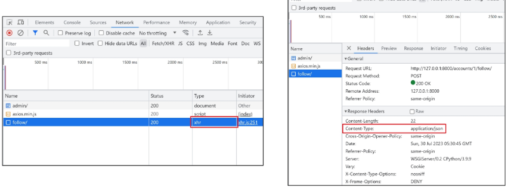

### 목차

> [1. Ajax와 서버](#1-ajax와-서버)
> 
> [2. Ajax with follow](#2-ajax-with-follow)
> 
> [3. Ajax with likes](#3-ajax-with-likes)

# 1. Ajax와 서버

(복습)

- Asynchronous JavaScript and XML

- 비동기적인 웹 애플리케이션 개발에 사용하는 기술

### Ajax를 활용한 클라이언트 서버 간 동작

- **Client(AXIOS)** -- `XHR` 객체 생성 및 요청 --> **Server**

- **Client(AXIOS)** <-- `JSON` -- **Server**

- **XHR 객체 생성 및 요청** -> **응답 데이터 생성** -> **JSON 데이터 응답** -> **Promise 객체 데이터를 활용해 DOM 조작**(웹 페이지의 일부분 만을 다시 로딩)

# 2. Ajax with follow

### 비동기 팔로우 구현

- 사전 준비 : 
  
  - M:N까지 진행한 Django 프로젝트 준비
  
  - 가상 환경 생성, 활성화 및 패키지 설치

### Ajax 적용

- 프로필 페이지에 axios CDN 작성

- 기존 : 
  
  - HTML의 form 태그를 사용해 POST 메서드로 데이터 제출(submit)

- 변경 :
  
  - axios를 사용해 POST 메서드로 데이터를 제출
  
  - form method, action 속성이 불필요
  
  - 팔로우 버튼에 submit 이벤트가 발생하면 (이벤트 리스너)
  
  - django가 json 데이터를 응답
  
  - JS에서 json 응답받은 json 데이터를 활용해 팔로우 버튼을 조작 (DOM)

- accounts/profile.html

```html
  <script src="https://cdn.jsdelivr.net/npm/axios/dist/axios.min.js"></script>
  <script>
  </script>
</body>
</html>
```

- `form` 요소 선택을 위해 `id` 속성 지정 및 선택

- `action`과 `method` 속성은 삭제
  
  - 요청은 axios로 대체되기 때문

- accounts/profile.html

```django
<form id="follow-form">
  ...
</form>
```

```javascript
const formTag = document.querySelector('#follow-form')
```

- `form` 요소에 이벤트 핸들러 할당

- `submit` 이벤트의 기본 동작 취소하기

- accounts/profile.html

```javascript
formTag.addEventListener('submit', function (event) {
  event.preventDefault()
})
```

- axios 요청 코드 작성
1. `url` 작성에 필요한 `user pk`는 어떻게 작성해야 할까?

2. `csrftocken`은 어떻게 보내야 할까?
- accounts/profile.html

```javascript
formTag.addEventListener('submit', function (event) {
  event.preventDefault()
  axios({
    method: 'post',
    url: `/accounts/${}/follow/`,
  })
})
```

- `url`에 작성할 `user pk` 가져오기 (HTML => JavaScript)
  
  - 3가지 방법이 있음

- accounts/profile.html

```django
<form id="follow-form" data-user-id="{{ person.pk }}">
  ...
</form>
```

```javascript
formTag.addEventListener('submit', function (event) {
  enent.preventDefault()

  const userId = event.currentTarget.dataset.userId
  const userId = this.dataset.userId
  const userId = formTag.dataset.userId
}
```

---

### '`data-*'` 속성

- 사용자 지정 데이터 특성을 만들어 임의 데이터를 HTML과 DOM 사이에서 교환할 수 있는 방법

- data- 뒤에 붙인 글자가 변수명?이 된다. -> 강의 확인
  
  - ex) abc-def => abcDef => dataset.abcDef

- 모든 사용자 지정 데이터는 JavaScript에서 **dataset** 속성을 통해 접근

- 주의사항
  
  - 대소문자 여부에 상관없이 `xml` 문자로 시작 불가
  
  - 세미콜론 포함 불가
  
  - 대문자 포함 불가

---

- 요청 `url` 작성 마무리

- accounts/profile.html

```javascript
url: `/accounts/${userId}/follow/`,
```

- 문서상 `input hidden` 타입으로 존재하는 `csrf token` 데이터를 이제는 axios로 전송해야 함

- accounts/profile.html

```django
<form id="follow-form" data-user-id="{{ person.pk }}">
  
  
    <input type="submit" value="Unfollow">
  
    <input type="submit" value="Follow">
  
</form>
```

- `csrf` 값을 가진 `input` 요소를 직접 선택 후 axios에 작성하기

- https://docs.djangoproject.com/en/4.2/howto/csrf/

- accounts/profile.html

```javascript
const csrftoken = document.querySelector('[name-csrfmiddlewaretoken]').value

formTag.addEventListener('submit', function (event) {
  event.preventDefault()

  const userId = event.currentTarget.dataset.userId

  axios({
    method: 'post',
    url: `/accounts/${userId}/follow/`,
    headers: {`X-CSRFToken`: csrftoken,},
  })
})
```

- 팔로우 버튼을 토글하기 위해서는 현재 팔로우 상태인지 언팔로우 상태인지에 대한 상태 확인이 필요

- Django의 view 함수에서 팔로우 여부를 파악할 수 있는 변수를 추가로 생성해 JSON 타입으로 응답하기

- 팔로우 상태 여부를 JavaScript에게 전달할 데이터 작성

- 응답은 더 이상 HTML 문서가 아닌 `JSON` 데이터로 응답하도록 변경

- accounts/views.py

```python
from django.http import JsonResponse

@login_required
def follow(request, user_pk):
    User = get_user_model()
    person = User.objects.get(pk=user_pk)
    if person != request.user:
        if person.followers.filter(pk=request.user.pk).exists():
            person.followers.remove(request.user)
            is_followed = False
        else:
            person.followers.add(request.user)
            is_followed = True
        context = {
            'is_followed': is_followed,
        }
        return JsonResponse(context)
    return redirect('accounts:profile', person.username)
```

- 팔로우 요청 후 Django 서버로 부터 받은 응답 데이터 확인하기

- accounts/profile.html

```javascript
axios({
  method: 'post',
  url: `/accounts/${userId}/follow/`,
  headers: {'X-CSRFToken': csrftoken,},
})
  .then((response) => {
    console.log(response)
    console.log(response.data)
  })
})
```

- 응답 데이터 `is_followed`에 따라 팔로우 버튼을 조작하기

- accounts/profile.html

```javascript
  .then((response) => {
    const isFollowed = response.data.is_followed
    const followBtn = document.querySelector('input[type=submit]')
    if (isFollowed === true) {
      followBtn.value = 'Unfollow'
    } else {
      followBtn.value = 'Follow'
    }
  })
```

- 클라이언트와 서버 간 `XHR` 객체를 주고 받는 것을 확인하기

- 개발자도구 - Network



- "팔로잉 수와 팔로워 수 비동기 적용"

- 해당 요소를 선택할 수 있도록 `span` 태그와 `id` 속성 작성

- accounts/profile.html

```django
<div>
  팔로잉 : <span id="followings-count">{{ person.followings.all|length }}</span> /
  팔로워 : <span id="followers-count">{{ person.followers.all|length }}</span>
</div>
```

- 각 `span` 태그를 선택

- accounts/profile.html

```javascript
.then((response) => {
  ...
  
  const followingsCountTag = document.querySelector('#followings-count')
  const followersCountTag = document.querySelector('#followers-count')
}
```

- Django view 함수에서 팔로워, 팔로잉 인원 수 연산을 진행하여 결과를 응답 데이터로 전달

- accounts/views.py

```python
@login_required
def follow(request, user_pk):
    ...
        context = {
            'is_followed': is_followed,
            'followings_count': person.followings.count(),
            'followers_count': person.followers.count(),
        }
        return JsonResponse(context)
    return redirect('accounts:profile', person.username)
```

- 응답 데이터를 받아 각 태그의 인원수 값 변경에 활용

- accounts/profile.html

```javascript
.then((response) => {
  ...
  
  const followingsCountTag = document.querySelector('#followings-count')
  const followersCountTag = document.querySelector('#followers-count')

  followingsCountTag.textContent = response.data.followings_count
  followersCountTag.textContent = response.data.followers_count
})
```

### 정리

<details open><summary>accounts/profile.html</summary>

```javascript
<body>
  <h1>{{ person.username }}의 프로필</h1>
  <div>
    팔로잉 : <span id="followings-count">{{ person.followings.all|length }}</span> 
    / 팔로워 : <span id="followers-count">{{ person.followers.all|length }}</span>
  </div>

  
    <div>
      <form id="follow-form" data-user-id="{{ person.pk }}">
        
        
          <input type="submit" value="언팔로우" class="follow-input">
        
          <input type="submit" value="팔로우" class="follow-input">
        
      </form>
    </div>
  

   유저가 작성한 게시글 
  <h2>{{ person.username }} 작성한 게시글</h2>
  
    <p>{{ article }}</p>
  

  <hr>

   유저가 작성한 댓글 
  <h2>{{ person.username }} 작성한 댓글</h2>
  
    <p>{{ comment }}</p>
  

  <hr>

   유저가 좋아요한 게시글 
  <h2>{{ person.username }} 좋아요한 게시글</h2>
  
    <p>{{ article }}</p>
  

  <a href="">[back]</a>

  <script src="https://cdn.jsdelivr.net/npm/axios/dist/axios.min.js"></script>
  <script>
    // 1. 팔로우 버튼 선택
    const formTag = document.querySelector('#follow-form')
    // 7. csrftoken 선택
    const csrftoken = document.querySelector('[name=csrfmiddlewaretoken]').value

    // 2. 팔로우 버튼에 이벤트 리스너를 부착 (submit 이벤트 감지)
    formTag.addEventListener('submit', function (event) {
      // 3. submit 이벤트의 기본 동작 취소
      event.preventDefault()
      // 5. HTML에서 준비한 user의 pk를 조회
      // console.log(event.currentTarget.dataset.userId)
      const userId = event.currentTarget.dataset.userId
      // const userId = this.dataset.userId
      // const userId = formTag.dataset.userId

      // 4. axios 준비
      axios({
        method: 'post',
        // 6. HTML에서 전달해서 할당한 PK 값으로 url 완성
        url: `/accounts/${userId}/follow/`,
        // 8. 선택한 csrftoken 값을 요청 headers에 세팅
        // https://docs.djangoproject.com/en/5.1/howto/csrf/
        // https://axios-http.com/kr/docs/req_config
        headers: {'X-CSRFToken': csrftoken},
      })
        .then((response) => {
          console.log(response)
          // 11. django로 부터 응답받은 팔로우 상태 정보
          console.log(response.data)
          // 12. 팔로우 상태 정보 데이터에 따라 팔로우 버튼을 조작
          const isFollowed = response.data.is_followed
          const followBtn = document.querySelector('.follow-input')
          if (isFollowed === true) {
            followBtn.value = '언팔로우'
          } else {
            followBtn.value = '팔로우'
          }
          // 13. 팔로워 & 팔로잉 수 선택
          const followingsCountTag = document.querySelector('#followings-count')
          const followersCountTag = document.querySelector('#followers-count')
          // 15. django가 응답한 팔로잉, 팔로워 수 데이터를 활용해 DOM 변경
          followingsCountTag.textContent = response.data.followings_count
          followersCountTag.textContent = response.data.followers_count
        })
        .catch((error) => {
          console.log(error)
        })
    })
  </script>

</body>
```

</details>

- accounts/views.py

```python
from django.http import JsonResponse

def follow(request, user_pk):
    User = get_user_model()
    you = User.objects.get(pk=user_pk)
    me = request.user

    if me != you:
        # 9. JS에게 팔로우 상태여부를 전달할 데이터 작성
        if me in you.followers.all():
            you.followers.remove(me)
            # me.followings.remove(you)
            is_followed = False
        else:
            you.followers.add(me)
            # me.followings.add(you)
            is_followed = True
        context = {
            # 14. 팔로워 수와 팔로잉 수에 대한 데이터 작성
            'is_followed': is_followed,
            'followings_count': you.followings.count(),
            'followers_count': you.followers.count(),
        }
        # 10. JSON 데이터로 응답
        return JsonResponse(context)
    return redirect('accounts:profile', you.username)
```

# 3. Ajax with likes

### 비동기 좋아요 구현

### Ajax 좋아요 적용 시 유의사항

- 전반적인 Ajax 적용은 팔로구 구현 과정과 모두 동일

- 단, 팔로우와 달리 좋아요 버튼은 **한 페이지에 여러 개**가 존재

- => 그렇다면 좋아요 버튼에 이벤트 리스너를 할당해야 할까?

### [복습] 버블링

- 한 요소에 이벤트가 발생하면, 이 요소에 할당된 핸들러가 동작하고, 이어서 부모 요소의 핸들러가 동작하는 현상

- 가장 최상단의 조상 요소(`document`)를 만날 때까지 이 과정이 반복되면서 요소 각각에 할당된 핸들러가 동작

### [복습] 버블링이 필요한 이유

- 만약 다음과 같이 다른 동작을 수행하는 버튼이 여러 개가 있다고 가정

```html
<div>
  <button></button>
  <button></button>
  ...
  <button></button>
  <button></button>
</div>
```

- 그렇다면 각 버튼마다 이벤트 핸들러를 할당해야 할까?

- => 각 버튼의 **공통 조상인 div 요소에 이벤트 핸들러 단 하나만 할당**하기

### Ajax 적용

- 모든 좋아요 `form` 요소를 포함하는 최상위 요소 작성

- articles/index.html

```django
<article class="article-container">
  
    ...
  
</article>
```

1. 최상위 요소 선택

2. 이벤트 핸들러 할당

3. 하위 요소들의 `submit` 이벤트를 감지하고 `submit` 기본 이벤트를 취소
- articles/index.html

```javascript
const articleContainer = document.querySelector('.artilce-container')

articleContainer.addEventListener('submit', function (event) {
  event.preventDefault()
})
```

- axios 코드 작성

- => `url` 작성에 필요한 `article pk`는 어떻게 작성해야 할까?
  
  - url: \`/articles/$**{}**/ikes/\`

- 각 좋아요 `form`에 `article.pk`를 브여 후 HTML의 `article.pk` 값을 JavaScript에서 참조하기

- accounts/index.html

```django
<form data-article-id="{{ article.pk }}">
  ...
</form>
```

- accounts/profile.html

```javascript
formTag.addEventListener('submit', function (event) {
  event.preventDefault()

  const articleId = event.???
  ...
}
```

---

### [복습] `'currentTarget'` & `'target'`

- `currentTarget` 속성
  
  - '현재' 요소
  
  - 항상 이벤트 핸들러가 연결된 요소만을 참조하는 속성
  
  - `this`와 같음

- `target` 속성
  
  - 이벤트가 발생한 가장 안쪽의 요소(target)를 참조하는 속성
  
  - **실제 이벤트가 시작된 요소**
  
  - 버블링이 진행 되어도 변하지 않음

---

- `url` 완성 후 요청 및 응답 확인

- articles/index.html

```javascript
articleContainer.addEventListener('submit', function (event) {
  event.preventDefault()
  const articleId = event.target.dataset.articleId
  axios({
    method: 'post',
    url: `/articles/${articleId}/likes/`,
    headers: {'X-CSRFToken': csrftoken,},
  })
    .then((response) => {
      console.log(response)
    })
    .catch((error) => {
      console.log(error)
    })})
```

- 좋아요 버튼을 토글하기 위해서는 현재 사용자가 좋아요를 누른 상태인지 좋아요를 누르지 않은 상태인지에 대한 **상태 확인**이 필요

- => Django의 view 함수에서 좋아요 여부를 파악할 수 있는 변수 추가 생성

- => JSON 타입으로 응답하기

- 좋아요 상태 여부를 JavaScript에게 전달할 데이터 작성 및 JSON 데이터 응답

- articles/views.py

```python
from django.http import JsonResponse

@login_required
def likes(requeset, article_pk):
    article = Article.objects.get(pk=article_pk)
    if request.user in article.like_users.all():
        article.like_users.remove(request.user)
        is_liked = False
    else:
        article.like_users.add(request.user)
        is_liked = True
    context = {
        'is_liked': is_liked,
    }
    return JsonResponse(context)
```

- 응답 데이터 `is_liked`를 받아 `isLiked` 변수에 할당

- articles/index.html

```javascript
axios({
  method: 'post',
  url: `/articles/${artilceId}/likes/`,
  headers: {'X-CSRFToken': csrftoken,},
})
  .then((response) => {
    console.log(response)
    const isLiked = response.data.is_liked
  })
  .catch((error) => {
    console.log(error)
  })
})
```

- `isLiked`에 따라 좋아요 버튼을 토글하기

- => 그런데 어떤 게시글의 좋아요 버튼을 선택 했는지 구분이 필요

- articlels/index.html

```javascript
  .then((response) => {
    console.log(response)
    const isLiked = response.data.is_liked
    const likeBtn = ??
  })
```

- 문자와 `article`의 `pk` 값을 혼합하여 각 버튼에 `id` 속성 값을 설정

- **id 속성 값은 숫자로 시작할 수 없음**

- articles/index.html

```django

  <input type="submit" value="좋아요 취소" id="like-{{ article.pk }}">

  <input type="submit" value="좋아요" id="like-{{ article.pk }}">

```

- 각 좋아요 버튼을 선택 후 `isLiked`에 따라 버튼을 토글

- articles/index.html

```javascript
  .then((response) => {
    console.log(response)
    const isLiked = response.data.is_liked
    const likeBtn = document.querySelector(`#like-${articleId}`)
    if (isLiked === true) {
      likeBtn.value = '좋아요 취소'
    } else {
      likeBtn.value = '좋아요'
    }
  })
```

### 버블링을 활용하지 않는 경우

1. `querySelectorAll()`을 사용해 전체 좋아요 버튼을 선택

2. `forEach()`를 사용해 전체 좋아요 버튼을 순회하면서 진행
- `querySelectorAll()` 선택을 위한 `class` 적용

- accounts/index.html

```django

  ...
  <form class="like-forms" data-article-id="{{ article.pk }}">
    
    
      <input type="submit" value="좋아요 취소" id="like-{{ article.pk }}">
    
      <input type="submit" value="좋아요" id="like-{{ article.pk }}">
    
  </form>
  <hr>

```

- `forEach()`를 사용해 전체 좋아요 버튼을 순회하면서 진행

- articles/index.html

```javascript
const formTags = document.querySelectorAll('.like-forms')
const csrftoken = document.querySelector('[name=csrfmiddlewaretoken]').value

formTags.forEach((formTag) => {
  formTag.addEventListener('submit', funcion (event) {
    event.prerventDefault()
    
    const articleId = formTag.dataset.articleId

    axios({
      method: 'post',
      url: `/articles/${articleId}/likes/`,
      headers: {'X-CSRFToken': csrftoken,},
    })
      .then((response) => {
        const isLiked = response.data.is_liked
        const likeBtn = document.querySelector(`#like-${articleId}`)
        if (isLiked === true) {
          likeBtn.value = '좋아요 취소'
        } else {
          likeBtn.value = '좋아요'
        }
      })
  })
})
```

### 정리

<details open><summary>articles/index.html</summary>

```javascript
<body>
  <h1>Articles</h1>

  
    <p>안녕하세요 {{ user.username }}</p>
    <a href="">내 프로필</a>

    <a href="">CREATE</a>
    <form action="" method="POST">
      
      <input type="submit" value="LOGOUT">
    </form>
    <form action="" method="POST">
      
      <input type="submit" value="회원탈퇴">
    </form>
    <a href="">회원정보 수정</a>
  
    <a href="">LOGIN</a>
    <a href="">회원가입</a>
  

  
  <article class="article-container">
    
      <a href="">
        <p>작성자: {{ article.user.username }}</p>
      </a>
      <p>글 번호: {{ article.pk }}</p>
      <a href="">
        <p>글 제목: {{ article.title }}</p>
      </a>
      <p>글 내용: {{ article.content }}</p>
       좋아요 form 버튼 
       6. 좋아요 버튼의 action, method 삭제 
       9. JS에 게시글 id를 전달하기 위한 data 속성 세팅 
      <form data-article-id="{{ article.pk }}">
        
        
         17. 각 좋아요 버튼을 구별할 수 있는 id 속성 추가 
          <input type="submit" value="좋아요 취소" id="like-{{ article.pk }}">
        
          <input type="submit" value="좋아요" id="like-{{ article.pk }}">
        
      </form>
      <hr>
    
  </article>

   1. axios CDN 작성 
  <script src="https://cdn.jsdelivr.net/npm/axios/dist/axios.min.js"></script>
  <script>
    // 2. 게시글을 모두 포함하는 최상위 요소를 선택
    const articleContainer = document.querySelector('.article-container')
    // 7. csrftoken 선택
    const csrftoken = document.querySelector('[name=csrfmiddlewaretoken]').value

    // 3. 선택한 최상위 요소에 이벤트 핸들러를 부착
    articleContainer.addEventListener('submit', function (event) {
      // 4. submit 이벤트 기본 동작 취소
      event.preventDefault()
      // 10. HTML에서 전달한 게시글 id 받기
      const articleId = event.target.dataset.articleId

      // 5. axios 요청 작성
      axios({
        method: 'post',
        // 11. 전달받은 게시글 id로 url 완성
        url: `/articles/${articleId}/likes/`,
        // 8. 선택한 csrftoken을 headers에 세팅
        headers: {'X-CSRFToken': csrftoken},
      })
        .then((response) => {
          console.log(response)
          console.log(response.data)
          // 14. django한테 응답받은 좋아요 상태 정보 저장
          const isLiked = response.data.is_liked
          // 16. 좋아요 버튼 선택
          const likeBtn = document.querySelector(`#like-${articleId}`)
          // 15. 좋아요 상태 정보에 따라 버튼 변경
          if (isLiked === true) {
            likeBtn.value = '좋아요 취소'
          } else {
            likeBtn.value = '좋아요'
          }
        })
        .catch((error) => {
          console.log(error)
        })
    })
  </script>

</body>
```

</details>

- articles/views.py

```python
from django.http import JsonResponse

def likes(request, article_pk):
    article = Article.objects.get(pk=article_pk)

    # 12. 좋아요 상태여부를 JS에 응답할 데이터 세팅
    if request.user in article.like_users.all():
        article.like_users.remove(request.user)
        is_liked = False
    else:
        article.like_users.add(request.user)
        is_liked = True
    # 13. 세팅한 데이터를 JSON 형식으로 응답
    context = {
        'is_liked': is_liked,
    }
    return JsonResponse(context)
```
