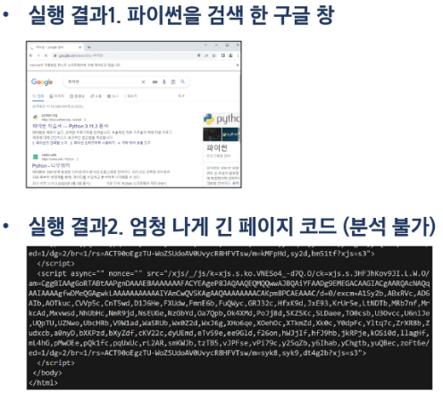

### 목차

> [1. 목표](#1-목표)
> 
> [2. 웹 크롤링 이해하기](#2-웹-크롤링-이해하기)
> 
> [3. 웹 크롤링 실습](#3-웹-크롤링-실습)

### 챕터의 포인트!

- 관통 Ver1. 키워드 검색량 분석을 위한 데이터 수집

- 관통 Ver2. 인증 페이지 구현

# 1. 목표

### 프로젝트 파악하기

- 웹 페이지 검색 결과를 코드에서 활용하기

### 파이썬으로 웹 페이지에 있는 정보를 가져오는 방법

1. 누군가 업로드해 둔 데이터를 다운로드 받기 (ex. 캐글)

2. 누군가 만들어 둔 API Server 를 활용하여 정보를 받아오기

3. **사람이 검색하는 것처럼 파이썬이 자동으로 검색 후 결과를 수집하는 방법**
   
   - 이러한 기술을 **크롤링(Crawling)** 이라고 한다.
   
   - 이번 프로젝트에서 사용할 기술

> Quiz. 데이터 사이언스에서는 먼저 데이터를 수집하는 것이 중요. Kaggle 같은 데이터 공유 플랫폼에서 수집된 데이터들을 쉽게 다운로드 받을 수 있지만 우리는 XXX 라는 기술을 사용하여 직접 데이터를 수집하고자 한다. 이 기술의 이름은? 
> 
> => 크롤링

### 프로젝트 목표

1. Django 없이 크롤링하는 방법 학습

2. 구글 검색 수를 크롤링하여 어떤 키워드가 더 많이 검색되는지 조사하기

# 2. 웹 크롤링 이해하기

### [복습] 데이터 사이언스 프로세스

- 필요한 정보를 추출하는 5가지 단계
1. 문제 정의 : 해결하고자 하는 문제 정의

2. 데이터 수집 : 문제 해결에 필요한 데이터 수집

3. 데이터 전처리(정제) : 실질적인 분석을 수행하기 위해 데이터를 가공하는 단계
   
   - 수집한 데이터의 오류 제거(결측치, 이상치), 데이터 형식 변환 등

4. 데이터 분석 : 전처리가 완료된 데이터에서 필요한 정보를 추출하는 단계

5. 결과 해석 및 공유 : 의사 결정에 활용하기 위해 결과를 해석하고 시각화 후 공유하는 단계

### [복습] 데이터 수집

- 데이터 수집은 다양한 기술과 방법을 활용할 수 있다.

- 웹 스크래핑(Web Scraping) : 웹 페이지에서 데이터를 추출하는 기술
  
  - 안 페이지

- **웹 크롤링(Web Crawling) : 웹 페이지를 자동으로 탐색하고 데이터를 수집하는 기술**
  
  - 여러 페이지 + 자동화

- Open API 활용 : 공개된 API 를 통해 데이터를 수집

- 데이터 공유 플랫폼 활용 : 다양한 사용자가 데이터를 공유하고 활용할 수 있는 온라인 플랫폼
  
  - 종류 : 캐글(Kaggle), Data.world, 데이콘(Dacon), 공공데이터포털 등

### 웹 크롤링이란?

- 여러 웹 페이지를 돌아다니며 원하는 정보를 모으는 기술

- 원하는 정보를 추출하는 스크래핑(Scraping) 과 여러 웹 페이지를 자동으로 탐색하는 크롤링(Crawling) 의 개념을 합쳐 웹 크롤링이라고 부름

- 즉, 웹 사이트들을 돌아다니며 **필요한 데이터를 추출하여 활용할 수 있도록 자동화된 프로세스**

### 웹 크롤링 프로세스

- 웹 페이지 다운로드
  
  - 해당 웹 페이지의 HTML, CSS, JavaScript 등의 코드를 가져오는 단계
  
  - JavaScript 역할 : 페이지 데이터 변경(동작)

- 페이지 파싱
  
  - 다운로드 받은 코드를 분석하고 필요한 데이터를 추출하는 단계
  
  - 전체 페이지에서 원하는 부분만 꺼내오기
  
  - 웹페이지 다운~ 페이지 파싱 : 여기까지 한 페이지

- 링크 추출 및 다른 페이지 탐색
  
  - 다른 링크를 추출하고, 다음 단계로 이동하여 원하는 데이터를 추출하는 단계
  
  - 더보기 눌러서 다음 내용(페이지) 확인 -> 페이징

- 데이터 추출 및 저장
  
  - 분석 및 시각화에 사용하기 위해 데이터를 처리하고 저장하는 단계
  
  - pandas, matplotlib 활용

# 3. 웹 크롤링 실습

### 준비 단계

- 실습 및 도전 과제에는 구글 검색 결과 페이지를 크롤링한다.

- 아래 필수 라이브러리를 설치 후 진행
  
  - `requests` : HTTP 요청을 보내고 응답을 받을 수 있는 모듈
    
    > requests.get(URL) : GET method
  
  - `BeautifulSoup` : HTML 문서에서 원하는 데이터를 추출하는 데 사용되는 파이썬 라이브러리
    
    - 페이지를 직접 요청(request)하면 굉장히 복잡하고 긴 문자열로 반환됨
    
    - 여기서 직접 원하는 데이터를 골라내기 힘들어 도움을 주는 라이브러리 이용
  
  - `Selenium` : 웹 애플리케이션을 테스트하고 자동화하기 위한 파이썬 라이브러리
    
    - 웹 페이지의 동적인 컨텐츠를 가져오기 위해 사용함 (검색 결과 등)

```bash
$ pip install requests beautifulsoup4 selenium
```

### 기본 예제 실습

- [Quotes to Scrape](https://quotes.toscrape.com/) 사이트를 활용
  
  - 여러 가지 주제에 관한 명언들을 모아 둔 데모 사이트

- requests 및 BeautifulSoup 라이브러리 활용 연습

- examples/example.py

```python
from bs4 import BeautifulSoup
import requests

def crawling_basic():
    # 가져올 url 문자열로 입력
    url = 'http://quotes.toscrape.com/tag/love/'  

    # requests의 get함수를 이용해 해당 url로 부터 html이 담긴 자료를 받아옴
    response = requests.get(url)    

    # # 우리가 얻고자 하는 html 문서가 여기에 담기게 됨
    html_text = response.text

    # print(type(html_text))  # 문자열 - 구조화가 안되어있다.

    # html을 잘 정리된(구조화된) 형태로 변환
    soup = BeautifulSoup(html_text, 'html.parser')

    # print(type(soup))  # bs4.BeautifulSoup - BeautifulSoup 가 제공하는 객체로 변환

    # print(soup.prettify())

    # 많이 쓰이는 메서드들
    # 1. 태그를 이용하여 하나 검색
    # find : 가장 먼저 만나는 a태그를 반환
    # main = soup.find('a')
    # print(f'제목 : {main.text}')

    # # 2. 해당 태그인 모든 요소 검색
    # a_tags = soup.find_all('a')  # 리스트로 반환
    # # print(f'a 태그 : {a_tags}')

    # for tag in a_tags:
    #     print(f'태그: {tag.text}')


    # # 3. CSS 선택자로 하나 검색
    # # 선택자가(태그 : p(이름), 클래스 : ".", id : "#") 일치하는 첫 번째글
    # word = soup.select_one('.text')
    # print(f'첫 번째 글 = {word.text}')

    # 4. CSS 선택자로 여러 개 검색하기
    words = soup.select('.text')
    for w in words:
        print(f'글 : {w.text}')

    # # 예쁘게 출력하기
    # # print(soup.prettify())


crawling_basic()
```

### 구글 기본 예제

- google_crawling.py

```python
from bs4 import BeautifulSoup
import requests

def crawling_basic():
    # 가져올 url 문자열로 입력
    url = 'https://www.google.com/search?q=%ED%83%95%EC%88%98%EC%9C%A1&oq=%ED%83%95%EC%88%98%EC%9C%A1&gs_lcrp=EgZjaHJvbWUyBggAEEUYOdIBCDE2MTBqMGo3qAIAsAIA&sourceid=chrome&ie=UTF-8'  

    # requests의 get함수를 이용해 해당 url로 부터 html이 담긴 자료를 받아옴
    response = requests.get(url)    

    # 우리가 얻고자 하는 html 문서가 여기에 담기게 됨
    html_text = response.text

    print(html_text)

    # with : 안에 있는 코드의 실행이 끝나면 메모리를 지워버림
    # 텍스트를 파일로 저장
    with open('soup.txt', 'w', encoding='utf-8') as file:
        file.write(html_text)

crawling_basic()
```

- 실행 결과 Quotes to Scrape 사이트와 달리 크롤링한 정보가 html과 다름 검색한 글자도 찾을 수 없음

- 차이점 : Quotes to Scrape는 자바스크립트가 없다.

- 구글은 자바스크립트가 서버에서 데이터를 받아오는데, 받아오기 전까지는 그 내용을 알 수 없다.

- 정리
  
  - `requests` 모듈은 정적인 부분(서버가 이미 가지고 있는 데이터)만 다운로드 가능. 동적인 컨텐츠(검색을 통해 변경되는 부분)를 다운로드 받을 수 없다!
  
  - 구글은 일부는 정적인 부분, 일부는 동적인 부분으로 되어 있어 `requests`로 `get`하면 결과가 동일하지 않다. -> `requests`를 쓰면 안 된다.
  
  - 동적인 컨텐츠를 받을 수 있는 방법 : `selenium`
  
  - `selenium` : 개발자들이 동적 웹 테스트를 위해서 많이 사용 -> 크롤링에서 활용

- examples/example1.py

```python
from bs4 import BeautifulSoup
from selenium import webdriver

def get_google_data(keyword):
    url = f"https://www.google.com/search?q={keyword}"

    # 크롬 브라우저가 열린다. 이 때, 동적인 내용들이 모두 채워짐
    driver = webdriver.Chrome()
    driver.get(url)

    # 열린 페이지 소스를 받아옴
    html = driver.page_source  # 문자열 데이터를 다운로드
    soup = BeautifulSoup(html, "html.parser")  # 파싱을 위해 변환

    # 눈으로 보기 좋게 출력
    print(soup.prettify())

    # 파일로 저장하여 확인하기
    with open('soup.txt', 'w', encoding="utf-8") as file:
        file.write(soup.prettify())

    driver.quit()


# 검색 키워드 설정
keyword = "탕수육"
get_google_data(keyword)
```



- 완벽하게 동일하지는 않지만 동적인 부분이 해결된 후의 페이지를 볼 수 있다.

- `requests`는 그냥 요청만 보내지만 `selenium`은 페이지를 열어서 내용을 긁어옴

### 구글 검색 결과 분석하기

- "F12" 혹은 "우클릭 - 검사" 로 크롬 개발자 도구를 열어 활용

- id와 class 이름이 이상하다!
  
  - id는 새로고침마다 변한다.
  
  - 사람이 정하는 것이 아니라 프로그래밍 되어 있다.
  
  - 즉, **id 값이 아닌 class와 태그를 기준으로 정보를 추출**해야 한다.

- 예시1. 검색 결과 개수 출력

- div 태그, id는 "result-stats"

- example2.py

```python
from bs4 import BeautifulSoup
from selenium import webdriver

def get_google_data(keyword):
    url = f"https://www.google.com/search?q={keyword}"
    # 크롬 브라우저가 열린다. 이 때, 동적인 내용들이 모두 채워짐
    driver = webdriver.Chrome()
    driver.get(url)

    # 열린 페이지 소스를 받아옴
    html = driver.page_source 
    soup = BeautifulSoup(html, "html.parser")

    # 개발자 도구로 원하는 부분의 id 찾기
    # div 태그 중 id 가 result-stats 인 요소 검색
    result_stats = soup.select_one("div#result-stats")
    print(result_stats.text)

    driver.quit()

# 검색 키워드 설정
keyword = "탕수육"
get_google_data(keyword)
```

> DevTools listening on ws://127.0.0.1:51593/devtools/browser/854da143-6328-40a9-95ef-cc77904da823
> 
> 검색결과 약 6,320,000개 (0.26초)

- 예시2. 검색 결과 페이지들의 제목 가져오기

  - 공통적으로 결과를 감싸는 div에는 "g" 클래스, 제목에는 "LC20lb MBeuO DKV0Md" 클래스를 가지고 있다.

- example3.py

```python
from bs4 import BeautifulSoup
from selenium import webdriver

def get_google_data(keyword):
    url = f"https://www.google.com/search?q={keyword}"
    # 크롬 브라우저가 열린다. 이 때, 동적인 내용들이 모두 채워짐
    driver = webdriver.Chrome()
    driver.get(url)

    # 열린 페이지 소스를 받아옴
    html = driver.page_source 
    soup = BeautifulSoup(html, "html.parser")

    # 특정 부분의 상위 요소부터 찾기
    # div 태그 중 g 클래스를 가진 모든 요소 선택
    g_list = soup.select("div.g")
    # 해당 요소를 반복하며
    for g in g_list:
        # 요소 안에 LC20lb MBeuO DKV0Md 클래스를 가진 특정 요소 선택
        # 클래스들을 띄어쓰기 하지 않고 붙여써야 한다.
        title = g.select_one(".LC20lb.MBeuO.DKV0Md")
        # 요소가 존재 한다면
        if title is not None:
            title_text = title.text
            print('제목 = ', title_text)

# 검색 키워드 설정
keyword = "탕수육"
get_google_data(keyword)
```

- 출력 결과

> DevTools listening on ws://127.0.0.1:51656/devtools/browser/3ddc625a-1d47-4c8c-b0f2-4b175aaa5a52
>  
> 제목 =  탕수육
>
> 제목 =  초보도 성공하는 돼지고기 탕수육
>
> 제목 =  탕수육 - 위키백과, 우리 모두의 백과사전
>
> 제목 =  궈바오러우 - 위키백과, 우리 모두의 백과사전
>
> 제목 =  크레잇 찹쌀등심탕수육 스틱형1kg | 상품상세
>
> 제목 =  검색결과 >탕수육, 이마트몰, 당신과 가장 가까운 이마트 - SSG
>
> 제목 =  [고메] 바삭쫄깃한 탕수육
>
> 제목 =  고메 탕수육 450g | 상품상세
>
> 제목 =  찹쌀탕수육(탕수육300g,소스200g)

### [참고] BeautifulSoup4 요소 선택 메서드 종류

- `find()` : 태그를 사용하여 요소를 검색. 첫 번째로 일치하는 요소를 반환

- `find_all()` : 태그를 사용하여 요소를 검색. 모든 일치하는 요소를 리스트로 반환

- `select()` : CSS 선택자를 사용하여 요소를 검색. 모든 일치하는 요소를 리스트로 반환

- `select_one()` : CSS 선택자를 사용하여 요소를 검색. 첫 번째로 일치하는 요소를 리스트로 반환

- `find_parent() / find_next_sibling() / find_previous_sibling()` : 태그를 사용하여 요소를 검색. 각각 일치하는 요소의 부모 / 다음 형제 요소/ 이전 형제 요소를 반환

### Django에서 활용하기

### 크롤링 결과 저장하기

- Django에서 크롤링을 진행 후 아래 검색어와 게시글 제목을 데이터베이스에 저장

- models.py를 어떻게 작성해야할까? 

  - title은 여러개의 제목들이 모두 저장됨 -> 정석적인 방법은 다음에... 이번에는 레코드를 여러개 만듦

- crawlings/urls.py
app_name="crawlings"
urlpatterns = [
    path('', views.index, name="index"),
]
- crawlings/models.py

```python
class Article(models.Model):
    query = models.TextField()
    title = models.TextField()
```

- crawlings/index.html

```django
<h1>메인 페이지</h1>


  <form action="" method="POST">
    
    <label for="query">검색어: </label>
    <input type="text" id="query" name="query">
    <button>검색하기</button>
  </form>

  
    <p>{{ forloop.counter }}: {{ result.title }}</p>
    <hr>
  

  <p>먼저 로그인해주세요.</p>

```

- crawlings/views.py

```python
from django.shortcuts import render
from .models import Article
from bs4 import BeautifulSoup
from selenium import webdriver
from selenium.webdriver.chrome.options import Options


def crawling(keyword):
    url = f"https://www.google.com/search?q={keyword}"
    # Chrome 옵션 설정
    options = Options()
    options.add_argument('--headless')  # 브라우저를 숨기고 백그라운드에서 실행

    # 크롬 브라우저가 열린다. 이 때, 동적인 내용들이 모두 채워짐
    driver = webdriver.Chrome(options=options)
    driver.get(url)

    # 열린 페이지 소스를 받아옴
    html = driver.page_source
    soup = BeautifulSoup(html, "html.parser")

    # div 태그 중 g 클래스를 가진 모든 요소 선택
    g_list = soup.select("div.g")

    results = []

    # 해당 요소를 반복하며
    for g in g_list:
        # 요소 안에 LC20lb MBeuO DKV0Md 클래스를 가진 특정 요소 선택
        title = g.select_one(".LC20lb.MBeuO.DKV0Md")
        title_text = ''
        # 요소가 존재 한다면
        if title is not None:
            title_text = title.text

        results.append(title_text)

    return results


def index(request):
    results = []
    if request.POST:
        query = request.POST.get('query')
        data = crawling(query)
        # 저장
        for title in data:
            # 1. Article 이 기존에 존재하지 않으면
            # 기본 코드 - 아래 처럼 코드를 짜면 생성된 id 를 가져오는 코드가 추가로 필요하다.
            # if not Article.objects.filter(query=query, title=title).exists():
            #     Article.objects.create(query=query, title=title)

            # get_or_create : 있다면 조회, 없다면 생성
            article, created_article = Article.objects.get_or_create(
                query=query, title=title
            )

            results.append(article)

    context = {
        'results': results,
        # [도전] 버그 없도록 수정해보기!
        # 'results': Article.objects.filter(query=query)
    }

    return render(request, 'crawlings/index.html', context)
```

- 인증된 유저만 크롤링 결과를 볼 수 있도록 구성

  - 프론트, 백 둘 모두에서 처리해야 한다.