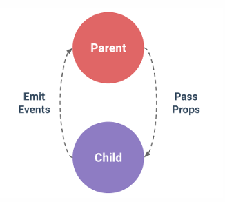
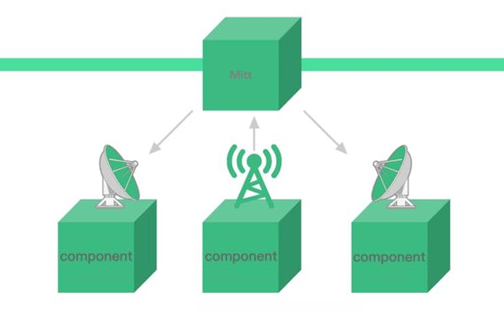
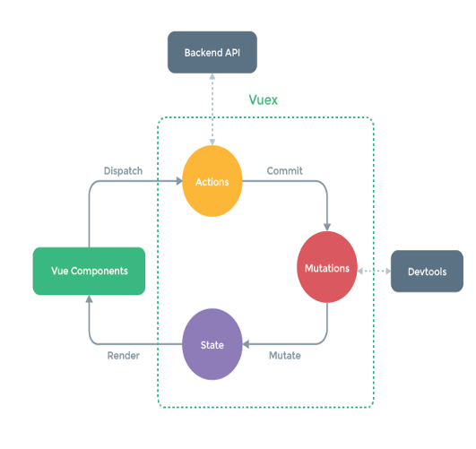

### 목차

> [5. Vue의 데이터 전송 방법](#5-vue의-데이터-전송-방법)
>
> [실습 : Props/Emit](#실습--propsemit)
>
> [실습 : Mitt](#실습--mitt)
>
> [실습 : Vuex](#실습--vuex)

# 5. Vue의 데이터 전송 방법

### ~~EventBus(Props, Emit)~~ Props, Emit

- EventBus와 Props/Emit은 다르다는데, 자료에 오타가 많은 것 같다.

- 부모 자식간에 데이터를 전달하기 위한 props, emit

  - `props` : 부모 -> 자식

  - `emit` : 자식 -> 부모

- 인접한 부모 자식간에만 전달이 가능하다.

- 복잡한 구조에서 사용하기 어렵다.




### ~~EventBus(Global)~~ Mitt

- Component <-> ~~Bus~~ Mitt <-> Component 간 데이터 전송

- Vue3에서 Global EventBus가 Mitt인 것 같다.

- 복잡한 관계에서도 바로 데이터 전송이 가능하다.

- Component간 데이터 흐름 파악이 어려움.

- Vue3부터 EventBus를 지원하지 않고 mitt 사용



### Vuex

- Vuex의 State에서 공간에서 데이터 관리하고 Component는 State를 주시

- 값이 바뀌면 State를 공유하는 모든 Compnent 값이 변경되어 보임.

- Props, emit, eventbus보다 설정 및 관리가 번거로운 단점이 있다.



### 어느 개발 방법을 선택할 것인가?

- Props, emit -> Mitt (Library) -> Vuex로 갈수록 복잡도가 커져 관리 Point가 증가함.

- 소규모의 프로젝트라면 Mitt를 활용해도 문제는 없음. 다만 Vuex를 활용하는 것을 지향함.

- 내가 활용하는 Framework 데이터 전송 방법을 이해하고 적재적소에 활용할 줄 알아야 함.


# 실습 : Props/Emit

### App.vue

```html
<div class="container">
  <nav>
    <RouterLink :to="{ name: 'PropsEmitView' }">Props/Emit</RouterLink> |
    <RouterLink :to="{ name: 'MittView' }">Mitt</RouterLink> |
    <RouterLink :to="{ name: 'VuexView' }">Vuex</RouterLink>
  </nav>
  <RouterView />
</div>
```

```javascript
import { RouterView, RouterLink } from 'vue-router'
```

### PropsEmitView.vue

```html
<div>
  <div>
    <h2>Props/Emit</h2>
    <p>(부모-자식 간 EventBus 사용)</p>
    <p>부모 컴포넌트의 데이터, 그 데이터를 업데이트할 수 있는 event를 전달하여, 자식 컴포넌트에서 부모 컴포넌트의 데이터를 바인딩하고, 업데이트할 수 있다.</p>
  </div>
  <div class="row">
    <div class="col-8">
      <ChildAComponent @ox-event="oxEvent" />
    </div>
    <div class="col-4">
      <ChildBComponent :msg="ox" />
    </div>
  </div>
</div>
```

```javascript
import ChildAComponent from '@/components/ChildAComponent.vue'
import ChildBComponent from '@/components/ChildBComponent.vue'

let ox

const oxEvent = function (...args) {
  // console.log(args)
  ox = args[0]
}
```

- child A : 클릭 이벤트 : `$emit('oxEvent', '?')` : 이벤트와 추가인자 전달

- Parent : `@ox-event="oxEvent"` : `ox-event`로 emit 이벤트 수신, `oxEvent` 함수 실행 -> props으로 전달할 문자열 O, X 지정

- Parent : `:msg="ox"` : ox 문자열 값을 props인 `msg`에 담고 `:`를 이용해 동적으로 전달

- child B : `{{ msg }}` 를 통해 props으로 전달받은 문자열 출력

### ChildAComponent.vue

```html
<div>
  <div class="card">
    <ul class="list-group list-group-flush">
      <li class="list-group-item">
        <a href="#" @click="$emit('oxEvent', 'O')">O</a>
      </li>
      <li class="list-group-item">
        <a href="#" @click="$emit('oxEvent', 'X')">X</a>
      </li>
    </ul>
  </div>
</div>
```

- 주어진 화면과 같은 형태로 만들면서 새로고침 방지를 위해 `href="#"`를 사용했다. 화면이 작아서 맨위로 올라가도 상관없다.

### ChildBComponent.vue

```html
<div>
  <div class="card">
    <ul class="list-group list-group-flush">
      <li class="list-group-item">Answer<br>
        {{ msg }}
      </li>
    </ul>
  </div>
</div>
```

```javascript
defineProps({
  msg: String
})
```

# 실습 : Mitt

### main.js

```javascript
import mitt from 'mitt'

const emitter = mitt()

app.config.globalProperties.emitter = emitter
```

- 위 코드 추가

### ChildAMittComponent.vue

```html
<div>
  <div class="card">
    <ul class="list-group list-group-flush">
      <li class="list-group-item">
        <!-- <a href="#" @click="oxEvent('O')">O</a> -->
        <a href="#" @click="emitter.emit('oxEvent', 'O')">O</a>
      </li>
      <li class="list-group-item">
        <a href="#" @click="oxEvent('X')">X</a>
      </li>
    </ul>
  </div>
</div>
```

```javascript
import { getCurrentInstance } from 'vue'

const instance = getCurrentInstance()
const emitter = instance.appContext.config.globalProperties.emitter

const oxEvent = (msg) => {
  emitter.emit('oxEvent', msg)
  // console.log('emit :', msg)
}
```

- vue3에서는 Composition API를 사용할 때 setup 함수 내에서 `this`를 사용할 수 없다.

- 전역 이벤트 버스인 `emitter`를 사용하기 위해 현재 실행중인 컴포넌트의 인스턴스를 가져와 이를 통해 전역적으로 등록된 emitter 객체에 접근한다.

- html에서 emitter 함수를 바로 사용해도 된다.

### ChildBMittComponent.vue

```html
<div>
  <div class="card">
    <ul class="list-group list-group-flush">
      <li class="list-group-item">Answer<br>
        {{ msg }}
      </li>
    </ul>
  </div>
</div>
```

```javascript
import { getCurrentInstance, onMounted, onUnmounted, ref } from 'vue'

const instance = getCurrentInstance()
const emitter = instance.appContext.config.globalProperties.emitter

const msg = ref('')

onMounted(() => {
  emitter.on('oxEvent', (ox) => {  // 'ox-event 불가능'
    msg.value = ox
    // console.log(ox)
  })
})

onUnmounted(() => {
  emitter.off('oxEvent')
})
```

- ChildA에서 `emit`으로 이벤트를 발생시킨다.

- ChildB에서 `on`을 이용해 이벤트 리스너를 등록한다. 이때 등록된 함수를 통해 ox값이 바뀌게 되고 `ref`로 선언된 반응형 변수 값에 따라 화면이 업데이트된다.

- `off`를 이용해 `on`으로 등록했던 이벤트를 제거할 수 있다.

- 이벤트 리스너는 컴포넌트가 언마운트될 때 off를 이용해 제거해야 한다.

# 실습 : Vuex

### main.js

```javascript
import store from './stores/store'

app.use(store)
```

- 위 코드 추가

### stores/store.js

```javascript
import { createStore } from 'vuex'

export default createStore({
  state: {  // 사용할 데이터 저장
    msg: ''
  },
  mutations: {  // 유일하게 상태(state)를 변경 가능, 동기적, commit() 메서드로 호출
    oxEvent (state, ox) {
      state.msg = ox
    }
  },
  actions: {},  // 비동기 로직 처리, dispatch() 메서드를 통해 호출
  getters: {} // state를 기반으로 계산된 값을 반환, 첫 번째 인자로 state를 받음
})
```

- `state` : 

  - 사용할 데이터 저장

- `mutations` : 

  - 유일하게 상태(state)를 변경 가능
  
  - 동기적
  
  - `commit()` 메서드로 호출

- `actions` : 

  - 비동기 로직 처리
  
  - `dispatch()` 메서드를 통해 호출

- `getters` : 

  - state를 기반으로 계산된 값을 반환
  
  - 첫 번째 인자로 state를 받음

### ChildAVuexComponent.vue

```html
<div>
  <div class="card">
    <ul class="list-group list-group-flush">
      <li class="list-group-item">
        <a href="#" @click="oxEvent('O', $event)">O</a>
      </li>
      <li class="list-group-item">
        <a href="#" @click="oxEvent('X', $event)">X</a>
      </li>
    </ul>
  </div>
</div>
```

```javascript
import { useStore } from 'vuex'

const store = useStore()

const oxEvent = (ox, event) => {
  event.preventDefault()
  store.commit('oxEvent', ox)
  // console.log(ox)
}
```

- `event.preventDefault()` : 메인 페이지로 이동 차단

- `commit()`을 통해 vuex의 state 값 변경

### ChildBVuexComponent.vue

```html
<div>
  <div class="card">
    <ul class="list-group list-group-flush">
      <li class="list-group-item">Answer<br>
        {{ msg }}
      </li>
    </ul>
  </div>
</div>
```

```javascript
import { computed } from 'vue'
import { useStore } from 'vuex'

const store = useStore()
// computed로 묶어야 state의 data값이 바뀌는 것을 감지
const msg = computed(() => store.state.msg)
```

- `computed()`를 이용해 vuex의 state 값 캐싱 및 추적

  - 캐싱(Caching) : 데이터를 미리 저장해 두고, 재사용할 수 있도록 하는 기술
