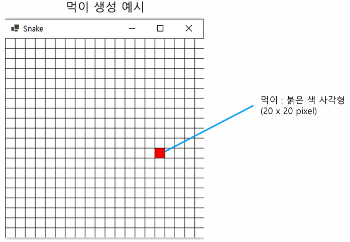

### 목차

> [6. 간단한 스네이크 게임 구현](#6-간단한-스네이크-게임-구현)
>
> [실습](#실습)

# 6. 간단한 스네이크 게임 구현

- **update** : 화면 갱신

- **rendering** : 화면에 그리기

- **key input** : 키 입력

- **객체의 충돌 체크** : A와 B가 닿았을 때

- **state 변화** : 상태 변화

### 전체 맵 그리기

- 전체 맵 : **가로 400 x 세로 400 pixel** 크기의 **스크린 창 생성성**

- 각 칸의 크기 : **20 x 20 pixel으로 고정정**

=> 총 20 x 20 칸

- GUI 도구들을 이용해서 검은색 선을 그어서 전체 맵을 표시 (격자 무늬)


### 먹이 생성

- 먹이는 **랜덤한 칸에 생성**

- **20 x 20 pixel의 붉은 색 box로 표현 (붉은 칸)**

- 먹이가 생성될 때 현재 뱀의 머리, 몸통 위치에 생성되면 안된다.

- 뱀이 먹이를 먹을 경우 다시 먹이의 위치가 랜덤하게 reset되어야 한다.



### 뱀의 이동

- 뱀의 머리는맵 20 x 20에 랜덤하게 생성하며, **20 x 20 pixel의 초록색 box로 표현**한다.

- 뱀의 머리는 현재 정해진 방향으로 10 frame(0.1초에 1번씩 update)으로 **자동으로 이동**한다.

- 방향키 상, 하, 좌, 우의 입력이 있을 때마다 뱀의 머리가 이동하는 방향이 해당 화살표 방향으로 변경된다.

- 뱀의 몸통은 항상 뱀의 머리 방향을 따라 1칸씩 움직인다.


### 뱀의 성장

- 뱀이 먹이를 먹을 때 마다 뱀의 크기는 1칸씩 길어진다.

  - 먹이 칸을 초록색으로 바꾸면서 뱀의 머리로 하면 될 듯

- 뱀이 먹이를 먹을 때 마다 먹이의 위치는 reset 되며, 먹이의 위치가 reset 될 때 반드시 현재 뱀의 위치와 중복되지 않게 생성되어야 한다.

- 뱀의 늘어날 수 있는 몸의 개수는 제한을 두지 않는다.


### 게임 오버 조건

- 뱀의 머리가 자신의 몸에 닿으면 게임이 종료괸다.

- 뱀의 머리가 화면 밖으로 나갈 경우 게임이 종료된다.

- 게임이 종료되면, "게임 오버입니다."라는 메시지 창을 띄운다.

- 게임 오버 창을 닫게 되면 다시 게임을 시작한다. (뱀의 크기 및 위치, 먹이 위치 초기화)


### 참고 내용

- 선 그리기, 도형 채우기 등 기본적인 **Graphic User Interface (GUI) 사용법** 익히기

- **Frame의 개념** 익히기 (객체의 update => draw가 1회 일어나는 process : 이 과정이 1초에 수행한 횟수를 Frame이라고 함)

  - 60frame : 1초에 process(update->draw) 60회

- **물체의 충돌 체크 개념** 익히기

- **뱀의 이동 알고리즘** 익히기

### 기대 효과

- 게임 제작에 대한 기본적인 감을 익힐 수 있다.

- 게임 객체들의 이동에 대해 배울 수 있다.

- 자신감... UP!

# 실습

### 기본 설정
```python
import sys
import pygame
from pygame.locals import *
import random
from tkinter import messagebox, Tk

# 색
WHITE = (255, 255, 255)
BLACK = (0, 0, 0)
RED = (200, 76, 5)
GREEN = (99, 140, 109)

# 초당 프레임
FPS = 10
frame_per_sec = pygame.time.Clock()

# 게임 창 설정
KAN = 20    # 한 칸 크기
MARGIN_GARO = 10    # 가로 여백
MARGIN_SERO = 30    # 세로 여백백

# 이동방향(상, 하, 좌, 우, 정지)
UP = (0, -1)
DOWN = (0, 1)
LEFT = (-1, 0)
RIGHT = (1, 0)
STOP = (0, 0)


# 칸 그려주는 함수
def draw_rec(x, y, color, display):
    rect = pygame.Rect(x*KAN + MARGIN_GARO + 1, y*KAN + MARGIN_SERO + 1, KAN-1, KAN-1)
    pygame.draw.rect(display, color, rect)
```

### 뱀 클래스

```python
# 뱀 설정
class Snake():
    def __init__(self):
        self.create()


    # 뱀 생성
    def create(self):
        self.length = 1
        self.positions = [(random.randrange(0, 20), random.randrange(0, 20))]
        self.direction = STOP
    

    # 뱀 그리기
    def draw(self, display):
        for x, y in self.positions:
            draw_rec(x, y, GREEN, display)


    # 뱀 이동
    def move(self, display):
        x, y = self.positions[0]    # 머리 위치
        dx, dy = self.direction     # 이동 방향
        nx, ny = (x + dx, y + dy)   # 이동 위치

        if (nx, ny) in self.positions[2:]: # 자기 몸이랑 부딛히면
            return True
        elif nx < 0 or nx >= 20 or ny < 0 or ny >= 20:  # 벽이랑 부딛히면
            return True
        else:
            self.positions.insert(0, (nx, ny))
            # 이렇게 하면 먹이 먹었을 때 삽입 등 할 필요 없어짐
            if len(self.positions) > self.length:
                px, py = self.positions.pop()
                draw_rec(px, py, WHITE, display)
        return False


    # 뱀 식사
    def eat(self):
        self.length += 1
```

### 먹이 클래스

```python
# 먹이 생성, 그리기
class Food():
    def __init__(self):
        self.create()

    def create(self):
        self.position = (random.randrange(0, 20), random.randrange(0, 20))

    def draw(self, display):
        draw_rec(self.position[0], self.position[1], RED, display)
```

### 게임 클래스

```python
# 게임 설정
class Game():
    def __init__(self):
        self.snake = Snake()
        self.food = Food()
        self.running = True
        self.game_display = pygame.display.set_mode((420, 440))   # 가로 420 x 세로 440 pixel


    # 키 입력
    def process_event(self):
        for event in pygame.event.get():
            if event.type == pygame.QUIT:
                return True
            elif event.type == pygame.KEYDOWN:
                if event.key == pygame.K_UP:
                    self.snake.direction = UP
                elif event.key == pygame.K_DOWN:
                    self.snake.direction = DOWN
                elif event.key == pygame.K_LEFT:
                    self.snake.direction = LEFT
                elif event.key == pygame.K_RIGHT:
                    self.snake.direction = RIGHT
        return False


    # 배경 그리기
    def set_background(self):
        # 배경 창 그리기
        self.game_display.fill(WHITE)    # 배경색
        pygame.display.set_caption('SNAKE GAME')    # 창 이름

        # 배경 칸 나누기 line(창, 색, 좌표, 테두리 굵기기)
        for i in range(0, 21):
            pygame.draw.line(self.game_display, BLACK, (i*KAN + MARGIN_GARO, MARGIN_SERO), (i*KAN + MARGIN_GARO, 400 + MARGIN_SERO), 1)
            pygame.draw.line(self.game_display, BLACK, (MARGIN_GARO, i*KAN + MARGIN_SERO), (400 + MARGIN_GARO, i*KAN + MARGIN_SERO), 1)


    # 실행
    def run(self, display):
        self.set_background()
        over = self.snake.move(display)
        if over:
            self.game_over()
            self.snake.create()
            self.food.create()
        self.eat(self.snake, self.food)
        self.score(self.snake.length, display)
        self.snake.draw(display)
        self.food.draw(display)


    # 먹이 먹으면
    def eat(self, snake, food):
        if snake.positions[0] == food.position:
            snake.eat()
            food.create()


    # 점수표
    def score(self, length, display):
        score = 'Score : ' + str(length)
        # SysFont(글꼴, 크기, 굵기, 이탤릭)
        font = pygame.font.SysFont('timesnewroman', 20, False, False)
        # render(문자열, 안티앨리어싱, 색)
        text = font.render(score, True, BLACK)
        text_rect = text.get_rect()
        text_rect.x, text_rect.y = (10, 5)
        pygame.draw.rect(display, WHITE, text_rect)
        display.blit(text, text_rect)


    # 게임오버
    def game_over(self):
        root = Tk()
        root.withdraw()
        if messagebox.showinfo('게임 오버!', 'score : ' + str(self.snake.length) + '\n게임 오버입니다.'):
            game = Game()
```

- 게임 오버 이후 새로 생성해줘야 오류가 안 난다.

### main

```python
# pygrame 기능 사용 시작
pygame.init()


# 게임 실행
game = Game()
status = False

while game.running:
    status = game.process_event()
    if status:  # 창 x 누르면 종료
        pygame.quit()
        sys.exit()
    game.run(game.game_display)
    pygame.display.update()
    frame_per_sec.tick(FPS)
```
