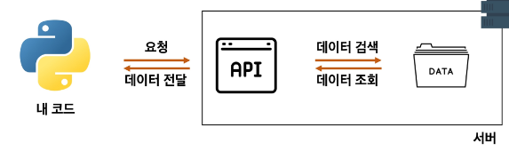

### 목차

> API 이해하기
> 
> 날씨 데이터 수집


# 관통 프로젝트

- 금융 상품 비교

- 영화 추천 서비스


☠☠☠☠☠☠☠☠☠☠☠☠

☠☠☠☠😴😴😴😴☠💤💤☠

☠☠😴😴😴😴😴💤💤😴☠☠

☠😴😴😴😴😴💤💤😴😴😴☠

☠😴😴😴😴😴😴😴😴😴😴☠

☠😴😴💤💤😴😴💤💤😴😴☠

☠☠😴😴😴💤💤😴😴😴☠☠

☠☠☠☠😴😴😴😴☠☠☠☠

☠☠☠☠☠☠☠☠☠☠☠☠


# 실습 목표

- 파이썬으로 인터넷에 있는 날씨 정보를 가져와 내가 원하는 정보만 출력


### 전문용어 이해

- 서버 : 부탁을 받으면 처리해주거나, 부탁대로 원하는 값을 돌려주는 역할

> ex. 메인 화면 돌려줌

- 클라이언트 : 부탁하는 역할

> ex. 메인 화면 요청


### 클라이언트가 서버에 요청하는 방법 2가지

- 웹 브라우저(크롬)을 켜서 주소창에 주소(URL)를 입력
  
  - [https://fakestoreapi.com/carts](https://fakestoreapi.com/carts)
  
  - ~com 까지가 서버 주소, 뒤쪽(carts)이 내가 원하는 데이터의 요청 주소

- 서버에 정보를 요청하는 파이썬 코드 작성
  
  - 터미널 창에서 `$ pip install requests`
  
  - `requests `: 파이썬에서 서버에 요청을 보낼 수 있는 도구, 패키지, 모듈(like 브라우저)
  
  - `pip` : 파이썬 패키지 관리 시스템
  
  - `$ pip list` : 설치 목록 확인

```python
import requests

url = 'https://fakestoreapi.com/carts'
data = requests.get(url).json()
print(data)
```

- `url` : 요청을 보내는 서버의 주소

- `requests.get(url)` : 해당 서버(url)에 데이터를 달라고 요청을 보내는 함수

- `.json()` : 내부의 데이터를 JSON(파이썬 딕셔너리와 비슷함) 형태로 변환해주는 함수

### API

- 클라이언트가 원하는 기능을 수행하기 위해서 서버 측에서 만들어 놓은 프로그램

- ex. 데이터 저장, 조회, 수정, 삭제 등등

- 서버 측에서 특정 주소로 요청이 오면 정해진 기능을 수행하는 API를 미리 만들어 둠

- 클라이언트는 서버가 미리 만들어 놓은 주소로 요청 보냄



### 날씨 정보를 제공하는 API

- 날씨 정보를 수집하기 위해 `날씨 정보를 가지고 있는 서버`, `해당 서버가 제공하는 API` 필요

### 오픈 API

- 외부에서 사용할 수 있도록 무료로 개방(open)된 API

- 사용법은 공식 문서(Docs)에 명시

- 프로젝트에서 사용되는 API :
  
  - OpenWeatherMap API :가상 데이터 및 날씨 정보를 제공하는 오픈 API
  
  - 금융상품통합비교공시 API : 금융감독원에서 제공하는 금융 상품 정보를 제공하는 오픈 API

- 주의사항 :
  
  - `API Key` : 악성 사용자 or 너무 많은 동시 요청을 서버가 견디지 못 해서 사용
  
  - **깃헙에 올리지 않게 주의!!**
  
  - 사용자 인증/회원가입 하면 서버에서 API 키 발급해줌
  
  - 서버에 요청할 때마다 해당 API를 함께 보내 정상적인 사용자인 것을 확인
  
  - 일부 오픈 API는 사용량이 제한되어있음. 일일/월간 사용량 제한 확인 (사용량 초과될 경우 요금 청구될 수 있음)

### JSON

- API가 반환하는 코드

- API가 사용하는 데이터 형식 - JSON

- JavaScript Object Notation의 약자. 직역하면 '자바스크립트 객체 표기법'

- 데이터를 저장하거나 전송할 때 많이 사용되는 경량의 텍스트 기반의 데이터 형식

- 통신 방법이나 프로그래밍 문법이 아니라 단순히 데이터를 표현하는 표현 방법 중 하나

- 특징 : 데이터는 중괄호`{}`로 둘러싸인 키-값 쌍의 집합으로 표현됨. 

- 키=문자열 /값=다양한 데이터 유형 가질 수 있음. 값은 쉼표(,)로 구분

- 파이썬 : JSON 활용 기능 가짐.
  
  - 파싱(Parsing) : 데이터를 의미 있는 구조로 분석하고 해석
  
  - json.loads() : JSON 형식의 문자열을 파싱하여 python Dictionary로 반환


# 날씨 데이터 수집

### OpenWeatherMap API

- 기상 데이터 및 날씨 정보를 제공하는 오픈 API

- 전세계 날씨 데이터를 가져와 날씨, 일일 및 시간 별 예보 등 다양한 정보를 얻을 수 있음

- API 사용량 제한 : 60 calls/minute, 1,000,000 calls/month


### 실습

- [Current weather data - OpenWeatherMap](https://openweathermap.org/current#name)

- 위도/경도로 날씨 불러오기

```python
import requests
from pprint import pprint

# 서울의 위도 : 37.56 / 경도 : 126.97
lat = 37.56
lon = 126.97
api_key = ''

url = f'https://api.openweathermap.org/data/2.5/weather?lat={lat}&lon={lon}&appid={api_key}'

response = requests.get(url).json()
print(response)
pprint(response)


```

- 도시 이름으로 날씨 불러오기

```python
import requests
from pprint import pprint

# "Tokyo, JP"
# "New York, Us"
city = "Seoul, KR"
api_key = ''

url = f'https://api.openweathermap.org/data/2.5/weather?q={city}&appid={api_key}'
response = requests.get(url).json()
pprint(response)


```


