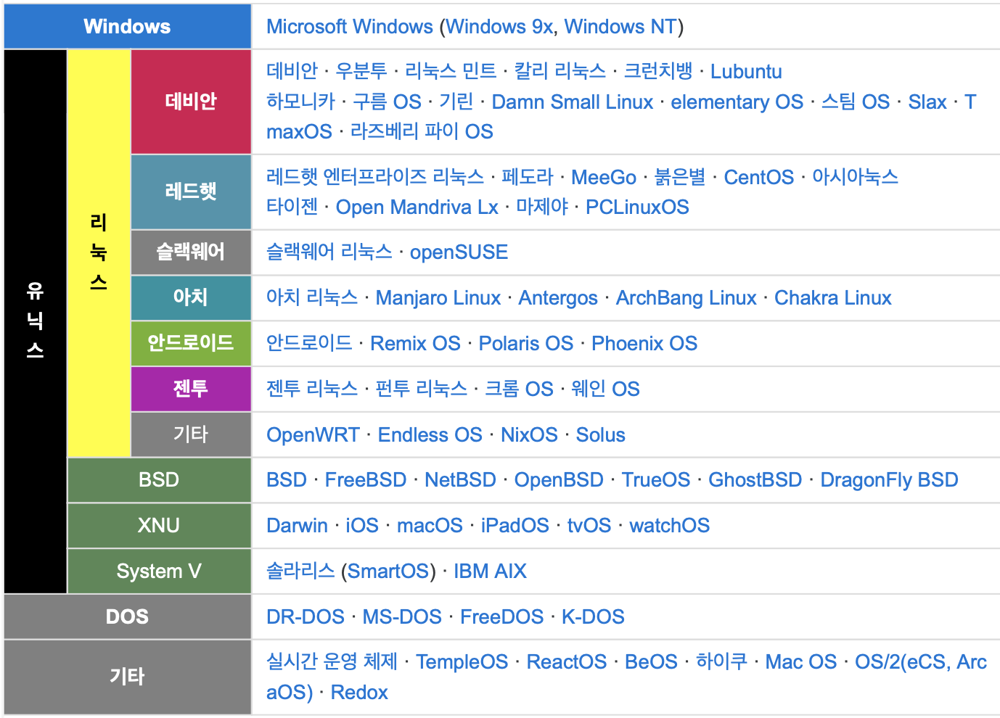

# MarkText

- test.md

> 🟨🟨🟨🟨🟨🟨🟨🟨🟨🟨🟨    🟥🟥🟥🟥🟨🟥🟥🟥🟥🟥🟥
> 
> 🟨🟨🟥🟥🟥🟨🟥🟥🟥🟨🟨    🟥🟥🟥🟥🟨🟨🟥🟥🟥🟥🟥
> 
> 🟨🟥🟥🟥🟥🟥🟥🟥🟥🟥🟨    🟥🟥🟥🟨🟨🟨🟨🟨🟨🟨🟨
> 
> 🟨🟨🟥🟥🟥🟥🟥🟥🟥🟨🟨    🟨🟨🟨🟨🟨🟨🟨🟨🟨🟥🟥
> 
> 🟨🟨🟨🟨🟥🟥🟥🟨🟨🟨🟨    🟥🟥🟥🟨🟨🟨🟨🟨🟥🟥🟥
> 
> 🟨🟨🟨🟨🟨🟥🟨🟨🟨🟨🟨    🟥🟥🟥🟨🟨🟥🟥🟨🟨🟥🟥
> 
> 🟨🟨🟨🟨🟨🟨🟨🟨🟨🟨🟨    🟥🟥🟨🟥🟥🟥🟥🟥🟥🟨🟥

# CLI

- Command Line Interface

- window만 unix - linux 라인을 타지 않음



- 이미지 출처 : [https://daeun28.github.io/컴퓨터공학-스터디/post24/](https://daeun28.github.io/%EC%BB%B4%ED%93%A8%ED%84%B0%EA%B3%B5%ED%95%99-%EC%8A%A4%ED%84%B0%EB%94%94/post24/)

#### 문법

- ~ : home directory

- ls, mkdir, ../ , rm, rm-r, start, 절대/상대경로 등등

- 가장 중요한 것 : 내가 어디에서 작업하고 있는지 알아한다.

---

# GIT

- 버전 관리 (역사를 기록)

- 변경사항을 기록. **변경사항만** 기록 (이전 버전에서 얼마나 변했는지)

- 분산 구조 : 중앙 서버 의존X, 백업, 복구 용이

#### GIT의 영역

1. **Working Directory***
   
   - 작업중인 파일 위치

2. **Staging Area**
   
   - 변경 파일 대기실 (반드시 거쳐야 함)
   
   - 눈에 보이지 X

3. **Repository**
   
   - 모든 버전(커밋)들이 쌓여있는 곳

#### Commit

- 스냅샷. 변경사항만을 찍어서 기록

---

#### $ git init

- git이 관리 시작 -> git이 따로 저장하는 숨김파일이 생김 (.git)

- 안에서 한 번 더 git init을 하면 상단에서는 그 폴더를 볼 수 x

- 최상단에서만! 한 번만 할 것! **조심** -> 실수로 하면 해당 위치의 숨김파일 (.git) 삭제하면 된다.

```bash
SSAFY@2□□PC099 MINGW64 ~/Desktop/Practice
$ git init
Initialized empty Git repository in C:/Users/SSAFY/Desktop/Practice/.git/
```

#### $ git add

- staging area로 올리는 작업
- 현재 디렉토리에 있는 파일 한 번에 올리기 : **git add .**

```bash
SSAFY@2□□PC099 MINGW64 ~/Desktop/Practice (master)
$ git add a.py 
```

#### $ git commit -m "messages"

- staging area에 있는 목록을 repository에 기록

- 최초의 파일 있어야 함. commit은 명령을 기록하는 것이기 때문

- 똑같은 commit message 써도 되긴 함

- 메일과 이름을 써야 commit 가능
  
  +) git config --global user.email "mailto:you@example.com"
  +) git config --global user.name "Your Name"

- 첫 commit은 관습적으로 **'initial commit'** 이라고 한다.

```bash
SSAFY@2□□PC099 MINGW64 ~/Desktop/Practice (master)
$ git commit -m "first commit"
Author identity unknown

*** Please tell me who you are.

Run

  git config --global user.email "you@example.com"
  git config --global user.name "Your Name"

to set your account's default identity.
Omit --global to set the identity only in this repository.

fatal: unable to auto-detect email address (got 'SSAFY@2PC099.(none)')

SSAFY@2□□PC099 MINGW64 ~/Desktop/Practice (master)
$ git config --global user.email "dbsgpwls0316@naver.com"

SSAFY@2□□PC099 MINGW64 ~/Desktop/Practice (master)
$ git config --global user.name "HyeJin"

SSAFY@2□□PC099 MINGW64 ~/Desktop/Practice (master)
$ git commit -m "first commit"
[master (root-commit) 6bbe9a3] first commit
 1 file changed, 0 insertions(+), 0 deletions(-)
 create mode 100644 a.py

SSAFY@2□□PC099 MINGW64 ~/Desktop/Practice (master)
$ git status
On branch master
nothing to commit, working tree clean
```

#### $ git status

- git의 현재 상태

- commit 하기 전에 꼭 확인!

```bash
SSAFY@2□□PC099 MINGW64 ~/Desktop/Practice/test (master)
$ git status
On branch master

No commits yet

nothing to commit (create/copy files and use "git add" to track)
```

```bash
SSAFY@2□□PC099 MINGW64 ~/Desktop/Practice (master)
$ git status
On branch master
Changes to be committed:
  (use "git restore --staged <file>..." to unstage)
        modified:   a.py
```

#### $ git log

- 버전 기록 보기

```bash
SSAFY@2□□PC099 MINGW64 ~/Desktop/Practice (master)
$ git log
commit 9448e16a6a7768991c2c4f808448c29889b4f369 (HEAD -> master)
Author: HyeJin <dbsgpwls0316@naver.com>
Date:   Thu Jul 11 12:04:32 2024 +0900

    second commit

commit 6bbe9a399833585e44105c0d76f2d55df88b395e
Author: HyeJin <dbsgpwls0316@naver.com>
Date:   Thu Jul 11 11:56:58 2024 +0900

    first commit
```

---

#### 로컬(local)

- 사용자가 작업하고 있는 현재 환경

#### git log --oneline

- commit 목록 한 줄로 보기

#### git config --global -l

- 사용자 정보

---

# GitHub

#### $ git remote add origin remote_repo_url

- origin : 추가하는 원격 저장소 별칭

- 첫 번째 저장소는 암묵적으로 origin으로 한다.

- remote_repo_url : 원격 저장소 주소

```bash
SSAFY@2□□PC099 MINGW64 ~/Desktop/Practice (master)
$ git remote add origin https://github.com/gggwww06/git-practice

SSAFY@2□□PC099 MINGW64 ~/Desktop/Practice (master)
$ git remote -v
origin  https://github.com/gggwww06/git-practice (fetch)
origin  https://github.com/gggwww06/git-practice (push)
```

#### $ git push origin master

- origin 저장소에 master을 올린다.

```bash
SSAFY@2□□PC099 MINGW64 ~/Desktop/Practice (master)
$ git push origin master
Enumerating objects: 9, done.
Counting objects: 100% (9/9), done.
Delta compression using up to 8 threads
Compressing objects: 100% (3/3), done.
Writing objects: 100% (9/9), 673 bytes | 673.00 KiB/s, done.
Total 9 (delta 0), reused 0 (delta 0), pack-reused 0 (from 0)
To https://github.com/gggwww06/git-practice
 * [new branch]      master -> master
```

- commit을 올리는 것.

#### $ git pull

- **변경사항만** 다운

#### $ git clone remote_repo_url

- 새 컴퓨터에 다운

- 저장소를 받기 때문에 **git init**은 필요X

```bash
SSAFY@2□□PC099 MINGW64 ~/Desktop
$ git clone https://github.com/gggwww06/git-practice
Cloning into 'git-practice'...
remote: Enumerating objects: 14, done.
remote: Counting objects: 100% (14/14), done.
remote: Compressing objects: 100% (7/7), done.
remote: Total 14 (delta 0), reused 14 (delta 0), pack-reused 0
Receiving objects: 100% (14/14), done.
```

```bash
SSAFY@2□□PC099 MINGW64 ~/Desktop
$ cd git-practice/

SSAFY@2□□PC099 MINGW64 ~/Desktop/git-practice (master)
$
```

---

#### 실습1

1. 새로운 폴더 생성 후 로컬 저장소 설정

2. commit 목록 생성

3. 새로운 깃헙 repository 생성

4. 원격 저장소 추가

5. commit 목록 push

#### 실습2

1. 기존에 origin을 추가한 로컬 저장소에서 이어서 진행

2. 새로운 깃헙 repository 생성

3. origin이 아닌 다른 이름으로 원격 저장소 추가

4. commit 목록 push

<details><summary><b>코드</b></summary>

```bash
SSAFY@2□□PC099 MINGW64 ~/Desktop/GitPractice
$ git init
Initialized empty Git repository in C:/Users/SSAFY/Desktop/GitPractice/.git/

SSAFY@2□□PC099 MINGW64 ~/Desktop/GitPractice (master)
$ git add .

SSAFY@2□□PC099 MINGW64 ~/Desktop/GitPractice (master)
$ git status
On branch master

No commits yet

Changes to be committed:
  (use "git rm --cached <file>..." to unstage)
        new file:   h.py


SSAFY@2□□PC099 MINGW64 ~/Desktop/GitPractice (master)
$ git commit -m "append h.py"
[master (root-commit) 6d240a5] append h.py
 1 file changed, 1 insertion(+)
 create mode 100644 h.py

SSAFY@2□□PC099 MINGW64 ~/Desktop/GitPractice (master)
$ git add .

SSAFY@2□□PC099 MINGW64 ~/Desktop/GitPractice (master)
$ git status
On branch master
Changes to be committed:
  (use "git restore --staged <file>..." to unstage)
        new file:   w.py


SSAFY@2□□PC099 MINGW64 ~/Desktop/GitPractice (master)
$ git commit -m "append w.py"
[master 6f36078] append w.py
 1 file changed, 1 insertion(+)
 create mode 100644 w.py

SSAFY@2□□PC099 MINGW64 ~/Desktop/GitPractice (master)
$ git log --oneline
6f36078 (HEAD -> master) append w.py
6d240a5 append h.py

SSAFY@2□□PC099 MINGW64 ~/Desktop/GitPractice (master)
$ git remote add origin https://github.com/gggwww06/git-practice2

SSAFY@2□□PC099 MINGW64 ~/Desktop/GitPractice (master)
$ git push origin master
Enumerating objects: 6, done.
Counting objects: 100% (6/6), done.
Delta compression using up to 8 threads
Compressing objects: 100% (3/3), done.
Writing objects: 100% (6/6), 473 bytes | 473.00 KiB/s, done.
Total 6 (delta 0), reused 0 (delta 0), pack-reused 0 (from 0)
To https://github.com/gggwww06/git-practice2
 * [new branch]      master -> master

SSAFY@2□□PC099 MINGW64 ~/Desktop/GitPractice (master)
$ git remote add newR https://github.com/gggwww06/git-practice3

SSAFY@2□□PC099 MINGW64 ~/Desktop/GitPractice (master)
$ git push newR master 
Enumerating objects: 6, done.
Counting objects: 100% (6/6), done.
Delta compression using up to 8 threads
Compressing objects: 100% (3/3), done.
Writing objects: 100% (6/6), 473 bytes | 473.00 KiB/s, done.
Total 6 (delta 0), reused 0 (delta 0), pack-reused 0 (from 0)
To https://github.com/gggwww06/git-practice3
 * [new branch]      master -> master

SSAFY@2□□PC099 MINGW64 ~/Desktop/GitPractice (master)
$ git add .

SSAFY@2□□PC099 MINGW64 ~/Desktop/GitPractice (master)
$ git status
On branch master
Changes to be committed:
  (use "git restore --staged <file>..." to unstage)
        new file:   README.md


SSAFY@2□□PC099 MINGW64 ~/Desktop/GitPractice (master)
$ git commit -m "append README.md"
[master 51dca16] append README.md
 1 file changed, 1 insertion(+)
 create mode 100644 README.md

SSAFY@2□□PC099 MINGW64 ~/Desktop/GitPractice (master)
$ git push origin master 
Enumerating objects: 4, done.
Counting objects: 100% (4/4), done.
Delta compression using up to 8 threads
Compressing objects: 100% (2/2), done.
Writing objects: 100% (3/3), 336 bytes | 336.00 KiB/s, done.
Total 3 (delta 0), reused 0 (delta 0), pack-reused 0 (from 0)
To https://github.com/gggwww06/git-practice2
   6f36078..51dca16  master -> master

SSAFY@2□□PC099 MINGW64 ~/Desktop/GitPractice (master)
$
```

</details>

---

#### $ gitignore

- **.gitignore** 파일 생성

- git에 올리지 않는 파일 목록 작성

- [**gitignore.io**]([gitignore.io - 자신의 프로젝트에 꼭 맞는 .gitignore 파일을 만드세요](https://www.toptal.com/developers/gitignore)) 사이트 : .gitignore 파일 만들어줌 (ex. window, vscode...)

- 이미 git 관리를 받은 파일은 적용안됨 (**git rm --cached** : 캐시 삭제 필요)
