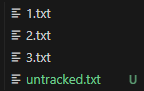
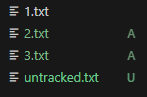
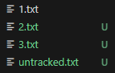
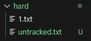

### 목차

> [1. Git revert](#-git-revert-commit-id)
> 
> [2. Git reset](#-git-reset-옵션-commit-id)
> 
> [3. 복구](#-git-reflog)

# $ git revert \<commit id>

- 순방향 실행 취소

- 과거로 돌아간다. "재설정"

- commit messageX, commit id를 입력해야한다.

- 특정 commit을 없었던 일로 만듦.

- commit 존재 자체를 삭제X, 없어진 시점의 commit도 남아있음. 지정된 변경 사항을 반전시키는 새 commit 생성.

- ㄴ이유 : 남아있어야 역사를 공유하고 싱크를 맞추고 협력 가능

- id 다 안 쓰고 4~5개만 써도 된다.

```bash
SSAFY@2□□PC099 MINGW64 ~/Downloads/revert-reset-practice/reset-revert-practice/revert (master)
$ git revert 91cbd
[master 9f3738e] Revert "second" & ssafy        
 1 file changed, 0 insertions(+), 0 deletions(-)
 delete mode 100644 2.txt
```

- git editor (Vim)으로 새 commit message 써야함

```vim
Revert "second"

This reverts commit 91cbd74ec969ce40577658673789755440b7bd18.

# Please enter the commit message for your changes. Lines starting
# with '#' will be ignored, and an empty message aborts the commit.
#
# On branch master
# Changes to be committed:
#       deleted:    2.txt
#
# Untracked files:
#       untracked.txt
#
```

- i : insert(입력모드), esc : 입력모드 취소, w : 저장, q : 종료...

- 맨 윗줄 : 추천 commit message -> 로 저장됨

- 커밋 아이디 여러 개 나열해서 한꺼번에 실행 취소 가능

- **".."** : 범위 지정 취소 가능, ex) git revert id1..id2

- **"--no-edit"** commit message 편집기 열지 않고 자동으로 commit 실행

- **"--no-commit"** 자동으로 commit을 하지 않고 add만 해서 staging area에 올리기만 함.

# $ git reset [옵션] \<commit id>

- 특정 commit으로 되돌아감

- 되돌아간 commit 이후의 commit은 모두  삭제

- 삭제되는 commit을 어떤 영역에 남겨둘지 옵션으로 선택 가능

- **"--soft"** : 삭제된 commit의 기록을 staging area에 남김 (add된 상태)

```bash
SSAFY@2□□PC099 MINGW64 ~/Downloads/revert-reset-practice/reset-revert-practice/reset/soft (master)
$ git log --oneline
d7c8501 (HEAD -> master) third
91cbd74 second
f7b3a3d first

SSAFY@2□□PC099 MINGW64 ~/Downloads/revert-reset-practice/reset-revert-practice/reset/soft (master)
$ git reset --soft f7b3

SSAFY@2□□PC099 MINGW64 ~/Downloads/revert-reset-practice/reset-revert-practice/reset/soft (master)
$ git log --oneline
f7b3a3d (HEAD -> master) first
```

 

- **"--mixed"** : working directory에 남김 (기본 옵션)

```bash
SSAFY@2□□PC099 MINGW64 ~/Downloads/revert-reset-practice/reset-revert-practice/reset/mixed (master)
$ git reset --mixed f7b3

SSAFY@2□□PC099 MINGW64 ~/Downloads/revert-reset-practice/reset-revert-practice/reset/mixed (master)
$ git log --oneline
f7b3a3d (HEAD -> master) first

SSAFY@2□□PC099 MINGW64 ~/Downloads/revert-reset-practice/reset-revert-practice/reset/mixed (master)
$ git status
On branch master
Untracked files:
  (use "git add <file>..." to include in what will be committed)
        2.txt
        3.txt
        untracked.txt

nothing added to commit but untracked files present (use "git add" to track)
```

 

**"--hard"** : 삭제. 남기지X

```bash
SSAFY@2□□PC099 MINGW64 ~/Downloads/revert-reset-practice/reset-revert-practice/reset/hard (master)
$ ls
1.txt  2.txt  3.txt  untracked.txt

SSAFY@2□□PC099 MINGW64 ~/Downloads/revert-reset-practice/reset-revert-practice/reset/hard (master)
$ git reset --hard f7b3
HEAD is now at f7b3a3d first

SSAFY@2□□PC099 MINGW64 ~/Downloads/revert-reset-practice/reset-revert-practice/reset/hard (master)
$ ls
1.txt  untracked.txt
```

 

# $ git reflog

- 이미 삭제한 commit으로 다시 돌아감. 복구.

- head가 이전에 가리켰던 모든 commit을 보여줌.

- --hard로 지운 commit도 복구 가능.

# $ git restore

- modified 상태의 파일 되돌리기

- 마지막 add 이후의 수정사항이 다 사라짐

- 복원 불가. 덮어쓰기 때문

# Unstage

- staging area에서 working directory로 되돌리기

### $ git rm --cached \<file>

- git 저장소에 commit이 하나도 없는 경우

```bash
SSAFY@2□□PC099 MINGW64 ~/Desktop/gp (master)
$ git status
On branch master

No commits yet

Changes to be committed:
  (use "git rm --cached <file>..." to unstage)
        new file:   README.md


SSAFY@2□□PC099 MINGW64 ~/Desktop/gp (master)
$ git rm --cached README.md 
rm 'README.md'

SSAFY@2□□PC099 MINGW64 ~/Desktop/gp (master)
$ git status
On branch master

No commits yet

Untracked files:
  (use "git add <file>..." to include in what will be committed)
        README.md

nothing added to commit but untracked files present (use "git add" to track)
```

### $ git retore --staged \<file>

- git 저장소에 commmit이 존재하는 경우

```bash
SSAFY@2□□PC099 MINGW64 ~/Desktop/gp (master)
$ git status
On branch master
Changes to be committed:
  (use "git restore --staged <file>..." to unstage)
        modified:   README.md


SSAFY@2□□PC099 MINGW64 ~/Desktop/gp (master)
$ git restore --staged README.md 

SSAFY@2□□PC099 MINGW64 ~/Desktop/gp (master)
$ git status
On branch master
Changes not staged for commit:
  (use "git add <file>..." to update what will be committed)
  (use "git restore <file>..." to discard changes in working directory)
        modified:   README.md

no changes added to commit (use "git add" and/or "git commit -a")
```
