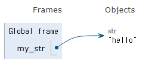
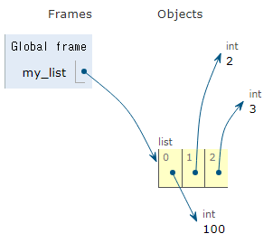

### 목차

> [1. 복습](#1-복습)
> 
> [2. list](#2-list)
> 
> [3. tuple](#3-tuple)
> 
> [4. range](#4-range)
> 
> [5. dict](#5-dict)
> 
> [6. set](#6-set)
> 
> [7. Other Types](#7-Other-Types)
> 
> [8. Type Conversion](#8-Type-Conversion)
> 
> [9. 연산자](#9-연산자)

 

# 1. 복습

### Data Types

- 값의 종류와 그 값에 적용 가능한 연산과 동작을 결정하는 속성(복습)

- int - 진수(2, 8, 16진법)

- float - 근삿값, 부동소수점 에러, 지수 표현

### Sequence Types

- 여러 개의 값들을 `순서대로 나열`, 정렬❌!!

- str - 문자열, string interpolation(문자열 내에 변수나 표현식 삽입, f-string), 인덱싱, 슬라이싱,`변경❌`

# ~Sequence Types

# 2. list

- 리스트 : 여러 개의 값을 순서대로 저장, `변경⭕`

- 0개 이상의 객체를 포함, 대괄호 `[]`로 표기, 어떤 자료형도 저장할 수 있음

```python
my_list_1 = []
my_list_2 = [1, 'a', 3, 'b', 5]
my_list_3 = [1, 2, 3, 'Python', ['hello', 'world', '!!!']]
```

```python
my_list = [1, 'a', 3, 'b', 5]

# 인덱싱
print(my_list[1])  # a

# 슬라이싱
print(my_list[2:4])  # [3, 'b']
print(my_list[:3])  # [1, 'a', 3]
print(my_list[3:])  # ['b', 5]
print(my_list[0:5:2])  # [1, 3, 5]
print(my_list[::-1])  # [5, 'b', 3, 'a', 1]

# 길이
print(len(my_list))  # 5
```

- 중첩된 리스트

```python
my_list = [1, 2, 3, ['python', 'hello', 100]]

print(len(my_list))  # 4
print(my_list[3][1])  # hello
print(my_list[-1][1][-1])  # o
```

- 리스트는 가변

```python
my_list = [1, 2, 'python']
my_list[0] = 100

print(my_list)  # [100, 2, 'python']

# TypeError: 'str' object does not support item assignment
my_list[-1][0] = 't' 
```

# 3. tuple

- 튜플 : 여러 개의 값을 순서대로 저장하는 시퀀스 자료형, `변경❌`

- 0개 이상의 객체를 포함, 소괄호 `()`로 표기, 어떤 자료형도 저장할 수 있음

- 불변 특성을 사용해 안전하게 여러 개의 값을 전달, 그룹화, 다중 할당 -> 개발자가 직접 사용 x. 파이썬 내부 동작에서 주로 사용

```python
x, y = (10, 20)
print(x)  # 10
print(y)  # 20

# 파이썬은 쉼표를 튜플 생성자로 사용하니 괄호는 생략 가능
x, y = 10, 20
```

```python
my_tuple = (1, 'a', 3, 'b', 5)

# TypeError: 'tuple' object does not support item assignment
my_tuple[1] = 'z'
```

# 4. range

- 연속된 정수 시퀀스를 생성하는 자료형 `변경❌`

> range(시작 값, 끝 값, 증가 값)

- 증가 값이 없으면 1씩 증가

- 증가 값이 음수이면 감소, 양수이면 증가

- 증가 값이 0이면 에러

- 증가 값이 음수이면 시작 값이 끝 값보다 커야 함

- 증가 값이 양수이면 시작 값이 끝 값보다 작아야 함

```python
my_range_1 = range(5)
my_range_2 = range(1, 10, 2)
print(my_range_1)  # range(0, 5)
print(my_range_2)  # range(1, 10, 2)

# 리스트로 형 변환 시 데이터 확인 가능
print(list(my_range_1))  # [0, 1, 2, 3, 4]
print(list(my_range_2))  # [1, 3, 5, 7, 9, 10)

# 주로 반복문과 함께 활용
for i in range(5):
    print(i)
```

---

# Non-sequence Types

# 5. dict

- 딕셔너리 : key - value 쌍으로 이루어진 자료형, `순서❌`, `중복❌`, `변경⭕`

- **key**는 **변경 불가능**한 자료형만 사용 가능(str, int, float, tuple, range...)

- **value**는 모든 자료형 사용 가능

- 중괄호 `{}`로 표기

```python
my_dict_1 = {}
my_dict_2 = {'key': 'value'}
my_dict_3 = {'apple': 12, 'list': [1, 2, 3]}
print(my_dict_1)  # {}
print(my_dict_2)  # {'key': 'value'}
print(my_dict_3)  # {'apple': 12, 'list': [1, 2, 3]}
```

- 딕셔너리는 키에 접근해 값을 얻어냄

```python
my_dict = {'apple' : 12, 'list' : [1, 2, 3]}

print(my_dict['apple'])  # 12

# 추가
my_dict['banana'] = 50
print(my_dict)  # {'apple': 12, 'list': [1, 2, 3], 'banana': 50}

# 변경
my_dict['banana'] = 1000
print(my_dict)  # {'apple': 12, 'list': [1, 2, 3], 'banana': 1000}

# 순서x
print(my_dict[1])  # Error
# 딕셔너리의 2번째 자료형 그런 거 x -> 순서 x
```


# 6. set

- 세트 : `순서❌`, `중복❌`, `변경⭕`

- 수학에서의 집합과 동일한 연산 처리 가능, 중괄호 `{}`로 표기

```python
my_set_1 = set()
my_set_2 = {1, 2, 3}
my_set_3 = {1, 1, 1}
print(my_set_1)  # set()
print(my_set_2)  # {1, 2, 3}
print(my_set_3)  # {1} 

# my_set_2[1] x !!
```

- 합집합, 차집합, 교집합

```python
my_set_1 = {1, 2, 3}
my_set_2 = {3, 6, 9}

# 합집합
print(my_set_1 | my_set_2)  # {1, 2, 3, 6, 9}

# 차집합
print(my_set_1 - my_set_2)  # {1, 2}

# 교집합
print(my_set_1 & my_set_2)  # {3}
```

---

# 7. Other Types

### None

- 파이썬에서 `값이 없음`을 표현하는 자료형

```python
variable = None

print(variable)  # None
```

### Boolean

- 참(Ture)와 거짓(False)을 표현하는 자료형

- 비교/논리 연산의 평가 결과로 사용, 주로 조건/반복문과 함께 사용

- `True`, `False` 대문자 주의!!

```python
# Boolean
bool_1 = True
bool_2 = False
print(bool_1)  # True
print(bool_2)  # False
print(3 > 1)  # True
print('3' != 3)  # True
```

### Collection

- 여러 개의 항목 또는 요소를 담는 자료 구조 (str, int, tuple, set, dict)

#### 컬렉션 정리

| 컬렉션   | 변경 가능 여부 | 순서 여부 |      |
|:-----:|:--------:|:-----:|:----:|
| str   | X        | O     | 시퀀스  |
| list  | O        | O     | 시퀀스  |
| tuple | X        | O     | 시퀀스  |
| dict  | O        | X     | 비시퀀스 |
| set   | O        | X     | 비시퀀스 |

- 불변과 가변의 차이(1/2)

```python
# immutable (불변)
my_str = 'hello'
my_str[0] = 'z'

# mutable (가변)
my_list = [1, 2, 3]
my_list[0] = 100
```

 


---

# 8. Type Conversion

### 형변환

- 한 데이터 타입을 다른 데이터 타입으로 변환

- 암시적/명시적

### 암시적 형변환

- Implict Type conversion : 파이썬이 자동으로 수행하는 형변환

- 정수와 실수의 연산에서 정수가 실수로 변환됨

- 암시적 형변환이 일어나지 않게 코드를 작성하는게 좋긴 함

```python
# 암시적 형변환
print(3 + 5.0)  # 8.0
print(True + 3)  # 4
print(True + False)  # 1
```

### 명시적 형변환

- 암시적 형변환이 아닌 모든 형변환

- str -> int : 형식에 맞는 숫자만 가능

```python
print(int('1'))  # 1

# ValueError: invalid literal for int() with base 10: '3.5'
print(int('3.5'))

print(int(3.5))  # 3
print(float('3.5'))  # 3.5
```

- int -> str : 모두 가능

```python
print(str(1) + '등')  # 1등
```

---

# 9. 연산자

### 산술 연산자

| 기호  | 연산자          |
|:---:|:------------:|
| -   | 음수   부호      |
| +   | 덧셈           |
| -   | 뺄셈           |
| *   | 곱셈           |
| /   | 나눗셈          |
| //  | 정수   나눗셈 (몫) |
| %   | 나머지          |
| **  | 지수   (거듭제곱)  |

### 복합 연산자

- 연산과 할당이 함께 이뤄짐

| 기호  | 예시        | 의미           |
|:---:|:---------:|:------------:|
| +=  | a   += b  | a   = a + b  |
| -=  | a   -= b  | a   = a - b  |
| *=  | a   *= b  | a   = a * b  |
| /=  | a   /= b  | a   = a / b  |
| //= | a   //= b | a   = a // b |
| %=  | a   %= b  | a   = a % b  |
| **= | a   **= b | a   = a ** b |

### 비교 연산자

| 기호       | 내용      |
|:--------:|:-------:|
| <        | 미만      |
| <=       | 이하      |
| >        | 초과      |
| >=       | 이상      |
| ==       | 같음      |
| !=       | 같지   않음 |
| is       | 같음      |
| is   not | 같지   않음 |

- `is` 비교 연산자 : 메모리 내에서 같은 객체를 참고하는지 확인, 값을 비교하는 `==`와는 다름

- `==`는 동등성(equality), `is`는 식별성(identity)

```python
# 비교 연산자
print(3 > 6)  # False
print(2.0 == 2)  # True
print(2 != 2)  # False
print('HI' == 'hi')  # False
print(1 == True)  # True -> type이 다른 안 좋은 상황.

# SyntaxWarning: "is" with a literal. Did you mean "=="?
# ==은 값(데이터)을 비교하는 것이지만 is는 레퍼런스(주소)를 비교하기 때문
# 아래 조건은 항상 False이기 때문에 is 대신 ==를 사용해야 한다는 것을 알림
print(1 is True)  # False
print(2 is 2.0)  # False
print(1 == True)  # True
print(2 == 2.0)  # True

print(0 == None)  # False
```

- is는 None, Boolean이랑 비교할 때 주로 사용, 같은 타입끼리 비교할 때 사용. 형변환이 일어나는 건 좋지x

### 논리 연산자

| 기호  | 연산자  | 내용                                                   |
|:---:|:----:|:----------------------------------------------------:|
| and | 논리곱  | 두   피연산자 모두 True인   경우에만      전체   표현식을 True로   평가   |
| or  | 논리합  | 두   피연산자 중 하나라도 True인   경우      전체   표현식을 True로   평가 |
| not | 논리부정 | 단일   피연산자를 부정                                        |

```python
print(True and False) # False

print(True or False) # True

print(not True) # False

print(not 0) # True
```

```python
num = 15
result = (num > 10) and (num % 2 == 0)
print(result) # False

name = 'Alice'
age = 25
result = (name == 'Alice') or (age == 30)
print(result) # True
```

### 단축평가

- 논리 연산에서 두 번째 피연산자를 평가하지 않고 결과를 결정하는 동작

- ❗ A and B : A(T) -> B 확인 => B | A(F) -> B확인x => A

- ❗ A or B : A(T) -> B 확인x => A | A(F) => B 확인 => B

```python
vowels = 'aeiou'

print(('a' and 'b') in vowels)  # False ('b' in vowels)
print(('b' and 'a') in vowels)  # True ('a' in vowels)

print(3 and 5)  # 5
print(3 and 0)  # 0
print(0 and 3)  # 0
print(0 and 0)  # 0

print(5 or 3)  # 5
print(3 or 0)  # 3
print(0 or 3)  # 3
print(0 or 0)  # 0
```

- 이유 : 코드 실행을 최적화, 불필요한 연산 피할 수 있게.


### 멤버십 연산자

- 특정 값이 시퀀스나 다른 컬렉션에 속하는지 여부를 확인

| 기호       | 내용                                    |
|:--------:|:-------------------------------------:|
| in       | 왼쪽   피연산자가 오른쪽 피연산자의 시퀀스에 속하는지를 확인    |
| not   in | 왼쪽   피연산자가 오른쪽 피연산자의 시퀀스에 속하지 않는지를 확인 |

```python
word = 'hello'
numbers = [1, 2, 3, 4, 5]

print('h' in word)  # True
print('z' in word)  # False

print(4 not in numbers)  # False
print(6 not in numbers)  # True
```

### 시퀀스형 연산자

- `+` 와 `*` 는 시퀀스 간 연산에서 산술 연산자일때와 다른 역할을 가짐

| 연산자 | 내용       |
|:---:|:--------:|
| +   | 결합   연산자 |
| *   | 반복   연산자 |

```python
print('Gildong' + ' Hong')  # Gildong Hong
print('hi' * 5)  # hihihihihi
print([1, 2] + ['a', 'b'])  # [1, 2, 'a', 'b']
print([1, 2] * 2)  # [1, 2, 1, 2]
```


### +) 깊은 복사 얕은 복사

- 얕은 복사(shallow copy) : 할당, 슬라이싱(`[:]`), `.copy()` 등

```python
a = [1,2,3,[4,5]]
b = copy.deepcopy(a) # or (b = a) or (b = a[:]) 
b[-1][0] = 8
print(a)  # [1,2,3,[8,5]]
print(b)  # [1,2,3,[8,5]]
```

- 깊은 복사(deep copy) : `copy.deepcopy` 메소드 사용

```python
import copy

a = [1,2,3,[4,5]]
b = copy.deepcopy(a)
b[-1][0] = 8
print(a)  # [1,2,3,[4,5]]
print(b)  # [1,2,3,[8,5]]
```
