### 목차

> [1. CSS Box Model](#1-css-box-model)
> 
> [2. CSS Layout](#2-css-layout)
> 
> [3. CSS Flexbox](#3-css-flexbox)
> 
> [4. 참고](#4-참고)

# 1. CSS Box Model

- 웹 페이지의 모든 HTML 요소를 감싸는 사각형 상자 모델

- 웹페이지에 존재하는 도형, 원은 모두 네모 박스를 깎은 것

### 박스 타입

1. Block box

2. Inline box
- 박스 타입에 따라 페이지에서의 배치 흐름 및 다른 박스와 관련하여 박스가 동작하는 방식이 달라짐

### 박스 표시(Display) 타입

1. Outer display type

2. Inner display type

### Outer display type

- 박스가 문서 흐름에서 어떻게 동작할지를 결정

- 속성 : `block`, `inline`

- `block` 특징 :
  
  - 항상 새로운 행으로 나뉨
  
  - width와 height 속성 사용 가능
  
  - padding, margin, border로 인해 다른 요소를 상자로부터 밀어냄
  
  - width 속성을 지정하지 않으면 박스는 inline 방향으로 사용 가능한 공간을 모두 차지함 (상위 컨테이너 너비 100%로 채우는 것)
  
  - 대표적인 block 타입 태그 : `h1~6`, `p`, `div`

- `inlin` 특징 :
  
  - 새로운 행으로 넘어가지 않음
  
  - width와 height 속성을 사용할 수 없음
  
  - 수직 방향 : `padding`, `margin`, `border`가 적용되지만 다른 요소를 밀어낼 수는 없음
  
  - 수평 방향 : `padding`, `margin`, `borders`가 적용되어 다른 요소를 밀어낼 수 있음
  
  - 대표적인 inline 타입 태그 : `a`, `img`, `span`, `strong`, `em`

### Normal flow

- 일반적인 흐름 또는 레이아웃을 변경하지 않은 경우 웹 페이지 요소가 배치되는 형식

- <-- Inline Direction -->

- ↕ Block Direction ↕

### Inner display type

- 박스 내부의 요소들이 어떻게 배치될지를 결정

- 속성 : `flex`

### CSS Box Model

- 웹 페이지의 모든 HTML 요소를 감싸는 사각형 상자 모델

- 내용(content), 안쪽 여백(padding), 테두리(border), 외부 간격(margin)으로 구성되어 요소의 크기와 배치를 결정

- box 구성 요소 : 
  
  - `Margin` : 이 박스와 다른 요소 사이의 공백, 가장 바깥쪽 영역
  - `Border` : 콘텐츠와 패딩을 감싸는 테두리 영역
  - `Padding` : 콘텐츠 주위에 위치하는 공백 영역
  - `Content` : 콘텐츠가 표시되는 영역
  - Content box : 실제 콘텐츠가 표시되는 영역 크기, `width` 및 `height` 속성을 사용하여 크기 조정
  - Padding box : 콘텐츠 주위에 공백, `padding` 관련 속성을 사용하여 크기 조정
  - Border box : 콘텐츠와 패딩을 래핑, `border` 관련 속성을 사용하여 크기 조정
  - Margin box : 콘텐츠, 패딩 및 테두리를 래핑, 박스와 다른 요소 사이의 공백, `margin` 관련 속성을 사용하여 크기 조정

- Box 구성의 방향 별 속성 값

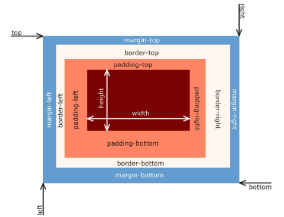

- Box 구성 요소 예시

```html
<body>
  <div class="box1">box1</div>
  <div class="box2">box2</div>
</body>
```

```css
<style>
    .box1 {
      width: 200px;
      padding-left: 25px;
      padding-bottom: 25px;
      margin-left: 25px;
      margin-top: 50px;
      border-width: 3px;
      border-style: solid;
      border-color: black;
    }

    .box2 {
      width: 200px;
      padding: 25px 50px;
      margin: 25px auto;
      border: 1px dashed black;
    }
  </style>
```

### shorthand 속성

- `border` : `border-width`, `border-style`, `border-color`를 한번에 설정하기 위한 속성

```css
border: 2px solid black;
```

- `margin` & `padding` : 4방향의 속성을 각각 지정하지 않고 한번에 지정할 수 있는 속성

```css
/* 4개 - 상우하좌 */
margin: 10px 20px 30px 40px;
padding: 10px 20px 30px 40x;

/* 3개 - 상/좌우/하 */
margin: 10px 20px 30px;
padding: 10px 20px 30px;

/* 2개 - 상하/좌우 */
margin: 10px 20px;
padding: 10px 20px;

/* 1개 - 공통 */
margin: 10px;
padding: 10px;
```

### box-sizing 속성

- The standard CSS box model : 표준 상자 모델에서 width와 height 속성 값을 설정하면 이 값은 content box 크기를 조정하게 됨

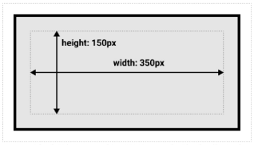

- 실제 박스 크기는 350px이 아닌 테두리, 패딩 값을 모두 더한 값을 가짐

- CSS는 border box가 아닌 content box의 크기를 `width` 값으로 지정

### The alternative CSS box model

- 대체 상자 모델에서 모든 `width`와 `height`는 실제 상자의 너비

- 실제 박스 크기를 정하기 위해 테두리와 패딩을 조정할 필요 없음

- `box-sizing` : 대체 상자 모델로 변경할 수 있는 속성

- `content-box` : 설정한 `width`와 `height` 값이 곧 요소 내부의 콘텐츠 크기

- `border-box` : 설정한 `width`와 `height` 값이 안쪽 여백과 테두리까지 포함

```css
* {
    box-sizing: content-box;
}
* {
    box-sizing: border-box;
}
```

- `box-sizing` 예시

```html
<body>
  <div class="box content-box">content-box</div>
  <div class="box border-box">border-box</div>
</body>
```

```css
<style>
    .box {
      width: 100px;
      border: 2px solid black;
      padding: 10px;
      margin: 20px;
      background-color: yellow;
    }

    .content-box {
      box-sizing: content-box;
    }

    .border-box {
      box-sizing: border-box;
    }
  </style>
```

### 기타 display 속성

- `inline-block` : 
  
  - `inline`과 `block` 요소 사이의 중간 지점을 제공하는 display 값
  
  - `width` 및 `height` 속성 사용 가능
  
  - `padding`, `margin`, 및 `border`로 인해 다른 요소가 상자에서 밀려남
  
  - 새로운 행으로 넘어가지 않음
  
  - 요소가 줄 바꿈 되는 것을 원하지 않으면서 너비와 높이를 적용하고 싶은 경우에 사용

- `inline-block` 예시

```html
<body>
  <!-- 1. 이제 다른 요소를 밀어낼 수 있는 span -->
  <p>Lorem ipsum dolor sit amet <span>consectetur</span> adipisicing elit. Animi iusto enim officia exercitationem
    dolorque, quasi velit, dolores, tempora illum odio necessitatibus. Fugit,
    cumque eligendi!</p>

  <!-- 2. 리스트 요소를 가로로 정렬 -->
  <ul>
    <li><a href="#">link</a></li>
    <li><a href="#">link</a></li>
    <li><a href="#">link</a></li>
  </ul>

  <!-- 3. div 요소를 가로로 정렬 -->
  <div class="container">
    <div class="box"></div>
    <div class="box"></div>
    <div class="box"></div>
  </div>
</body>
```

```css
<style>
    span {
      margin: 20px;
      padding: 20px;
      width: 80px;
      height: 50px;
      background-color: lightblue;
      border: 2px solid blue;
      display: inline-block;
    }

    ul>li {
      background-color: crimson;
      padding: 10px 20px;
      display: inline-block;
    }

    .container {
      text-align: center;
    }

    .box {
      width: 100px;
      height: 100px;
      background-color: #4CAF50;
      margin: 10px;
      display: inline-block;
    }
  </style>
```

- `none` : 요소를 화면에 표시하지 않고, 공간조차 부여되지 않음

- `none` 예시

```html
<body>
  <div class="box"></div>
  <div class="box"></div>
  <div class="box"></div>
</body>
```

```css
<style>
    .box {
      width: 100px;
      height: 100px;
      background-color: red;
      border: 2px solid black;
    }

    .none {
      display: none;
    }
  </style>
```

# 2. CSS Layout

- 각 요소의 **위치**와 **크기**를 조정하여 웹 페이지의 디자인을 결정하는 것

- `Display`, `Position`, `Flexbox` 등

### CSS Position

- 요소를 Normal Flow에서 제거하여 다른 위치로 배치하는 것

- 다른 요소 위에 올리기, 화면의 특정 위치에 고정시키기 등

- Position 이동 방향 : top, right, bottom, left, Z Axis
  
  - `Z Axis` : 요소들이 겹쳤을 때 뭘 위에 둘지

### Position 유형

1. `static` : 요소를 Normal Flow에 따라 배치
   
   - top, right, bottom, left 속성이 적용되지 않음
   
   - 기본 값

2. `relative` : 요소를 Normal Flow에 따라 배치
   
   - 자신의 원래 위치(static)을 기준으로 이동
   
   - top, right, bottom, left 속성으로 위치를 조정
   
   - 다른 요소의 레이아웃에 영향을 주지 않음
   
   - 요소가 차지하는 공간은 static일 때와 같음

3. `absolute` : 요소를 Normal Flow에서 제거
   
   - 가장 가까운 `relative` 부모 요소를 기준으로 이동
   
   - 만족하는 부모 요소가 없다면 body 태그를 기준으로 함
   
   - top, right, bottom, left 속성으로 위치를 조정
   
   - 문서에서 요소가 차지하는 공간이 없어짐

4. `fixed` : 요소를 Normal Flow에서 제거
   
   - 현재 화면영역(viewport)을 기준으로 이동
   
   - 스크롤해도 항상 같은 위치에 유지됨
   
   - top, right, bottom, left 속성으로 위치를 조정
   
   - 문서에서 요소가 차지하는 공간이 없어짐

5. `sticky` : `relative`와 `fixed`의 특성을 결합한 속성
   
   - 스크롤 위치가 임계점에 도달하기 전에는 `relative`처럼 동작
   
   - 스트롤이 특정 임계점에 도달하면 fixed처럼 동작하여 화면에 고정됨
   
   - 만약 다음 `sticky` 요소가 나오면 다음 `sticky` 요소가 이전 `sticky` 요소의 자리를 대체
   
   - 이전 `sticky`요소가 고정되어 있던 위치와 다음 `sticky` 요소가 고정되어야 할 위치가 겹치게 되기 때문
- 예시 코드 : Position 활용

```html
<body>
  <div class="container">
    <div class="box static">Static</div>
    <div class="box absolute">Absolute</div>
    <div class="box relative">Relative</div>
    <div class="box fixed">Fixed</div>
  </div>
</body>
```

```css
<style>
    * {
      box-sizing: border-box;
    }

    body {
      height: 1500px;
    }

    .container {
      /* position: relative; */
      height: 300px;
      width: 300px;
      border: 1px solid black;
    }

    .box {
      height: 100px;
      width: 100px;
      border: 1px solid black;
    }

    .static {
      /* position: static; */
      background-color: lightcoral;
    }

    .absolute {
      /* position: absolute; */
      background-color: lightgreen;
      top: 100px;
      left: 100px;
    }

    .relative {
      /* position: relative; */
      background-color: lightblue;
      top: 100px;
      left: 100px;
    }

    .fixed {
      /* position: fixed; */
      background-color: gray;
      top: 0;
      right: 0;
    }
  </style>
```

- 예시 코드 : Position sticky 활용

```html
<body>
  <h1>Sticky positioning</h1>
  <div>
    <div class="sticky">첫 번째 Sticky</div>
    <div>
      <p>내용1</p>
      <p>내용2</p>
      <p>내용3</p>
    </div>
    <div class="sticky">두 번째 Sticky</div>
    <div>
      <p>내용4</p>
      <p>내용5</p>
      <p>내용6</p>
    </div>
    <div class="sticky">세 번째 Sticky</div>
    <div>
      <p>내용7</p>
      <p>내용8</p>
      <p>내용9</p>
    </div>
  </div>
</body>
```

```css
<style>
    body {
      height: 1500px;
    }

    .sticky {
      position: sticky;
      top: 0;
      background-color: lightblue;
      padding: 20px;
      border: 2px solid black;
    }
  </style>
```

- 예시 코드 : Position absolute 활용

```html
<body>
  <div class="card">
    <div class="card-content">
      <h3>Card Title</h3>
      <p>Lorem ipsum dolor sit amet, consectetur adipiscing elit.</p>
      <span class="badge">New</span>
    </div>
  </div>
</body>
```

```css
<style>
    .card {
      position: relative;
      width: 300px;
      height: 200px;
      border: 1px solid black;
    }

    .card-content {
      padding: 10px;
    }

    .badge {
      position: absolute;
      top: 0;
      right: 0;
      background-color: red;
      color: white;
      padding: 5px 10px;
    }
  </style>
```

### z-index

- 요소의 쌓임 순서(stack order)를 정의하는 속성

- 정수 값을 사용해 Z축 순서를 지정

- 값이 클수록 요소가 위에 쌓이게 됨

- static이 아닌 요소에만 적용됨

- 기본값은 auto

- 부모 요소의 z-index 값에 영향을 받음

- 같은 부모 내에서만 z-index 값을 비교

- 부모의 z-index가 낮으면 자식의 z-index가 아무리 높아도 부모보다 위로 올라갈 수 없음

- z-index 값이 같으면 HTML 문서 순서대로 쌓임

- 예시 코드

```html
<body>
  <div class="container">
    <div class="box red">z-index: 3</div>
    <div class="box green">z-index: 2</div>
    <div class="box blue">z-index: 1</div>
  </div>
</body>
```

```css
<style>
    .container {
      position: relative;
    }

    .box {
      position: absolute;
      width: 100px;
      height: 100px;
    }

    .red {
      background-color: red;
      top: 50px;
      left: 50px;
      /* z-index: 3; */
    }

    .green {
      background-color: green;
      top: 100px;
      left: 100px;
      /* z-index: 2; */
    }

    .blue {
      background-color: blue;
      top: 150px;
      left: 150px;
      /* z-index: 1; */
    }
  </style>
```

### Position의 목적

- 전체 페이지에 대한 레이아웃을 구성하는 것보다는 페이지 특정 항목의 위치를 조정하는 것

# 3. CSS Flexbox

- 요소를 행과 열 형태로 배치하는 1차원 레이아웃 방식

- 공간 배열 & 정렬

### 박스 표시(Display) 타입

1. Outer display type

2. **Inner display type** ☜

### Inner display type

- `Flexbox`

```css
.container {
    display: flex;
}
```

- 박스 내부의 요소들이 어떻게 배치될지를 결정

- 속성 : `flex`

### Flexbox 구성 요소

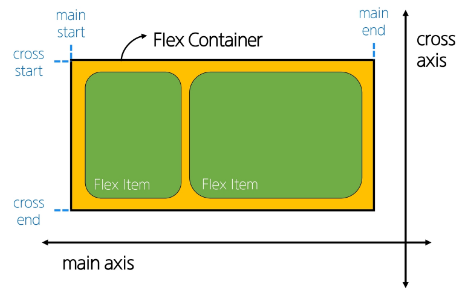

- `main axis` : 주 축
  
  - flex item들이 배치되는 기본 축
  
  - main start에서 시작하여 main end 방향으로 배치 (기본 값)

- `cross axis` : 교차 축
  
  - main axis에 수직인 축
  
  - cross start에서 시작하여 cross end 방향으로 배치 (기본 값)

- `Flex Container`
  
  - `display: flex;`혹은 `display: inline-flex;` 가 설정된 부모 요소
  
  - 이 컨테이너의 1차 자식 요소들이 Flex Item이 됨
  
  - flexbox 속성 값들을 사용하여 자식 요소 Flex Item들을 배치하는 주체

- `Flex Item`
  
  - Flex Container 내부에 레이아웃 되는 항목

### Flexbox 속성 목록

- Flex Container 관련 속성
  
  - `display`, `flex-direction`, `flex-wrap`, `justify-content`, `align-items`, `align-content`

- Flex Item 관련 속성
  
  - `align-self`, `flex-grow`, `flex-basis`, `order`
1. Flex Container 지정
   
   - flex item은 기본적으로 행(주 축의 기본값인 가로 방향)으로 나열
   
   - flex item은 주 축의 시작 선에서 시작
   
   - flex item은 교차 축의 크기를 채우기 위해 늘어남

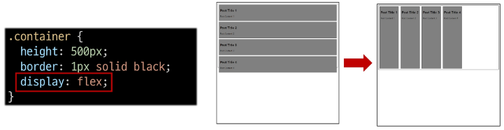

2. `flex-direction`
   
   - flex item이 나열되는 방향을 지정
   
   - column으로 지정할 경우 주 축이 변경됨
   
   - `-reverse`로 지정하면 flex item 배치의 시작 선과 끝 선이 서로 바뀜
   
   - row : 세로줄, column : 가로줄

```css
.container {
    flex-direction: row;
    flex-direction: column;
}
```

3. `flex-wrap`
   
   - flex item 목록이 flex container의 한 행에들어가지 않을 경우 다른 행에 배치할지 여부 설정

```css
.container {
    flex-wrap: nowrap;
    flex-wrap: wrap;
}
```

4. `justify-content`
   
   - 주 축을 따라 flex item과 주위에 공간을 분배

```css
.container {
    justify-content: flex-start;
    justify-content: center;
    justify-content: flex-end;
}
```

5. `align-content`
   
   - 교차 축을 따라 flex item과 주위에 공간을 분배
   
   - flex-wrap이 wrap 또는 wrap-reverse로 설정된 여러 행에만 적용됨
   
   - 한 줄 짜리 행에는 효과 없음 (flex-wrap이 nowrap으로 설정된 경우)

```css
.container {
    flex-wrap: wrap;

    align-content: center;
}
```

6. `align-items`
   
   - 교차 축을 따라 flex item 행을 정렬

```css
.container {
    align-items: center;
}
```

7. `align-self`
   
   - 교차 축을 따라 개별 flex item을 정렬

```css
.item1 {
    align-self: center;
}

.item2 {
    align-self: flex-end;
}
```

### 목적에 따른 속성 분류

- 배치 : `flex-direction`, `flex-wrap`

- 공간 분배 : `justify-content`, `align-content`

- 정렬 : `align-items`, `align-self`

### 속성명 Tip

- `justify` : 주 축

- `align` : 교차 축
8. `flex-grow` 
   
   - 남는 행 여백을 비율에 따라 각 flex item에 분배
   
   - 아이템이 컨테이너 내에서 확장하는 비율을 지정
   
   - ★남은 부분을 몇 등분 할 것인가?★
   
   - `flex-grow`의 반대는 `flex-shrink`

   - 코드 : 1:2:3 비율

```html
<div class="container">
  <div class="item item-1">1</div>
  <div class="item item-2">2</div>
  <div class="item item-3">3</div>
</div>
```

```css
.container {
    display: flex;
    width: 100%;
}

.item {
    height: 100px;
    color: white;
    font-size: 3rem;
}

.item-1 {
  background-color: red;
  flex-grow: 1;
}

.item-1 {
  background-color: red;
  flex-grow: 2;
}

.item-1 {
  background-color: red;
  flex-grow: 3;
}
```

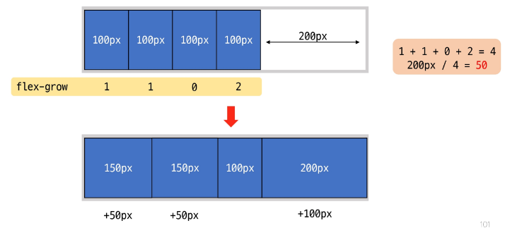

9. `flex-basis`
   
   - flex item의 초기 크기 값을 지정
   
   - `flex-basis`와 `width` 값을 동시에 적용한 경우 `flex-basis`가 우선

```css
.item-1 {
    background-color: red;
    flex-basis: 300px;
}
```

### 반응형 레이아웃

- 다양한 디바이스와 화면 크기에 자동으로 적응하여 콘텐츠를 최적으로 표시하는 웹 레이아웃 방식

- `flex-wrap`을 사용해 반응형 레이아웃 작성(`flex-grow` & `flex-basis` 활용)

```html
<body>
  <div class="card">
    
    <div class="content">
      <h2>Heading</h2>
      <p>Lorem, ipsum dolor sit amet consectetur adipisicing elit. Perspiciatis minus sed expedita ut nihil tempora
        neque autem odio eos, repudiandae blanditiis, molestiae consequatur. Adipisci illo dolor repellat alias
        maiores.
        Aut?</p>
    </div>
  </div>
</body>
```

```css
<style>
    .card {
      width: 80%;
      border: 1px solid black;
      /* 1 */
      display: flex;
      /* 2 */
      flex-wrap: wrap;
    }

    img {
      width: 100%;
    }

    .thumbnail {
      /* 3 */
      flex-basis: 700px;
      /* 4 */
      flex-grow: 1;
    }

    .content {
      /* 3 */
      flex-basis: 350px;
      /* 4 */
      flex-grow: 1;
    }
</style>
```

- `jstify-items` 및 `justify-self` 속성이 없는 이유 : 필요 없기 때문

- `margin auto`를 통해 정렬 및 배치가 가능

# 4. 참고

### 마진 상쇄

- Margin collapsing : 두 block 타입 요소의 margin top과 bottom이 만나 더 큰 margin으로 결합되는 현상

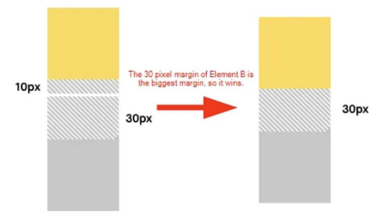

- 이유 : 복잡한 레이아웃에서 요소 간 간격을 일관 되게 유지하기 위함
  
  - 요소 간의 간격을 더 예측 가능하고 관리하기 쉽게 만듦
  
  - 일관성, 단순화

### 박스 타입 별 수평 정렬

- Block 요소의 수평 정렬

- `margin: auto`사용 : 블록 요소의 너비를 지정하고 좌우 마진을 auto로 지정

```html
<div class="box margin-auto">
</div>
```

```css
.box {
    width: 100px;
    height: 100px;
    background-color: crimson;
    border: 1px solid black;
}

.margin-auto {
    margin: 0 auto;
}
```

- Inline 요소의 수평 정렬

- `text-align` 사용 : 부모 요소에 적용

```html
<div class="text-center">
    <span>inline 요소</span>
</div>
```

```css
.text-center {
    text-align: center;
}
```

- Inline-block 요소의 수평 정렬

- `text-align` 사용 : 부모 요소에 적용

```html
<div class="text-center">
    <div class="box inline-block"></div>
</div>
```

```css
.text-center {
    text-align: center;
}

.inline-block {
    display: inline-block;
}
```

### Flexbox Shorthand 속성

- `flex-flow`

```css
.container {
    flex-flow: flex-direction flex-wrap;
}
```

- `flex`

```css
/* One value, unitless number: flex-grow */
flex: 2;

/* One value, length or percentage: flex-basis*/
flex: 10rem;
flex: 30%;

/* Two values: flex-grow | flex-basis */
flex: 1 30px;

/* Two values: flex-grow | flex-shrink */
flex: 2 2;

/* Three values: flex-grow | flex-shrink | flex-basis */
flex: 2 2 10%;
```

### Flexbox 속성 정리

- `flex-direction`

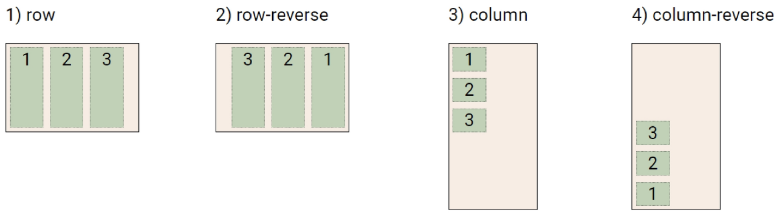

- `flex-wrap`

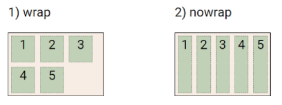

- `justify-content`

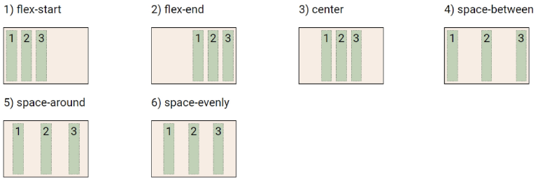

- `align-content`

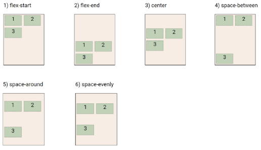

- `align-items`

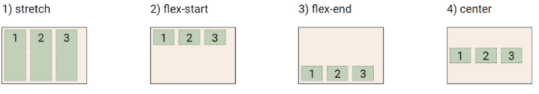

- `align-self`

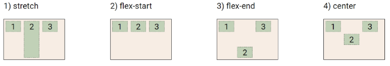


