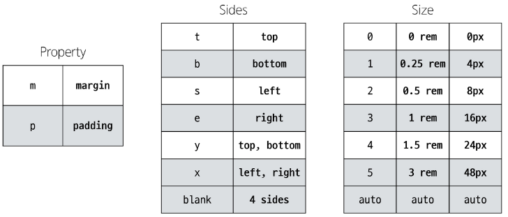

### 목차

> [1. Bootstrap]
> 
> [2. Reset CSS]
> 
> [3. Bootstrap 활용]
> 
> [4. Semantic Web]
> 
> [5. 참고]


# 1. Bootstrap

-  CSS 프론트엔드 프레임워크(Toolkit)

- 미리 만들어진 다양한 디자인 요소들을 제공하여 웹 사이트를 빠르고 쉽게 개발할 수 있도록 함

- bootstrap 영어 홈페이지 문서 참고

```html
<!doctype html>
<html lang="en">
  <head>
    <meta charset="utf-8">
    <meta name="viewport" content="width=device-width, initial-scale=1">
    <title>Bootstrap demo</title>
    <link href="https://cdn.jsdelivr.net/npm/bootstrap@5.3.3/dist/css/bootstrap.min.css" rel="stylesheet" integrity="sha384-QWTKZyjpPEjISv5WaRU9OFeRpok6YctnYmDr5pNlyT2bRjXh0JMhjY6hW+ALEwIH" crossorigin="anonymous">
  </head>
  <body>
    <h1>Hello, world!</h1>
    <script src="https://cdn.jsdelivr.net/npm/bootstrap@5.3.3/dist/js/bootstrap.bundle.min.js" integrity="sha384-YvpcrYf0tY3lHB60NNkmXc5s9fDVZLESaAA55NDzOxhy9GkcIdslK1eN7N6jIeHz" crossorigin="anonymous"></script>
  </body>
</html>
```

-  <link~, <script ~ : 인터넷 상에 올라가 있는 css파일, javascript 파일을 html 파일로 불러오기

### CDN

- Content Delivery Network : 지리적 제약 없이 빠르고 안전하게 콘텐츠를 전송할 수 있는 전송 기술

- 전세계에 있는 CND을 제공하는 서버(업체) 중 가장 가까운 곳에서 받아오는 것

- 서버와 사용자의 물리적인 거리를 줄여 콘텐츠 로딩에 소요되는 시간을 최소화 (웹 페이지 로드 속도를 높임)

- 지리적으로 사용자와 가까운 CDN 서버에 콘텐츠를 저장해서 사용자에게 전달

> 1. Bootstrap 홈페이지 - Download - "compiled CSS and JS" 다운로드
> 
> 2. CDN을 통해 가져오는 bootstrap css와 js 파일을 확인
> 
> 3. bootstrap.css, bootstrap.js 파일 참고
> 
> -> 온라인 CDN 서버에 업로드 된 css 및 js 파일을 불러와서 사용하는 것

### Bootstrap 사용 가이드

- 기본 사용법

```html
<p class="mt-5">Hello, world!</p>
```

- `mt-5` : `{property}{sides}-{size}`
  
  - `{property}` : `m`
  
  - `{sides}` : `t`
  
  - `{size}` : `5`

- Bootstrap에서 클래스 이름으로 Spacing을 표현하는 방법



- 디바이스, 브라우저마다 사이즈가 다 다르고 px은 크기가 일정하기 때문에 비율로 되어있는 rem 사이즈 활용 -> bootstrap이 자주 쓰이는 사이즈들을 만들어 놓은 것

- ex) `mx-auto` : `margin left, right auto`

- 공식 문서에 잘 설명되어 있음 -> 보면서 해야한다.

- Bootstrap에는 특정한 규칙이 있는 클래스 이름으로 스타일 및 레이아웃이 미리 작성되어 있음

# 2. Reset CSS

- 모든 HTML 요소 스타일을 일관된 기준으로 재설정하는 간결하고 압축된 규칙 세트

- HTML Element, Table, List 등의 요소들에 일관성 있게 스타일을 적용 시키는 기본 단계

### Reset CSS 사용 배경

- 모든 브라우저는 각자의 'user agent stylesheet' 를 가지고 있음 -> 웹사이트를 보다 읽기 편하게 하기 위해

- 문제는 이 설정이 브라우저마다 상이하다는 것

- 모든 브라우저에서 웹사이트를 동일하게 보이게 만들어야 하는 개발자에겐 매우 골치 아픈 일

- 모두 똑같은 스타일 상태로 만들고 스타일 개발을 시작하자!

### User-agent stylesheets

- 모든 문서에 기본 스타일을 제공하는 기본 스타일 시트

### Normalize CSS

- retset CSS 방법 중 대표적인 방법

- 웹 표준 기준으로 브라우저 중 하나가 불일치 한다면 차이가 있는 브라우저를 수정하는 방법
  
  - 경우에 따라 IE 또는 EDGE 브라우저는 표준에 따라 수정할 수 없는 경우도 있는데, 이 경우 IE 또는 EDGE의 스타일을 나머지 브라우저에 적용시킴

### Bootstrap에서의 Reset CSS

- bootstrap은 `bootstrap-rebot.css`라는 파일명으로 `nomalize.css`를 자체적으로 커스텀해서 사용하고 있음

# 3. Bootstrap 활용

### Typography

- 제목, 본문 텍스트, 목록 등

- Display headings : 기존 Heading보다 더 눈에 띄는 제목이 필요할 경우 (더 크고 약간 다른 스타일)

```html
<h1 class="display-1">Display 1</h1>
<h1 class="display-2">Display 2</h1>
<h1 class="display-3">Display 3</h1>
<h1 class="display-4">Display 4</h1>
<h1 class="display-5">Display 5</h1>
<h1 class="display-6">Display 6</h1>
```

- Inline text elements : HTML inline 요소에 대한 스타일

```html
<p>You can use the mark tag to <mark>highlight</mark> text.</p>
<p><del>This line of text is meant to be treated as deleted text.</del></p>
<p><s>This line of text is meant to be treated as no longer accurate.</s></p>
<p><ins>This line of text is meant to be treated as an addition to the document.</ins></p>
<p><u>This line of text will render as underlined.</u></p>
<p><small>This line of text is meant to be treated as fine print.</small></p>
<p><strong>This line rendered as bold text.</strong></p>
<p><em>This line rendered as italicized text.</em></p>
```

- Lists : HTML list 요소에 대한 스타일

```html
<ul class="list-unstyled">
  <li>This is a list.</li>
  <li>It appears completely unstyled.</li>
  <li>Structurally, it's still a list.</li>
  <li>However, this style only applies to immediate child elements.</li>
  <li>Nested lists:
    <ul>
      <li>are unaffected by this style</li>
      <li>will still show a bullet</li>
      <li>and have appropriate left margin</li>
    </ul>
  </li>
  <li>This may still come in handy in some situations.</li>
</ul>
```

### Colors

- Bootstrap Color system : Bootstrap이 지정하고 제공하는 색상 시스템

- Text, Border, Background 및 다양한 요소에 사용하는 Bootstrap의 색상 키워드

- Text colors

```html
<p class="text-primary">.text-primary</p>
<p class="text-primary-emphasis">.text-primary-emphasis</p>
<p class="text-secondary">.text-secondary</p>
<p class="text-secondary-emphasis">.text-secondary-emphasis</p>
<p class="text-success">.text-success</p>
<p class="text-success-emphasis">.text-success-emphasis</p>
<p class="text-danger">.text-danger</p>
...
```

- Background colors

```html
<div class="p-3 mb-2 bg-primary text-white">.bg-primary</div>
<div class="p-3 mb-2 bg-primary-subtle text-primary-emphasis">.bg-primary-subtle</div>
<div class="p-3 mb-2 bg-secondary text-white">.bg-secondary</div>
<div class="p-3 mb-2 bg-secondary-subtle text-secondary-emphasis">.bg-secondary-subtle</div>
<div class="p-3 mb-2 bg-success text-white">.bg-success</div>
<div class="p-3 mb-2 bg-success-subtle text-success-emphasis">.bg-success-subtle</div>
<div class="p-3 mb-2 bg-danger text-white">.bg-danger</div>
...
```

### Bootstrap 실습

- 너비와 높이가 각각 200px인 정사각형 작성하기 (너비와 높이를 제외한 스타일은 모두 bootstrap으로 작성)

```css
.box {
    width: 200px;
    height: 200px;
}
```

```html
<div class="box border border-2 border-dark bg-info"></div>
```

### Bootstrap Component

- Bootstrap에서 제공하는 UI 관련 요소

- 버튼, 네비게이션 바, 카드, 폼, 드롭다운 등

- 대표 Component 사용해보기 : Alerts, Badges, Buttons, Cards, Navbar

- 장점 : 일관된 디자인을 제공하여 웹 사이트의 구성 요소를 구축하는 데 유용하게 활용

- 주의사항 : 각 component id 속성 값과 각 버튼의 data-bs-target 속성 값이 각각 올바르게 일치하는지 확인

- moda 주의사항 : modal 버튼과 본체가 함께 다닐 필요 없다.
  
  - modal 본체는 버튼을 눌러야만 활성화되는 코드이기 때문에 코드 최하단에 모아두는 것을 권장

# 4. Semantic Web

- semantic : 의미론적

- 웹 데이터를 의미론적으로 구조화된 형태로 표현하는 방식

- 이 요소가 시각적으로 어떻게 보여질까? -> 이 요소가 가진 목적과 역할은 무엇일까?

### Semantic in HTML

- HTML 요소가 의미를 가진다는 것

```html
<p style="font-size: 30px;">Heading</p>
```

- ↳단순히 제목처럼 보이게 큰 글자로 만드는 것

```html
<h1>Heading</h1>
```

- ↳"페이지 내 최상위 제목"이라는 의미를 제공하는 요소 h1

- ↳ 브라우저에 의해 스타일이 지정됨

### HTML Semantic Element

- 기본적인 모양과 기능 이외에 의미를 가지는 HTML 요소

- 검색엔진 및 개발자가 웹 페이지 콘텐츠를 이해하기 쉽도록

- 대표적인 Semantic Element : `header`, `nav`, `main`, `article`, `section`, `aside`, `footer`
  
  - `<div></div>`랑 기능이 100% 같다. 그러나 태그들을 같이 혼용해서 쓰자~ 그래야 알아보기 쉽다.

### Semantic in CSS

- CSS 방법론 : CSS를 효율적이고 유지 보수가 용이하게 작성하기 위한 일련의 가이드라인

- OOCSS : Object Oriented CSS : 객체 지향적 접근법을 적용하여 CSS를 구성하는 방법론

- OOCSS 기본 원칙 : 
  
  1. 구조와 스킨을 분리 : 구조와 스킨을 분리함으로써 재사용 가능성을 높임
     
     - ex) 모든 버튼의 공통 구조를 정의 + 각각의 스킨(배경색과 폰트 색상을 정의)
  
  2. 컨테이너와 콘텐츠를 분리 : 
     
     - 객체에 직접 적용하는 대신 객체를 둘러싸는 컨테이너에 스타일을 적용
     
     - 스타일을 정의할 때 위치에 의존적인 스타일을 사용하지 않도록 함
     
     - 콘텐츠를 다른 컨테이너로 이동시키거나 재배치할 때 스타일이 깨지는 것을 방지

- OOCSS 적용 예시

- 변경 전 : `.header`와 `.footer` 클래스가 폰트 크기와 색 둘 다 영향을 주고 있음

- 변경 후 : `.container` `.title`은 폰트 크기 담당 (콘텐츠 스타일)
  
  - `.header`와 `.footer`는 폰트 색 담당 (컨테이너 스타일)


- OOCSS 예시

```html
<body>
  <div class="card">
    <p class="card-title">Card Title</p>
    <p class="card-description">This is a card description.</p>
    <button class="btn btn-blue">Learn More</button>
    <button class="btn btn-red">Learn More</button>
  </div>
</body>
```

```css
<style>
    /* 기본 Card 구조 */
    .card {
      border: 1px solid #ccc;
      border-radius: 4px;
      padding: 16px;
      width: 50%;
    }

    /* Card 제목 */
    .card-title {
      font-size: 20px;
      font-weight: bold;
      margin-bottom: 8px;
    }

    /* Card 설명 */
    .card-description {
      font-size: 16px;
      margin-bottom: 16px;
    }

    /* 기본 버튼 구조 */
    .btn {
      display: inline-block;
      border-radius: 4px;
      padding: 8px 16px;
      font-size: 1rem;
      font-weight: 400;
      color: #212529;
      text-align: center;
      text-decoration: none;
      cursor: pointer;
    }

    /* 파란 배경 버튼 */
    .btn-blue {
      background-color: #007bff;
      color: #fff;
    }

    /* 빨간 배경 버튼 */
    .btn-red {
      background-color: #cb2323;
      color: #fff;
    }
  </style>
```

# 5. 참고

### Bootstrap을 사용하는 이유

- 가장 많이 사용되는 CSS 프레임워크

- 사전에 디자인된 다양한 컴포넌트 및 기능 -> 빠른 개발과 유지보수

- 손쉬운 반응형 웹 디자인 구현

- 커스터마이징(customizing)이 용이

- 크로스 브라우징(Cross browsing) 지원
  
  - 모든 주요 브라우저에서 작동하도록 설계되어 있음

### CDN 없이 사용하기

- Bootstrap 코드 파일을 다운받아 활용
1. Bootstrap 코드 파일 다운로드

2. `bootstrap.css`와 `bootstrap.bundle.js`만 선택

3. CSS 파일은 HTML `<head>` 태그에 가져와서 사용

4. JS 파일은 HTML `<body>` 태그 맨 마지막(밑)에 가져와서 사용
- 파일 별 포함된 기능이 다르므로 공식문서를 통해 확인

- 파일 배치 및 불러오기 코드 예시


### 책임과 역할

- HTML : 콘텐츠의 구조와 의미

- CSS : 레이아웃과 디자인

### 의미론적인 마크업이 필요한 이유

- "검색엔진 최적화(SEO)" : 
  
  - 검색 엔진이 해당 웹 사이트를 분석하기 쉽게 만들어 검색 순위에 영향을 줌

- "웹 접근성(Web Accessibility)" :
  
  - 웹 사이트, 도구, 기술이 고령자나 장애를 가진 사용자들이 사용할 수 있도록 설계 및 개발하는 것
  
  - ex) 스크린 리더를통해 전맹 시각장애 사용자에게 웹의 글씨를 읽어줌
  
  - [널리-네이버](https://nuli.navercorp.com/)
