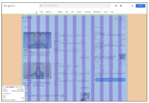
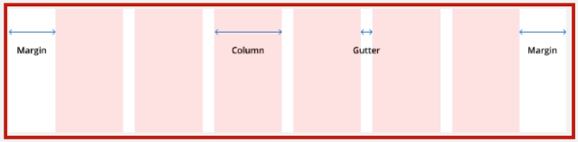
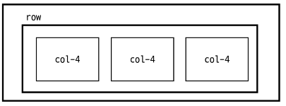
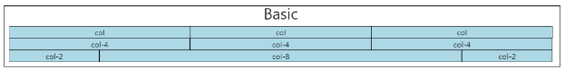
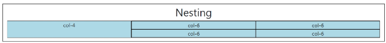
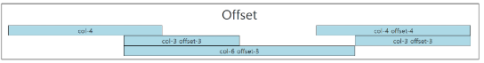
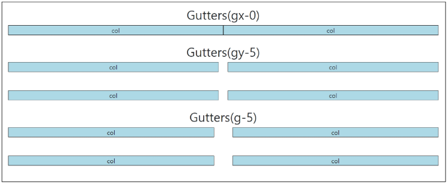
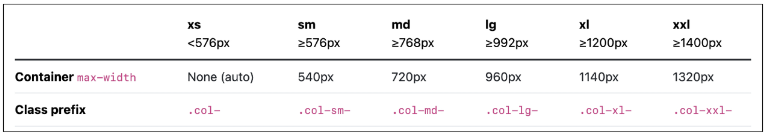
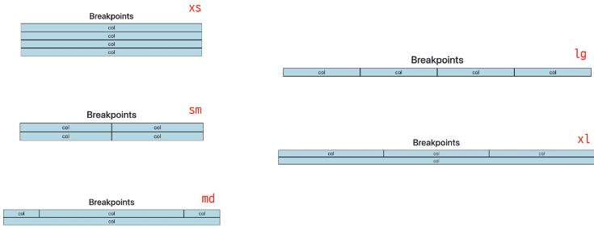
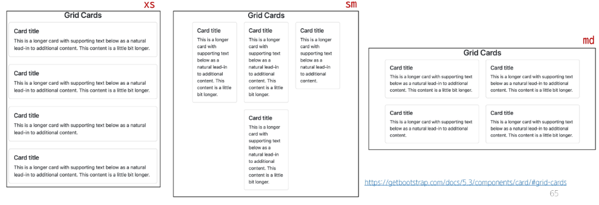

### 목차

> [1. Bootstrap Grid system](#1-bootstrap-grid-system)
>
> [2. Grid system for responsive web](#2-grid-system-for-responsive-web)
>
> [3. CSS Layout 종합 정리](#3-css-layout-종합-정리)
>
> [4. UX & UI](#4-ux--ui)

+) 알면 유용한 vscode 팁 : `emmet`

- emmet cheat sheet 참고

- div.container (그냥 .container 해도 된다.) :
```html
<div class="container"></div>
```

- ul>li*3 : 
```html
<ul>
    <li></li>
    <li></li>
    <li></li>
</ul>
```

- ul>li.item$*5
```html
<ul>
  <li class="item1"></li>
  <li class="item2"></li>
  <li class="item3"></li>
  <li class="item4"></li>
  <li class="item5"></li>
</ul>
```

- nav>ul.menu>li*5>a[href='#']{메뉴 $} :
```html
<nav>
  <ul class="menu">
    <li><a href="#">메뉴 1</a></li>
    <li><a href="#">메뉴 2</a></li>
    <li><a href="#">메뉴 3</a></li>
    <li><a href="#">메뉴 4</a></li>
    <li><a href="#">메뉴 5</a></li>
  </ul>
</nav>
```

# 1. Bootstrap Grid system

- 웹 페이지의 레이아웃을 조정하는 데 사용되는 12개의 컬럼으로 구성된 시스템

    - 12인 이유 : 약수가 많고 적당히 크다.

- Grid system 목적 : 반응형 디자인을 지원해 웹 페이지를 모바일, 태블릿, 데스크탑 등 다양한 기기에서 적절하게 표시할 수 있도록 도움

### 반응형 웹 디자인

- Responsive Web Design

- 디바이스 종류나 화면 크기에 상관없이, 어디서든 일관된 레이아웃 및 사용자 경험을 제공하는 디자인 기술

- ex) 구글 뉴스



### Grid system 기본 요소

1. Container : Column들을 담고 있는 공간

2. Column : 실제 컨텐츠를 포함하는 부분

3. Gutter : 컬럼과 컬럼 사이의 여백 영역



- row : 1개의 row 안에 12개의 column 영역이 구성

- 각 요소는 12개 중 몇 개를 차지할 것인지 지정됨



- grid system의 가장 기본적인 코드

```html
<div class="container">
    <div class = "row">
        <div class = "col-4"></div>
        <div class = "col-4"></div>
        <div class = "col-4"></div>
    </div>
</div>
```

### Grid system 실습

- 기본

- 한 줄에 12칸이 초과되면 다음 줄로 떨어짐 (ex. 2 8 / 3)

```html
<h2 class="text-center">Basic</h2>
<div class="container">
  <div class="row">
    <div class="box col">col</div>
    <div class="box col">col</div>
    <div class="box col">col</div>
  </div>
  <div class="row">
    <div class="box col-4">col-4</div>
    <div class="box col-4">col-4</div>
    <div class="box col-4">col-4</div>
  </div>
  <div class="row">
    <div class="box col-2">col-2</div>
    <div class="box col-8">col-8</div>
    <div class="box col-2">col-2</div>
  </div>
</div>
```



- 중첩(Nesting)

```html
<h2 class="text-center">Nesting</h2>
<div class="container">
  <div class="row">
    <div class="box col-4">col-4</div>
    <div class="box col-8">
      <div class="row">
        <div class="box col-6">col-6</div>
        <div class="box col-6">col-6</div>
        <div class="box col-6">col-6</div>
        <div class="box col-6">col-6</div>
      </div>
    </div>
  </div>
</div>
```



- 상쇄(Offset)

```html
<h2 class="text-center">Offset</h2>
<div class="container">
  <div class="row">
    <div class="box col-4">col-4</div>
    <div class="box col-4 offset-4">col-4 offset-4</div>
  </div>
  <div class="row">
    <div class="box col-3 offset-3">col-3 offset-3</div>
    <div class="box col-3 offset-3">col-3 offset-3</div>
  </div>
  <div class="row">
    <div class="box col-6 offset-3">col-6 offset-3</div>
  </div>
</div>
```



- Gutters : Grid system에서 column 사이에 여백 영역
    - x축은 `padding`, y축은 `margin`으로 여백 생성


```html
<h2 class="text-center">Gutters(gx-0)</h2>
<div class="container">
  <div class="row gx-0">
    <div class="col-6">
      <div class="box">col</div>
    </div>
    <div class="col-6">
      <div class="box">col</div>
    </div>
  </div>
</div>
```

```html
<h2 class="text-center">Gutters(gy-5)</h2>
<div class="container">
  <div class="row gy-5">
    <div class="col-6">
      <div class="box">col</div>
    </div>
    <div class="col-6">
      <div class="box">col</div>
    </div>
    <div class="col-6">
      <div class="box">col</div>
    </div>
    <div class="col-6">
      <div class="box">col</div>
    </div>
  </div>
</div>
```

```html
<h2 class="text-center">Gutters(g-5)</h2>
<div class="container">
  <div class="row g-5">
    <div class="col-6">
      <div class="box">col</div>
    </div>
    <div class="col-6">
      <div class="box">col</div>
    </div>
    <div class="col-6">
      <div class="box">col</div>
    </div>
    <div class="col-6">
      <div class="box">col</div>
    </div>
  </div>
</div>
```



# 2. Grid system for responsive web

- Responsive Web Design

- 디바이스 종류나 화면 크기에 상관없이, 어디서든 일관된 레이아웃 및 사용자 경험을 제공하는 디자인 기술

- Bootstrap grid system에서는 12개 column과 6개 breakpoints를 사용하여 반응형 웹 디자인을 구현

### Grid system Breakpoints

- 웹 페이지를 다양한 화면 크기에서 적절하게 배치하기 위한 분기점

- 화면 너비에 따라 6개의 분기점 제공(xs, sm, md, lg, xl, xxl)

- 각 breakpoints 마다 설정된 최대 너비 값 "이상으로" 화면이 커지면 grid system 동작이 변경됨



- 실습

```html
<h2 class="text-center">Breakpoints</h2>
<div class="container">
  <div class="row">
    <div class="box col-12 col-sm-6 col-md-2 col-lg-3 col-xl-4">
      col
    </div>
    <div class="box col-12 col-sm-6 col-md-8 col-lg-3 col-xl-4">
      col
    </div>
    <div class="box col-12 col-sm-6 col-md-2 col-lg-3 col-xl-4">
      col
    </div>
    <div class="box col-12 col-sm-6 col-md-12 col-lg-3 col-xl-12">
      col
    </div>
  </div>
```



```html
<h2 class="text-center">Breakpoints + offset</h2>
  <div class="row g-4">
    <div class="box col-12 col-sm-4 col-md-6">
      col
    </div>
    <div class="box col-12 col-sm-4 col-md-6">
      col
    </div>
    <div class="box col-12 col-sm-4 col-md-6">
      col
    </div>
    <div class="box col-12 col-sm-4 offset-sm-4 col-md-6 offset-md-0">
      col
    </div>
  </div>
</div>
```


- Grid System은 화면 크기에 따라 12개의 칸을 각 요소에 나누어 주는 것

# 3. CSS Layout 종합 정리

- 어떤 레이아웃 기술이 사용됐는지 생각해보기

- CSS 레이아웃 기술들은 각각 고유한 특성과 장단점을 가지고 있음

- 이들은 상호 보완적이며, 특정 상황에 따라 적합한 도구가 달라짐

- 최적의 기술을 선택하고 효과적으로 활용하기 위해서는 다양한 실제 개발 경험이 필수적

# 4. UX & UI

### UX

- User Expereience : 제품이나 서비스를 사용하는 사람들이 느끼는 전체적인 경험과 만족도를 개선하고 최적화하기 위한 디자인과 개발 분야

> 예시
> 
> - 백화점 1층에서 느껴지는 좋은 향수 향기
>
> - 러쉬 매장 근처에만 가도 맡을 수 있는 러쉬 향기
>
> - 원하는 음악을 검색할 때, 검색 기능이 적절하게 작동하고 검색 결과가 정확하게 나오는 것

- UX 설계 :

    - 사람들의 마음과 생각을 이해하고 정리해서 제품에 녹여내는 과정

    - 유저 리서치, 데이터 설계 및 정제, 유저 시나리오, 프로토타입 설계

### UI

- User Interface : 서비스나 사용자 간의 상호작용을 가능하게 하는 디자인 요소들을 개발하고 구현하는 분야

> 예시
> 
> - 리모컨 : 사용자가 버튼을 누르면 TV가 켜지고, 채널을 변경하거나 볼륨을 조절할 수 있음
>
> - ATM : 사용자가 터치스크린을 통해 사용자 정보를 입력하고, 원하는 금액을 선택할 수 있음
>
> - 웹 사이트 : 사용자가 로그인 버튼을 누르면, 이동하는 화면의 디자인 및 레이아웃

- UI 설계

    - 예쁜 디자인보다는 사용자가 더 쉽고 편리하게 사용할 수 있도록 고려

    - 이를 위해서는 디자인 시스템, 중간 산출물, 프로토타입 등이 필요

- 디자이너와 기획자 그리고 개발자 : 많은 회사에서 UX/UI 디자인을 함께하는 디자이너를 채용하거나 UX는 기획자, UI는 디자이너의 역할로 채용하기도 함

# 5. 참고

### The Grid System

- CSS가 아닌 편집 디자인에서 나온 개념으로 구성 요소를 잘 배치해서 시각적으로 좋은 결과물을 만들기 위함

- 기본적으로 안쪽에 있는 요소들의 오와 열을 맞추는 것에서 기인

- 정보 구조와 배열을 체계적으로 작성하여 정보의 질서를 부여하는 시스템

### Grid cards

- `row-cols` 클래스를 사용하여 해당 표시할 열(카드) 수를 손쉽게 제어할 수 있음

```html
<h2 class="text-center">Grid Cards</h2>
<div class="container">
  <div class="row row-cols-1 row-cols-sm-3 row-cols-md-2 g-4">
    <div class="col">
      <div class="card">
        <div class="card-body">
          <h5 class="card-title">Card title</h5>
          <p class="card-text">This is a longer card with supporting text below as a natural lead-in to additional
            content. This content is a little bit longer.</p>
        </div>
      </div>
    </div>
    <div class="col">
      <div class="card">
        <div class="card-body">
          <h5 class="card-title">Card title</h5>
          <p class="card-text">This is a longer card with supporting text below as a natural lead-in to additional
            content. This content is a little bit longer.</p>
        </div>
      </div>
    </div>
    <div class="col">
      <div class="card">
        <div class="card-body">
          <h5 class="card-title">Card title</h5>
          <p class="card-text">This is a longer card with supporting text below as a natural lead-in to additional
            content.</p>
        </div>
      </div>
    </div>
    <div class="col">
      <div class="card">
        <div class="card-body">
          <h5 class="card-title">Card title</h5>
          <p class="card-text">This is a longer card with supporting text below as a natural lead-in to additional
            content. This content is a little bit longer.</p>
        </div>
      </div>
    </div>
  </div>
</div>
```



### UI Design Guidelines

- 기업별 UI Design Guidelines

- 삼성 One UI : [https://developer.samsung.com/one-ui](https://developer.samsung.com/one-ui)

- 애플 UI : [https://developer.apple.com/kr/design/tips/](https://developer.apple.com/kr/design/tips/)

- Can't Unsee : 더 나은 UX/UI를 고민해볼 수 있는 웹 게임 : [https://cantunsee.space/](https://cantunsee.space/)
